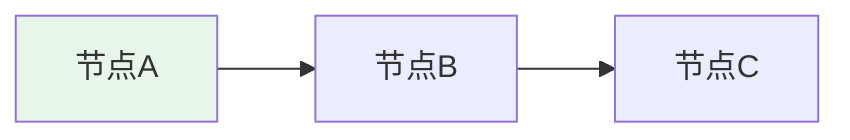
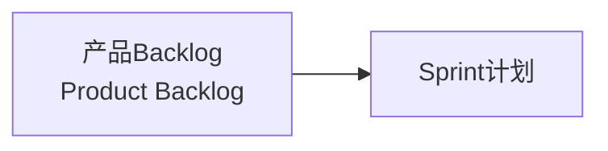
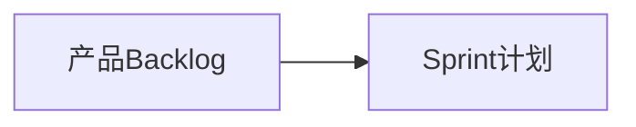

有图解或示例图的时候尽量使用mermaid展示，避免使用文本符号
绘图时，注意图的大小和比例，避免图过小或过大的情况
背景不要使用颜色，保持透明

## Mermaid 语法规范

### 禁止使用的语法

以下语法会导致 Mermaid 渲染失败，**严禁使用**：

| 禁止项 | 错误示例 | 原因 |
|--------|----------|------|
| 中文引号 | `["文本"]` | 不支持中文引号 |
| HTML换行符 | ` ` | 节点内不支持换行 |
| 特殊符号 | `•`、`⚠️`、`>` 等 | 可能导致解析错误 |
| 复杂subgraph | `subgraph 名称["标题"]` | 引号和特殊字符问题 |
| 长文本节点 | `["很长的文本内容"]` | 建议简化 |

### 正确语法示例

### 最佳实践

1. **节点命名**：使用简短英文或中文，如 `A[开始]`、`B[处理]`
2. **避免嵌套**：减少subgraph使用，简化图表结构
3. **文本简化**：节点文本控制在10个字以内
4. **使用连接线**：用箭头表达关系，而非长文本
5. **样式设置**：使用 `style 节点 fill:#颜色` 设置背景色

### 图表大小和布局优化

**问题**：节点太多、层级太深会导致图表显示过小，看不清内容。

**解决方案**：

| 场景 | 优化方法 | 示例 |
|------|----------|------|
| 节点过多（>8个） | 拆分为多个小图表 | 一个图表展示结构，其他图表展示详情 |
| 层级太深（>3层） | 使用LR横向布局替代TD纵向布局 | `flowchart LR` |
| 内容复杂 | 使用subgraph分组，但控制每组节点数 | 每组不超过4个节点 |
| 列表型内容 | 直接用文字列表，不用图表 | 2-3个简单节点无需图表 |

**推荐布局**：
- **简单关系**：`flowchart LR`（横向）
- **流程步骤**：`flowchart TB`（纵向，不超过4个节点）
- **分组展示**：使用subgraph，但每组节点控制在3-4个

### 常见错误修复

**错误**：

**正确**：

### 检查清单

创建Mermaid图表后，检查：
- [ ] 没有使用中文引号 `"`
- [ ] 没有使用 ` ` 换行
- [ ] 没有使用特殊符号（•、⚠️等）
- [ ] 节点文本简洁明了
- [ ] 图表可以正常渲染