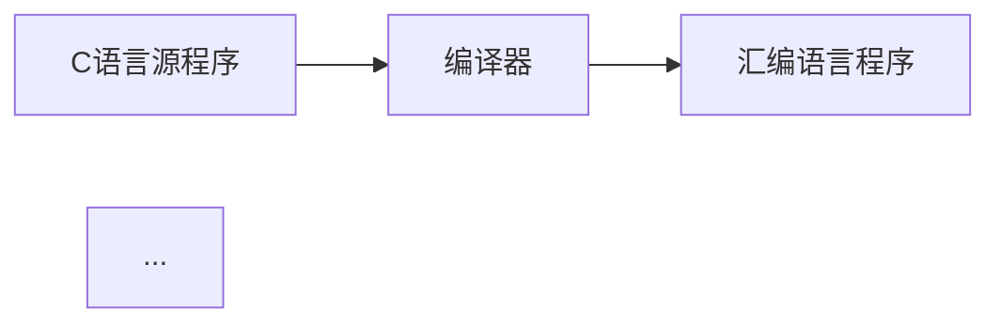

# 笔记图片插入规则

## 📌 适用范围

本规则适用于所有课程笔记的创建和更新，包括：
- **章节笔记**：按课本章节组织的笔记
- **专题笔记**：跨章节的专题深入笔记
- **习题笔记**：习题解答和练习
- **总结复习**：考试复习和知识点总结

---

## 🎯 核心原则

> **创建笔记时，必须自动检测并插入课本中的所有相关图示**

---

## 📋 执行流程

### 步骤1：识别内容范围

#### 章节笔记
在 `full.md` 中定位当前章节的起始和结束位置。

#### 专题笔记
专题笔记涉及多个章节，需要：
1. 确定专题涉及的核心概念和知识点
2. 在 `full.md` 中搜索相关内容的分布范围
3. 收集所有相关章节的图片

### 步骤2：搜索所有图片引用

使用 grep 搜索当前章节内的所有图片：

```bash
# 搜索格式：
grep -n "!\[.*\]\(images/.*\.jpg\)" full.md

# 搜索图号引用
grep -n "图[0-9]\+\.[0-9]\+" full.md
```

### 步骤3：提取图片信息

对于每个找到的图片，记录：
- **图号**：如 图1.2、图2.5
- **图名**：图片的标题/描述
- **文件路径**：images/xxx.jpg
- **上下文**：图片前后的文字说明

### 步骤4：确定插入位置

根据图片在课本中的位置，确定在笔记中的插入点：

| 图片类型 | 插入位置 |
|---------|---------|
| 概念示意图 | 概念介绍之后 |
| 结构图 | 结构说明之后 |
| 流程图 | 流程描述之后 |
| 对比图 | 对比内容之后 |
| 示例图 | 示例说明之后 |

### 步骤5：插入图片到笔记

#### 图片路径规则

> 📖 **详细路径规范请参考**：[笔记规则 - 图片路径规范](notes.md#图片路径规范)

**快速参考**：
- **章节笔记/小节笔记**（路径深度3级）：`../../../images/xxx.jpg`
- **专题笔记/习题笔记/总结复习**（路径深度2级）：`../../images/xxx.jpg`

#### 插入格式

**章节笔记/小节笔记**（使用3级路径）：
```markdown
#### 📷 [图号] [图名]

![[图名]](../../../images/[图片文件名].jpg)

> 📚 **课本出处**：[图号] [图名]，[简要说明图片内容]
```

**专题笔记/习题笔记/总结复习**（使用2级路径）：
```markdown
#### 📷 [图号] [图名]

![[图名]](../../images/[图片文件名].jpg)

> 📚 **课本出处**：[图号] [图名]，[简要说明图片内容]
```

---

## 📝 插入格式规范

### 标准格式

```markdown
#### 📷 图1.2 数字计算机的主要组成结构


> 📚 **课本出处**：图1.2 展示了计算机五大部件（运算器、控制器、存储器、输入设备、输出设备）之间的连接关系
```

### 格式要素

1. **四级标题** (`####`)：使用 📷 图标 + 图号 + 图名
2. **图片引用**：使用相对路径（根据笔记类型选择 `../../images/` 或 `../../../images/`）
3. **出处说明**：使用 📚 图标，说明图片内容和课本位置

---

## 🔍 检查清单

创建或更新笔记时，必须检查：

- [ ] 已搜索当前章节的所有图片引用
- [ ] 已提取所有图片的文件路径
- [ ] 已确定每张图片的插入位置
- [ ] 已按标准格式插入所有图片
- [ ] 已添加图片的出处说明
- [ ] 已在"相关链接"部分列出所有图片

---

## ⚠️ 常见错误

### 错误1：遗漏图片

**表现**：笔记中只有文字，没有插入课本原图

**解决**：严格按照"执行流程"搜索并插入所有图片

### 错误2：图片路径错误

**表现**：图片显示为裂图或无法加载

**解决**：根据笔记类型使用正确的相对路径
- 章节笔记：`../../../images/xxx.jpg`（向上3级）
- 专题笔记：`../../images/xxx.jpg`（向上2级）

### 错误3：插入位置不当

**表现**：图片插入在无关内容之后

**解决**：根据图片内容，插入到最相关的知识点之后

### 错误4：缺少出处说明

**表现**：只有图片，没有说明文字

**解决**：必须添加 📚 **课本出处** 说明

---

## 📚 示例

### 示例1：概念示意图

```markdown
### 一、计算机五大部件

课本通过打算盘的例子来解释计算机的五大组成...

#### 📷 图1.2 数字计算机的主要组成结构


> 📚 **课本出处**：图1.2 展示了计算机五大部件之间的连接关系

#### 2. 计算机五大部件
...
```

### 示例2：流程图（章节笔记）

```markdown
**C语言的转换过程**：



#### 📷 图1.7 C语言的转换层次


> 📚 **课本出处**：图1.7 展示了C语言程序被转换成可执行机器语言的四个步骤

#### 阶段4：操作系统
...
```

### 示例3：专题笔记（多章节图片整合）

```markdown
# 专题-IP地址分类

## 一、IP地址分类概述

### 1. IP地址结构

#### 📷 图4-9 IP地址中的网络号和主机号字段


> 📚 **课本出处**：图4-9 IP地址分为网络号和主机号两部分

### 2. 分类编址

#### 📷 图4-10 分类的IP地址


> 📚 **课本出处**：图4-10 展示了A、B、C、D、E五类地址的划分方式

## 二、CIDR无分类编址

#### 📷 图4-11 CIDR表示的IP地址


> 📚 **课本出处**：图4-11 CIDR网络前缀长度可变
```

**专题笔记图片收集要点**：
- 专题笔记可能涉及多个章节的图片
- 需要按逻辑顺序组织图片，而非按章节顺序
- 每张图片都要标注来源章节

---

## 🔄 更新笔记时的处理

当更新已有笔记时：

1. **检查是否有新增图片**：对比新旧版本，识别新增的图片
2. **检查图片位置是否变化**：如果课本更新了图片位置，同步调整
3. **补充遗漏的图片**：如果之前遗漏了图片，立即补充插入

---

## 📖 相关规则

- [笔记规则](notes.md) - 笔记的整体结构和格式
- [绘图规则](display.md) - 使用 Mermaid 绘制示意图
- [大纲阅读规则](read-outline.md) - 强制阅读大纲的流程

---

*规则创建时间：2026-04-20*
