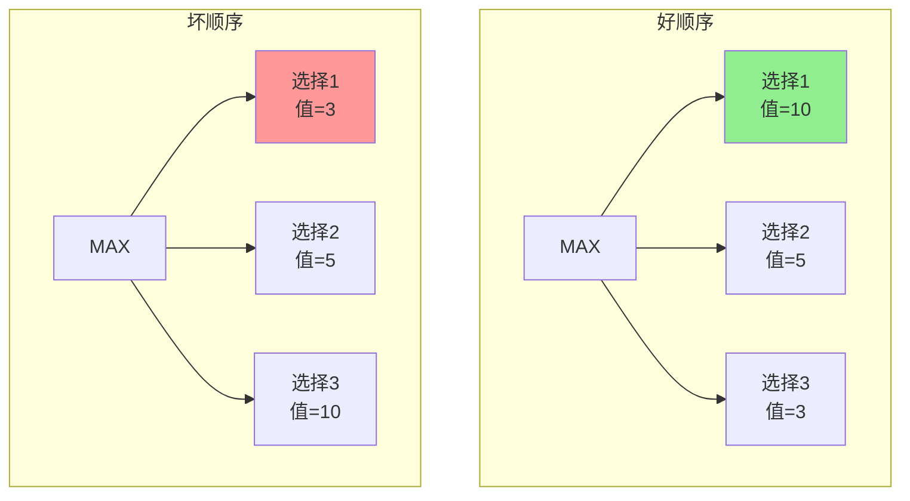
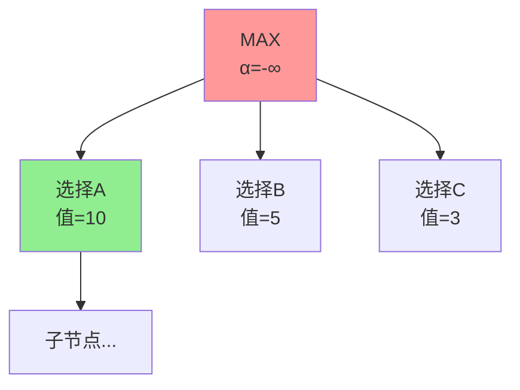
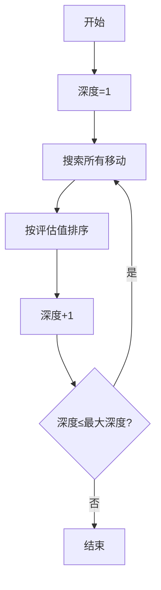
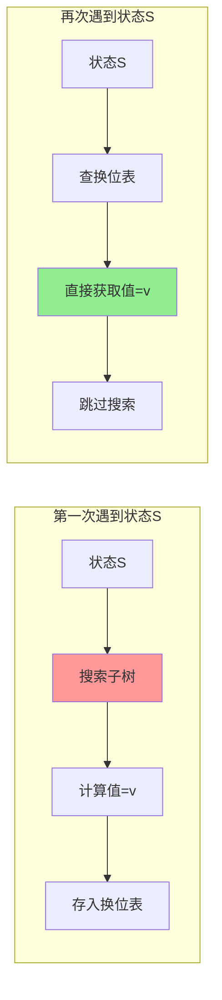
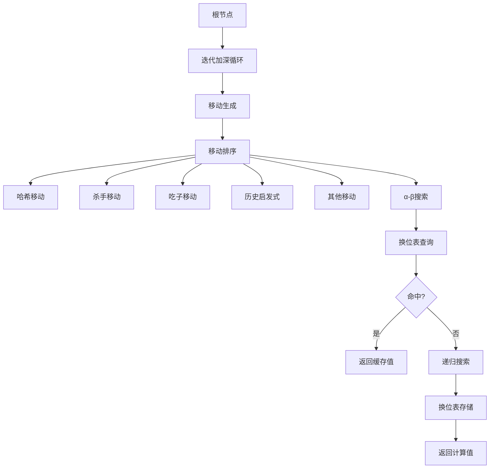

# 专题：移动顺序与α-β剪枝优化

## 基本信息
- **课程**：人工智能（上册）
- **专题**：移动顺序与α-β剪枝优化
- **日期**：2026-04-03
- **标签**：#移动顺序 #AlphaBeta剪枝 #换位表 #优化策略 #专题

---

## 重点内容

⭐ **核心概念**：
- 移动顺序对α-β剪枝效率的影响
- 完美顺序 vs 随机顺序 vs 最差顺序
- 换位表（Transposition Table）

⭐ **优化策略**：
- 简单启发式排序
- 绝招启发式（Killer Move）
- 迭代加深 + 历史表

---

## 一、什么是移动顺序？

### 1.1 定义
移动顺序指的是在搜索博弈树时，**先检查哪些后继节点、后检查哪些后继节点的顺序**。

### 1.2 为什么重要？

> 💡 **核心原因**：α-β剪枝的效率**很大程度上依赖于移动顺序**！



**好顺序**：先检查值大的节点 → 快速确定下界 → 能剪掉更多分支

**坏顺序**：先检查值小的节点 → 下界更新慢 → 剪枝效果差

---

## 二、不同移动顺序的效果对比

### 2.1 复杂度对比

| 情况 | 时间复杂度 | 有效分支因子 | 搜索深度 |
|------|-----------|-------------|---------|
| **完美顺序**（先最佳） | O(b^(m/2)) | √b | ✅ 最深 |
| **随机顺序** | O(b^(3m/4)) | b^(3/4) | ⚠️ 中等 |
| **最差顺序**（先最差） | O(b^m) | b | ❌ 最浅 |

### 2.2 国际象棋示例

- 分支因子 b ≈ 35
- 完美顺序：有效分支因子 √35 ≈ 6
- **相同时间内可搜索深度翻倍！**

```
完美顺序：搜索深度 = 2m（相比Minimax）
随机顺序：搜索深度 ≈ 1.33m
最差顺序：搜索深度 = m（无剪枝效果）
```

### 2.3 直观理解



**好顺序流程**：
1. 先检查选择A，值=10
2. 更新 α = 10
3. 检查选择B时，如果某子节点值<10，MIN会选择更小的
4. 如果选择B的最大可能值<10，直接剪枝！

---

## 三、移动排序策略

### 3.1 简单启发式排序

**优先级规则**：

```
1. 吃子移动（Capture）     ← 最高优先级
2. 威胁移动（Threat）       ← 高优先级
3. 前进移动（Advance）      ← 中优先级
4. 后退移动（Retreat）      ← 低优先级
5. 其他移动                ← 最低优先级
```

**原理**：
- 吃子通常能立即获得物质优势
- 威胁能限制对手选择
- 前进增加棋盘控制力

### 3.2 绝招启发式（Killer Move Heuristic）⭐⭐⭐

#### 核心思想
在当前位置有效的"绝招"，在其他位置往往也有效！

#### 实现方法

```python
# 全局杀手表
killer_table = {}  # 记录每个深度的好移动

def search(state, depth, alpha, beta):
    moves = generate_moves(state)
    
    # 1. 优先尝试杀手移动
    if depth in killer_table:
        killer_move = killer_table[depth]
        if killer_move in moves:
            moves.remove(killer_move)
            moves.insert(0, killer_move)
    
    # 2. 正常搜索
    for move in moves:
        value = -search(result(state, move), depth-1, -beta, -alpha)
        
        # 3. 如果是好移动，记录为杀手
        if value > alpha:
            killer_table[depth] = move
            alpha = value
            
        if alpha >= beta:
            break  # 剪枝
    
    return alpha
```

#### 效果
- 简单但非常有效
- 不需要领域知识
- 自适应学习对手模式

### 3.3 迭代加深 + 历史表

#### 算法流程



#### 优势
1. **更好的移动顺序**：浅层搜索提供排序依据
2. **时间控制**：可以随时停止，返回当前最佳移动
3. **搜索时间补偿**：虽然增加了一些搜索时间，但更好的排序能弥补甚至超越这部分开销

#### 历史启发式（History Heuristic）

```python
# 历史表：记录移动的成功次数
history_table = {}

def search(state, depth, alpha, beta):
    moves = generate_moves(state)
    
    # 按历史表排序（成功次数多的优先）
    moves.sort(key=lambda m: history_table.get(m, 0), reverse=True)
    
    for move in moves:
        value = -search(result(state, move), depth-1, -beta, -alpha)
        
        if value > alpha:
            # 记录成功的移动
            history_table[move] = history_table.get(move, 0) + 2^depth
            alpha = value
            
        if alpha >= beta:
            # 导致剪枝的移动也记录
            history_table[move] = history_table.get(move, 0) + 2^depth
            break
    
    return alpha
```

---

## 四、换位表（Transposition Table）⭐⭐⭐

### 4.1 问题：换位（Transposition）

不同移动序列可能到达**相同的局面**：

```
序列1: 白e2-e4 → 黑e7-e5 → 白马g1-f3
序列2: 白马g1-f3 → 黑e7-e5 → 白e2-e4

最终局面相同！
```

### 4.2 解决方案：换位表

**核心思想**：缓存已计算状态的值，避免重复搜索



### 4.3 换位表实现

```python
class TranspositionTable:
    def __init__(self, size=2^20):
        self.table = {}
        self.size = size
    
    def store(self, hash_key, depth, value, flag):
        """
        flag: 'exact', 'lower', 'upper'
        - exact: 精确值
        - lower: 下界（≥value）
        - upper: 上界（≤value）
        """
        entry = {
            'depth': depth,
            'value': value,
            'flag': flag
        }
        # 替换策略：深度优先或始终替换
        if hash_key not in self.table or depth >= self.table[hash_key]['depth']:
            self.table[hash_key] = entry
    
    def lookup(self, hash_key, depth, alpha, beta):
        """返回值或None"""
        if hash_key not in self.table:
            return None
        
        entry = self.table[hash_key]
        if entry['depth'] < depth:
            return None  # 缓存的深度不够
        
        if entry['flag'] == 'exact':
            return entry['value']
        elif entry['flag'] == 'lower' and entry['value'] >= beta:
            return entry['value']
        elif entry['flag'] == 'upper' and entry['value'] <= alpha:
            return entry['value']
        
        return None
```

### 4.4 Zobrist哈希

**问题**：如何快速计算状态的哈希值？

**解决方案**：Zobrist哈希

```python
class ZobristHash:
    def __init__(self, board_size, num_piece_types):
        # 为每个位置、每种棋子类型生成随机数
        self.table = {}
        for pos in range(board_size):
            for piece in range(num_piece_types):
                self.table[(pos, piece)] = random.getrandbits(64)
    
    def hash(self, board):
        """计算棋盘状态的哈希值"""
        h = 0
        for pos, piece in enumerate(board):
            if piece != EMPTY:
                h ^= self.table[(pos, piece)]
        return h
    
    def update(self, old_hash, pos, old_piece, new_piece):
        """增量更新哈希值"""
        h = old_hash
        if old_piece != EMPTY:
            h ^= self.table[(pos, old_piece)]
        if new_piece != EMPTY:
            h ^= self.table[(pos, new_piece)]
        return h
```

**优势**：
- 增量更新：O(1)时间
- 均匀分布：低碰撞率
- 可逆：添加和移除相同

### 4.5 换位表效果

在国际象棋中：
- 非常有效
- 搜索深度可**扩大一倍**
- 是现代国际象棋引擎的标配

---

## 五、综合优化策略

### 5.1 现代博弈引擎的典型架构



### 5.2 优化效果总结

| 优化技术 | 效果 | 实现复杂度 |
|---------|------|-----------|
| **简单启发式** | 中等 | 简单 |
| **杀手启发式** | 显著 | 简单 |
| **历史启发式** | 显著 | 中等 |
| **迭代加深** | 显著 | 中等 |
| **换位表** | 非常显著 | 复杂 |
| **组合使用** | 极其显著 | 复杂 |

---

## 六、关键要点总结

### 6.1 核心结论

1. **移动顺序是α-β剪枝的"催化剂"**
   - 好的顺序能让剪枝效果最大化
   - 坏的顺序会让剪枝形同虚设

2. **完美顺序不可达，但可以接近**
   - 理论极限：分支因子从b降到√b
   - 实际效果：通常能接近理论极限

3. **组合优化效果最好**
   - 单一技术有限
   - 多种技术组合使用效果更佳

### 6.2 考试要点

📌 **必会内容**：
- 移动顺序对α-β剪枝效率的影响
- 完美顺序的时间复杂度：O(b^(m/2))
- 换位表的作用和实现原理
- 杀手启发式的核心思想

📌 **常见题型**：
- 分析题：给定搜索树，比较不同移动顺序的剪枝效果
- 计算题：计算不同顺序下的节点访问数量
- 应用题：为特定博弈设计移动排序策略

---

## 疑问与思考

❓ **待解决问题**：
1. 如何评估不同移动排序策略的效果？
2. 在内存有限的情况下，如何设计换位表的替换策略？
3. 深度学习能否用于预测最佳移动顺序？

💡 **个人理解**：
- 移动顺序优化体现了"启发式"的精髓：用经验知识指导搜索
- 换位表是空间换时间的经典案例
- 这些优化技术使得α-β剪枝从理论走向实用

---

## 相关链接

- **课本**：第5章 5.2.4节 "移动顺序"
- **图5-5**：α-β剪枝过程（展示顺序影响）
- **前置知识**：Minimax算法、α-β剪枝
- **后续学习**：5.3节 启发式α-β树搜索

---

## 一句话总结

> 💡 **移动顺序是α-β剪枝的"催化剂"，换位表是"记忆库"，两者结合让博弈搜索从理论走向实用。**
