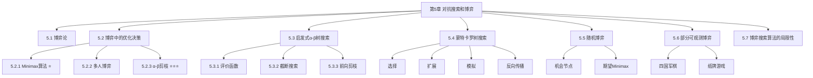
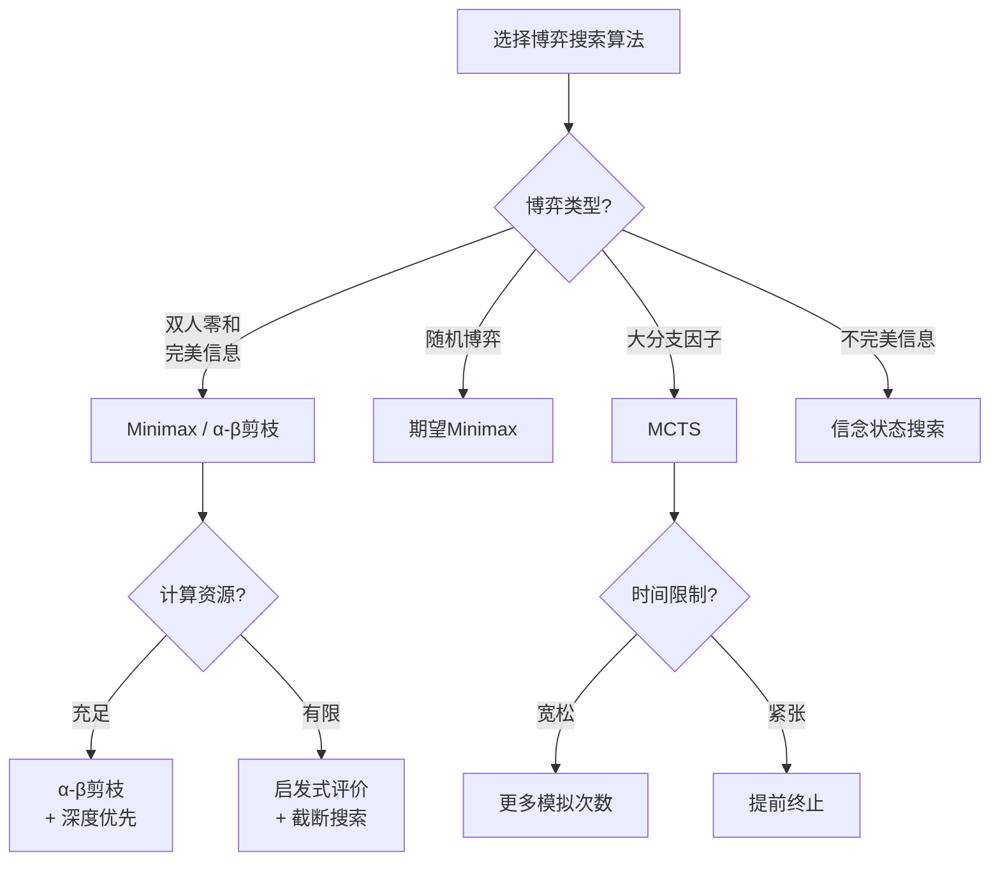
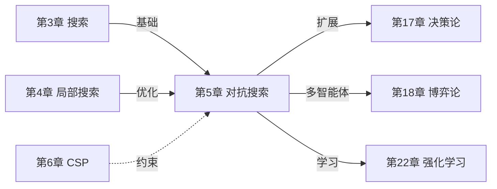

# 第5章 对抗搜索和博弈 - 章节总结

## 基本信息

- **课程**：人工智能（上册）
- **章节**：第5章 对抗搜索和博弈
- **日期**：2026-04-03
- **标签**：#对抗搜索 #博弈论 #Minimax #AlphaBeta剪枝 #MCTS #章节总结

***

## 一、章节结构概览



***

## 二、核心概念对比表

### 2.1 博弈类型对比

| 博弈类型        | 特征         | 例子      | 算法            |
| ----------- | ---------- | ------- | ------------- |
| **确定性博弈**   | 无随机因素      | 国际象棋、围棋 | Minimax、α-β剪枝 |
| **随机博弈**    | 包含掷骰子等随机因素 | 西洋双陆棋   | 期望Minimax     |
| **完美信息博弈**  | 完全可观测      | 国际象棋、围棋 | 标准博弈树搜索       |
| **不完美信息博弈** | 部分可观测      | 扑克、桥牌   | 信念状态搜索        |
| **零和博弈**    | 一方收益=另一方损失 | 国际象棋    | Minimax       |
| **非零和博弈**   | 可能存在双赢     | 外交游戏    | 效用向量          |

### 2.2 搜索算法对比

| 算法            | 时间复杂度              | 空间复杂度            | 适用场景    | 关键特点    |
| ------------- | ------------------ | ---------------- | ------- | ------- |
| **Minimax**   | $O(b^m)$           | $O(bm)$ 或 $O(m)$ | 双人零和博弈  | 最优但计算量大 |
| **α-β剪枝**     | $O(b^{m/2})$（最佳情况） | $O(bm)$          | 双人零和博弈  | 剪枝提高效率  |
| **期望Minimax** | $O(b^m n^m)$       | $O(bm)$          | 随机博弈    | 处理机会节点  |
| **MCTS**      | 取决于迭代次数            | $O(N)$           | 大分支因子博弈 | 随机模拟评估  |

***

## 三、核心算法详解

### 3.1 Minimax算法 ⭐⭐⭐

**核心思想**：

- MAX节点：选择子节点中的**最大值**
- MIN节点：选择子节点中的**最小值**

**数学定义**：
$$
\text{MINIMAX}(s) =
\begin{cases}
\text{UTILITY}(s) & \text{如果是终止状态} \\
\max\_{a} \text{MINIMAX}(\text{RESULT}(s,a)) & \text{如果是MAX节点} \\
\min\_{a} \text{MINIMAX}(\text{RESULT}(s,a)) & \text{如果是MIN节点}
\end{cases}
$$

**复杂度**：

- 时间：$O(b^m)$
- 空间：$O(bm)$（一次生成所有动作）或 $O(m)$（一次生成一个动作）

***

### 3.2 α-β剪枝 ⭐⭐⭐⭐⭐

**核心思想**：通过剪枝消除对结果无影响的子树，无需检查所有状态就能得到正确决策。

**关键参数**：

- **$\alpha$**：MAX的当前最佳选择（下界）="至少"
- **$\beta$**：MIN的当前最佳选择（上界）="至多"

**剪枝条件**：

- 对于MAX节点：如果当前值 $\geq \beta$，剪枝
- 对于MIN节点：如果当前值 $\leq \alpha$，剪枝

**效果**：

- 最佳移动排序下，时间复杂度降为 $O(b^{m/2})$
- 可以搜索**两倍深度**！

**示例**：

```Textile
        MAX(根)
       /   |   \
     MIN   MIN   MIN
    / | \  / | \  / | \
   3 12 8  2 x y 14 5 2

计算过程：
1. 左子树MIN = min(3,12,8) = 3
2. 根节点α = 3
3. 中子树MIN的第一个子节点=2
   2 ≤ α(3)，所以剪掉x和y
4. 右子树MIN = min(14,5,2) = 2
5. 根节点MAX = max(3, 2, 2) = 3
```

***

### 3.3 蒙特卡罗树搜索（MCTS）⭐⭐⭐

**四个步骤循环**：

1. **选择（Selection）**：从根节点选择路径到叶节点
2. **扩展（Expansion）**：添加一个或多个子节点
3. **模拟（Simulation）**：从扩展节点进行随机模拟
4. **反向传播（Backpropagation）**：将结果传回更新节点统计

**UCT公式**（选择策略）：
$$UCB1 = \frac{U(n)}{N(n)} + C \times \sqrt{\frac{\ln N(\text{PARENT}(n))}{N(n)}}$$

- 第一项：利用（exploitation）- 过去表现
- 第二项：探索（exploration）- 不确定性
- $C$：平衡常数（通常$\sqrt{2}$）

**优点**：

- 不需要评价函数
- 适用于大分支因子博弈
- 可以随时停止并返回结果

***

### 3.4 期望Minimax（随机博弈）

**适用场景**：包含随机因素（如掷骰子）的博弈

**公式**：
$$
\text{EXPECTIMINIMAX}(s) =
\begin{cases}
\text{UTILITY}(s) & \text{终止状态} \\
\max\_{a} \text{EXPECTIMINIMAX}(\text{RESULT}(s,a)) & \text{MAX节点} \\
\min\_{a} \text{EXPECTIMINIMAX}(\text{RESULT}(s,a)) & \text{MIN节点} \\
\sum\_{r} P(r) \times \text{EXPECTIMINIMAX}(\text{RESULT}(s,r)) & \text{机会节点}
\end{cases}
$$

**复杂度**：$O(b^m n^m)$，其中$n$是不同随机结果数

***

## 四、关键知识点速查

### 4.1 术语表

| 术语          | 定义                    |
| ----------- | --------------------- |
| **博弈树**     | 记录从初始状态到终止状态的所有移动序列的树 |
| **分支因子(b)** | 每个节点的平均子节点数           |
| **深度(m)**   | 从根到叶的路径长度             |
| **效用函数**    | 终止状态下玩家的收益            |
| **评价函数**    | 非终止状态下对局面的估计          |
| **倒推值**     | 通过搜索树反向传播计算的值         |
| **剪枝**      | 跳过对结果无影响的子树           |
| **信念状态**    | 所有逻辑可能的棋盘状态集合         |

### 4.2 博弈树规模对比（记忆要点）

| 博弈   | 分支因子 | 终止节点数        | 可行性    |
| ---- | ---- | ------------ | ------ |
| 井字棋  | 9    | \~$10^5$     | ✅ 完全可解 |
| 国际象棋 | 35   | \~$10^{123}$ | ❌ 不可行  |
| 围棋   | 250  | \~$10^{360}$ | ❌ 不可行  |

***

## 五、算法选择指南



***

## 六、典型应用场景

### 6.1 国际象棋AI

- **算法**：α-β剪枝 + 启发式评价函数
- **特点**：分支因子\~35，评价函数设计关键
- **代表**：Deep Blue、Stockfish

### 6.2 围棋AI

- **算法**：蒙特卡罗树搜索 + 深度学习（AlphaGo/AlphaZero）
- **特点**：分支因子\~250，传统搜索不可行
- **突破**：结合神经网络策略和价值网络

### 6.3 扑克AI

- **算法**：不完美信息博弈求解 + 均衡策略
- **特点**：隐藏信息、虚张声势
- **代表**：Libratus、Pluribus

***

## 七、常见误区与注意事项

⚠️ **误区1**：Minimax假设对手总是最优的

- **事实**：面对次优对手时，Minimax可能不是最佳选择

⚠️ **误区2**：评价函数的排序正确就够了

- **事实**：随机博弈中，评价函数的值大小会影响决策

⚠️ **误区3**：α-β剪枝总是有效

- **事实**：移动顺序严重影响剪枝效率

⚠️ **误区4**：MCTS不需要任何领域知识

- **事实**：好的选择策略和模拟策略能显著提升性能

***

## 八、与其他章节的联系



***

## 九、考试重点预测

📌 **高频考点**：

1. Minimax算法的原理和计算过程
2. α-β剪枝的条件和效果分析
3. 博弈树的复杂度计算
4. MCTS的四个步骤
5. 双人零和博弈的特征

📌 **可能的题型**：

- 计算题：给定博弈树，计算Minimax值或α-β剪枝过程
- 分析题：比较不同算法的优缺点
- 应用题：为特定博弈选择合适的算法

***

## 十、延伸阅读与资源

### 推荐论文

1. **AlphaGo**: Silver et al. (2016) "Mastering the game of Go"
2. **AlphaZero**: Silver et al. (2017) "Mastering Chess and Shogi"
3. **MCTS**: Browne et al. (2012) "A Survey of Monte Carlo Tree Search Methods"

### 实践项目

- 实现井字棋的Minimax AI
- 实现带α-β剪枝的国际象棋AI
- 使用MCTS实现简易围棋程序

***

## 复习检查清单

- [ ] 理解三种多智能体环境观点
- [ ] 掌握双人零和博弈的五个特征
- [ ] 能写出Minimax的数学定义
- [ ] 理解α-β剪枝的原理和条件
- [ ] 掌握MCTS的四个步骤
- [ ] 理解期望Minimax与Minimax的区别
- [ ] 了解部分可观测博弈的挑战
- [ ] 能根据场景选择合适的算法

***

**总结**：第5章是人工智能中非常重要的章节，核心是解决对抗环境下的决策问题。Minimax算法是基础，α-β剪枝是优化，MCTS是突破，三者各有适用场景。
