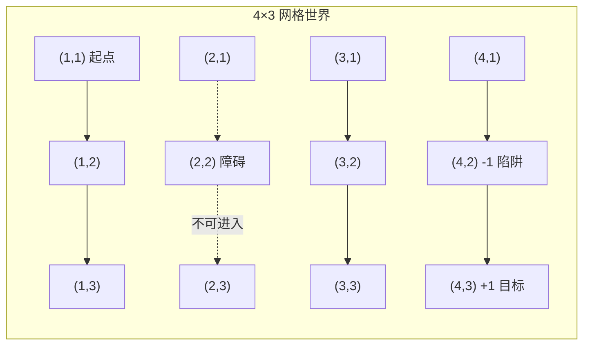
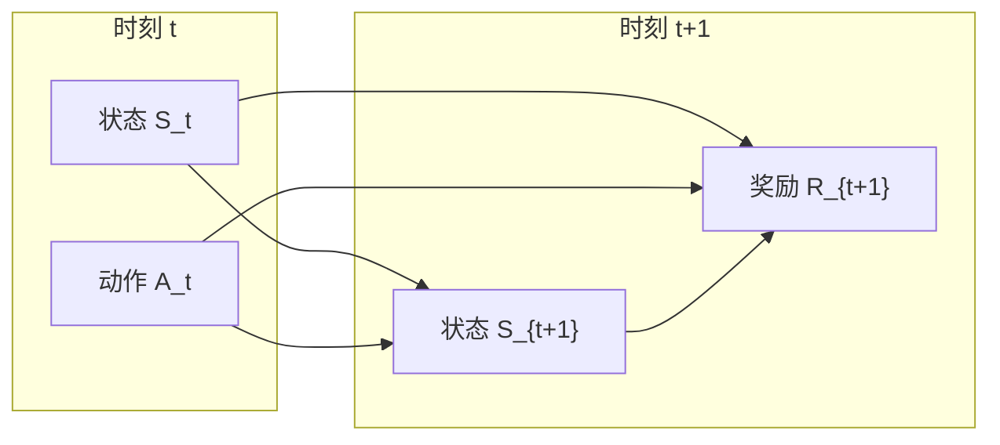

# 17.1 序贯决策问题

## 基本信息
- **课程**：人工智能（上册）
- **章节**：第17章 做复杂决策 - 17.1节
- **日期**：2026-04-08
- **标签**：#MDP #序贯决策 #马尔可夫 #贝尔曼方程 #强化学习基础

---

## 重点内容

### ⭐⭐⭐ 核心概念

1. **马尔可夫决策过程（MDP）** - 完全可观测随机环境下的序贯决策框架
2. **贝尔曼方程** - 状态效用与相邻状态效用的递归关系
3. **策略 vs 动作序列** - MDP的解是策略而非固定序列
4. **折扣因子** - 平衡当前与未来奖励的重要性

---

## 详细笔记

### 一、引入示例：$4 \times 3$ 网格世界



**环境特点**：
- 智能体从(1,1)出发，目标是到达(4,3)获得+1奖励
- (4,2)是陷阱，奖励为-1
- 动作：Up、Down、Left、Right

#### 随机转移模型

动作结果具有**不确定性**：
- 以 **0.8** 概率达到预期方向
- 以 **0.1** 概率向垂直方向移动（各0.1）
- 撞墙则停留在原地

**示例**：从(1,1)执行Up动作
- 0.8 概率到达(1,2)
- 0.1 概率到达(2,1)
- 0.1 概率撞墙，停留在(1,1)

---

### 二、马尔可夫决策过程（MDP）定义

> **定义**：一个完全可观测的随机环境下，具有马尔可夫转移模型和加性奖励的序贯决策问题称为**马尔可夫决策过程（Markov Decision Process, MDP）**。

#### MDP的五元组 $(S, A, P, R, \gamma)$

| 元素 | 符号 | 说明 |
|------|------|------|
| 状态集合 | $S$ | 包含初始状态 $s_0$ |
| 动作集合 | $A(s)$ 或 $\text{ACTIONS}(s)$ | 状态 $s$ 下可用的动作 |
| 转移模型 | $P(s' \mid s, a)$ | 在状态 $s$ 执行动作 $a$ 到达 $s'$ 的概率 |
| 奖励函数 | $R(s, a, s')$ | 转移获得的即时奖励 |
| 折扣因子 | $\gamma \in [0, 1]$ | 未来奖励的折扣程度 |

#### 马尔可夫性质

$$P(s_{t+1} \mid s_t, a_t, s_{t-1}, a_{t-1}, \ldots) = P(s_{t+1} \mid s_t, a_t)$$

**含义**：下一状态只依赖于当前状态和动作，与历史无关（无记忆性）。

---

### 三、策略与最优策略

#### 策略（Policy）

**定义**：策略 $\pi$ 是一个函数，$\pi(s)$ 表示在状态 $s$ 推荐的动作。

**特点**：
- 解的形式是**策略**，而非固定的动作序列
- 策略为每个可能到达的状态指定动作
- 无论动作结果如何，智能体都知道下一步该做什么
- 策略显式地表达了智能体函数

#### 最优策略 $\pi^*$

**定义**：产生最大期望效用的策略。

$$\pi^* = \arg\max_\pi U^\pi(s)$$

#### 奖励值对策略的影响（$4 \times 3$ 世界）

| 奖励范围 $r$ | 策略特点 | 行为描述 |
|-------------|---------|---------|
| $r < -1.6497$ | 直奔最近出口 | 包括-1的陷阱也愿意进 |
| $-0.7311 < r < -0.4526$ | 选择到+1的最短路径 | 但(4,1)处直接进入-1 |
| $-0.0850 < r < -0.0273$ | 平衡风险与奖励 | 正常情况（如r=-0.04）|
| $-0.0274 < r < 0$ | 完全规避风险 | 远离-1状态，可能撞墙 |
| $r > 0$ | 避开所有出口 | 永远留在环境中获得无限奖励 |

---

### 四、17.1.1 时间上的效用

#### 有限期 vs 无限期

| 类型 | 特点 | 策略性质 |
|------|------|---------|
| **有限期** | 存在固定时间 $N$ | 非平稳策略（依赖剩余时间） |
| **无限期** | 无固定时间限制 | 平稳策略（只依赖当前状态） |

#### 加性折扣奖励

$$U_h([s_0, a_0, s_1, a_1, \ldots]) = \sum_{t=0}^{\infty} \gamma^t R(s_t, a_t, s_{t+1})$$

**折扣因子 $\gamma$ 的含义**：

| $\gamma$ 值 | 含义 |
|------------|------|
| $\gamma \to 0$ | 只关注眼前奖励，短视 |
| $\gamma \to 1$ | 重视长期奖励，有远见 |
| $\gamma = 1$ | 纯加性奖励（无折扣） |

**效用上界**：

$$U_h \leq \sum_{t=0}^{\infty} \gamma^t R_{\max} = \frac{R_{\max}}{1 - \gamma}$$

#### 折扣奖励的5个合理性

1. **经验原因**：人与动物都更看重近期奖励
2. **经济原因**：早期奖励可投资产生收益（$\gamma = 0.9$ 相当于 11.1% 利率）
3. **不确定性**：$\gamma$ 等价于每步 $1-\gamma$ 的意外终止概率
4. **偏好平稳性**：加性折扣是唯一满足平稳性的效用形式
5. **数学便利**：保证无限序列效用有限，避免无穷比较

---

### 五、17.1.2 最优策略与状态效用

#### 状态效用定义

从状态 $s$ 开始执行策略 $\pi$ 的期望效用：

$$U^\pi(s) = E\left[\sum_{t=0}^{\infty} \gamma^t R(S_t, \pi(S_t), S_{t+1})\right]$$

#### ⭐⭐⭐ 贝尔曼方程（Bellman Equation）

**核心方程**：

$$U(s) = \max_{a \in A(s)} \sum_{s'} P(s' \mid s, a) [R(s, a, s') + \gamma U(s')]$$

**含义**：
- 状态的效用 = 最优动作带来的期望奖励 + 下一状态的折扣效用
- 状态的效用是贝尔曼方程组的**唯一解**

#### 最优策略的选择

$$\pi^*(s) = \arg\max_{a \in A(s)} \sum_{s'} P(s' \mid s, a) [R(s, a, s') + \gamma U(s')]$$

#### $4 \times 3$ 世界的状态效用示例（$\gamma=1, r=-0.04$）

```
        (1,3)   (2,3)   (3,3)
        0.812   0.868   0.912
        
        (1,2)   障碍    (3,2)
        0.762           0.660
        
        (1,1)   (2,1)   (3,1)
        0.705   0.655   0.611
                
                (4,1)   (4,2)   (4,3)
                        -1      +1
```

**规律**：离+1出口越近，效用越高。

---

### 六、17.1.3 奖励规模

#### 奖励值对行为的影响

- **负奖励**：给予智能体快速到达目标的动力
- **正奖励**：智能体可能选择永远留在环境中
- **奖励大小**：决定风险与速度的权衡

#### 适当策略（Proper Policy）

**定义**：保证最终到达终止状态的策略。

- 适当策略可使用 $\gamma = 1$（无折扣）
- 不适当策略存在时，标准算法可能失效

---

### 七、17.1.4 表示MDP

#### 动态决策网络（Dynamic Decision Network, DDN）



#### DDN的优势

- 紧致表示大型MDP
- 状态变量分解为多个属性（因子化表示）
- 转移概率由条件概率表给出
- 可扩展传感器变量表示POMDP

---

## 重点公式总结

| 公式名称 | 表达式 | 用途 |
|---------|--------|------|
| 折扣效用 | $U_h = \sum_{t=0}^{\infty} \gamma^t R_t$ | 计算历史效用 |
| 效用上界 | $U_h \leq \frac{R_{\max}}{1-\gamma}$ | 保证效用有限 |
| **贝尔曼方程** | $U(s) = \max_a \sum_{s'} P(s'\mid s,a)[R + \gamma U(s')]$ | 求解状态效用 |
| **最优策略** | $\pi^*(s) = \arg\max_a \sum_{s'} P(s'\mid s,a)[R + \gamma U(s')]$ | 选择最优动作 |

---

## 疑问与思考

❓ **疑问**：
- 贝尔曼方程如何具体求解？（见17.2节价值迭代、策略迭代）
- MDP与博弈论的关系？（见第18章）
- 部分可观测时如何处理？（见17.4节POMDP）

💡 **个人理解**：
- MDP是第3章搜索问题的**随机推广**
- 核心思想：在不确定环境中，最优决策需要考虑所有可能结果的**期望效用**
- 策略 $\pi$ 类似于编程中的"策略模式"，将决策逻辑封装

📌 **与前面章节的联系**：
- 第3章确定性搜索 $\to$ 第17章随机环境（MDP）
- 第5章博弈树搜索 $\to$ 第17章与期望最大化相关
- 第16章决策论 $\to$ 第17章序贯决策

---

## 相关链接

- [第17章-17.2-MDP的算法](第17章-17.2-MDP的算法.md)（待创建）
- [第17章-17.3-老虎机问题](第17章-17.3-老虎机问题.md)（待创建）
- [第17章-17.4-部分可观测MDP](第17章-17.4-部分可观测MDP.md)（待创建）
- [第3章-通过搜索进行问题求解](../章节笔记/第3章-通过搜索进行问题求解.md)
- [第16章-决策论](../章节笔记/第16章-决策论.md)（如有）

---

## 参考资源

- **教材**：《人工智能：现代方法（第4版）》第17章
- **延伸阅读**：Richard Bellman (1957) 动态规划奠基工作
- **应用领域**：机器人控制、自动驾驶、游戏AI、资源调度
