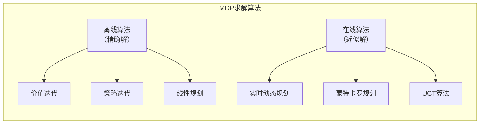

# 17.2 MDP的算法

## 基本信息
- **课程**：人工智能（上册）
- **章节**：第17章 做复杂决策 - 17.2节
- **日期**：2026-04-08
- **标签**：#MDP #价值迭代 #策略迭代 #贝尔曼更新 #动态规划

---

## 重点内容

### ⭐⭐⭐ 核心算法

1. **价值迭代（Value Iteration）** - 迭代更新状态效用直至收敛
2. **策略迭代（Policy Iteration）** - 交替进行策略评估与策略改进
3. **线性规划（Linear Programming）** - 将MDP转化为LP问题求解
4. **在线算法** - 实时动态规划、蒙特卡罗规划

---

## 详细笔记

### 一、算法分类



---

### 二、17.2.1 价值迭代（Value Iteration）

#### 核心思想

通过**迭代更新**状态效用，直至收敛到贝尔曼方程的解。

#### 贝尔曼更新（Bellman Update）

$$U_{i+1}(s) \leftarrow \max_{a \in A(s)} \sum_{s'} P(s' \mid s, a) [R(s, a, s') + \gamma U_i(s')]$$

#### 价值迭代算法

```
function VALUE-ITERATION(mdp, ε) returns 效用函数
inputs: 
    mdp: 具有状态S、动作A(s)、转移模型P、奖励R、折扣γ的MDP
    ε: 允许的最大误差

local variables:
    U, U': 状态效用向量，初始为0
    δ: 最大相对变化

repeat
    U ← U'
    δ ← 0
    for each 状态s in S do
        U'[s] ← max_{a∈A(s)} Q-VALUE(mdp, s, a, U)
        if |U'[s] - U[s]| > δ then
            δ ← |U'[s] - U[s]|
until δ ≤ ε(1-γ)/γ
return U
```

#### 收敛性分析

**压缩性质（Contraction）**：

贝尔曼更新是效用向量空间上的**压缩算子**，压缩因子为 $\gamma$：

$$\|BU_i - BU_i'\| \leq \gamma \|U_i - U_i'\|$$

**收敛速度**：
- 误差每次至少以因子 $\gamma$ 减少
- 指数级快速收敛

**迭代次数估计**：

$$N = \left\lceil \frac{\log(2R_{\max}/\varepsilon(1-\gamma))}{\log(1/\gamma)} \right\rceil$$

| 参数 | 影响 |
|------|------|
| $\gamma$ 接近1 | 收敛慢，但考虑长期影响 |
| $\gamma$ 较小 | 收敛快，但短视 |
| $\varepsilon$ 较小 | 精度高，迭代次数增加 |

#### 终止条件

$$\text{如果 } \|U_{i+1} - U_i\| < \frac{\varepsilon(1-\gamma)}{\gamma}, \text{ 则 } \|U_{i+1} - U\| < \varepsilon$$

#### 策略损失界限

$$\text{如果 } \|U_i - U\| < \varepsilon, \text{ 则 } \|U^{\pi_i} - U\| < 2\varepsilon$$

**重要发现**：通常在 $U_i$ 尚未收敛之前，$\pi_i$ 就已经达到最优！

---

### 三、17.2.2 策略迭代（Policy Iteration）

#### 核心思想

从初始策略开始，**交替进行**：
1. **策略评估**：计算当前策略下的状态效用
2. **策略改进**：基于效用计算新的MEU策略

#### 算法流程

```
function POLICY-ITERATION(mdp) returns 策略
inputs: mdp, 具有状态S、动作A(s)、转移模型P的MDP

local variables:
    U: 状态效用向量，初始为0
    π: 策略向量，初始为随机

repeat
    U ← POLICY-EVALUATION(π, U, mdp)
    unchanged? ← true
    for each 状态s in S do
        a* ← argmax_{a∈A(s)} Q-VALUE(mdp, s, a, U)
        if Q-VALUE(mdp, s, a*, U) > Q-VALUE(mdp, s, π[s], U) then
            π[s] ← a*
            unchanged? ← false
until unchanged?
return π
```

#### 策略评估（Policy Evaluation）

给定策略 $\pi_i$，计算效用 $U_i = U^{\pi_i}$：

$$U_i(s) = \sum_{s'} P(s' \mid s, \pi_i(s)) [R(s, \pi_i(s), s') + \gamma U_i(s')]$$

**关键区别**：
- 价值迭代：非线性方程（含max算子）
- 策略评估：**线性方程组**（动作已确定）

**求解方法**：
- 精确求解：$O(n^3)$，适用于小状态空间
- 迭代求解：简化贝尔曼更新，适用于大状态空间

#### 修正策略迭代（Modified Policy Iteration）

不必精确求解策略评估，只需执行**几次简化价值迭代步骤**：

$$U_{i+1}(s) \leftarrow \sum_{s'} P(s' \mid s, \pi_i(s)) [R(s, \pi_i(s), s') + \gamma U_i(s')]$$

#### 异步策略迭代（Asynchronous Policy Iteration）

- 每次迭代可选择**任意子集**的状态进行更新
- 同样保证收敛到最优策略
- 可设计更有效的启发式算法

---

### 四、17.2.3 线性规划（Linear Programming）

#### 基本思想

将MDP转化为**线性规划问题**求解。

#### LP表述

**变量**：每个状态 $s$ 的效用 $U(s)$

**目标**：最小化 $\sum_s U(s)$

**约束**：对于每个状态 $s$ 和动作 $a$：

$$U(s) \geq \sum_{s'} P(s' \mid s, a) [R(s, a, s') + \gamma U(s')]$$

#### 复杂度分析

- 理论：多项式时间可解
- 实践：LP求解器通常不如动态规划高效
- 状态数量往往非常大

---

### 五、17.2.4 MDP的在线算法

#### 离线 vs 在线

| 特点 | 离线算法 | 在线算法 |
|------|---------|---------|
| 计算时机 | 预先计算 | 决策时计算 |
| 适用规模 | 小到中等MDP | 大规模MDP（如$10^{62}$状态的俄罗斯方块）|
| 代表算法 | 价值迭代、策略迭代 | RTDP、UCT、蒙特卡罗规划 |

#### 实时动态规划（Real-Time Dynamic Programming, RTDP）

**核心思想**：
- 构建以当前状态为中心的最大化期望树
- 三角形节点：极大值节点（决策）
- 圆形节点：机会节点（随机结果）

**$\varepsilon$-期限（Horizon）**：

$$H = \left\lceil \log_\gamma \frac{\varepsilon(1-\gamma)}{R_{\max}} \right\rceil$$

超过深度 $H$ 的奖励之和小于 $\varepsilon$，可忽略。

**示例**：
- $\gamma = 0.5, \varepsilon = 0.1, R_{\max} = 1$：$H = 5$
- $\gamma = 0.9, \varepsilon = 0.1, R_{\max} = 1$：$H = 44$

#### 采样近似

当分支因子很大时，可通过**采样**近似期望：

$$\sum_s P(x)f(x) \approx \frac{1}{N} \sum_{i=1}^N f(x_i)$$

#### UCT算法

- 最初为MDP设计，后用于博弈
- 结合蒙特卡罗模拟和树搜索
- 平衡探索与利用

---

## 算法对比总结

| 算法 | 时间复杂度 | 空间复杂度 | 特点 |
|------|-----------|-----------|------|
| **价值迭代** | $O(|S|^2|A| \cdot N)$ | $O(|S|)$ | 简单直观，收敛快 |
| **策略迭代** | $O(|S|^3 + |S|^2|A| \cdot K)$ | $O(|S|)$ | 策略收敛快 |
| **修正策略迭代** | 介于两者之间 | $O(|S|)$ | 折中方案 |
| **线性规划** | 多项式时间 | $O(|S||A|)$ | 理论优美，实践较慢 |
| **在线算法** | 每次决策多项式 | $O(H \cdot |A|)$ | 适用于大规模问题 |

注：$N$为价值迭代次数，$K$为策略迭代次数，$H$为搜索深度。

---

## 重点公式总结

| 公式名称 | 表达式 | 说明 |
|---------|--------|------|
| **贝尔曼更新** | $U_{i+1}(s) = \max_a \sum_{s'} P(s'\|s,a)[R + \gamma U_i(s')]$ | 价值迭代核心 |
| **策略评估** | $U_i(s) = \sum_{s'} P(s'\|s,\pi_i(s))[R + \gamma U_i(s')]$ | 线性方程组 |
| **收敛条件** | $\|U_{i+1} - U_i\| < \varepsilon(1-\gamma)/\gamma$ | 终止判断 |
| **迭代次数** | $N = \lceil \log(2R_{\max}/\varepsilon(1-\gamma)) / \log(1/\gamma) \rceil$ | 复杂度估计 |
| **$\varepsilon$-期限** | $H = \lceil \log_\gamma(\varepsilon(1-\gamma)/R_{\max}) \rceil$ | 在线搜索深度 |

---

## 疑问与思考

❓ **疑问**：
- 价值迭代和策略迭代哪个更好？（取决于问题结构）
- 如何选择折扣因子 $\gamma$？（权衡短期与长期）
- 在线算法如何保证实时性？（限制搜索深度、使用启发式）

💡 **个人理解**：
- 价值迭代："先算效用，再得策略"
- 策略迭代："先定策略，再算效用，反复改进"
- 压缩性质是价值迭代收敛的理论保证
- 实际应用中，策略往往比效用更快收敛

📌 **与前面章节的联系**：
- 第3章A*搜索 $\to$ 第17章价值迭代（都是迭代求解）
- 第5章Minimax $\to$ 第17章最大化期望树
- 第13章采样方法 $\to$ 第17章在线算法采样近似

---

## 相关链接

- [第17章-17.1-序贯决策问题](第17章-17.1-序贯决策问题.md)
- [第17章-17.3-老虎机问题](第17章-17.3-老虎机问题.md)（待创建）
- [第3章-通过搜索进行问题求解](../章节笔记/第3章-通过搜索进行问题求解.md)
- [第5章-博弈中的优化决策](../章节笔记/第5章-5.2-博弈中的优化决策.md)

---

## 参考资源

- **教材**：《人工智能：现代方法（第4版）》第17.2节
- **延伸阅读**：
  - Bellman (1957) 动态规划
  - Howard (1960) 策略迭代
  - Kocsis & Szepesvári (2006) UCT算法
- **实践工具**：
  - Python: `pymdptoolbox`, `gym`
  - MATLAB: MDP Toolbox
