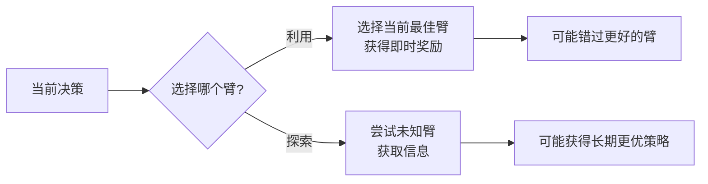

# 17.3 老虎机问题

## 基本信息
- **课程**：人工智能（上册）
- **章节**：第17章 做复杂决策 - 17.3节
- **日期**：2026-04-08
- **标签**：#老虎机问题 #探索与利用 #基廷斯指数 #UCB #汤普森采样

---

## 重点内容

### ⭐⭐⭐ 核心概念

1. **探索与利用的权衡** - 选择当前最佳臂还是尝试未知臂
2. **基廷斯指数（Gittins Index）** - 最优索引策略
3. **UCB（上置信界）** - 简单有效的近似策略
4. **汤普森采样** - 基于贝叶斯采样的策略
5. **老虎机超过程（BSP）** - 每个臂是完整MDP的推广

---

## 详细笔记

### 一、老虎机问题概述

#### 问题背景

在拉斯维加斯，单臂老虎机是一种投币机。赌徒投入硬币、拉动杠杆、收集奖金。一个 **$n$ 臂老虎机**有 $n$ 个杠杆，每个杠杆背后有固定但未知的奖金概率分布。

#### 核心问题

**探索与利用的权衡（Exploration vs Exploitation）**：
- **利用（Exploitation）**：选择当前奖励最多的臂
- **探索（Exploration）**：尝试还没试过的臂，获取信息



#### 应用领域

- 新疗法测试（临床试验）
- 投资组合选择
- 研究项目资助
- 在线广告投放
- A/B测试

---

### 二、老虎机问题的形式化定义

#### 马尔可夫奖励过程（MRP）

每个臂 $M_i$ 是一个**只有一个可能动作的MDP**：
- 状态集合 $S_i$
- 转移模型 $P_i(s' \mid s, a_i)$
- 奖励 $R_i(s, a_i, s')$
- 奖励序列 $R_{i,0}, R_{i,1}, R_{i,2}, \ldots$

#### 整体老虎机问题是一个MDP

- **状态空间**：$S = S_1 \times S_2 \times \cdots \times S_n$（笛卡尔积）
- **动作**：$a_1, a_2, \ldots, a_n$（选择拉动哪个臂）
- **转移模型**：只更新被选择的臂，其他臂保持不变
- **折扣因子**：$\gamma$

**关键特性**：
- 臂之间相互独立
- 同一时间只能在一个臂上工作

---

### 三、单臂老虎机与最优停止

#### 示例：确定性奖励序列

设 $\gamma = 0.5$，两个臂：
- 臂 $M$：奖励序列 0, 2, 0, 7.2, 0, 0, 0, ...
- 臂 $M_1$：固定奖励 1, 1, 1, ...

**单独使用每个臂的效用**：

$$U(M) = 1.0 \times 0 + 0.5 \times 2 + 0.5^2 \times 0 + 0.5^3 \times 7.2 = 1.9$$

$$U(M_1) = \sum_{t=0}^{\infty} 0.5^t = 2.0$$

**最优策略**：从 $M$ 开始，第4次后切换到 $M_1$

$$U(S) = 0 + 1.0 + 0 + 0.9 + \sum_{t=4}^{\infty} 0.5^t = 2.025$$

#### 停止时间（Stopping Time）

最优策略：拉动臂 $M$ 直到时间 $T$，然后永远转换到 $M_\lambda$

- $T = 0$：立即选择 $M_\lambda$
- $T = \infty$：永远选择 $M$
- $0 < T < \infty$：切换策略

---

### 四、⭐⭐⭐ 基廷斯指数（Gittins Index）

#### 定义

$$\lambda = \max_{T > 0} \frac{E\left(\sum_{t=0}^{T-1} \gamma^t R_t\right)}{E\left(\sum_{t=0}^{T-1} \gamma^t\right)}$$

**含义**：
- 分子：效用（折扣奖励和）
- 分母：折扣时间
- 比值：每单位折扣时间可获得的最大效用

#### 最优策略

> **基廷斯指数定理**：拉动基廷斯指数最高的那个臂，然后更新基廷斯指数。

**计算复杂度**：
- 第一次决策：$O(n)$（$n$ 为臂的数量）
- 后续决策：$O(1)$（未被选择的臂指数不变）

#### 计算示例

奖励序列：0, 2, 0, 7.2, 0, 0, 0, ...，$\gamma = 0.5$

| T | 1 | 2 | 3 | 4 | 5 | 6 |
|---|---|---|---|---|---|---|
| $R_t$ | 0 | 2 | 0 | 7.2 | 0 | 0 |
| $\sum \gamma^t R_t$ | 0.0 | 1.0 | 1.0 | 1.9 | 1.9 | 1.9 |
| $\sum \gamma^t$ | 1.0 | 1.5 | 1.75 | 1.875 | 1.9375 | 1.9687 |
| **比值** | **0.0** | **0.6667** | **0.5714** | **1.0133** | **0.9806** | **0.9651** |

**基廷斯指数**：$\lambda = 1.0133$（最大比值）

**最优策略**：
- 若 $0 < \lambda \leq 1.0133$：从 $M$ 获取前4个奖励，然后转换到 $M_\lambda$
- 若 $\lambda > 1.0133$：总是选择 $M_\lambda$

#### 重启MDP方法

计算一般臂 $M$ 的基廷斯指数：

1. 构造**重启MDP** $M^s$：在每个状态添加"重启"动作
2. 求解 $M^s$ 的最优策略价值 $V^*$
3. 基廷斯指数：$\lambda = (1-\gamma) \cdot V^*$

---

### 五、17.3.2 伯努利老虎机

#### 问题定义

每个臂 $M_i$ 以固定但未知的概率 $\mu_i$ 产生奖励0或1。

#### 状态表示

臂 $M_i$ 的状态由 $(s_i, f_i)$ 定义：
- $s_i$：成功次数（获得奖励1）
- $f_i$：失败次数（获得奖励0）
- 初始：$s_i = f_i = 1$（先验概率1/2）

**转移概率**：
- $P(\text{成功}) = \frac{s_i}{s_i + f_i}$
- $P(\text{失败}) = \frac{f_i}{s_i + f_i}$

#### 基廷斯指数特点

```
观察现象：
- 状态(3,2)：指数 0.7057，估计值 0.6
- 状态(7,4)：指数 0.6922，估计值 0.6364

结论：尝试次数少的臂有"探索奖励"（exploration bonus）
```

---

### 六、17.3.3 近似最优老虎机策略

#### UCB（上置信界）策略

$$UCB(M_i) = \hat{\mu}_i + \frac{g(N)}{\sqrt{N_i}}$$

其中：
- $\hat{\mu}_i$：臂 $i$ 的样本均值估计
- $N_i$：臂 $i$ 被采样次数
- $N$：总采样次数
- $g(N)$：适当函数

**直观理解**：
- 第一项：利用（当前估计值）
- 第二项：探索（不确定性 bonus）

**遗憾（Regret）界**：$O(\log N)$

#### 汤普森采样（Thompson Sampling）

**核心思想**：根据臂是实际最优的概率随机选择臂。

**算法步骤**：
1. 从每个臂的后验分布 $P_i(\mu_i)$ 生成一个样本
2. 选择样本值最大的臂

**特点**：
- 贝叶斯方法
- 遗憾增长速度：$O(\log N)$
- 实现简单，效果优异

---

### 七、17.3.4 老虎机问题的变体

#### 选择问题（Selection Problem）

**与老虎机问题的区别**：

| 特点 | 老虎机问题 | 选择问题 |
|------|-----------|---------|
| 目标 | 最大化总奖励 | 尽快确定最佳选项 |
| 失败代价 | 有代价（失去生命/金钱） | 无额外代价 |
| 索引函数 | 存在（基廷斯指数） | **不存在** |
| 应用场景 | 临床试验 | 药物筛选、供应商选择 |

**元级决策**：博弈树搜索中的节点扩展决策是选择问题，不是老虎机问题。

#### 老虎机超过程（Bandit Superprocess, BSP）

**定义**：每个臂本身是一个**完整的MDP**（而非MRP）。

**应用场景**：
- 多任务处理
- 项目管理
- 多学生教学

**关键发现**：

> BSP的全局最优策略可能涉及局部次优的行动！

**原因**：其他MDP的可用性改变了短期与长期奖励的平衡。

**示例**：4个购物中心建设
- 局部最优：第15周第一家商店出租
- 全局最优：使用次优计划（第5周出租），租金收取：第5, 10, 15, 20周
- 若都等15周：租金收取：第15, 30, 45, 60周

**求解方法**：
- 精确求解：笛卡尔积状态空间（指数级复杂度）
- 实用方法：机会成本建模 + 边界计算 + 前瞻搜索

---

## 算法对比总结

| 策略 | 类型 | 计算复杂度 | 遗憾界 | 特点 |
|------|------|-----------|--------|------|
| **基廷斯指数** | 最优 | $O(n)$ 每次决策 | 最优 | 理论最优，计算复杂 |
| **UCB** | 近似 | $O(1)$ 每次决策 | $O(\log N)$ | 简单有效，广泛使用 |
| **汤普森采样** | 近似 | $O(1)$ 每次决策 | $O(\log N)$ | 贝叶斯方法，效果优异 |
| **$\varepsilon$-贪心** | 简单 | $O(1)$ | 次优 | 以$\varepsilon$概率随机探索 |

---

## 重点公式总结

| 公式名称 | 表达式 | 说明 |
|---------|--------|------|
| **基廷斯指数** | $\lambda = \max_T \frac{E(\sum_{t=0}^{T-1}\gamma^t R_t)}{E(\sum_{t=0}^{T-1}\gamma^t)}$ | 最优索引 |
| **UCB** | $UCB(M_i) = \hat{\mu}_i + g(N)/\sqrt{N_i}$ | 上置信界 |
| **遗憾界** | $O(\log N)$ | Lai & Robbins (1985) |

---

## 疑问与思考

❓ **疑问**：
- 基廷斯指数为什么是最优的？（可分解性定理）
- UCB中的 $g(N)$ 如何选择？（有多种变体：UCB1, UCB2, ...）
- 汤普森采样与UCB哪个更好？（取决于问题，通常汤普森采样更鲁棒）

💡 **个人理解**：
- 老虎机问题是**探索-利用权衡**的最简单形式
- 基廷斯指数将复杂的序贯决策问题简化为**索引策略**
- UCB的"不确定性 bonus"是探索的直观体现
- BSP说明**全局最优 ≠ 局部最优之和**

📌 **与前面章节的联系**：
- 第5章MCTS中的UCB $\to$ 第17章UCB策略
- 第14章贝叶斯更新 $\to$ 第17章汤普森采样
- 第17.2节MDP算法 $\to$ 第17.3节基廷斯指数计算

---

## 相关链接

- [第17章-17.1-序贯决策问题](第17章-17.1-序贯决策问题.md)
- [第17章-17.2-MDP的算法](第17章-17.2-MDP的算法.md)
- [第17章-17.4-部分可观测MDP](第17章-17.4-部分可观测MDP.md)
- [第17章-17.5-求解POMDP的算法](第17章-17.5-求解POMDP的算法.md)
- [第5章-5.4-蒙特卡罗树搜索](../章节笔记/第5章-5.4-蒙特卡罗树搜索.md)

---

## 参考资源

- **教材**：《人工智能：现代方法（第4版）》第17.3节
- **经典论文**：
  - Gittins (1979) 基廷斯指数
  - Lai & Robbins (1985) 渐进最优遗憾界
  - Auer et al. (2002) UCB1算法
  - Thompson (1933) 汤普森采样
- **实践应用**：
  - 在线广告：Google, Facebook的A/B测试
  - 推荐系统：Netflix, Spotify的内容推荐
  - 临床试验：自适应随机化
