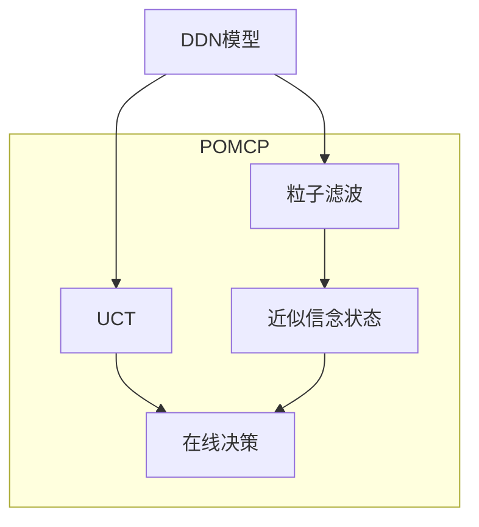

# 17.5 求解POMDP的算法

## 基本信息
- **课程**：人工智能（上册）
- **章节**：第17章 做复杂决策 - 17.5节
- **日期**：2026-04-08
- **标签**：#POMDP算法 #价值迭代 #在线算法 #POMCP #条件规划

---

## 重点内容

### ⭐⭐⭐ 核心概念

1. **条件规划（Conditional Plan）** - POMDP的解表示形式
2. **效用超平面** - 信念空间中的分段线性凸函数
3. **POMDP价值迭代** - 基于条件规划的动态规划
4. **劣势规划消除** - 减少计算复杂度的关键
5. **POMCP（部分可观测蒙特卡罗规划）** - 在线近似算法

---

## 详细笔记

### 一、POMDP解的基本形式

#### 从策略到条件规划

在POMDP中，最优策略 $\pi^*$ 可以用**条件规划**表示：

```
条件规划 = [动作; if 感知=e₁ then 子规划₁ else if 感知=e₂ then 子规划₂ ...]
```

**示例**：
```
[Stay; if Percept=A then Stay else Go]
```

#### 关键观察

**观察1**：固定条件规划的期望效用随信念状态**线性变化**

$$U_p(b) = \sum_s b(s) \alpha_p(s) = b \cdot \alpha_p$$

其中 $\alpha_p(s)$ 是从物理状态 $s$ 开始执行规划 $p$ 的效用。

**观察2**：最优效用是各条件规划效用的**最大值**

$$U(b) = \max_p b \cdot \alpha_p$$

#### 效用函数的几何性质

```mermaid
graph TD
    A[效用函数 U(b)] --> B[分段线性]
    A --> C[凸函数]
    B --> D[多个超平面的最大值]
    C --> E[信念状态越确定<br>效用越高]
    D --> F[每个超平面对应<br>一个条件规划]
```

**为什么中间信念状态效用较低？**
- 中间状态：不确定性高，缺乏选择好的动作所需的信息
- 极端状态：确定性高，可以做出最优选择
- 体现了**信息的价值**

---

### 二、⭐⭐⭐ 两状态世界示例

#### 问题设定

- **状态**：$A$（奖励0），$B$（奖励1）
- **动作**：
  - Stay：以0.9概率停留在原地
  - Go：以0.9概率转换到另一状态
- **传感器**：以0.6概率报告正确状态
- **折扣因子**：$\gamma = 1$

#### 一步规划的效用计算

$$\alpha_{[Stay]}(A) = 0.9 \times 0 + 0.1 \times 1 = 0.1$$
$$\alpha_{[Stay]}(B) = 0.1 \times 0 + 0.9 \times 1 = 0.9$$

$$\alpha_{[Go]}(A) = 0.1 \times 0 + 0.9 \times 1 = 0.9$$
$$\alpha_{[Go]}(B) = 0.9 \times 0 + 0.1 \times 1 = 0.1$$

#### 效用函数可视化

```
效用
  ↑
1 │      /Stay
  │     /
0.5│----●----
  │   /
0 │  /Go
  └──────────→ b(B)
    0   0.5   1
```

**最优一步策略**：
- $b(B) > 0.5$ 时选择 Stay
- $b(B) \leq 0.5$ 时选择 Go

---

### 三、⭐⭐⭐ POMDP价值迭代算法

#### 算法思想

从深度为1的条件规划开始，逐步构建更深层的规划：

```
深度1：单个动作 [Stay], [Go]
    ↓
深度2：[动作; if 感知 then 深度1规划]
    ↓
深度3：[动作; if 感知 then 深度2规划]
    ↓
...
```

#### 效用递归公式

对于深度为 $d$ 的条件规划 $p$：

$$\alpha_p(s) = \sum_{s'} P(s' \mid s, a) \left[ R(s, a, s') + \gamma \sum_e P(e \mid s') \alpha_{p.e}(s') \right]$$

其中：
- $a$：规划的初始动作
- $p.e$：感知 $e$ 后的子规划（深度 $d-1$）

#### 算法复杂度分析

| 参数 | 符号 | 深度 $d$ 的规划数量 |
|------|------|-------------------|
| 动作数 | $\|A\|$ | 指数级增长 |
| 观测数 | $\|E\|$ | $|A|^{O(|E|^{d-1})}$ |

**示例**：
- $d=8$，$|A|=2$，$|E|=4$：$2^{2^{14}} = 2^{16384}$ 个规划！
- 消除劣势规划后：只有144个非劣势规划

#### 劣势规划消除（REMOVE-DOMINATED-PLANS）

**定义**：规划 $p_1$ 被 $p_2$ **劣势**，如果对所有信念状态 $b$：

$$b \cdot \alpha_{p_1} \leq b \cdot \alpha_{p_2}$$

**重要性**：
- 双指数增长 → 可管理的规模
- 使用线性规划检测劣势规划

---

### 四、两状态世界的深度扩展

#### 深度2的规划

总共有 $2 \times 2^2 = 8$ 个不同的深度2规划：

```
[Stay; if A then Stay else Stay]
[Stay; if A then Stay else Go]
[Stay; if A then Go else Stay]
[Stay; if A then Go else Go]
[Go; if A then Stay else Stay]
[Go; if A then Stay else Go]
[Go; if A then Go else Stay]
[Go; if A then Go else Go]
```

#### 非劣势规划

- 8个规划中只有**4个非劣势**
- 信念空间被划分为4个区域
- 每个区域对应一个最优规划

#### 深度8的结果

- 非劣势规划数量：144个
- 效用函数：复杂的分段线性凸函数
- 最优策略与深度1相同（在这个简单例子中）

---

### 五、⭐⭐⭐ 17.5.2 POMDP的在线算法

#### 基本设计

在线POMDP智能体的决策循环：

```mermaid
flowchart LR
    A[当前信念状态 b] --> B[前瞻搜索<br>选择动作]
    B --> C[执行动作 a]
    C --> D[观测证据 e]
    D --> E[滤波更新<br>b' = FORWARD(b,a,e)]
    E --> A
```

#### EXPECTIMAX算法扩展

将17.2.4节的EXPECTIMAX算法扩展到POMDP：

```
EXPECTIMAX树：
- 决策节点：信念状态 b
- 机会节点：可能的观测 e
  - 分支概率：P(e | a, b)
  - 子节点：新信念状态 FORWARD(b, a, e)
```

**复杂度**：$O(|A|^d \cdot |E|^d)$ —— 远小于价值迭代的双指数增长

#### 关键优化技术

1. **采样**：在机会节点采样观测，减少分支因子
2. **近似滤波**：使用粒子滤波处理大状态空间
3. **长期模拟**：类似UCT的蒙特卡罗模拟

---

### 六、⭐⭐⭐ POMCP（部分可观测蒙特卡罗规划）

#### 算法组成

POMCP = **粒子滤波** + **UCT**



#### 算法特点

| 特性 | 说明 |
|------|------|
| 信念表示 | 粒子集合（而非精确概率分布） |
| 适用规模 | 非常大的状态和观测空间 |
| 模型表示 | DDN（动态决策网络） |
| 近似性 | 牺牲最优性换取可扩展性 |

#### $4 \times 3$ POMDP示例

图17-18展示了POMCP的行为：

1. **初始**：均匀信念状态
2. **Left动作**：安全，不太可能落入(4,2)
3. **Up动作**：可能在(3,3)或(1,3)
4. **Right动作**：在两种情况下都是好选择
5. **继续Right**：达到目标

---

### 七、算法对比总结

| 算法 | 类型 | 复杂度 | 适用场景 | 特点 |
|------|------|--------|---------|------|
| **精确价值迭代** | 离线 | 双指数 $O(|A|^{|E|^d})$ | 小规模POMDP | 最优但不可扩展 |
| **点-based VI** | 离线 | 多项式（近似） | 中等规模 | 近似最优 |
| **EXPECTIMAX** | 在线 | $O(|A|^d \cdot |E|^d)$ | 中等规模 | 精确但深度受限 |
| **POMCP** | 在线 | 每次决策多项式 | 大规模POMDP | 可扩展，近似 |

---

## 重点公式总结

| 公式名称 | 表达式 | 说明 |
|---------|--------|------|
| **效用线性性** | $U_p(b) = b \cdot \alpha_p$ | 固定规划的效用 |
| **最优效用** | $U(b) = \max_p b \cdot \alpha_p$ | 分段线性凸函数 |
| **效用递归** | $\alpha_p(s) = \sum_{s'} P(s'\|s,a)[R + \gamma \sum_e P(e\|s')\alpha_{p.e}(s')]$ | 条件规划效用 |
| **复杂度** | $|A|^{O(|E|^{d-1})}$ | 深度 $d$ 的规划数 |

---

## 疑问与思考

❓ **疑问**：
- 为什么POMDP是PSPACE-hard的？（信念空间连续，需要无限存储）
- 点-based价值迭代如何工作？（只在信念空间的"关键点"计算效用）
- POMCP的收敛性如何保证？（蒙特卡罗方法的统计保证）

💡 **个人理解**：
- POMDP的难点在于**连续信念空间** + **信息价值**
- 条件规划表示将无限策略空间转化为可管理的结构
- 在线算法通过**前瞻搜索**避免存储整个策略
- POMCP的成功说明**近似+采样**在处理复杂不确定性时的威力

📌 **与前面章节的联系**：
- 第4章：条件规划概念
- 第5章：EXPECTIMAX、UCT、MCTS
- 第14章：粒子滤波
- 第17.2节：MDP价值迭代
- 第17.4节：POMDP基础

---

## 相关链接

- [第17章-17.1-序贯决策问题](第17章-17.1-序贯决策问题.md)
- [第17章-17.2-MDP的算法](第17章-17.2-MDP的算法.md)
- [第17章-17.3-老虎机问题](第17章-17.3-老虎机问题.md)
- [第17章-17.4-部分可观测MDP](第17章-17.4-部分可观测MDP.md)
- [第5章-5.4-蒙特卡罗树搜索](../章节笔记/第5章-5.4-蒙特卡罗树搜索.md)
- [第14章-概率推理](../../第14章-概率推理/)

---

## 参考资源

- **教材**：《人工智能：现代方法（第4版）》第17.5节
- **经典论文**：
  - Sondik (1971) "The optimal control of partially observable Markov processes"
  - Kaelbling et al. (1998) "Planning and acting in partially observable stochastic domains"
  - Pineau et al. (2003) "Point-based value iteration: An anytime algorithm for POMDPs"
  - Silver & Veness (2010) "Monte-Carlo planning in large POMDPs"
- **开源工具**：
  - APPL：POMDP求解器
  - DESPOT：在线POMDP算法
  - AI-Toolbox：C++ POMDP库
