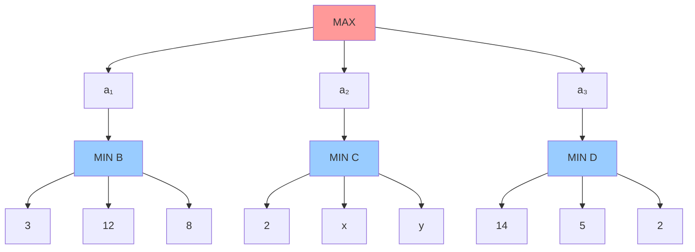
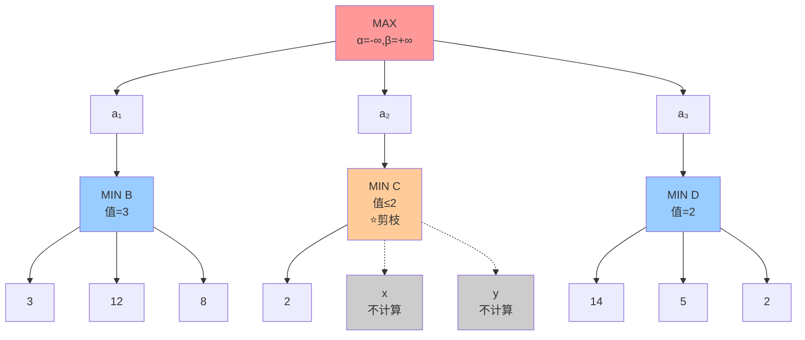

# 5.2 博弈中的优化决策

## 基本信息
- **课程**：人工智能（上册）
- **章节**：第5章 5.2 博弈中的优化决策
- **日期**：2026-04-03
- **标签**：#Minimax #AlphaBeta剪枝 #博弈树 #优化决策

---

## 重点内容

⭐ **核心算法**：
- 极小化极大搜索算法（Minimax）
- α-β剪枝算法（Alpha-Beta Pruning）⭐⭐⭐

⭐ **关键概念**：
- 极小化极大值（Minimax Value）
- 倒推值（Backup Value）
- 剪枝条件
- 移动顺序优化

---

## 一、极小化极大值（Minimax Value）

### 1.1 定义
某一状态的极小化极大值是指：**假设从该状态到博弈结束两个参与者都以最优策略行动**，到达的终止状态对于MAX的效用值。

### 1.2 数学公式

$$
\text{MINIMAX}(s) = 
\begin{cases} 
\text{UTILITY}(s, \text{MAX}) & \text{如果 IS-TERMINAL}(s) \\
\max_{a \in \text{Actions}(s)} \text{MINIMAX}(\text{RESULT}(s, a)) & \text{如果 TO-MOVE}(s) = \text{MAX} \\
\min_{a \in \text{Actions}(s)} \text{MINIMAX}(\text{RESULT}(s, a)) & \text{如果 TO-MOVE}(s) = \text{MIN}
\end{cases}
$$

### 1.3 图5-2示例



**计算过程**：
- 节点B（MIN）：min(3, 12, 8) = **3**
- 节点C（MIN）：min(2, x, y) = **2**
- 节点D（MIN）：min(14, 5, 2) = **2**
- 根节点（MAX）：max(3, 2, 2) = **3**

**最优决策**：MAX选择 $a_1$

---

## 二、5.2.1 极小化极大搜索算法

### 2.1 算法思想
- **递归算法**：一直向下进行到叶节点
- **倒推值**：随着递归展开通过搜索树倒推极小化极大值
- **深度优先探索**：完整的深度优先搜索

### 2.2 算法伪代码

```python
def MINIMAX-SEARCH(game, state):
    player = game.To-Move(state)
    value, move = MAX-VALUE(game, state)
    return move

def MAX-VALUE(game, state):
    if game.Is-TERMINAL(state):
        return game.UTILITY(state, player), null
    
    v = -∞
    move = null
    for each a in game.ACTIONS(state):
        v2, a2 = MIN-VALUE(game, game.RESULT(state, a))
        if v2 > v:
            v, move = v2, a
    return v, move

def MIN-VALUE(game, state):
    if game.Is-TERMINAL(state):
        return game.UTILITY(state, player), null
    
    v = +∞
    move = null
    for each a in game.ACTIONS(state):
        v2, a2 = MAX-VALUE(game, game.RESULT(state, a))
        if v2 < v:
            v, move = v2, a
    return v, move
```

### 2.3 复杂度分析

| 复杂度类型 | 值 | 说明 |
|-----------|-----|------|
| **时间复杂度** | $O(b^m)$ | $b$=分支因子，$m$=最大深度 |
| **空间复杂度** | $O(bm)$ | 一次生成所有动作 |
| **空间复杂度** | $O(m)$ | 一次生成一个动作 |

💡 **现实挑战**：国际象棋 $35^{80} \approx 10^{123}$，显然不可行！

---

## 三、5.2.2 多人博弈中的最优决策

### 3.1 核心变化
- **单一值 → 值向量**
- 3人博弈：$\langle v_A, v_B, v_C \rangle$

### 3.2 决策规则
每个节点选择**对自己最有利**的移动

### 3.3 联盟现象
> 💡 **有趣发现**：联盟可以自然形成于纯粹的自私行为！

- A和B处于弱势，C处于强势
- A和B的最佳策略：**一起攻击C**
- 一旦C被削弱，联盟可能瓦解

### 3.4 非零和博弈中的合作
如果存在效用值 $\langle v_A = 1000, v_B = 1000 \rangle$ 的终止状态：
- 双方都会尽一切可能到达该状态
- **自动合作**实现共同目标

---

## 四、5.2.3 α-β剪枝 ⭐⭐⭐⭐⭐

### 4.1 核心思想
**通过剪枝消除对结果没有影响的树的大部分**，不需要检查所有状态就能计算出正确的极小化极大决策。

### 4.2 关键参数

| 参数 | 含义 | 解释 |
|------|------|------|
| **$\alpha$** | MAX的当前最佳选择 | "至少"（下界） |
| **$\beta$** | MIN的当前最佳选择 | "至多"（上界） |

### 4.3 剪枝条件

```
对于MAX节点：
    如果 当前值 ≥ β，则剪枝
    
对于MIN节点：
    如果 当前值 ≤ α，则剪枝
```

### 4.4 图5-5剪枝示例详解



**步骤分析**：

| 步骤 | 操作 | 结果 | 说明 |
|------|------|------|------|
| (a) | 计算B的第一个子节点 | B ≤ 3 | 第一个叶节点=3 |
| (b) | 计算B的第二个子节点 | B ≤ 3 | 12>3，MIN不会选 |
| (c) | 计算B的第三个子节点 | **B = 3** | 8>3，MIN选3 |
| | 根节点α = 3 | | MAX至少能得到3 |
| (d) | 计算C的第一个子节点 | C ≤ 2 | 第一个叶节点=2 |
| | **剪枝！** | x, y不计算 | 2 < α(3)，MAX不会选C |
| (e)(f) | 计算D的所有子节点 | **D = 2** | min(14,5,2)=2 |
| | 根节点MAX | **= 3** | max(3, 2, 2)=3 |

### 4.5 数学证明

$$
\begin{aligned}
\text{MINIMAX(root)} &= \max(\min(3,12,8), \min(2,x,y), \min(14,5,2)) \\
&= \max(3, \min(2,x,y), 2) \\
&= \max(3, z, 2) \quad \text{其中 } z = \min(2,x,y) \leq 2 \\
&= 3
\end{aligned}
$$

根节点的值与x、y无关，因此可以剪枝！

### 4.6 α-β剪枝算法伪代码

```python
def ALPHA-BETA-SEARCH(game, state):
    player = game.To-Move(state)
    value, move = MAX-VALUE(game, state, -∞, +∞)
    return move

def MAX-VALUE(game, state, α, β):
    if game.Is-TERMINAL(state):
        return game.UTILITY(state, player), null
    
    v = -∞
    for each a in game.ACTIONS(state):
        v2, a2 = MIN-VALUE(game, game.RESULT(state, a), α, β)
        if v2 > v:
            v, move = v2, a
        α = MAX(α, v)
        if v ≥ β:        # ⭐ 剪枝条件
            return v, move
    return v, move

def MIN-VALUE(game, state, α, β):
    if game.Is-TERMINAL(state):
        return game.UTILITY(state, player), null
    
    v = +∞
    for each a in game.ACTIONS(state):
        v2, a2 = MAX-VALUE(game, game.RESULT(state, a), α, β)
        if v2 < v:
            v, move = v2, a
        β = MIN(β, v)
        if v ≤ α:        # ⭐ 剪枝条件
            return v, move
    return v, move
```

### 4.7 复杂度分析

| 情况 | 时间复杂度 | 有效分支因子 |
|------|-----------|-------------|
| **最佳情况**（完美移动顺序） | $O(b^{m/2})$ | $\sqrt{b}$ |
| **随机顺序** | $O(b^{3m/4})$ | $b^{3/4}$ |
| **最差情况**（无剪枝） | $O(b^m)$ | $b$ |

📌 **国际象棋示例**：
- 分支因子从35降到$\sqrt{35} \approx 6$
- 相同时间内可搜索**两倍深度**！

---

## 五、5.2.4 移动顺序

### 5.1 重要性
α-β剪枝的有效性**很大程度上依赖于状态的检查顺序**！

### 5.2 移动排序策略

1. **简单排序**：先尝试吃子，然后是威胁，再后是前进和后退
2. **绝招启发式**：首先尝试之前发现的最佳移动（killer move）
3. **迭代加深**：先搜索一层并记录排名，再深入搜索

### 5.3 换位表（Transposition Table）

**问题**：不同移动序列可能导致相同的局面（换位）

**解决方案**：
- 缓存状态的启发式值
- 避免重复搜索
- 在国际象棋中非常有效，搜索深度可**扩大一倍**

---

## 六、香农的两种策略（1950）

克劳德·香农在《Programming a Computer for Playing Chess》中提出：

| 策略 | 特点 | 应用 |
|------|------|------|
| **A型策略** | 宽但浅，考虑某深度的所有移动 | 传统国际象棋程序 |
| **B型策略** | 深但窄，舍弃看起来差的移动 | 围棋程序、现代国际象棋 |

---

## 疑问与思考

❓ **待解决问题**：
1. 如何设计一个好的移动排序函数？
2. 在实际应用中，α-β剪枝能达到理论上的最佳效率吗？
3. 换位表的实现细节是什么？

💡 **个人理解**：
- α-β剪枝的精髓在于"不需要知道确切值，只需要知道范围"
- 移动顺序优化是实践中的关键，理论上的最佳顺序不可达
- 剪枝条件可以理解为：如果当前路径不可能超越已知的最佳选择，就放弃

---

## 相关链接

- **课本**：第5章 5.2节 "博弈中的优化决策"
- **图5-2**：二层博弈树示例
- **图5-3**：Minimax算法
- **图5-5**：α-β剪枝过程详解
- **图5-6**：α-β剪枝的一般情况
- **图5-7**：α-β搜索算法

---

## 复习要点

1. **Minimax值定义**：假设双方都最优，MAX能获得的效用值
2. **Minimax算法**：递归深度优先，时间$O(b^m)$，空间$O(bm)$或$O(m)$
3. **α-β剪枝**：
   - α = MAX的当前最佳选择（下界）
   - β = MIN的当前最佳选择（上界）
   - 剪枝条件：MAX节点v≥β，MIN节点v≤α
   - 最佳情况时间$O(b^{m/2})$
4. **移动顺序**：严重影响剪枝效率，完美顺序可使分支因子从b降到$\sqrt{b}$
5. **换位表**：缓存已计算状态，避免重复搜索

---

## 算法对比总结

| 算法 | 核心思想 | 时间复杂度 | 关键优化 |
|------|---------|-----------|---------|
| **Minimax** | 极大极小递归 | $O(b^m)$ | 基础算法 |
| **α-β剪枝** | 剪掉无关分支 | $O(b^{m/2})$ | 移动顺序、换位表 |
| **迭代加深** | 逐步加深搜索 | - | 优化移动顺序 |
