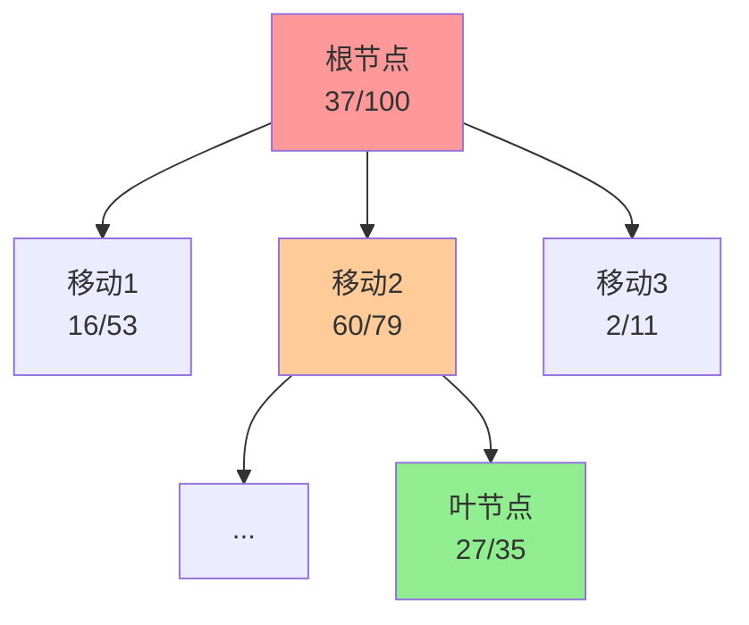
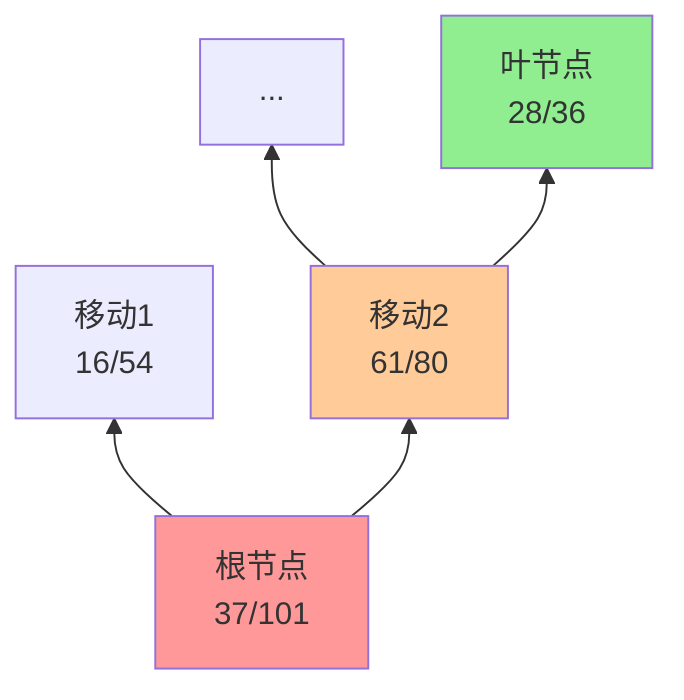
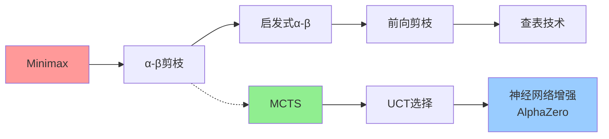

# 5.4 蒙特卡罗树搜索（MCTS）

## 基本信息
- **课程**：人工智能（上册）
- **章节**：第5章 5.4 蒙特卡罗树搜索
- **日期**：2026-04-03
- **标签**：#MCTS #蒙特卡罗 #UCT #探索利用权衡 #博弈搜索

---

## 重点内容

⭐ **核心思想**：
- 不用启发式评价函数，通过多次完整博弈模拟的平均效用值估计状态值
- 适用于分支因子大、评价函数难定义的博弈（如围棋）

⭐ **四大步骤**：
1. 选择（Selection）
2. 扩展（Expansion）
3. 模拟（Simulation）
4. 反向传播（Back-Propagation）

⭐ **关键算法**：
- UCT（应用于树搜索的置信上界）
- UCB1公式平衡探索与利用

---

## 一、为什么需要MCTS？

### 1.1 α-β搜索在围棋中的困境

| 问题 | 说明 |
|------|------|
| **分支因子太大** | 围棋初始分支因子为361 |
| **搜索深度受限** | α-β搜索只能达到4-5层 |
| **评价函数难定义** | 子力价值不是有效指标 |
| **状态变化复杂** | 大多数状态直到最后阶段都在变化 |

### 1.2 MCTS的核心思想

> 💡 **不用启发式评价函数，而是通过多次完整博弈模拟的平均效用值来估计状态值**

---

## 二、MCTS的基本概念

### 2.1 模拟（Simulation / Playout / Rollout）


**特点**：
- 从当前状态开始，双方轮流选择移动
- 直到到达终止局面
- 用**博弈规则**（而非启发式）判断结果
- 对于输赢博弈，"平均效用值" = "获胜百分比"

### 2.2 模拟策略（Playout Policy）

**问题**：如果随机选择移动，得到的是"双方都随机玩"的结果，而非"双方都最优玩"的结果

**解决方案**：
- 使用**模拟策略**偏向好的行动
- 围棋：使用神经网络从自我对弈中学习
- 国际象棋："考虑吃子"
- 黑白棋："占据角落"

---

## 三、MCTS的四个步骤 ⭐⭐⭐

MCTS通过迭代四个步骤不断增长的搜索树：

### 3.1 选择（Selection）



**过程**：
- 从根节点开始
- 使用**选择策略**选择移动
- 沿着树向下移动到**叶节点**
- 平衡**探索**（模拟次数少的节点）和**利用**（胜率高的节点）

### 3.2 扩展（Expansion）

- 为所选叶节点生成**一个新的子节点**
- 标记为 $0/0$（0胜/0次模拟）
- 某些版本会生成多个子节点

### 3.3 模拟（Simulation）

- 从新生成的子节点开始执行**一次模拟**
- 根据**模拟策略**为双方选择移动
- 这些移动**不记录在搜索树中**
- 图中示例：黑方获胜

### 3.4 反向传播（Back-Propagation）



**更新规则**：
- 黑方节点：获胜次数+1，模拟次数+1
- 白方节点：模拟次数+1（获胜次数不变）
- 自底向上更新所有节点

---

## 四、UCT选择策略 ⭐⭐⭐

### 4.1 UCB1公式

$$
\text{UCB1}(n) = \frac{U(n)}{N(n)} + C \times \sqrt{\frac{\log N(\text{PARENT}(n))}{N(n)}}
$$

**符号说明**：

| 符号 | 含义 |
|------|------|
| $U(n)$ | 经过节点n的所有模拟的**总效用值** |
| $N(n)$ | 经过节点n的**模拟次数** |
| PARENT(n) | 节点n的父节点 |
| $C$ | 平衡利用和探索的常数（理论值$\sqrt{2}$） |

### 4.2 公式解读

```mermaid
graph LR
    A[UCB1值] --> B[利用项<br/>U(n)/N(n)]
    A --> C[探索项<br/>C×√(log N(PARENT)/N(n))]
    
    B --> D[平均效用值<br/>胜率越高越好]
    C --> E[不确定性<br/>模拟越少分值越高]
    
    style B fill:#90EE90
    style C fill:#ffcc99
```

**利用项**：节点的平均效用值（胜率越高越好）

**探索项**：
- 分母 $N(n)$：模拟次数少的节点分值高
- 分子 $\log N(\text{PARENT})$：父节点探索越多，探索项越小
- 最终趋于0，模拟分配给平均效用值最高的节点

### 4.3 参数C的影响

- $C = 1.4$：60/79节点UCB1值最高（利用优先）
- $C = 1.5$：2/11节点分值最高（探索优先）

---

## 五、MCTS算法伪代码

```python
def MONTE-CARLO-TREE-SEARCH(state):
    tree = NODE(state)  # 初始化博弈树
    
    while IS-TIME-REMAINING():  # 时间未耗尽
        leaf = SELECT(tree)      # 选择
        child = EXPAND(leaf)     # 扩展
        result = SIMULATE(child) # 模拟
        BACK-PROPAGATE(result, child)  # 反向传播
    
    # 返回模拟次数最多的移动
    return argmax(ACTIONS(state), key=lambda a: N(NODE(a)))
```

---

## 六、MCTS vs α-β搜索

### 6.1 复杂度对比

假设分支因子32，博弈平均100步，计算能力10亿状态：

| 算法 | 搜索深度/模拟次数 |
|------|------------------|
| Minimax | 6层 |
| α-β（完美顺序） | 12层 |
| **MCTS** | **1000万次模拟** |

### 6.2 优缺点对比

| 特点 | MCTS | α-β搜索 |
|------|------|---------|
| **依赖评价函数** | ❌ 不需要 | ✅ 需要 |
| **易受单次错误影响** | ❌ 不易（多次模拟聚合） | ✅ 易受影响 |
| **分支因子敏感** | ❌ 不敏感 | ✅ 敏感 |
| **单步决胜移动** | ⚠️ 可能遗漏 | ✅ 能发现 |
| **明显必胜局面** | ⚠️ 仍需模拟验证 | ✅ 评价函数直接判断 |

### 6.3 适用场景

**MCTS更适合**：
- 分支因子高（围棋）
- 评价函数难定义
- 全新博弈（无经验）

**α-β更适合**：
- 分支因子低（国际象棋）
- 评价函数准确
- 单步可改变局势

---

## 七、MCTS的改进与扩展

### 7.1 与评价函数结合

- 模拟一定步数后截断
- 在截断节点应用评价函数

### 7.2 提前终止模拟（Early Playout Termination）

- 模拟持续太多步时终止
- 使用启发式评价函数评估
- 或宣布平局

### 7.3 与神经网络结合（AlphaZero）

- 用神经网络学习选择策略和模拟策略
- 通过自我对弈训练
- 达到超人类水平

---

## 八、关键要点总结

### 8.1 核心思想

> 💡 **MCTS通过随机模拟代替启发式评估，利用统计平均获得稳定的状态估值**

### 8.2 四个步骤

1. **选择**：用UCT策略选择路径
2. **扩展**：添加新节点
3. **模拟**：执行一次随机对局
4. **反向传播**：更新路径上所有节点

### 8.3 探索-利用权衡

- **探索**：尝试模拟次数少的节点（不确定性高）
- **利用**：选择胜率高的节点（确定性高）
- **UCT公式**：数学上平衡两者

### 8.4 算法演进关系



---

## 疑问与思考

❓ **待解决问题**：
1. UCT公式中C值如何选择最优？
2. MCTS在实时性要求高的游戏中表现如何？
3. 如何设计好的模拟策略？
4. MCTS与深度学习的结合还有哪些可能？

💡 **个人理解**：
- MCTS是"用计算换准确性"的典型代表
- UCT公式巧妙地平衡了探索与利用，是强化学习中多臂老虎机问题的应用
- AlphaZero的成功证明了MCTS+神经网络的强大潜力
- MCTS的随机性既是优点（探索广泛）也是缺点（可能遗漏关键移动）

---

## 相关链接

- **课本**：第5章 5.4节 "蒙特卡罗树搜索"
- **图5-10**：MCTS的四个步骤（选择、扩展、模拟、反向传播）
- **图5-11**：UCTMCTS完整算法
- **前置知识**：5.3节 启发式α-β树搜索
- **后续学习**：5.5节 随机博弈（Expectiminimax）
- **延伸阅读**：AlphaGo/AlphaZero论文

---

## 复习要点

📌 **必会内容**：
1. MCTS的四个步骤及其作用
2. UCT公式及各项含义（利用项vs探索项）
3. MCTS与α-β搜索的对比（优缺点、适用场景）
4. 探索-利用权衡的概念

📌 **常见题型**：
- 计算题：给定节点数据，计算UCB1值
- 分析题：比较MCTS和α-β在特定博弈中的适用性
- 应用题：为特定博弈选择合适的搜索算法
- 流程题：描述MCTS的一次完整迭代过程

📌 **公式记忆**：
```
UCB1(n) = U(n)/N(n) + C × √(ln N(PARENT) / N(n))
```

---

## 一句话总结

> 💡 **MCTS通过随机模拟和统计平均替代启发式评估，利用UCT公式平衡探索与利用，成为解决大分支因子博弈（如围棋）的强大武器。**
