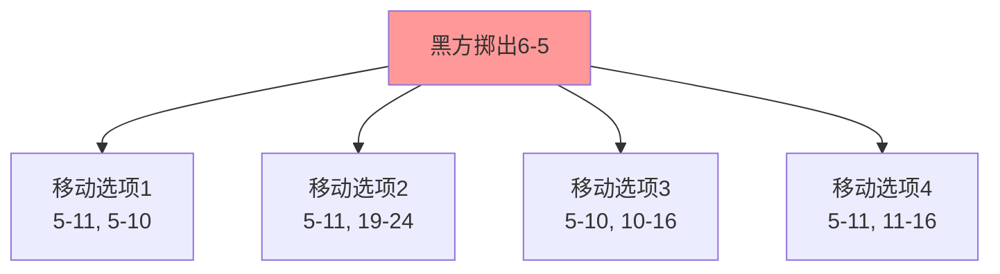
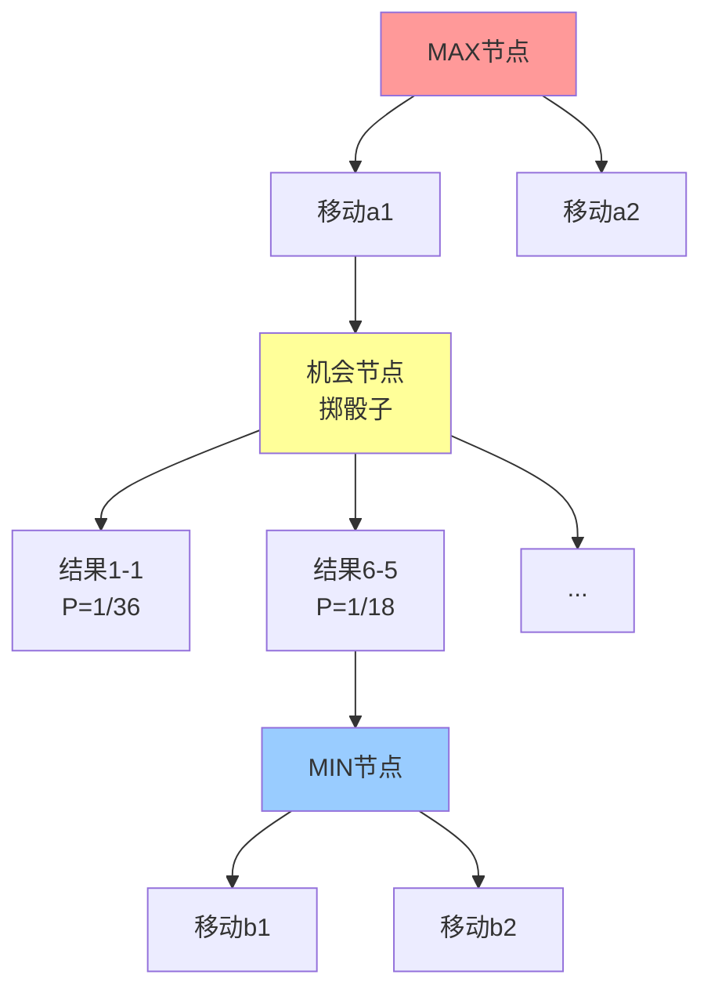
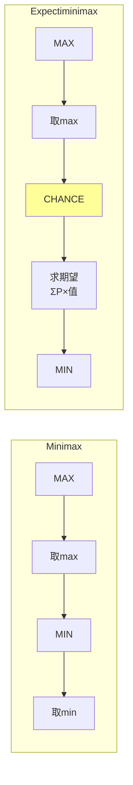
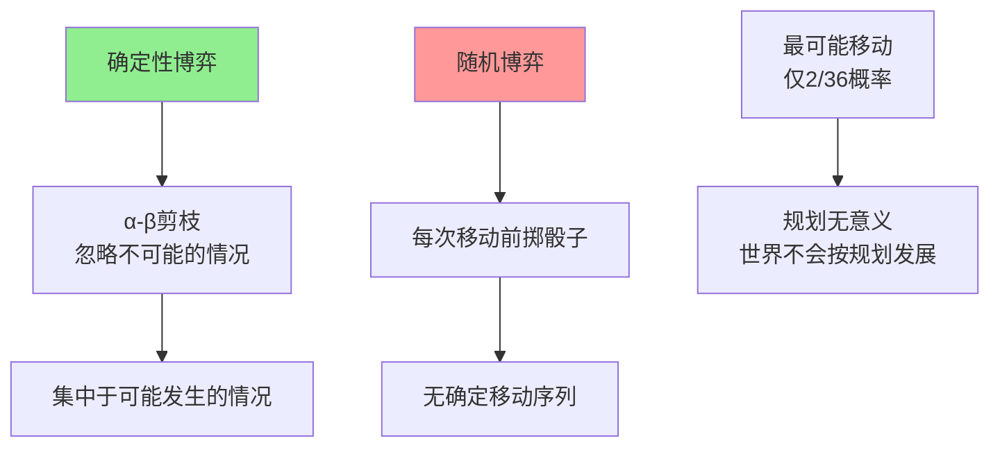
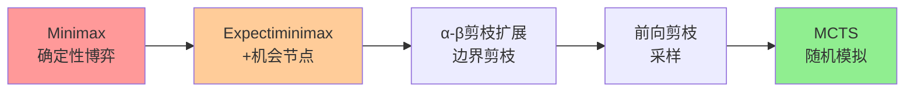

# 5.5 随机博弈（Stochastic Games）

## 基本信息
- **课程**：人工智能（上册）
- **章节**：第5章 5.5 随机博弈
- **日期**：2026-04-03
- **标签**：#随机博弈 #Expectiminimax #机会节点 #期望值 #博弈搜索

---

## 重点内容

⭐ **核心概念**：
- 随机博弈包含随机因素（如掷骰子）
- 博弈树中增加机会节点（Chance Nodes）
- Expectiminimax算法扩展Minimax处理随机性

⭐ **关键算法**：
- Expectiminimax：对机会节点计算期望值
- 复杂度：$O(b^m \times n^m)$，$n$为机会节点结果数

⭐ **特殊要求**：
- 评价函数必须是获胜概率的正线性变换

---

## 一、什么是随机博弈？

### 1.1 定义

> **随机博弈**：包含**随机因素**（如掷骰子）的博弈，使博弈更接近现实生活的不可预测性。

### 1.2 典型例子：西洋双陆棋（Backgammon）

**特点**：
- 运气和技巧相结合
- 每次移动前需要掷骰子
- 骰子结果决定可执行的移动



### 1.3 骰子概率

| 骰子组合类型 | 数量 | 概率 |
|-------------|------|------|
| 相同点数（1-1到6-6） | 6种 | 1/36 |
| 不同点数（如6-5） | 15种 | 1/18（每种） |
| **总计** | **21种** | **36种等可能组合** |

---

## 二、机会节点（Chance Nodes）⭐⭐⭐

### 2.1 博弈树结构变化



**三种节点类型**：
- **MAX节点**（方形）：我方决策，选最大值
- **MIN节点**（方形）：对手决策，选最小值
- **机会节点**（圆形）：随机事件，计算期望值

---

## 三、Expectiminimax算法 ⭐⭐⭐

### 3.1 算法定义

$$
\text{EXPECTIMINIMAX}(s) = 
\begin{cases} 
\text{UTILITY}(s, \text{MAX}) & \text{如果 IS-TERMINAL}(s) \\
\max_{a} \text{EXPECTIMINIMAX}(\text{RESULT}(s, a)) & \text{如果 TO-MOVE}(s) = \text{MAX} \\
\min_{a} \text{EXPECTIMINIMAX}(\text{RESULT}(s, a)) & \text{如果 TO-MOVE}(s) = \text{MIN} \\
\sum_{r} P(r) \times \text{EXPECTIMINIMAX}(\text{RESULT}(s, r)) & \text{如果 TO-MOVE}(s) = \text{CHANCE}
\end{cases}
$$

### 3.2 与Minimax的对比



**关键区别**：
- 增加了**机会节点**的处理
- 机会节点计算**期望值**（概率加权平均）
- MAX/MIN节点处理方式不变

### 3.3 计算示例

```
        [MAX]
       /     \
    a1         a2
    |          |
 [CHANCE]   [CHANCE]
 /   |   \   /   |   \
P=0.3 P=0.4 P=0.3  P=0.5 P=0.5
 |     |     |     |     |
10    20    30    15    25

计算过程：
- 机会节点1期望值 = 0.3×10 + 0.4×20 + 0.3×30 = 20
- 机会节点2期望值 = 0.5×15 + 0.5×25 = 20
- MAX选择：max(20, 20) = 20（两者相同）
```

---

## 四、随机博弈的评价函数 ⭐⭐

### 4.1 特殊要求

**图5-14示例**：

```
叶节点值排序：[1, 2, 3, 4]（从小到大）

情况1：实际值[1, 2, 3, 4]
→ 移动a1最佳

情况2：实际值[1, 20, 30, 400]
→ 移动a2最佳
```

**问题**：即使保持排序不变，不同的赋值也会改变最佳移动！

### 4.2 解决方案

> 💡 **评价函数应返回获胜概率的正线性变换值**

**原因**：
- 机会节点计算的是期望值
- 只有概率的线性变换才能保持期望值的正确性
- 确保评价函数与真实获胜概率一致

**数学表达**：
```
EVAL(s) = a × P(获胜) + b，其中 a > 0
```

---

## 五、复杂度分析 ⭐⭐⭐

### 5.1 时间复杂度

| 算法 | 时间复杂度 | 说明 |
|------|-----------|------|
| **Minimax** | $O(b^m)$ | $b$=分支因子, $m$=深度 |
| **Expectiminimax** | $O(b^m \times n^m)$ | $n$=机会节点结果数 |

### 5.2 复杂度推导

```
Minimax:        b × b × b × ... × b = b^m
                 ↑   ↑   ↑       ↑
                层1  层2  层3 ... 层m

Expectiminimax: (b×n) × (b×n) × ... × (b×n) = (b×n)^m = b^m × n^m
                 ↑       ↑           ↑
                层1      层2         层m
                
每层：先MAX/MIN选择（b种），然后机会节点（n种结果）
```

### 5.3 西洋双陆棋示例

- $n = 21$（骰子结果数）
- $b \approx 20$（通常情况）
- 某些情况下$b$可达4000（骰子数翻倍）
- **实际只能搜索3层！**

### 5.4 不确定性的挑战



---

## 六、α-β剪枝的扩展 ⭐⭐

### 6.1 机会节点剪枝的挑战

**问题**：机会节点的值是子节点的平均值，需要查看所有子节点才能确定

**直观理解**：
```
平均值 = (值1 + 值2 + ... + 值n) / n

要确定平均值的上界，似乎必须知道所有值
```

### 6.2 解决方案：边界剪枝

**关键洞察**：
- 如果限制效用函数的值范围（如[-2, +2]）
- 可以利用边界值设置机会节点的上界/下界
- 无需检查所有子节点即可剪枝

**示例**：
```
假设效用值范围[-2, +2]
已检查3个子节点，值分别为：1, 1, 1
还有2个子节点未检查

当前平均值 = (1+1+1+x+y)/5
最大值情况：x=2, y=2 → 平均值 = 7/5 = 1.4
最小值情况：x=-2, y=-2 → 平均值 = -1/5 = -0.2

如果父节点的β = 0.5，则上界1.4 > 0.5，不能剪枝
如果父节点的β = -0.5，则下界-0.2 > -0.5，可以剪枝！
```

### 6.3 前向剪枝

**适用场景**：机会节点分支因子高的博弈（如Yahtzee掷5个骰子）

**方法**：
- 只采样少数几个可能的机会分支
- 或使用MCTS（每次模拟包含随机掷骰子）

---

## 七、算法演进关系



---

## 八、关键要点总结

### 8.1 核心概念对比

| 概念 | 确定性博弈 | 随机博弈 |
|------|-----------|---------|
| **节点类型** | MAX, MIN | MAX, MIN, **CHANCE** |
| **算法** | Minimax | **Expectiminimax** |
| **机会节点处理** | 无 | **期望值计算** |
| **复杂度** | $O(b^m)$ | $O(b^m n^m)$ |
| **评价函数要求** | 保持顺序 | **正线性变换** |

### 8.2 Expectiminimax公式记忆

```
EXPECTIMINIMAX(s) =
  UTILITY(s)                              终止状态
  max{ EXPECTIMINIMAX(RESULT(s,a)) }       MAX节点
  min{ EXPECTIMINIMAX(RESULT(s,a)) }       MIN节点
  Σ P(r) × EXPECTIMINIMAX(RESULT(s,r))     CHANCE节点
```

### 8.3 实际应用

| 博弈 | 随机因素 | 算法选择 |
|------|---------|---------|
| 国际象棋 | 无 | α-β剪枝 |
| 西洋双陆棋 | 掷骰子 | Expectiminimax + MCTS |
| 扑克 | 发牌 | MCTS + 抽象 |
| 围棋 | 无 | MCTS (AlphaGo) |

---

## 疑问与思考

❓ **待解决问题**：
1. 机会节点剪枝的具体实现细节？
2. 如何确定评价函数的线性变换参数？
3. 在高度随机的博弈中，Expectiminimax是否还有优势？
4. 深度学习如何应用于随机博弈？

💡 **个人理解**：
- Expectiminimax是Minimax向不确定性世界的自然扩展
- 期望值的计算体现了"平均情况"思维
- 复杂度的大幅增加是随机性的代价
- 实际应用中常结合采样方法（如MCTS）来应对高复杂度

---

## 相关链接

- **课本**：第5章 5.5节 "随机博弈"
- **图5-12**：西洋双陆棋局面
- **图5-13**：包含机会节点的博弈树
- **图5-14**：评价函数赋值的影响
- **前置知识**：5.2节 Minimax算法
- **后续学习**：5.6节 部分可观测博弈

---

## 复习要点

📌 **必会内容**：
1. Expectiminimax算法的定义和计算过程
2. 机会节点的处理方法（期望值计算）
3. 复杂度分析（$O(b^m n^m)$）
4. 评价函数的特殊要求（正线性变换）
5. 机会节点剪枝的基本思想

📌 **常见题型**：
- 计算题：给定博弈树，计算Expectiminimax值
- 分析题：比较确定性博弈和随机博弈的复杂度
- 应用题：为随机博弈设计评价函数
- 推导题：解释为什么评价函数需要正线性变换

📌 **公式记忆**：
```
期望值 = Σ P(r) × VALUE(RESULT(s, r))
复杂度：O(b^m × n^m)
```

---

## 一句话总结

> 💡 **随机博弈通过引入机会节点和Expectiminimax算法，将确定性博弈理论扩展到包含随机性的现实世界，但复杂度的显著增加促使我们采用采样方法（如MCTS）来应对。**
