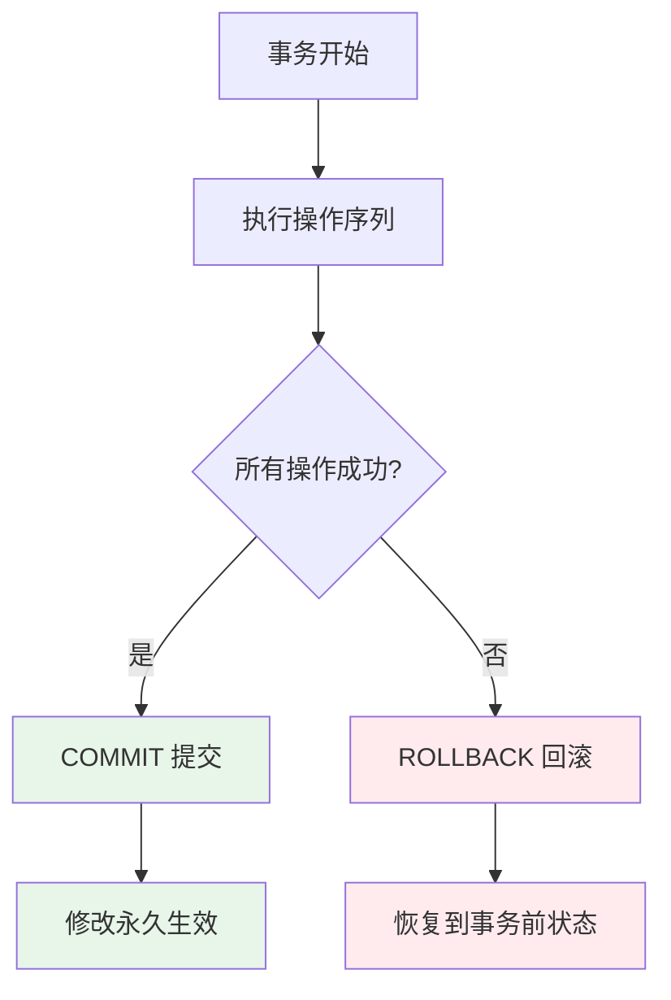
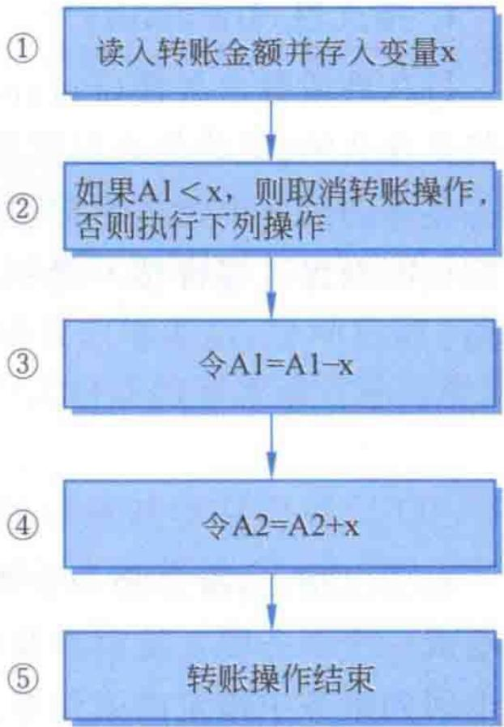
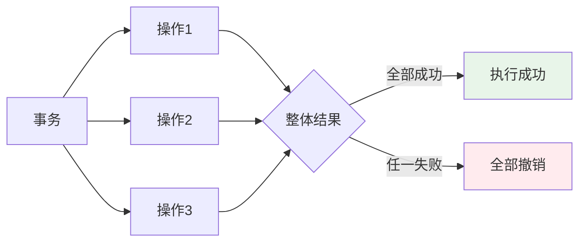
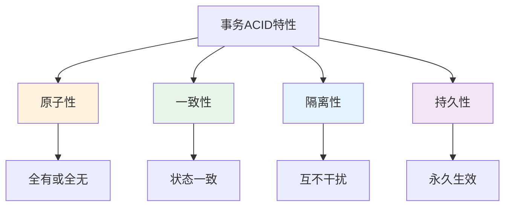

# 第10章-10.1-事务的基本概念

## 基本信息
- **课程**：数据库原理与应用
- **章节**：第10章 10.1节 事务的基本概念
- **日期**：2026-06-30
- **标签**：#事务 #ACID #原子性 #一致性 #隔离性 #持久性

---

## 重点内容

### ⭐⭐⭐ 核心概念
- **事务（Transaction）**：构成单一逻辑工作单元的数据库操作序列，要么全部成功执行，要么全部不执行
- **ACID四大特性**：原子性、一致性、隔离性、持久性——事务的四大基本特征

### ⭐⭐ 重要知识点
- 事务的"全有或全无"原则：保证数据库从一个一致状态转换到另一个一致状态
- 一致性与原子性的密切关系：原子性是一致性的基础
- 隔离性的本质：每个事务感觉"只有自己在工作"
- 持久性保证：一旦提交，结果永久有效

### ⭐ 关键理解
- 事务是并发控制和数据库恢复技术的基本概念
- 转账问题是理解事务的经典案例
- 事务的一致性还要求事务开始前数据库状态也必须一致

---

## 详细笔记

### 一、事务的定义（10.1.1节）

#### 1. 事务的概念

**事务（Transaction）** 是构成单一逻辑工作单元的数据库操作序列。

> 📚 **课本出处**：第10章 10.1.1节"事务"

**核心要点**：

- 事务中的操作是一个统一的整体，**不可再被分割**
- 要么**全部成功执行**（结果写到物理数据文件），要么**全部不执行**（结果不写到任何物理数据文件）
- 当执行过程中出现故障（断电、磁盘故障等），会撤销已执行语句的结果，使数据库恢复到执行前的状态

**事务的本质**：

#### 2. 经典案例——银行转账

将账户A1上的金额 x 转到账户A2，操作步骤如下：

| 步骤 | 操作 | 说明 |
|:----:|:-----|:-----|
| ① | 设置转账金额 x | 确定转账数额 |
| ② | 检查A1余额是否足够 | 如果不足则取消操作 |
| ③ | 从A1扣除金额 x | 转出方扣款 |
| ④ | 在A2加上金额 x | 转入方加款 |
| ⑤ | 转账结束 | 完成操作 |

#### 📷 图10.1 转账程序流程

> 📚 **课本出处**：图10.1 展示了转账程序的完整流程，说明了为什么需要事务来保证操作的完整性

**没有事务会怎样？**

如果转账程序在执行完步骤③（A1已扣款）后出现硬件故障，导致步骤④无法执行，那么：
- A1中已经被扣除金额 x
- A2中并没有增加金额 x
- 这种"钱凭空消失"的情况在实际应用中**绝对不允许出现**

> 💡 **理解技巧**：将步骤①~⑤定义为一个事务后，由于事务的"全有或全无"特性，步骤③和④要么都成功，要么都撤销，从而避免了上述错误。

---

### 二、事务的ACID特性（10.1.2节）

事务作为一种特殊的数据库操作序列，具有四个主要特性，通常称为 **ACID特性**。

> 📚 **课本出处**：第10章 10.1.2节"事务的ACID特性"

#### 1. 原子性（Atomicity）

**定义**：事务是数据库操作的逻辑工作单位。事务中的操作是一个整体，**不能再被分割**，要么全部成功执行，要么全部不成功执行。

> 📚 **课本出处**：第10章 10.1.2节"原子性（Atomicity）"

**通俗理解**：原子性意味着事务中的操作像原子一样不可分割。就好比签合同，要么所有条款都生效，要么整份合同无效，不能只执行部分条款。

#### 2. 一致性（Consistency）

**定义**：事务的一致性是指事务执行前后都能够保持数据库状态的一致性，即事务的执行结果是将数据库从一个**一致状态**转变为另一个**一致状态**。

> 📚 **课本出处**：第10章 10.1.2节"一致性（Consistency）"

**与原子性的关系**：

- 一致性和原子性是**密切相关**的
- 以转账为例：当步骤③执行后，如果步骤④因故不能执行，由于原子性，步骤①②③的结果也被取消，数据库回到执行前的状态，从而保持一致性

**重要前提**：
- 数据库的一致性不仅取决于事务的一致性，还要求事务**开始执行时**数据库状态也必须是一致的
- 否则，即使事务具有一致性，执行后也不一定能保持数据库的一致性

> ⚠️ **常见误区**：一致性不仅仅靠事务本身来保证，还依赖于事务开始前数据库的初始状态是否正确。

#### 3. 隔离性（Isolation）

**定义**：隔离性是指多个事务在执行时**不相互干扰**的特性。事务的内部操作及其使用的数据对其他事务是不透明的。

> 📚 **课本出处**：第10章 10.1.2节"隔离性（Isolation）"

**核心含义**：

| 要点 | 说明 |
|:----:|:-----|
| 操作透明 | 一个事务的内部操作对其他事务不可见 |
| 数据隔离 | 一个事务使用的数据对其他事务不透明 |
| 互不干扰 | 多个并发事务之间互不影响 |

> 💡 **理解技巧**：隔离性的本质是让每个事务都感觉"只有自己在工作"，而感觉不到系统中还有其他事务在并发执行。这就像每个人在自己的独立房间里工作，看不到别人在做什么。

#### 4. 持久性（Durability）

**定义**：持久性（又称永久性 Permanence）是指一个事务一旦成功提交，其结果对数据库的改变将是**永久的**，无论是否出现系统故障等问题。

> 📚 **课本出处**：第10章 10.1.2节"持久性（Durability）"

**核心含义**：
- 事务提交（COMMIT）后，修改就永久保存在数据库中
- 即使系统发生故障（断电、崩溃等），已提交的事务结果也不会丢失
- 这是数据库可靠性的基本保证

> 💡 **理解技巧**：持久性就像在银行办完转账并拿到回执单后，这笔转账记录就永久生效了，即使银行系统随后出了故障，这笔转账也不会消失。

#### ACID特性总结

| 特性 | 英文 | 关键词 | 核心保证 |
|:----:|:----:|:------:|:---------|
| 原子性 | Atomicity | 不可分割 | 操作要么全部执行，要么全部不执行 |
| 一致性 | Consistency | 状态一致 | 数据库从一个一致状态变为另一个一致状态 |
| 隔离性 | Isolation | 互不干扰 | 多个事务并发执行时互不影响 |
| 持久性 | Durability | 永久生效 | 一旦提交，结果永久保存 |

> 📌 **考试重点**：ACID四个特性的含义和相互关系是本章最核心的考点。需要能够用自己的话解释每个特性，并结合银行转账等实际案例说明。

---

## 疑问与思考

### ❓ 待解决问题
1. 隔离性在实际并发环境中如何实现？不同隔离级别对隔离性有什么影响？（详见10.3节）
2. 一致性除了依赖原子性外，还依赖哪些因素？约束条件（如CHECK、外键）在保证一致性中起什么作用？
3. 持久性如何在系统故障后得到保证？日志文件和备份在其中扮演什么角色？
4. 如果事务开始时数据库状态已经不一致，是否意味着事务执行后一定不一致？有没有例外情况？

### 💡 个人理解/技巧
- ACID四个特性可以记忆为 **"原子保一致，隔离加持久"**：原子性保证操作完整性，一致性保证状态正确性，隔离性保证并发安全性，持久性保证结果可靠性
- 转账问题是最经典的事务案例：A扣钱和B加钱必须是原子的，否则就会出现"钱凭空消失"或"凭空多出"的情况
- 一致性是最终目标，原子性、隔离性是实现一致性的手段，持久性保证一致性不会因故障而丢失
- 事务开始前数据库的一致性是前提条件——如果初始状态就不对，再完美的事务也无法保证结果正确

---

## 总结

### 核心要点

1. **事务的定义**：构成单一逻辑工作单元的数据库操作序列，要么全部成功，要么全部不执行
2. **ACID四大特性**：
   - 原子性：操作不可分割，全有或全无
   - 一致性：执行前后数据库状态一致
   - 隔离性：并发事务互不干扰
   - 持久性：提交后修改永久生效
3. **转账案例**：理解事务必要性的经典案例——扣款和加款必须同时成功或同时失败
4. **一致性依赖**：既依赖事务本身的一致性，也依赖事务开始前数据库的初始一致状态

### 关键要点

1. 事务是并发控制和数据库恢复的**基本概念**
2. ACID是事务最核心的四个特性，其中**原子性是基础**
3. 隔离性使每个事务感觉"只有自己在工作"
4. 持久性保证已提交的事务结果不会因故障而丢失

---

## 相关链接

### 本节相关图片
- [图10.1 转账程序流程](../../../images/35a4bcf124e7e6398d3fffcf36074a5b8fa34ad6c65a7231f4a5ce932ede2200.jpg)

### 关联章节
- [第10章-事务管理与并发控制](./第10章-事务管理与并发控制.md)
- [第10章-10.2-事务的管理](./第10章-10.2-事务的管理.md)
- 第10章-10.3-并发控制（待创建）
- 第11章-数据的完整性管理（一致性与完整性的关系）

---

## 检查清单

- [x] 已理解事务的定义和"全有或全无"原则
- [x] 已掌握ACID四个特性的含义和相互关系
- [x] 已理解转账案例中事务的必要性
- [x] 已插入课本原图（图10.1）
- [x] 已记录重点标记和课本出处
- [x] 已添加疑问与思考

---

*笔记创建时间：2026-06-30*
