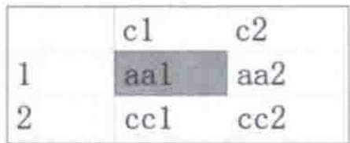
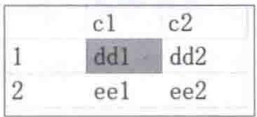
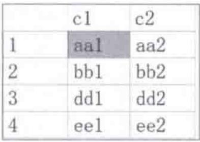
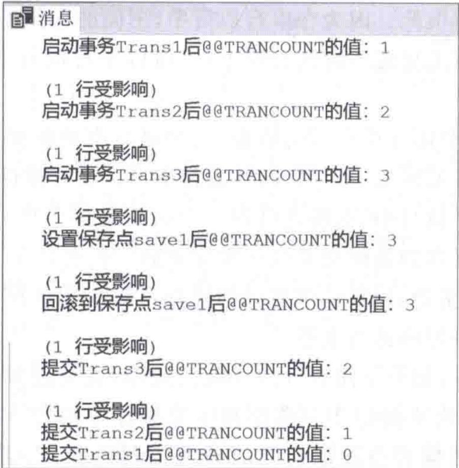
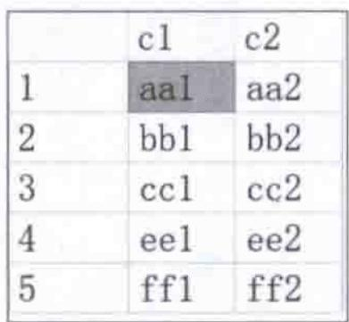
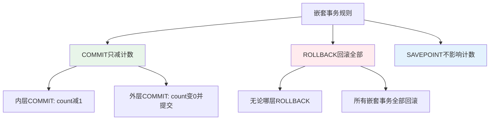
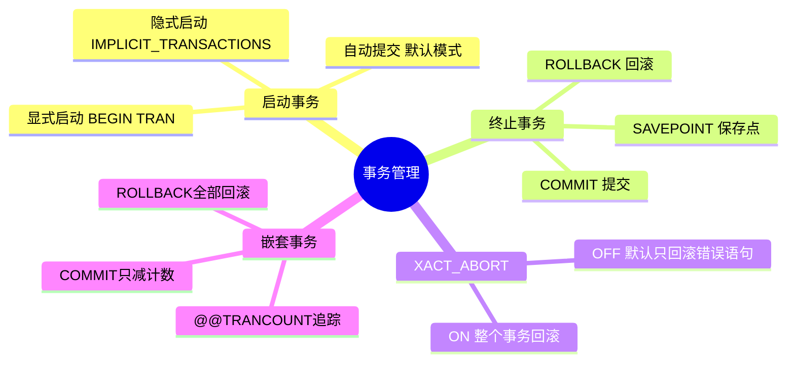

# 第10章-10.2-事务的管理

## 基本信息
- **课程**：数据库原理与应用
- **章节**：第10章 10.2节 事务的管理
- **日期**：2026-06-30
- **标签**：#事务管理 #BEGIN #COMMIT #ROLLBACK #SAVEPOINT #嵌套事务

---

## 重点内容

### ⭐⭐⭐ 核心操作
- **启动事务**：BEGIN TRANSACTION（显式）、自动提交（默认）、隐式启动（SET IMPLICIT_TRANSACTIONS ON）
- **提交事务**：COMMIT TRANSACTION — 修改永久保存，事务终止
- **回滚事务**：ROLLBACK TRANSACTION — 恢复到事务开始状态（全部回滚）或保存点状态（部分回滚）

### ⭐⭐ 重要知识点
- **自动提交模式**：SQL Server默认模式，每条SQL语句就是一个事务
- **XACT_ABORT设置**：控制运行时错误是否导致整个事务回滚
- **保存点（SAVEPOINT）**：允许部分回滚，只撤销保存点之后的操作
- **嵌套事务**：@@TRANCOUNT 系统变量追踪活动事务数

### ⭐ 关键区别
- COMMIT vs ROLLBACK：提交永久化修改 vs 回滚恢复状态
- 全部回滚 vs 部分回滚（带SAVEPOINT）
- SET XACT_ABORT ON vs OFF：错误处理策略的不同

---

## 详细笔记

### 一、启动事务（10.2.1节）

在 SQL Server 中，启动事务有3种方式：显式启动、自动提交和隐式启动。

> 📚 **课本出处**：第10章 10.2.1节"启动事务"

#### 1. 显式启动

使用 `BEGIN TRANSACTION` 语句显式启动事务，当执行到该语句时，SQL Server 将认为这是一个事务的起点。

**语法**：

```sql
BEGIN {TRAN|TRANSACTION}
    [ {transaction_name | @tran_name_variable}
      [WITH MARK ['description']] ]
[;]
```

**参数说明**：

| 参数 | 说明 |
|:----:|:-----|
| transaction_name | 事务名称（可选），仅最外层嵌套使用有效 |
| @tran_name_variable | 用变量提供事务名称 |
| WITH MARK ['description'] | 在日志中标记事务，允许还原到命名标记 |

> 📚 **课本出处**：第10章 10.2.1节"显式启动"

**示例**：

```sql
BEGIN TRANSACTION virement
-- 执行一系列操作...
COMMIT TRANSACTION virement
```

#### 2. 自动提交（默认模式）

**自动提交**是指用户每发出一条 SQL 语句，SQL Server 会自动启动一个事务，语句执行完后自动提交该事务。

> 📚 **课本出处**：第10章 10.2.1节"自动提交"

**核心要点**：

- 这是 SQL Server 的**默认模式**
- 每一条 SQL 语句就是一个事务（自动提交事务）
- 例如：`CREATE TABLE` 语句是一个事务，不可能出现部分字段创建而部分没有创建的情况

```sql
-- 自动提交模式下，每条语句独立提交
INSERT INTO UserTable VALUES('001', '张三', '1001', 5000, '北京');  -- 自动提交
UPDATE UserTable SET balance = balance + 100 WHERE account = '1001'; -- 自动提交
```

> 💡 **理解技巧**：自动提交模式下，你不需要写 BEGIN 和 COMMIT，每条语句执行完就自动生效了。

#### 3. 隐式启动

当将 `IMPLICIT_TRANSACTIONS` 设置为 `ON` 时，任何 DML 语句（DELETE、UPDATE、INSERT等）都自动启动一个事务，直到遇到 COMMIT 或 ROLLBACK 才结束。结束后自动启动新的事务，形成连续的事务链。

> 📚 **课本出处**：第10章 10.2.1节"隐式启动"

**设置语句**：

```sql
SET IMPLICIT_TRANSACTIONS ON;
```

**隐式事务的特点**：
- 无须用 `BEGIN TRANSACTION` 描述事务的开始
- 事务会形成连续的事务链
- 使用完毕后建议随时设置回 OFF

```sql
SET IMPLICIT_TRANSACTIONS ON;
-- 以下每条DML语句自动启动新事务
INSERT INTO UserTable VALUES('002', '李四', '1002', 3000, '上海');
UPDATE UserTable SET balance = balance - 200 WHERE account = '1002';
COMMIT; -- 提交当前事务，下一条DML又自动开始新事务
SET IMPLICIT_TRANSACTIONS OFF;
```

> ⚠️ **常见误区**：使用隐式事务模式时，如果不及时 COMMIT 或 ROLLBACK，事务会一直保持活动状态，可能导致锁资源占用过多。

#### 三种启动方式对比

| 启动方式 | 是否需要 BEGIN | 提交方式 | 默认模式 | 适用场景 |
|:--------:|:-------------:|:--------:|:--------:|:---------|
| 显式启动 | 是 | COMMIT/ROLLBACK | 否 | 需要多条语句作为整体执行 |
| 自动提交 | 否 | 每条语句自动提交 | 是 | 单条语句操作 |
| 隐式启动 | 否 | COMMIT/ROLLBACK | 否 | 连续多条DML操作 |

---

### 二、终止事务（10.2.2节）

有启动就必有终止。事务的终止方法有两种：COMMIT（提交）和 ROLLBACK（回滚）。

> 📚 **课本出处**：第10章 10.2.2节"终止事务"

#### 1. 提交事务——COMMIT TRANSACTION

执行 `COMMIT TRANSACTION` 时，会把语句执行的结果**保存到数据库中**（提交事务），并终止事务。

> 📚 **课本出处**：第10章 10.2.2节"提交事务——COMMIT TRANSACTION语句"

**语法**：

```sql
COMMIT {TRAN|TRANSACTION}
    [transaction_name | @tran_name_variable]
[;]
```

**关于 @@TRANCOUNT**：

| @@TRANCOUNT 值 | 执行COMMIT后 | 效果 |
|:--------------:|:------------:|:-----|
| 等于1 | 变为0 | 事务提交，修改永久生效 |
| 大于1 | 减1 | 事务保持活动（内层提交，外层未结束） |

> 💡 **理解技巧**：transaction_name 参数会被 SQL Server 忽略，设置它的目的是提高代码可读性，让程序员知道 COMMIT 与哪个 BEGIN 相关联。

#### 2. 终止事务的完整示例——银行转账

**【例10.1】** 创建关于银行转账的事务。

首先创建表并插入数据：

```sql
CREATE TABLE UserTable
(
    UserID varchar(18) PRIMARY KEY,      -- 身份证号
    username varchar(20) NOT NULL,       -- 用户名
    account varchar(20) NOT NULL UNIQUE, -- 账号
    balance float DEFAULT 0,             -- 余额
    address varchar(100)                 -- 地址
);

INSERT INTO UserTable VALUES('430302x1','王伟志','020000y1',10000,'中关村南路');
INSERT INTO UserTable VALUES('430302x2','张宇','020000y2',100,'火器营桥');
```

然后用事务实现转账（将账户020000y1的200元转给020000y2）：

```sql
BEGIN TRANSACTION virement;          -- 显式启动事务
DECLARE @balance float, @x float;
-- 设置转账金额
SET @x = 200;
-- 如果转出账号上的金额小于x，则取消转账操作
SELECT @balance = balance FROM UserTable WHERE account = '020000y1';
IF(@balance < @x) RETURN;
-- 从转出账号上扣除金额x
UPDATE UserTable SET balance = balance - @x WHERE account = '020000y1';
-- 在转入账号上加上金额x
UPDATE UserTable SET balance = balance + @x WHERE account = '020000y2';
GO
COMMIT TRANSACTION virement;          -- 提交事务，事务终止
```

> 📚 **课本出处**：第10章 10.2.2节 例10.1

> 💡 **理解技巧**：利用事务后，操作③（扣款）和操作④（加款）要么都对数据库产生影响，要么都不产生影响，避免了"转出账号已经被扣钱，但转入账号的余额并没有增加"的情况。

#### 3. XACT_ABORT 设置

DML 语句执行失败不一定由硬件故障造成，也可能由内部运行错误（如违反约束）导致。

> 📚 **课本出处**：第10章 10.2.2节"XACT_ABORT设置"

| XACT_ABORT 设置 | 运行时错误发生时的行为 |
|:----------------:|:----------------------:|
| OFF（默认） | 只回滚产生错误的SQL语句，事务继续执行 |
| ON | 整个事务终止并回滚 |

**设置语句**：

```sql
SET XACT_ABORT ON;   -- 开启：运行时错误导致整个事务回滚
SET XACT_ABORT OFF;  -- 关闭（默认）：只回滚错误语句
```

> ⚠️ **常见误区**：编译错误（如语法错误）不受 SET XACT_ABORT 影响，它只影响运行时错误。

**【例10.2】** 回滚包含运行时错误的事务。

```sql
-- XACT_ABORT OFF（默认）—— 只回滚错误语句
CREATE TABLE TestTransTable1(c1 char(3) NOT NULL, c2 char(3));
GO
BEGIN TRAN
    INSERT INTO TestTransTable1 VALUES('aa1','aa2');          -- 成功
    INSERT INTO TestTransTable1 VALUES(NULL,'bb2');           -- 失败：违反非空约束
    INSERT INTO TestTransTable1 VALUES('cc1','cc2');          -- 成功
COMMIT TRAN;
```

> 📚 **课本出处**：第10章 10.2.2节 例10.2

#### 📷 图10.2 表TestTransTable1中的数据



> 📚 **课本出处**：图10.2 显示只有第二条记录（NULL值）没有被插入，第一和第三条都被成功插入，事务并未整体回滚

**如果设置 XACT_ABORT ON**：

```sql
SET XACT_ABORT ON;  -- 开启
CREATE TABLE TestTransTable1(c1 char(3) NOT NULL, c2 char(3));
GO
BEGIN TRAN
    INSERT INTO TestTransTable1 VALUES('aa1', 'aa2');
    INSERT INTO TestTransTable1 VALUES(NULL, 'bb2');  -- 违反非空约束
    INSERT INTO TestTransTable1 VALUES('cc1', 'cc2');
COMMIT TRAN;
SET XACT_ABORT OFF;  -- 改回默认
```

结果：表 TestTransTable1 中**没有任何数据**，整个事务被回滚。

> 📌 **考试重点**：XACT_ABORT 的默认值是 OFF，此时只有出错的语句被回滚；设为 ON 时，整个事务回滚。这是一个容易混淆的知识点。

---

### 三、回滚事务——ROLLBACK TRANSACTION

回滚事务利用 `ROLLBACK TRANSACTION` 语句实现，可以把事务回滚到**事务起点**或**指定保存点**。

> 📚 **课本出处**：第10章 10.2.2节"回滚事务——ROLLBACK TRANSACTION语句"

**语法**：

```sql
ROLLBACK {TRAN | TRANSACTION}
    [ transaction_name | @tran_name_variable
    | savepoint_name | @savepoint_variable ]
[;]
```

**参数说明**：

| 参数 | 说明 |
|:----:|:-----|
| transaction_name | 事务名称，嵌套时必须是最外层 BEGIN 的名称 |
| savepoint_name | 保存点名称，回滚到该保存点的状态 |
| 不带参数 | 回滚到事务起点（全部回滚） |

#### 1. 全部回滚

**【例10.3】** 全部回滚事务。

```sql
CREATE TABLE TestTransTable2(c1 char(3), c2 char(3));
GO
DECLARE @TransactionName varchar(20) = 'myTrans1';
BEGIN TRAN @TransactionName
    INSERT INTO TestTransTable2 VALUES('aa1','aa2');
    INSERT INTO TestTransTable2 VALUES('bb1','bb2');
    INSERT INTO TestTransTable2 VALUES('cc1','cc2');
ROLLBACK TRAN @TransactionName       -- 回滚事务：3条插入全部撤销
INSERT INTO TestTransTable2 VALUES('dd1','dd2');
INSERT INTO TestTransTable2 VALUES('ee1','ee2');
SELECT * FROM TestTransTable2
```

> 📚 **课本出处**：第10章 10.2.2节 例10.3

#### 📷 图10.3 表TestTransTable2中的数据（全部回滚事务后）



> 📚 **课本出处**：图10.3 显示事务 myTrans1 中的3条插入语句全部被回滚，只有事务后的2条插入语句成功（处于自动提交模式）

#### 2. 部分回滚（SAVEPOINT）

在事务内设置保存点使用 `SAVE TRANSACTION` 语句：

```sql
SAVE {TRAN|TRANSACTION} {savepoint_name | @savepoint_variable} [;]
```

**【例10.4】** 部分回滚事务。

```sql
CREATE TABLE TestTransTable2(c1 char(3), c2 char(3));
GO
DECLARE @TransactionName varchar(20) = 'myTrans1';
BEGIN TRAN @TransactionName
    INSERT INTO TestTransTable2 VALUES('aa1','aa2');     -- 有效
    INSERT INTO TestTransTable2 VALUES('bb1','bb2');     -- 有效
    SAVE TRANSACTION save1;                              -- 设置保存点
    INSERT INTO TestTransTable2 VALUES('cc1','cc2');     -- 将被回滚
    ROLLBACK TRAN save1;                                 -- 回滚到save1
    INSERT INTO TestTransTable2 VALUES('dd1','dd2');     -- 有效
    INSERT INTO TestTransTable2 VALUES('ee1','ee2');     -- 有效
    COMMIT TRAN
```

> 📚 **课本出处**：第10章 10.2.2节 例10.4

#### 📷 图10.4 表TestTransTable2中的数据（部分回滚事务后）



> 📚 **课本出处**：图10.4 显示只有第3条插入（save1之后、ROLLBACK之前）的结果被撤销，其他4条均有效

**全部回滚 vs 部分回滚**：

| 回滚方式 | 语法 | 效果 |
|:--------:|:-----|:-----|
| 全部回滚 | `ROLLBACK TRAN [name]` | 事务中所有操作被撤销，数据库回到事务开始前 |
| 部分回滚 | `ROLLBACK TRAN savepoint_name` | 只撤销保存点之后的操作，保存点之前的操作保留 |

---

### 四、嵌套事务（10.2.3节）

事务是允许嵌套的，即一个事务内可以包含另外一个事务。

> 📚 **课本出处**：第10章 10.2.3节"嵌套事务"

#### @@TRANCOUNT 系统变量

系统全局变量 `@@TRANCOUNT` 可返回当前连接的活动事务个数。

| 操作 | 对 @@TRANCOUNT 的影响 |
|:----:|:--------------------:|
| BEGIN TRANSACTION | 加1 |
| COMMIT（嵌套内层） | 减1 |
| ROLLBACK（不带savepoint） | 置为0（回滚所有事务） |
| ROLLBACK TO savepoint_name | 不影响（值不变） |

> 📚 **课本出处**：第10章 10.2.3节"嵌套事务"

#### 嵌套事务示例

**【例10.5】** 嵌套事务。

```sql
CREATE TABLE TestTransTable3(c1 char(3), c2 char(3));
GO
IF(@@TRANCOUNT != 0) ROLLBACK TRAN;   -- 先终止所有事务
BEGIN TRAN Trans1                       -- 启动外层事务
    PRINT 'Trans1: @@TRANCOUNT=' + CAST(@@TRANCOUNT AS VARCHAR(10));  -- 1
    INSERT INTO TestTransTable3 VALUES('aa1', 'aa2');
    BEGIN TRAN Trans2                   -- 启动内层事务
        PRINT 'Trans2: @@TRANCOUNT=' + CAST(@@TRANCOUNT AS VARCHAR(10));  -- 2
        INSERT INTO TestTransTable3 VALUES('bb1', 'bb2');
        BEGIN TRAN Trans3               -- 启动最内层事务
            PRINT 'Trans3: @@TRANCOUNT=' + CAST(@@TRANCOUNT AS VARCHAR(10));  -- 3
            INSERT INTO TestTransTable3 VALUES('cc1', 'cc2');
            SAVE TRANSACTION save1;
            INSERT INTO TestTransTable3 VALUES('dd1', 'dd2');
            ROLLBACK TRAN save1;        -- 部分回滚：不影响@@TRANCOUNT
            PRINT 'ROLLBACK save1: @@TRANCOUNT=' + CAST(@@TRANCOUNT AS VARCHAR(10));  -- 3
            INSERT INTO TestTransTable3 VALUES('ee1', 'ee2');
        COMMIT TRAN Trans3              -- 提交Trans3
        PRINT 'COMMIT Trans3: @@TRANCOUNT=' + CAST(@@TRANCOUNT AS VARCHAR(10));  -- 2
    INSERT INTO TestTransTable3 VALUES('ff1', 'ff2');
    COMMIT TRAN Trans2                  -- 提交Trans2
    PRINT 'COMMIT Trans2: @@TRANCOUNT=' + CAST(@@TRANCOUNT AS VARCHAR(10));  -- 1
COMMIT TRAN Trans1                      -- 提交Trans1
PRINT 'COMMIT Trans1: @@TRANCOUNT=' + CAST(@@TRANCOUNT AS VARCHAR(10));  -- 0
```

> 📚 **课本出处**：第10章 10.2.3节 例10.5

#### 📷 图10.5 嵌套事务的执行结果



> 📚 **课本出处**：图10.5 展示了嵌套事务中 @@TRANCOUNT 的变化过程

#### 📷 图10.6 表TestTransTable3中的数据



> 📚 **课本出处**：图10.6 显示最终表中有5条记录（save1回滚了'dd1','dd2'那条，其余均保留）

#### 嵌套事务的关键规则

> 📌 **考试重点**

1. **COMMIT 只是递减计数**：内层 COMMIT 不会真正提交数据，只有最外层 COMMIT 才真正提交
2. **ROLLBACK 回滚所有**：不管嵌套多深，只要执行 ROLLBACK（不带savepoint），整个嵌套事务全部回滚
3. **ROLLBACK TO savepoint 不影响 @@TRANCOUNT**：部分回滚不改变事务计数



> ⚠️ **常见误区**：很多读者会误以为内层 COMMIT 只提交内层操作。实际上，内层 COMMIT 只是将 @@TRANCOUNT 减1，数据的真正提交要等到最外层 COMMIT 执行。因此，即使内层都 COMMIT 了，最外层 ROLLBACK 仍然会回滚所有操作。

---

## 疑问与思考

### ❓ 待解决问题
1. COMMIT 和 ROLLBACK 的本质区别是什么？从日志和数据文件的角度看，两者分别做了哪些操作？
2. SAVEPOINT 在实际应用中有哪些典型使用场景？什么情况下需要部分回滚而不是全部回滚？
3. 嵌套事务中，内层 COMMIT 的意义是什么？如果它不会真正提交数据，为什么还需要它？
4. 自动提交模式和隐式启动模式在性能和使用场景上有什么差异？
5. SET XACT_ABORT ON 为什么不是默认设置？默认 OFF 有什么合理性？

### 💡 个人理解/技巧
- **COMMIT vs ROLLBACK**：COMMIT 是"盖章确认"（修改永久化），ROLLBACK 是"撕毁重来"（恢复原状）
- **SAVEPOINT 的用途**：就像游戏中的存档点，ROLLBACK TO savepoint 相当于"读档"到存档点，之前的进度保留，之后的进度丢弃
- **嵌套事务规则的记忆口诀**：COMMIT 只减数，ROLLBACK 全归零
- **@@TRANCOUNT 的作用**：相当于一个事务计数器，帮你追踪当前嵌套了几层事务
- **XACT_ABORT 的选择**：如果业务要求"要么全做要么全不做"的严格原子性，应该设置为 ON

---

## 总结

### 事务管理操作速查表

| 操作 | SQL语句 | 功能 | 对数据的影响 |
|:----:|:--------|:-----|:-------------|
| 启动（显式） | `BEGIN TRAN [name]` | 开始一个事务 | 无 |
| 提交 | `COMMIT TRAN [name]` | 提交事务，永久保存修改 | 修改永久生效 |
| 回滚（全部） | `ROLLBACK TRAN [name]` | 回滚到事务起点 | 所有修改被撤销 |
| 回滚（部分） | `ROLLBACK TRAN savepoint_name` | 回滚到保存点 | 保存点后的修改被撤销 |
| 设置保存点 | `SAVE TRAN savepoint_name` | 创建保存点标记 | 无 |
| 自动提交 | 每条SQL（默认模式） | 每条语句独立事务 | 语句执行完即生效 |
| 隐式事务 | `SET IMPLICIT_TRANSACTIONS ON` | DML自动开始事务 | 需COMMIT/ROLLBACK终止 |

### 关键要点

1. **启动事务的三种方式**：显式（BEGIN）、自动提交（默认）、隐式（SET IMPLICIT_TRANSACTIONS ON）
2. **终止事务的两种方式**：COMMIT（提交，修改永久生效）和 ROLLBACK（回滚，恢复到事务前状态）
3. **XACT_ABORT 设置**：OFF（默认）只回滚错误语句，ON 则整个事务回滚
4. **保存点（SAVEPOINT）**：允许事务内设置标记，实现部分回滚
5. **嵌套事务规则**：
   - BEGIN 使 @@TRANCOUNT 加1
   - COMMIT 使 @@TRANCOUNT 减1
   - ROLLBACK（不带savepoint）使 @@TRANCOUNT 置0，全部回滚
   - ROLLBACK TO savepoint 不影响 @@TRANCOUNT

### 知识点脑图



---

## 相关链接

### 本节相关图片
- [图10.2 表TestTransTable1中的数据](../../../images/fcfc93843ec7580bee85f61fb282e28a6f144fd658dba15c2044e46828e53eef.jpg)
- [图10.3 表TestTransTable2中的数据（全部回滚事务后）](../../../images/78fcf574f7f62885c5d530809afee31a0068b7ef2c14119ec9f69738b4b79ae9.jpg)
- [图10.4 表TestTransTable2中的数据（部分回滚事务后）](../../../images/7a738c68a453377c6b5998fdbc49306266ee8725c431029feac42e30587c8f5e.jpg)
- [图10.5 嵌套事务的执行结果](../../../images/3bfa9353bb65447d8fbf13cd86daca95f9ddb3b8096e1788f6b0bc5bf0856e18.jpg)
- [图10.6 表TestTransTable3中的数据](../../../images/87b6c305c256d0c32c9fd3f84946867520e44943255729cba5ee32347468d3f0.jpg)

### 关联章节
- [第10章-事务管理与并发控制](./第10章-事务管理与并发控制.md)
- [第10章-10.1-事务的基本概念](./第10章-10.1-事务的基本概念.md)
- 第10章-10.3-并发控制（待创建）

---

## 检查清单

- [x] 已理解事务的3种启动方式及其区别
- [x] 已掌握 COMMIT 和 ROLLBACK 的语法和功能
- [x] 已理解 SAVEPOINT 和部分回滚机制
- [x] 已理解 XACT_ABORT 的作用和默认行为
- [x] 已掌握嵌套事务和 @@TRANCOUNT 的关系
- [x] 已插入课本原图（图10.2~图10.6）
- [x] 已包含SQL代码示例
- [x] 已记录重点标记和课本出处

---

*笔记创建时间：2026-06-30*
