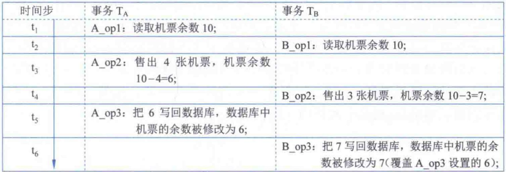
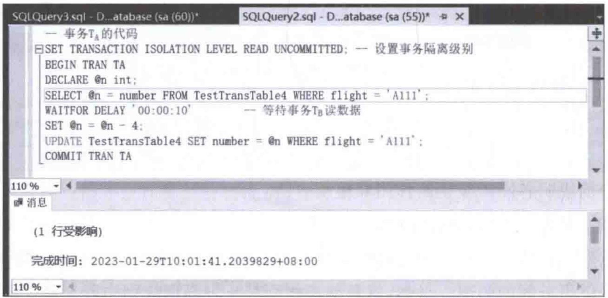
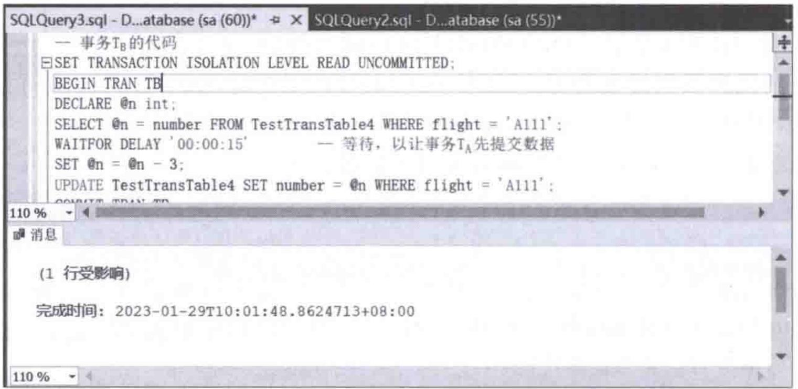
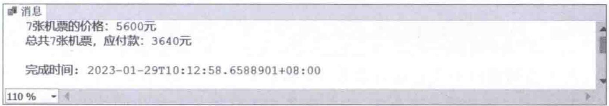
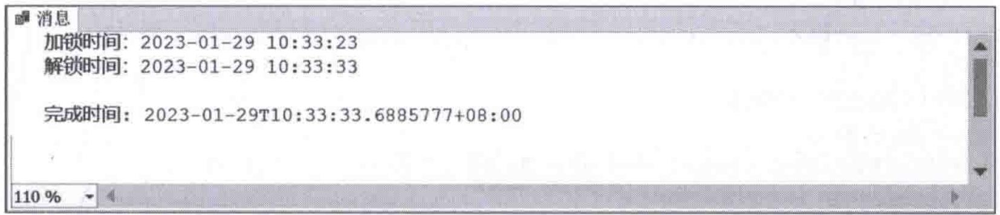
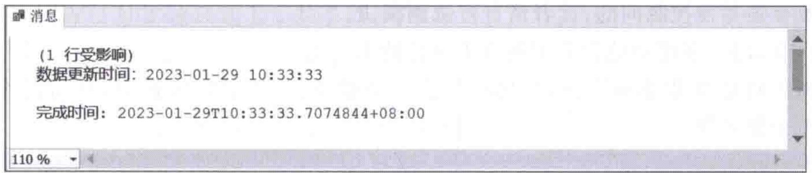
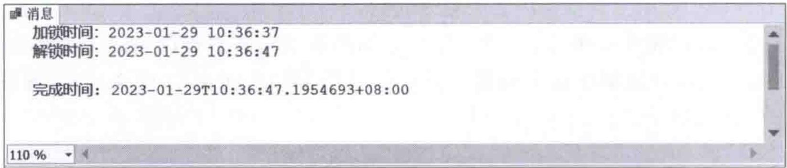
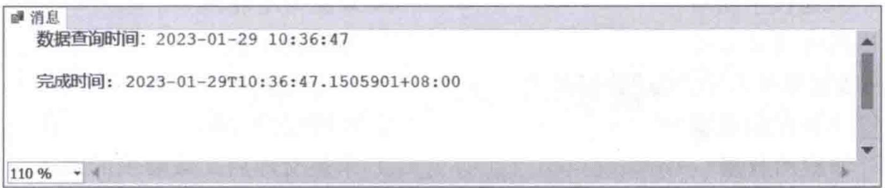
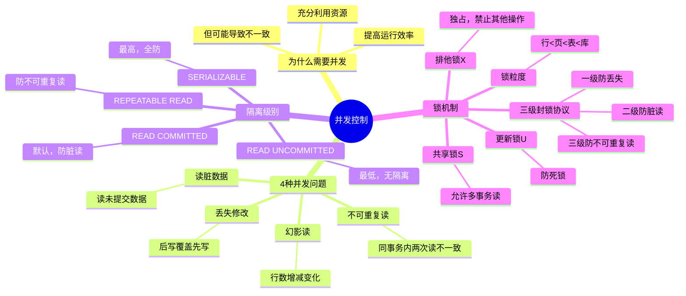

# 第10章-10.3-并发控制

## 基本信息
- **课程**：数据库原理与应用
- **章节**：第10章 10.3节 并发控制
- **日期**：2026-06-30
- **标签**：#并发控制 #事务隔离 #锁机制 #丢失修改 #脏读 #不可重复读 #幻影读

---

## 重点内容

### ⭐⭐⭐ 核心概念
- **并发控制**：通过有效控制和调度并发事务的交叉执行，保证数据库的一致性和完整性
- **4种并发问题**：丢失修改、读脏数据、不可重复读、幻影读
- **4种隔离级别**：READ UNCOMMITTED -> READ COMMITTED -> REPEATABLE READ -> SERIALIZABLE
- **3种锁类型**：共享锁(S)、排他锁(X)、更新锁(U)

### ⭐⭐ 锁机制
- **共享锁与排他锁的相容关系**：共享锁兼容共享锁，排他锁排斥一切锁
- **锁粒度**：行(RID) -> 键 -> 页面 -> 区域 -> 表 -> 数据库，粒度越小并发越高但开销越大
- **三级封锁协议**：一级防丢失修改、二级加防脏读、三级加防不可重复读

### ⭐ 关键对比
- 隔离级别越高，数据一致性越好，但并发效率越低
- 锁粒度越小，并发性越高，但管理开销越大

---

## 详细笔记

### 一、并发控制的概念

#### 1. 为什么需要并发控制

> 📚 **课本出处**：第10章 10.3.1节"并发控制的概念"

数据共享是数据库的基本功能之一。一个数据库可能同时拥有多个用户，同一时刻系统中可能同时运行成百上千个事务。

在单CPU系统中，事务的运行有两种方式：

| 方式 | 说明 | 优点 | 缺点 |
|:----:|:-----|:----:|:----:|
| **串行执行** | 每个时刻只有一个事务运行，其他事务等待 | 方便控制 | 效率极低，资源大量空闲 |
| **并发执行** | 多个事务的操作轮流交叉执行 | 充分利用资源，提高效率 | 可能导致数据不一致 |

> 📚 **课本出处**：第10章 10.3.1节，并发执行实际上是通过事务操作的轮流交叉实现的——同一时刻只有某一个操作占用CPU，但其他操作可以使用该操作没有占用的资源。

#### 2. 并发的好处与风险

**好处**：
- 充分利用空闲的系统资源（如I/O设备、内存）
- 总体上提高系统的运行效率

**风险**：
- 如果不能有效控制，可能导致对资源的不合理使用
- 可能导致数据的**不一致性**和**不完整性**

> 📌 **考试重点**：并发控制的定义——针对并发执行的事务，通过有效控制和调度其交叉执行的数据库操作，使各事务的执行不相互干扰，以避免出现数据库的不一致性和不完整性等问题。

---

### 二、几种并发问题

> 📚 **课本出处**：第10章 10.3.2节"几种并发问题"

当多个用户同时访问数据库时，如果没有必要的访问控制措施，可能会引发以下4种数据不一致的并发问题。

#### 1. 丢失修改（Lost Update）⭐⭐⭐

> 📚 **课本出处**：第10章 10.3.2节"丢失修改"

**定义**：事务A和事务B对同一数据进行修改，后执行的操作将先执行的操作结果覆盖掉，导致先执行的修改"丢失"。

**经典场景——民航订票系统**：

当前机票余数 x = 10张，售票点A（用户订4张）和售票点B（用户订3张）同时操作：

| 时间步 | 事务TA（订4张） | 事务TB（订3张） |
|:------:|:----------------|:----------------|
| t1 | 读取 x = 10 | |
| t2 | | 读取 x = 10 |
| t3 | x = 10 - 4 = 6，写回 x = 6 | |
| t4 | | x = 10 - 3 = 7，写回 x = 7 |

**结果**：数据库中剩余 7 张票。实际应剩余 10 - 4 - 3 = **3** 张。TB 的修改覆盖了 TA 的修改结果，TA 的修改"丢失"了。

#### 📷 图10.7 丢失修改



> 📚 **课本出处**：第10章 10.3.2节，图10.7 展示了丢失修改的执行过程

---

#### 2. 读"脏"数据（Dirty Read）⭐⭐⭐

> 📚 **课本出处**：第10章 10.3.2节"读'脏'数据"

**定义**：事务C修改了某数据并写回数据区（未提交），事务D读取了该数据；随后事务C回滚，数据恢复原值，导致事务D读到的数据与数据库实际数据不一致。

**"脏"数据** = 被某事务更改但还没有被提交的数据。

**场景举例**：

| 时间步 | 事务TC | 事务TD |
|:------:|:------|:------|
| t1 | 读取 x = 10；售出4张：x = 10 - 4 = 6；将 x = 6 写到数据区 | |
| t2 | | 读取 x = 6（读"脏"数据） |
| t3 | 回滚，x 恢复到原值 10 | |

**结果**：TD 使用的 x = 6 是"脏"数据，数据库实际值为 10。

> 💡 **理解技巧**：脏读的关键是"读了未提交的数据"。如果写入事务最终回滚，之前读到的数据就是无效的。

---

#### 3. 不可重复读（Non-Repeatable Read）⭐⭐⭐

> 📚 **课本出处**：第10章 10.3.2节"不可重复读"

**定义**：事务E按照一定条件读取数据x，随后事务F修改了x，事务E再次按相同条件读取x时发现两次读取结果不一致。

**场景举例**（c = 机票价格，n = 机票张数）：

| 时间步 | 事务TE（查询） | 事务TF（管理） |
|:------:|:--------------|:--------------|
| t1 | 读取 c = 800，n = 7；计算总价格 800 x 7 = 5600 | |
| t2 | | 读取 c = 800；六五折：c = 800 x 0.65 = 520；写回 c = 520 |
| t3 | 重读 c = 520，n = 7；计算总价格 520 x 7 = 3640 | |

**结果**：同一事务中两次读取价格，得到 5600 元和 3640 元两个不同的结果，产生矛盾。

> 📚 **课本出处**：第10章 10.3.2节，图10.9 展示了不可重复读的执行过程

> ⚠️ **常见误区**：不可重复读与读脏数据有相似之处，但关键区别是：不可重复读中另一个事务**已提交**了修改，而读脏数据中另一个事务**未提交**就回滚了。

---

#### 4. 幻影读（Phantom Row）⭐⭐⭐

> 📚 **课本出处**：第10章 10.3.2节"幻影读"

**定义**：事务G按照一定条件两次读取表中的某些记录，在两次读取之间事务H插入或删除了某些记录，导致第二次读取时记录"幻影"般地增多或消失了。

**场景举例**：
- TG 第一次按条件 `price <= 1200` 查询，得到 2 条记录
- 在此期间，TH 执行 `INSERT` 新增一条 price = 1000 的记录
- TG 第二次按相同条件查询，得到 3 条记录——多出的那条就是"幻影"

> 💡 **理解技巧**：4种问题的区分口诀——
> - 丢失修改 = "写覆盖"（后写覆盖先写）
> - 读脏数据 = "读未提交"（读了可能回滚的数据）
> - 不可重复读 = "改了再读变"（同一数据被其他事务修改后再次读取不同）
> - 幻影读 = "增删变行数"（查询范围内的记录数发生了变化）

---

### 三、基于事务隔离级别的并发控制

> 📚 **课本出处**：第10章 10.3.3节"基于事务隔离级别的并发控制"

事务的隔离级别用于表征一个事务与其他事务进行隔离的程度。**隔离级别越高，数据正确性越好，但并发程度和效率越低**。

#### 设置隔离级别的语法

```sql
SET TRANSACTION ISOLATION LEVEL {
    READ UNCOMMITTED
  | READ COMMITTED
  | REPEATABLE READ
  | SERIALIZABLE
};
```

---

#### 1. READ UNCOMMITTED（读未提交）

> 📚 **课本出处**：第10章 10.3.3节"使用 READ UNCOMMITTED"

**特点**：允许读取已经被其他事务修改但尚未提交的数据，实际上**根本没有提供事务间的隔离**。

**简记**：允许读取未提交数据。

**能防止的并发问题**：无（4种都不能防止）

**优点**：避免并发控制所需的系统开销

**适用场景**：单用户系统，或两个事务同时访问同一资源的可能性几乎为零

**SQL 示例**（允许丢失修改）：

```sql
-- 事务TA
SET TRANSACTION ISOLATION LEVEL READ UNCOMMITTED;
BEGIN TRAN TA
DECLARE @n int;
SELECT @n = number FROM TestTransTable4 WHERE flight = 'A111';
WAITFOR DELAY '00:00:10' -- 等待事务TB读数据
SET @n = @n - 4;
UPDATE TestTransTable4 SET number = @n WHERE flight = 'A111';
COMMIT TRAN TA

-- 事务TB
SET TRANSACTION ISOLATION LEVEL READ UNCOMMITTED;
BEGIN TRAN TB
DECLARE @n int;
SELECT @n = number FROM TestTransTable4 WHERE flight = 'A111';
WAITFOR DELAY '00:00:15' -- 等待让TA先提交
SET @n = @n - 3;
UPDATE TestTransTable4 SET number = @n WHERE flight = 'A111';
COMMIT TRAN TB
```

#### 📷 图10.10 执行事务TA



> 📚 **课本出处**：第10章 10.3.3节，图10.10 展示了在READ UNCOMMITTED级别下执行事务TA

#### 📷 图10.11 执行事务TB



> 📚 **课本出处**：第10章 10.3.3节，图10.11 展示了在READ UNCOMMITTED级别下执行事务TB，结果剩余7张票而非3张，造成丢失修改

---

#### 2. READ COMMITTED（读已提交）⭐

> 📚 **课本出处**：第10章 10.3.3节"使用 READ COMMITTED"

**特点**：不允许读取已修改但未提交的数据。当一个事务对数据进行了UPDATE但未提交时，其他事务不能读取该数据。

**简记**：不允许读取已修改但未提交数据。

**能防止的并发问题**：**脏读**（不能防止丢失修改、不可重复读、幻影读）

> 📌 **考试重点**：READ COMMITTED 是 SQL Server 的**默认事务隔离级别**。

**SQL 示例**（防止读脏数据）：

```sql
-- 事务TC（与READ UNCOMMITTED示例对比，只需修改隔离级别）
SET TRANSACTION ISOLATION LEVEL READ COMMITTED;
BEGIN TRAN TC
DECLARE @n int;
SELECT @n = number FROM TestTransTable4 WHERE flight = 'A111';
SET @n = @n - 4;
UPDATE TestTransTable4 SET number = @n WHERE flight = 'A111';
WAITFOR DELAY '00:00:10'
ROLLBACK TRAN TC -- 回滚事务

-- 事务TD
SET TRANSACTION ISOLATION LEVEL READ COMMITTED;
BEGIN TRAN TD
DECLARE @n int;
SELECT @n = number FROM TestTransTable4 WHERE flight = 'A111'; -- 被阻塞，等TC回滚后才执行
COMMIT TRAN TD
```

---

#### 3. REPEATABLE READ（可重复读）⭐⭐

> 📚 **课本出处**：第10章 10.3.3节"使用 REPEATABLE READ"

**特点**：如果一个数据块已被一个事务读取但尚未提交，则任何其他事务都不能修改（UPDATE）该数据块（但可以执行INSERT和DELETE）。

**简记**：不允许读取未提交数据，不允许修改已读数据。

**能防止的并发问题**：**脏读 + 不可重复读**（不能防止幻影读）

**缺点**：容易造成死锁

**SQL 示例**（防止不可重复读）：

```sql
-- 事务TE（查询事务，使用REPEATABLE READ）
SET TRANSACTION ISOLATION LEVEL REPEATABLE READ;
BEGIN TRAN TE
DECLARE @n int, @c int;
SELECT @c = price FROM TestTransTable4 WHERE flight = 'A111'; -- 第一次读
SET @n = 7;
PRINT CONVERT(varchar(10), @n) + '张机票的价格: '
     + CONVERT(varchar(10), @n * @c) + '元';
WAITFOR DELAY '00:00:10' -- 等待10秒
SELECT @c = price FROM TestTransTable4 WHERE flight = 'A111'; -- 第二次读（与第一次一致）
SET @n = 7;
PRINT '总共' + CONVERT(varchar(10), @n) + '张机票，应付款：'
     + CONVERT(varchar(10), @n * @c) + '元';
COMMIT TRAN TE

-- 事务TF（管理事务，在TE等待期间尝试修改价格）
SET TRANSACTION ISOLATION LEVEL REPEATABLE READ;
BEGIN TRAN TF
UPDATE TestTransTable4 SET price = price * 0.65 WHERE flight = 'A111'; -- 被阻塞
COMMIT TRAN TF
```

#### 📷 图10.13 出现不可重复读



> 📚 **课本出处**：第10章 10.3.3节，图10.13 展示了在READ COMMITTED级别下出现不可重复读（两次查询价格不同）

#### 📷 图10.14 避免了不可重复读


> 📚 **课本出处**：第10章 10.3.3节，图10.14 展示了在REPEATABLE READ级别下成功避免了不可重复读（两次查询价格一致）

---

#### 4. SERIALIZABLE（可串行化）⭐⭐

> 📚 **课本出处**：第10章 10.3.3节"使用 SERIALIZABLE"

**特点**：SQL Server **最高**的隔离级别。一个数据块一旦被一个事务读取或修改，则不允许其他事务对该数据进行任何更新操作（UPDATE、INSERT、DELETE），直到该事务结束。相当于事务串行执行。

**简记**：事务必须串行执行。

**能防止的并发问题**：**全部4种**（丢失修改 + 脏读 + 不可重复读 + 幻影读）

**缺点**：对系统性能影响很大，不是万不得已最好不要使用

**SQL 示例**（防止幻影读）：

```sql
-- 事务TG（查询事务，使用SERIALIZABLE）
SET TRANSACTION ISOLATION LEVEL SERIALIZABLE;
BEGIN TRAN TG
SELECT * FROM TestTransTable4 WHERE price <= 1200; -- 第一次读，2条
WAITFOR DELAY '00:00:10'
SELECT * FROM TestTransTable4 WHERE price <= 1200; -- 第二次读，仍然是2条
COMMIT TRAN TG

-- 事务TH（插入事务）
SET TRANSACTION ISOLATION LEVEL SERIALIZABLE;
BEGIN TRAN TH
INSERT INTO TestTransTable4 VALUES('A333', 1000, 20); -- 被阻塞，等TG结束后才执行
COMMIT TRAN TH
```

---

#### 隔离级别读写操作关系总览

> 📚 **课本出处**：第10章 10.3.3节，表10.1

| 隔离级别 | "读"操作 | "写"操作 |
|:---------|:---------|:---------|
| READ UNCOMMITTED | 读了,可再读；读了,可再写 | 写了,可再读；写了,不可再写 |
| READ COMMITTED | 读了,可再读；读了,可再写 | 写了,不可再读；写了,不可再写 |
| REPEATABLE READ | 读了,可再读；读了,**不可再写** | 写了,不可再读；写了,不可再写 |
| SERIALIZABLE | 读了,可再读；读了,**不可再写,插和删** | 写了,不可再读；写了,不可再写 |

> 📌 **考试重点**：表中"读了,不可再写"表示执行SELECT后，在事务提交/回滚前不允许UPDATE；"写了,不可再读"表示执行UPDATE后其他事务不能读取该数据。

> ⚠️ **常见误区**：严格来说，REPEATABLE READ 和 SERIALIZABLE 并不支持解决丢失修改问题，因为它们用于此类问题时容易造成**死锁**（SQL Server 会自动终止一个事务来解除死锁）。

---

### 四、基于锁的并发控制

> 📚 **课本出处**：第10章 10.3.4节"基于锁的并发控制"

#### 1. 封锁的概念

**封锁（Locking）**：对数据块的锁定，是SQL Server数据库引擎用来同步多个用户同时对同一个数据块进行访问的控制机制。

#### 2. 主要锁类型

> 📚 **课本出处**：第10章 10.3.4节"封锁"

##### 共享锁（S锁）⭐⭐⭐

- 允许多个事务并发读取同一数据块
- **不允许**其他事务修改当前事务加锁的数据块
- 一个事务加共享锁后，其他事务也**可以**继续加共享锁
- 所有事务都不能修改该数据块，直到共享锁释放

##### 排他锁（X锁）⭐⭐⭐

- 也称独占锁、写锁
- 一个事务加排他锁后，可以执行UPDATE、DELETE、INSERT等操作
- 其他事务**不能**加任何锁，也不能执行任何操作
- 保证同一数据块不会被多个事务同时更新

##### 更新锁（U锁）⭐⭐

- 介于共享锁和排他锁之间
- 一次只能分配给**一个**事务
- 读数据时相当于共享锁，更新时变为排他锁
- **优势**：可以较好地防止死锁

##### 其他锁类型

| 锁类型 | 说明 |
|:------:|:-----|
| 意向锁 | 表示需要在底层资源上获取S/X/U锁，提高性能 |
| 架构锁 | 修改表结构时使用，阻止其他事务并发访问 |
| 键范围锁 | 锁定记录之间的范围，防止幻影插入/删除 |
| 大容量更新锁 | 允许大容量数据并发复制到同一表 |

#### 3. 锁兼容矩阵 ⭐⭐⭐

> 📚 **课本出处**：第10章 10.3.4节，共享锁与排他锁的相容关系

| 已持有的锁 | 事务申请 S锁 | 事务申请 X锁 |
|:----------:|:----------:|:----------:|
| **无锁** | **兼容** | **兼容** |
| **S锁** | **兼容** | **冲突**（等待） |
| **X锁** | **冲突**（等待） | **冲突**（等待） |

**核心规则**：
- 事务T对数据D加了**S锁**：其他事务只能再加S锁，不能加X锁
- 事务T对数据D加了**X锁**：其他事务不能再加任何锁

---

#### 4. 锁的粒度

> 📚 **课本出处**：第10章 10.3.4节"SQL Server 锁的粒度"，表10.3

| 资源 | 描述 | 粒度 |
|:----:|:-----|:----:|
| RID | 行标识符，锁定表中单行数据 | 最小 |
| 键值 | 具有索引的数据行，保护键值范围 | |
| 页面 | 8KB的数据页或索引页 | |
| 区域 | 连续8个数据页或索引页 | |
| 表 | 整个数据表，包括所有数据和索引 | |
| DB | 整个数据库 | 最大 |

> 📌 **考试重点**：**粒度越小，并发性越高，但开销越大；粒度越大，并发性越低，但开销越小。**

---

#### 5. 三级封锁协议

> 📚 **课本出处**：第10章 10.3.4节"封锁协议"

| 协议 | X锁要求 | S锁要求 | 可解决的并发问题 |
|:----:|:-------:|:-------:|:---------------:|
| **一级封锁协议** | 修改前加X锁，事务结束时释放 | 不要求 | 丢失修改 |
| **二级封锁协议** | 同一级 | 读数据前加S锁，**读完即释放** | 丢失修改 + 脏读 |
| **三级封锁协议** | 同一级 | 读数据前加S锁，**事务结束时释放** | 丢失修改 + 脏读 + 不可重复读 |

> 📚 **课本出处**：第10章 10.3.4节，表10.4

> ⚠️ **常见误区**：三级封锁协议虽然可以解决不可重复读，但容易造成**死锁**。而且三级封锁协议不能解决幻影读问题。

---

#### 6. 并发控制的SQL语法及案例

> 📚 **课本出处**：第10章 10.3.4节"并发控制的SQL语法及案例"

##### 常用表提示选项

| 提示选项 | 作用 | 等价隔离级别 |
|:--------:|:-----|:----------:|
| HOLDLOCK | 使用共享锁，保持到事务完成 | SERIALIZABLE |
| NOLOCK | 不发布共享锁，允许读脏数据 | READ UNCOMMITTED |
| ROWLOCK | 使用行锁 | - |
| PAGLOCK | 使用页锁 | - |
| TABLOCK | 对表加共享锁，保持到语句结束 | - |
| TABLOCKX | 对表加排他锁 | - |
| UPDLOCK | 使用更新锁，保持到事务完成 | - |
| READPAST | 跳过被锁定的行 | - |

##### 案例：使用表级共享锁（例10.10）

```sql
-- 事务T1：对表加共享锁
BEGIN TRAN T1
DECLARE @s varchar(10);
-- 下面语句的唯一作用是对表加共享锁
SELECT @s = flight FROM TestTransTable4 WITH (HOLDLOCK, TABLOCK) WHERE 1=2;
PRINT '加锁时间:' + CONVERT(varchar(30), GETDATE(), 20);
WAITFOR DELAY '00:00:10' -- 事务等待10秒
PRINT '解锁时间:' + CONVERT(varchar(30), GETDATE(), 20);
COMMIT TRAN T1

-- 事务T2：尝试更新（被阻塞）
BEGIN TRAN T2
UPDATE TestTransTable4 SET price = price * 0.65 WHERE flight = 'A111';
PRINT '数据更新时间: ' + CONVERT(varchar(30), GETDATE(), 20);
COMMIT TRAN T2
```

#### 📷 图10.17 事务T1的输出结果



> 📚 **课本出处**：第10章 10.3.4节，图10.17 展示了事务T1加共享锁的输出

#### 📷 图10.18 事务T2的输出结果



> 📚 **课本出处**：第10章 10.3.4节，图10.18 展示了事务T2的UPDATE必须等到T1释放共享锁后才能执行

##### 案例：利用更新锁解决丢失修改（例10.11）

```sql
-- 事务TA：使用更新锁
BEGIN TRAN TA
DECLARE @n int;
SELECT @n = number FROM TestTransTable4 WITH (UPDLOCK, TABLOCK) WHERE flight = 'A111';
WAITFOR DELAY '00:00:10'
SET @n = @n - 4;
UPDATE TestTransTable4 SET number = @n WHERE flight = 'A111';
COMMIT TRAN TA

-- 事务TB：使用更新锁
BEGIN TRAN TB
DECLARE @n int;
SELECT @n = number FROM TestTransTable4 WITH (UPDLOCK, TABLOCK) WHERE flight = 'A111';
WAITFOR DELAY '00:00:15'
SET @n = @n - 3;
UPDATE TestTransTable4 SET number = @n WHERE flight = 'A111';
COMMIT TRAN TB
```

> 💡 **理解技巧**：更新锁的优势在于——TA先获得更新锁后，TB无法再获得该资源的任何锁，只能等待。TA完成更新并提交后，TB才能继续。这样既解决了丢失修改问题，又避免了死锁。

##### 案例：利用排他锁实现串行化（例10.12）

```sql
-- 事务T3：对表加排他锁
BEGIN TRAN T3
DECLARE @s varchar(10);
-- 下面语句的唯一作用是对表加排他锁
SELECT @s = flight FROM TestTransTable4 WITH (HOLDLOCK, TABLOCKX) WHERE 1=2;
PRINT '加锁时间:' + CONVERT(varchar(30), GETDATE(), 20);
WAITFOR DELAY '00:00:10'
PRINT '解锁时间:' + CONVERT(varchar(30), GETDATE(), 20);
COMMIT TRAN T3

-- 事务T4：尝试查询（被阻塞）
BEGIN TRAN T4
DECLARE @s varchar(10);
SELECT @s = flight FROM TestTransTable4;
PRINT '数据查询时间:' + CONVERT(varchar(30), GETDATE(), 20);
COMMIT TRAN T4
```

#### 📷 图10.19 事务T3的输出结果



> 📚 **课本出处**：第10章 10.3.4节，图10.19 展示了事务T3加排他锁的输出

#### 📷 图10.20 事务T4的输出结果



> 📚 **课本出处**：第10章 10.3.4节，图10.20 展示了事务T4必须等到T3释放排他锁后才能查询，实现了串行化

---

## 总结

### 4种并发问题对比

| 并发问题 | 核心特征 | 场景关键词 | 后果 |
|:--------:|:--------:|:----------:|:-----|
| **丢失修改** | 后写的覆盖先写的 | 两个事务同时UPDATE同一数据 | 修改结果丢失 |
| **读脏数据** | 读了未提交就回滚的数据 | 事务写入后回滚，另一个事务已读取 | 读到无效数据 |
| **不可重复读** | 同一事务内两次读取不一致 | 另一事务在两次读之间UPDATE了数据 | 两次结果矛盾 |
| **幻影读** | 查询范围内的行数发生变化 | 另一事务在两次查询之间INSERT/DELETE | 记录"幻影"增减 |

### 4种隔离级别对比

| 隔离级别 | 丢失修改 | 脏读 | 不可重复读 | 幻影读 | 并发性能 |
|:--------:|:--------:|:----:|:----------:|:------:|:--------:|
| READ UNCOMMITTED | x | x | x | x | 最高 |
| READ COMMITTED | x | o | x | x | 较高 |
| REPEATABLE READ | o* | o | o | x | 较低 |
| SERIALIZABLE | o* | o | o | o | 最低 |

> 注：o = 防止，x = 不一定防止。* REPEATABLE READ和SERIALIZABLE解决丢失修改时容易造成死锁。READ COMMITTED为SQL Server默认级别。

### 锁兼容矩阵

| 已持有 \ 申请 | S锁 | X锁 |
|:--------------:|:---:|:---:|
| **无锁** | 兼容 | 兼容 |
| **S锁** | **兼容** | 冲突 |
| **X锁** | 冲突 | 冲突 |

### 知识点脑图



### 关键要点

1. **并发控制的核心目标**：保证数据库的一致性和完整性
2. **4种并发问题的根本原因**：并发操作的随机调度破坏了事务的隔离性
3. **隔离级别越高，一致性越好，但并发效率越低**——这是核心权衡
4. **锁的两大核心规则**：S锁兼容S锁排斥X锁；X锁排斥一切锁
5. **更新锁是解决丢失修改的最佳选择**：既避免死锁，又保证正确性
6. **三级封锁协议与隔离级别的对应关系**：一级=READ UNCOMMITTED的思想，二级=READ COMMITTED的思想，三级=REPEATABLE READ的思想

---

## 疑问与思考

### ❓ 待解决问题

1. **4种并发问题如何区分？** 丢失修改关注"写覆盖写"，脏读关注"读了未提交的数据"，不可重复读关注"同一数据被修改后再次读取不同"，幻影读关注"查询范围内的记录数变化"
2. **4个隔离级别之间是什么递进关系？** 每升高一级，多解决一个并发问题：UNCOMMITTED(0) -> COMMITTED(防脏读) -> REPEATABLE READ(防不可重复读) -> SERIALIZABLE(防幻影读)
3. **共享锁和排他锁的本质区别是什么？** S锁是"只读锁"——允许多个读但禁止写；X锁是"读写锁"——独占资源，读写都只有持有者可以
4. **死锁是如何产生的？如何预防？** 当两个事务各自持有对方需要的锁并互相等待时产生死锁。预防方法：按固定顺序访问资源、设置锁等待超时、使用更新锁替代同时持有S锁和X锁
5. **为什么课本说REPEATABLE READ和SERIALIZABLE"不严格支持"解决丢失修改？** 因为将它们用于丢失修改场景时，两个事务同时持有S锁后都试图升级为X锁，导致死锁。SQL Server通过自动终止一个事务来解除死锁，但这本质上不是"防止"而是"事后补救"
6. **锁粒度的选择策略是什么？** 根据事务访问的数据量选择：访问少量行用行锁（并发高），访问大量行用表锁（开销小），DBMS会自动进行锁升级（行锁 -> 页锁 -> 表锁）

### 💡 个人理解/技巧

- **并发问题严重程度排序**：丢失修改 > 脏读 > 不可重复读 > 幻影读（丢失修改最严重，因为数据直接被覆盖）
- **隔离级别记忆口诀**：UNC(什么都没有) -> COM(提交了才能读) -> REP(重复读一致) -> SER(串行执行)
- **锁的类比**：共享锁像图书馆的"只能看不能借"，排他锁像"锁在保险柜里只有我能看到"
- **更新锁的巧妙之处**：先"排队挂号"（更新锁），读完数据后再"独家办理"（升级为排他锁），避免了两个事务同时挂号后争抢
- **三级封锁协议与隔离级别是两种不同的并发控制策略**：前者是"协议规定怎么加锁"，后者是"设置整体隔离程度"，实际中通常组合使用
- **实际开发经验**：大多数应用使用READ COMMITTED（默认值），只有在特殊场景（如报表统计需要一致性快照）才需要更高的隔离级别

---

## 相关链接

### 本节相关图片
- [图10.7 丢失修改](../../../images/23e6290eeeb40f92b6f46dfa023dffb17fa6f645de3edb9f78fad6b8892a33d8.jpg)
- [图10.10 执行事务TA](../../../images/63be5cdbf55a96de89b4995fc1bf6fd7e76121a2546f118d693157612bc9e57f.jpg)
- [图10.11 执行事务TB](../../../images/2467d719edc19f6f057d5c075f93b92eb63f70c8b898880a81608ecb13acaab4.jpg)
- [图10.13 出现不可重复读](../../../images/2b09a81a8c1c79e41f363d1f5277d864c1f0752db82875dc8c807c2e4f1f2cf7.jpg)
- [图10.14 避免了不可重复读](../../../images/96f012545343a968f8420deeb48c8786aedb7ef151b44d01d438de2c823cac7d.jpg)
- [图10.17 事务T1的输出结果](../../../images/49216affaf99a205f4fb2172c95b07c6bfe03cf7e6e5cf512429636507f22deb.jpg)
- [图10.18 事务T2的输出结果](../../../images/496de29a265f5e1a6f769f5d2f752d5970c0d1ad6aeef3957f318b87f80d9b32.jpg)
- [图10.19 事务T3的输出结果](../../../images/8a438c54fa050b5f4bf9a5c4d3c070ec3e2ad09b49eecb335e9ec36606a250bf.jpg)
- [图10.20 事务T4的输出结果](../../../images/f538be36bf4d4552b34a55dee29b0a6158638de4662a816bd7f6ea8938ced65a.jpg)

### 关联章节
- [第10章-事务管理与并发控制](./第10章-事务管理与并发控制.md)
- [第10章-10.1-事务的基本概念](./第10章-10.1-事务的基本概念.md)（待创建）
- [第10章-10.2-事务的管理](./第10章-10.2-事务的管理.md)（待创建）
- [第11章-数据的完整性管理](../第11章-数据的完整性管理/)（待创建）

---

## 检查清单

- [x] 已理解并发控制的概念和必要性
- [x] 已掌握4种并发问题的定义、场景和区别
- [x] 已掌握4种事务隔离级别的特点和解决的并发问题
- [x] 已掌握共享锁、排他锁、更新锁的特性和兼容关系
- [x] 已掌握锁粒度和三级封锁协议
- [x] 已插入课本原图（图10.7、图10.10-10.11、图10.13-10.14、图10.17-10.20）
- [x] 已添加SQL代码示例
- [x] 已记录重点标记和课本出处

---

*笔记创建时间：2026-06-30*
