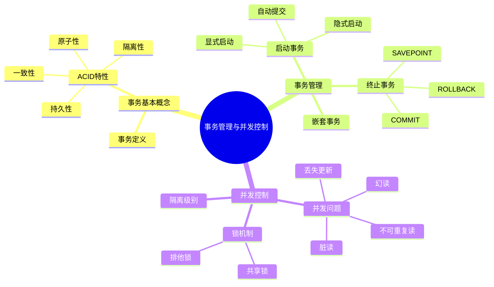

# 第10章-事务管理与并发控制

## 基本信息
- **课程**：数据库原理与应用
- **章节**：第10章 事务管理与并发控制
- **日期**：2026-06-30
- **标签**：#事务管理 #并发控制 #ACID #锁机制 #数据库恢复

---

## 重点内容

### ⭐⭐⭐ 核心概念
- **事务（Transaction）**：构成单一逻辑工作单元的数据库操作序列，要么全部成功，要么全部不执行
- **ACID特性**：原子性（Atomicity）、一致性（Consistency）、隔离性（Isolation）、持久性（Durability）
- **并发控制**：保证多个事务并发执行时数据库一致性的机制

### ⭐⭐ 重要知识点
- 事务的3种启动方式：显式启动、自动提交、隐式启动
- 事务的终止方法：COMMIT（提交）与 ROLLBACK（回滚）
- 嵌套事务与 @@TRANCOUNT 系统变量
- 并发问题：丢失更新、脏读、不可重复读、幻读
- 事务隔离级别：READ UNCOMMITTED 到 SERIALIZABLE
- 基于锁的并发控制：共享锁、排他锁、锁升级

### ⭐ 关键区别
- COMMIT vs ROLLBACK：提交使修改永久化，回滚恢复到事务开始状态
- 全部回滚 vs 部分回滚（SAVEPOINT）
- 不同隔离级别对并发问题的解决程度不同

---

## 详细笔记

### 一、事务的基本概念（10.1节）

#### 1. 事务定义

事务是数据库并发控制和恢复技术的基本概念。

- **定义**：构成单一逻辑工作单元的数据库操作序列
- **核心原则**：要么全部成功执行，要么全部不执行
- **典型场景**：银行转账（扣款和加款必须同时成功或同时失败）

#### 2. 事务的ACID特性

| 特性 | 英文 | 含义 |
|:----:|:----:|:-----|
| 原子性 | Atomicity | 事务是一个不可分割的工作单位，操作要么全部执行，要么全不执行 |
| 一致性 | Consistency | 事务执行前后数据库都处于一致状态 |
| 隔离性 | Isolation | 多个事务并发执行时互不干扰 |
| 持久性 | Durability | 事务一旦提交，其对数据库的改变是永久的 |

> 📚 **课本出处**：第10章 10.1节"事务的基本概念"

---

### 二、事务的管理（10.2节）

#### 1. 启动事务的3种方式

| 方式 | 说明 | 语法/设置 |
|:----:|:-----|:----------|
| 显式启动 | 使用BEGIN TRANSACTION语句 | `BEGIN TRAN [name]` |
| 自动提交 | 每条SQL语句自动成为一个事务（默认模式） | 无需特殊语句 |
| 隐式启动 | DML语句自动启动事务，形成连续事务链 | `SET IMPLICIT_TRANSACTIONS ON` |

#### 2. 终止事务

- **COMMIT TRANSACTION**：提交事务，修改永久保存到数据库
- **ROLLBACK TRANSACTION**：回滚事务，数据库恢复到事务开始状态
- **ROLLBACK TO savepoint**：部分回滚到指定保存点

#### 3. 嵌套事务

- 一个事务内可以包含另一个事务
- @@TRANCOUNT 追踪活动事务数
- BEGIN 使 @@TRANCOUNT 加1，COMMIT 使 @@TRANCOUNT 减1
- ROLLBACK（不带savepoint）将 @@TRANCOUNT 置0，回滚所有事务

> 📚 **课本出处**：第10章 10.2节"事务的管理"

---

### 三、并发控制（10.3节）

#### 1. 并发执行的必要性

多用户同时访问数据库时，需要并发控制来保证数据一致性。

#### 2. 几种并发问题

| 问题 | 描述 |
|:----:|:-----|
| 丢失更新 | 两个事务同时修改同一数据，一个事务的修改覆盖了另一个 |
| 脏读 | 事务读取到其他未提交事务修改的数据 |
| 不可重复读 | 事务内多次读取同一数据，结果不同 |
| 幻读 | 事务内查询结果集因其他事务插入/删除而发生变化 |

#### 3. 事务隔离级别

| 隔离级别 | 脏读 | 不可重复读 | 幻读 |
|:--------:|:----:|:----------:|:----:|
| READ UNCOMMITTED | 可能 | 可能 | 可能 |
| READ COMMITTED | 不可能 | 可能 | 可能 |
| REPEATABLE READ | 不可能 | 不可能 | 可能 |
| SERIALIZABLE | 不可能 | 不可能 | 不可能 |

#### 4. 基于锁的并发控制

- **共享锁（S锁）**：读操作使用，多个事务可同时持有
- **排他锁（X锁）**：写操作使用，与任何其他锁互斥
- **锁升级**：行级锁可升级为表级锁

> 📚 **课本出处**：第10章 10.3节"并发控制"

---

### 知识点脑图

---

## 关联章节

- [第10章-10.1-事务的基本概念](./第10章-10.1-事务的基本概念.md)
- [第10章-10.2-事务的管理](./第10章-10.2-事务的管理.md)
- 第10章-10.3-并发控制（待创建）
- [第9章-数据库编程技术](../第9章-数据库编程技术/第9章-数据库编程技术.md)（前置知识）
- 第11章-数据的完整性管理（后续章节）

---

## 检查清单

- [x] 已概述事务的基本概念和ACID特性
- [x] 已概述事务管理的启动和终止方法
- [x] 已概述并发控制的基本概念
- [x] 已添加课本出处标注
- [x] 已建立与其他章节的关联链接

---

*笔记创建时间：2026-06-30*
