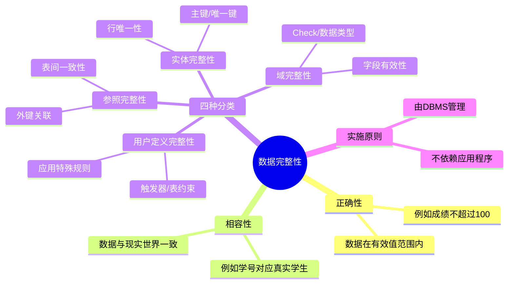

# 第11章-11.1-数据完整性概述

## 基本信息
- **课程**：数据库原理与应用
- **章节**：第11章 11.1节 关于数据完整性
- **日期**：2026-06-30
- **标签**：#数据完整性 #实体完整性 #参照完整性 #域完整性 #用户定义完整性 #完整性分类

---

## 重点内容

### ⭐⭐⭐ 核心概念
- **数据完整性**：数据的正确性 + 相容性，保证数据在语义上的合理性和有效性
- **完整性 vs 安全性**：完整性防语义错误，安全性防恶意操作
- **四种完整性类型**：实体完整性、参照完整性、域完整性、用户定义完整性

### ⭐⭐ 完整性机制
- **完整性约束条件**：定义数据必须满足的条件
- **完整性检查方法**：DBMS对数据进行自动检查
- **违约处理**：发现不满足约束时的处理方式

### ⭐ 关键理解
- 完整性应由DBMS来保证，而非由应用程序保证
- 用户定义完整性与域完整性是**相交关系**，不是隶属关系

---

## 详细笔记

### 一、数据完整性的概念（11.1.1）

数据完整性包含两方面的含义：

1. **数据的正确性**：数据是否在有效范围内
2. **数据的相容性**：数据是否与现实世界一致

> 📚 **课本出处**：第11章 11.1.1节"数据完整性的概念"

**举例说明**：

| 完整性类型 | 举例 | 说明 |
|:----------:|:-----|:-----|
| 正确性 | 性别字段只能是"男"或"女" | 数据在有效值范围内 |
| 相容性 | 学生姓名对应的学生必须是已存在的 | 数据与现实世界一致 |

---

#### ⭐⭐⭐ 完整性 vs 安全性

这是一个非常重要的区分，二者有本质区别：

| 对比项 | 数据完整性 | 数据安全性 |
|:------:|:----------:|:----------:|
| **目的** | 防止语义上不正确的数据 | 防止恶意破坏和非法操作 |
| **关注点** | 数据本身是否有意义 | 数据访问是否被授权 |
| **举例** | 成绩超过100分（百分制）无意义 | 未授权用户更改学生成绩 |
| **本质** | 数据值是否合理 | 数据操作是否合法 |

> 💡 **理解技巧**：完整性管的是"数据对不对"，安全性管的是"谁在操作"。即使修改后的成绩仍在0-100范围内（满足完整性），但如果是未授权用户修改的，仍然不安全。

> ⚠️ **常见误区**：不要把完整性混淆为安全性。一个违反安全性的操作可能仍然满足完整性约束，反之亦然。

---

#### 完整性的保证机制

数据完整性的保证一般由DBMS提供，包括三个方面：

1. **完整性约束条件**：定义数据必须满足的规则
2. **完整性检查方法**：在数据操作时进行检查
3. **违约处理**：发现违反约束时的处理措施

> 📚 **课本出处**：第11章 11.1.1节

> 💡 **理解技巧**：DBMS提供完整性的定义和检查机制，用户只需在定义表时声明约束，之后由DBMS自动负责检查和处理违约，而不需要在应用程序中编写检查逻辑。

---

### 二、数据完整性的分类（11.1.2）

数据完整性可分为**4种类型**：实体完整性、参照完整性、域完整性、用户定义完整性。

> 📚 **课本出处**：第11章 11.1.2节"数据完整性的分类"

---

#### 1. 实体完整性（Entity Integrity）

又称**行完整性**。

**定义**：任何一个实体都存在区别于其他实体的特征，且这些特征值不能为空（NULL）。实体完整性要求任意两行在某些字段上的取值不能完全相等且字段值不能为空。

> 📚 **课本出处**：第11章 11.1.2节"实体完整性"

**核心要点**：
- 保证关系中不存在"相同"的两行
- 关键字段的值不能为NULL

**实现机制**：
- 主键（Primary Key）
- 唯一码（Unique Key）
- 唯一索引（Unique Index）
- CHECK约束
- 标识字段（Identity Column）

**举例**：学生表中，学号（s_no）作为主键，每个学生的学号必须唯一且不能为空，这样就能区分每一个学生实体。

---

#### 2. 参照完整性（Referential Integrity）

又称**引用完整性**。

**定义**：主关系表（被参照表/主表）中的数据与从关系表（参照表/从表）中的数据的一致性。

> 📚 **课本出处**：第11章 11.1.2节"参照完整性"

**核心要点**：
- 从表中外键的值必须在主表主键中存在，或者为NULL
- 保证表间关系的正确性

**实现机制**：
- 主键（Primary Key）与外键（Foreign Key）的关联
- 存储过程
- 触发器

**举例**：选课表SC中的学号（s_no）是外键，参照学生表student的主键s_no。选课表中引用的学号必须是学生表中已存在的学号，不能插入一个不存在的学生的选课记录。

---

#### 3. 域完整性（Domain Integrity）

又称**字段完整性**或**列完整性**。

**定义**：域即是字段（列），域完整性即字段的完整性，是字段值在语义上的合理性和有效性。

> 📚 **课本出处**：第11章 11.1.2节"域完整性"

**核心要点**：
- 约束字段的取值范围、类型、格式等
- 保证单个字段的数据有意义

**实现机制**：
- CHECK约束
- 规则（Rule）
- 数据类型（Data Type）
- 外键（Foreign Key）
- 默认值（Default）
- 触发器（Trigger）

**举例**：
- 学生成绩不能超过100分（CHECK约束）
- 姓名字段值不能为空（NOT NULL约束）
- 性别字段只能取"男"或"女"（CHECK约束）

---

#### 4. 用户定义完整性（User-defined Integrity）

**定义**：实体完整性和参照完整性是关系模型最基本的要求。除此之外，在面向具体应用时，用户可以根据实际需要定义一些特殊的约束条件。这种针对具体应用的、由用户定义的特殊约束条件就是用户定义完整性。

> 📚 **课本出处**：第11章 11.1.2节"用户定义完整性"

**核心要点**：
- 针对具体应用的特殊约束
- 超出了实体、参照、域完整性的范围

**实现机制**：
- 规则（Rule）
- 触发器（Trigger）
- 表约束

**举例**：某门课程的成绩必须在期末考试之后才能录入；同一个用户在同一时间只能有一个未完成的借阅记录等。

---

#### 用户定义完整性与域完整性的关系

> 📚 **课本出处**：第11章 11.1.2节

用户定义完整性与域完整性是**相交关系**，不是隶属关系：

- 域完整性中**部分**由用户定义（如成绩范围0~100），**部分**由数据类型自动约定（如int类型限制为整数）
- 用户定义完整性中也包含对字段的约束
- 二者有重叠，但互不从属

> 💡 **理解技巧**：域完整性是"管列"的，用户定义完整性是"管应用规则"的。它们有交叉，但不是一个包含另一个。例如"成绩在0-100之间"既是域完整性（约束列的范围），也是用户定义完整性（由用户根据业务规则定义）。

---

### 三、完整性的总体实施原则

> 📚 **课本出处**：第11章 11.1.2节

现在的DBMS产品一般都提供定义和检查数据完整性的机制。因此：

- **应该**在DBMS中定义数据的完整性，由DBMS自动检查并给出提示信息
- **不应该**由应用程序来保证数据的完整性

> ⭐ **核心原则**：完整性应交给DBMS管理，应用程序只负责业务逻辑。

---

## 总结

### 四种完整性分类对比表

| 完整性类型 | 又称 | 作用范围 | 核心含义 | 主要实现机制 | 举例 |
|:----------:|:----:|:--------:|:--------|:------------|:-----|
| **实体完整性** | 行完整性 | 行（元组） | 每个实体可唯一标识，主键不重复且不为空 | Primary Key, Unique Key, Unique Index, Identity | 学号唯一且非空 |
| **参照完整性** | 引用完整性 | 表间关系 | 外键值必须在主表主键中存在或为NULL | Foreign Key, 触发器, 存储过程 | 选课表的学号必须在学生表中存在 |
| **域完整性** | 字段/列完整性 | 列（字段） | 字段值在语义上合理有效 | Check, Rule, Data Type, Default | 成绩在0~100之间 |
| **用户定义完整性** | 应用完整性 | 具体应用 | 用户根据业务需求定义的特殊约束 | Rule, Trigger, 表约束 | 期末考试后才能录入成绩 |

### 关键要点

1. **完整性 = 正确性 + 相容性**：数据既要值有效，又要与现实一致
2. **完整性 ≠ 安全性**：前者管数据含义，后者管访问权限
3. **DBMS负责完整性**：应由DBMS定义和检查，而非应用程序
4. **四类完整性各有侧重**：实体管行唯一、参照管表间关系、域管列范围、用户定义管业务规则
5. **域完整性与用户定义完整性是相交关系**：有重叠但互不从属

### 知识点脑图

---

## 疑问与思考

### ❓ 待解决问题
1. 域完整性中由数据类型自动约定的部分（如int类型），与DBMS默认行为之间的界限在哪里？
2. 当同一个约束同时涉及域完整性和用户定义完整性时（如成绩0~100），在SQL Server中应该用哪种方式定义更好？
3. 参照完整性中的级联删除（CASCADE DELETE）和级联更新（CASCADE UPDATE）在实际应用中有哪些风险？
4. 课本提到CHECK约束也可用于实现实体完整性，它与主键约束在实现实体完整性方面有何不同？

### 💡 个人理解/技巧
- 四种完整性可以按照作用范围记忆：**实体管行、域管列、参照管关系、用户定义管业务**
- 完整性和安全性的区分可以这样记：完整性是"对不对"的问题，安全性是"能不能"的问题
- DBMS保证完整性比应用程序保证更可靠，因为数据可能通过多种途径（不同应用程序、手动操作等）进入数据库，但都会经过DBMS
- 域完整性是最"基础"的完整性，几乎所有字段都天然需要满足；实体完整性和参照完整性是关系模型的"强制"要求

---

## 相关链接

### 关联章节
- [第1章-数据库概述](../第1章-数据库概述/第1章-数据库概述.md)（数据库系统阶段的统一数据控制）
- [第2章-2.1-关系模型](../../第2章-关系数据库理论基础/第2章-2.1-关系模型.md)（关系完整性约束的理论基础）
- [第4章-数据库查询语言SQL](../../第4章-数据库查询语言SQL/)（SQL定义约束的语法）
- [第8章-8.2-触发器](../../第8章-存储过程和触发器/)（触发器实现完整性）
- 第11章-11.2-实体完整性的实现（待创建）
- 第11章-11.3-参照完整性的实现（待创建）
- 第11章-11.4-用户定义完整性的实现（待创建）

### 参考资料
- 课本：第11章 11.1节"关于数据完整性"
- 理论基础：第2章 2.1.3节"关系的完整性约束"

---

## 检查清单

- [x] 已理解数据完整的概念（正确性 + 相容性）
- [x] 已区分完整性与安全性的本质区别
- [x] 已掌握四种完整性类型及其定义和举例
- [x] 已理解域完整性与用户定义完整性的相交关系
- [x] 已记录重点标记
- [x] 已添加课本出处标注

---

*笔记创建时间：2026-06-30*
