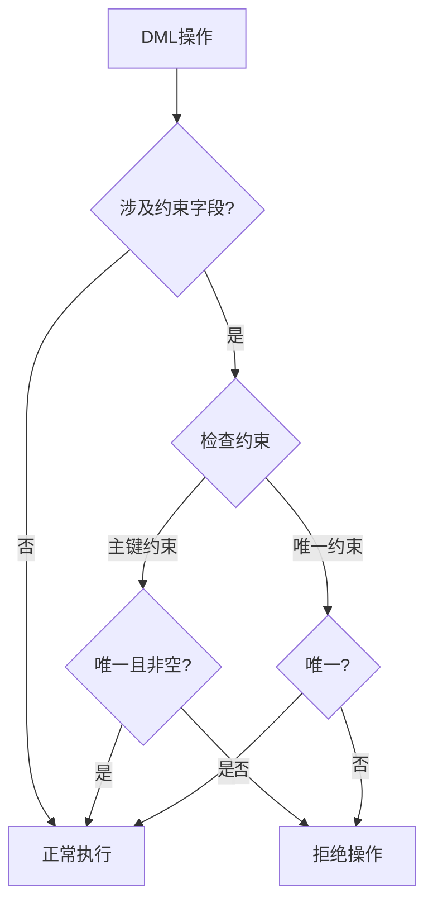

# 第11章-11.2-实体完整性的实现

## 基本信息
- **课程**：数据库原理与应用
- **章节**：第11章 11.2节 实体完整性的实现
- **日期**：2026-06-30
- **标签**：#实体完整性 #主键 #PRIMARY_KEY #唯一约束 #IDENTITY

---

## 重点内容

### ⭐⭐⭐ 核心概念
- **主键约束（PRIMARY KEY）**：实现实体完整性最常用的方法，保证每行数据唯一且非空
- **唯一约束（UNIQUE）+ 非空约束（NOT NULL）**：等价于主键约束的效果
- **IDENTITY字段**：自动编号，无需用户干预

### ⭐⭐ 定义方式
- **列级约束**：单字段主键直接定义在字段后
- **表级约束**：复合主键必须定义为表级约束
- **ALTER TABLE**：可在已创建的表上追加主键

### ⭐ 检查规则
- 插入或更新时，检查主键值是否**唯一**
- 插入或更新时，检查主键值是否**非空（NOT NULL）**

---

## 详细笔记

### 一、实体完整性的定义（11.2.1）

> 📚 **课本出处**：第11章 11.2.1节"实体完整性的定义"

实体完整性通过**主键约束**、**唯一约束**或**IDENTITY字段**来实施。其中主键约束是最常用的方法。

#### 1. 主键约束（PRIMARY KEY）

当主键由一个字段构成时，既可以定义为**列级约束**，也可以定义为**表级约束**；如果主键由多个字段构成（复合主键），则**必须定义为表级约束**。

**【例11.1】将student表的s_no定义为主键（列级约束）**

```sql
CREATE TABLE student(
    s_no char(8) PRIMARY KEY,        -- 定义主键（列级约束）
    s_name char(8),
    s_sex char(2),
    s_birthday smalldatetime,
    s_speciality varchar(50),
    s_avgrade numeric(4,1),
    s_dept varchar(50)
);
```

> 💡 **理解技巧**：列级约束直接写在字段定义后面，语法简洁；表级约束写在所有字段定义之后，用 `PRIMARY KEY(字段列表)` 的形式。

**复合主键（表级约束）—— 以SC表为例**

当主键由多个字段构成时，必须使用表级约束定义：

```sql
CREATE TABLE SC(
    s_no char(8),
    c_name varchar(20),
    c_grade numeric(4,1),
    PRIMARY KEY(s_no, c_name)  -- 将(s_no, c_name)设为主键（表级约束）
);
```

> ⚠️ **常见误区**：复合主键中，只有当**所有字段的值组合**相同时才视为重复；单个字段的值可以重复（如不同课程可以有相同学号）。

**使用ALTER TABLE追加主键**

```sql
-- 先创建无主键的表
CREATE TABLE student(
    s_no char(8),
    s_name char(8),
    s_sex char(2)
);

-- 后续追加主键
ALTER TABLE student
ADD CONSTRAINT PK_student PRIMARY KEY(s_no);
```

#### 2. 唯一约束（UNIQUE）+ 非空约束（NOT NULL）

在 SQL Server 中，唯一约束通过创建**唯一索引**来实现。如果对一个字段同时使用唯一约束和非空约束，也可以实现实体完整性。

**【例11.2】使用唯一约束+非空约束实现实体完整性**

```sql
-- 方法一：先建表，再建唯一索引
CREATE TABLE student(
    s_no char(8) NOT NULL,       -- 非空约束
    s_name char(8),
    s_sex char(2),
    s_birthday smalldatetime,
    s_speciality varchar(50),
    s_avgrade numeric(4,1),
    s_dept varchar(50)
);
CREATE UNIQUE INDEX unique_index ON student(s_no);  -- 唯一索引
```

上述代码等价于：

```sql
-- 方法二：直接使用UNIQUE + NOT NULL
CREATE TABLE student(
    s_no char(8) UNIQUE NOT NULL,  -- 唯一约束 + 非空约束
    s_name char(8),
    s_sex char(2),
    s_birthday smalldatetime,
    s_speciality varchar(50),
    s_avgrade numeric(4,1),
    s_dept varchar(50)
);
```

> 📚 **课本出处**：第11章 11.2.1节"唯一约束"

#### 3. IDENTITY字段

IDENTITY 字段是一种特殊的自动编号字段，用户无需手动赋值，系统会按照设定的**初值（seed）**和**增量（increment）**自动调整。

语法格式：

```sql
IDENTITY[(seed, increment)]
```

| 参数 | 说明 | 默认值 |
|:----:|:-----|:------:|
| seed | 第一行的初始值 | 1 |
| increment | 每行的增量值 | 1 |

> 📚 **课本出处**：第11章 11.2.1节"IDENTITY字段"

**【例11.3】创建带IDENTITY字段的表**

```sql
CREATE TABLE student(
    id_num int IDENTITY(0, 10),   -- 初值0，增量10
    s_no char(8),
    s_name char(8),
    s_sex char(2),
    s_birthday smalldatetime,
    s_speciality varchar(50),
    s_avgrade numeric(4,1),
    s_dept varchar(50)
);
```

插入数据时**不需要对IDENTITY字段赋值**：

```sql
INSERT student VALUES('20170201','刘洋','女','1997-02-03','计算机应用技术',98.5,'计算机系');
INSERT student VALUES('20170202','王晓珂','女','1997-09-20','计算机软件与理论',88.1,'计算机系');
INSERT student VALUES('20170203','王伟志','男','1996-12-12','智能科学与技术',89.8,'智能技术系');
```

插入后 id_num 字段自动递增：0, 10, 20

| id_num | s_no | s_name | s_sex | s_speciality |
|:------:|:----:|:------:|:-----:|:------------|
| 0 | 20170201 | 刘洋 | 女 | 计算机应用技术 |
| 10 | 20170202 | 王晓珂 | 女 | 计算机软件与理论 |
| 20 | 20170203 | 王伟志 | 男 | 智能科学与技术 |

> 📚 **课本出处**：第11章 11.2.1节，图11.1 IDENTITY字段自动更新效果

> 💡 **理解技巧**：IDENTITY字段本质上保证了该字段值的唯一性和非空性，从而间接实现实体完整性。它适合用作代理键（surrogate key），不承载业务含义。

---

### 二、实体完整性的检查（11.2.2）

> 📚 **课本出处**：第11章 11.2.2节"实体完整性的检查"

定义主键和唯一约束后，每当用户对表进行**插入**或**更新**操作时，只要涉及约束作用的字段，数据库系统就会自动进行检查。

#### 主键约束的检查内容

| 检查项目 | 规则 | 违约处理 |
|:--------:|:-----|:--------:|
| **唯一性** | 主键值不能与已有记录重复 | 拒绝插入或更新 |
| **非空性** | 主键中任一字段值不得为NULL | 拒绝插入或更新 |

> ⭐ **核心要点**：主键约束要求**同时满足唯一性和非空性**，二者缺一不可。

#### 唯一约束的检查内容

唯一约束**只检查唯一性**，不检查非空性（除非同时定义了NOT NULL约束）。

#### IDENTITY字段的检查

IDENTITY字段由系统自动管理，**自动保证唯一性和非空性**，无需额外检查。

#### 检查时机总结



> ⚠️ **常见误区**：唯一约束允许字段值为NULL（SQL标准中，NULL不被视为重复值），但主键约束不允许任何字段为NULL。

---

## 总结

### 实体完整性实现方式对比

| 实现方式 | 语法特点 | 非空保证 | 自动编号 | 适用场景 |
|:--------:|:--------:|:--------:|:--------:|:--------:|
| **PRIMARY KEY** | 最简洁 | 自动保证 | 否 | 最常用，单一字段或复合主键 |
| **UNIQUE + NOT NULL** | 需两个约束 | 需显式声明 | 否 | 需要灵活控制索引方式 |
| **IDENTITY** | 自动生成 | 自动保证 | 是 | 代理键、流水号 |

### 关键要点

1. **PRIMARY KEY** = UNIQUE + NOT NULL，是最常用的实体完整性实施方法
2. **单字段主键**可用列级或表级约束；**复合主键**必须用表级约束
3. 主键检查规则：**唯一性 + 非空性**，违反任一即拒绝操作
4. IDENTITY字段适合做自动编号，无需用户干预
5. 通过 `ALTER TABLE ADD CONSTRAINT` 可以在已有表上追加主键

---

## 疑问与思考

❓ **疑问**：PRIMARY KEY 和 UNIQUE 有什么区别？

💡 **解答**：
- **PRIMARY KEY** = UNIQUE + NOT NULL（不允许 NULL，一张表只能有一个）
- **UNIQUE**：允许 NULL（NULL 不计入重复检查），一张表可以有多个
- PRIMARY KEY 会自动创建**聚集索引**，UNIQUE 默认创建非聚集索引

❓ **疑问**：一个表能定义多个 PRIMARY KEY 吗？

💡 **解答**：
- **不能**，一张表只能有一个 PRIMARY KEY
- 但可以用**复合主键**（多个字段组合成一个主键）
- 多个字段需要唯一约束时，用 UNIQUE 代替

❓ **疑问**：在已有多行数据的表上添加主键，数据有重复怎么办？

💡 **解答**：
- 数据库会**拒绝添加**，并报错提示存在重复值
- 必须先清理数据（删除重复行或修改数据），再添加主键约束

### 💡 个人理解/技巧
- **PRIMARY KEY vs UNIQUE**：PRIMARY KEY不允许NULL且一张表只能有一个；UNIQUE允许NULL（但NULL不计入重复检查），一张表可以有多个UNIQUE约束
- **复合主键的陷阱**：`(学号, 课程)` 做复合主键时，同一个学生选多门课是允许的（组合不同），但同一学生不能重复选同一门课
- **主键为NULL时的行为**：SQL标准规定，主键中任一字段为NULL即视为违反约束，数据库会直接拒绝该操作
- **IDENTITY的局限**：IDENTITY字段值不连续是正常的（删除行后不会回收编号），不要用它来判断"中间缺失了什么数据"
- **选择策略**：优先使用 PRIMARY KEY；当需要额外唯一约束时用 UNIQUE；当需要自动编号时用 IDENTITY（常配合 PRIMARY KEY 使用）

---

## 相关链接

### 关联章节
- [第11章-数据的完整性管理](../第11章-数据的完整性管理/第11章-数据的完整性管理.md)
- [第11章-11.3-参照完整性的实现](../第11章-数据的完整性管理/第11章-11.3-参照完整性的实现.md)
- [第11章-11.4-用户定义完整性的实现](../第11章-数据的完整性管理/第11章-11.4-用户定义完整性的实现.md)
- [第6章-数据库的创建和管理](../../第6章-数据库的创建和管理/第6章-数据库的创建和管理.md)

---

## 检查清单

- [x] 已掌握PRIMARY KEY的三种定义方式（列级、表级、ALTER TABLE）
- [x] 已掌握复合主键的定义方法（必须用表级约束）
- [x] 已理解UNIQUE + NOT NULL等价于PRIMARY KEY
- [x] 已掌握IDENTITY字段的语法和使用
- [x] 已理解实体完整性的检查规则（插入/更新时）
- [x] 已添加课本出处标注

---

*笔记创建时间：2026-06-30*
