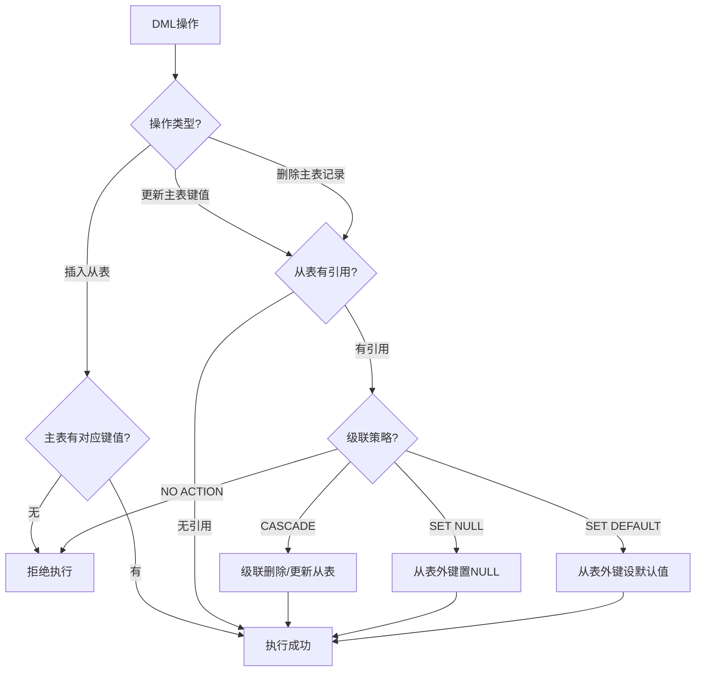

# 第11章-11.3-参照完整性的实现

## 基本信息
- **课程**：数据库原理与应用
- **章节**：第11章 11.3节 参照完整性的实现
- **日期**：2026-06-30
- **标签**：#参照完整性 #外键 #FOREIGN_KEY #级联操作 #主表从表

---

## 重点内容

### ⭐⭐⭐ 核心概念
- **参照完整性**：通过外键约束保证主表与从表之间的关联关系正确
- **主表与从表**：被参照的表为主表，引用外键的表为从表
- **FOREIGN KEY...REFERENCES**：SQL中定义外键约束的标准语法

### ⭐⭐ 级联操作
- **ON DELETE CASCADE / ON UPDATE CASCADE**：级联删除/更新
- **ON DELETE SET NULL / ON UPDATE SET NULL**：设为空值
- **ON DELETE SET DEFAULT / ON UPDATE SET DEFAULT**：设为默认值
- **NO ACTION**：拒绝操作（默认行为）

### ⭐ 检查规则
- 从表不能引用主表中不存在的键值
- 删除主表记录前，必须先处理从表中的关联记录

---

## 详细笔记

### 一、参照完整性的定义（11.3.1）

> 📚 **课本出处**：第11章 11.3.1节"参照完整性的定义"

参照完整性通过定义**外键与主键**之间（或外键与**唯一约束字段**之间）的对应关系来实现，由这种关系形成的约束称为**外键约束**。

在 SQL 语言中，外键约束由嵌套在 `CREATE TABLE` 或 `ALTER TABLE` 语句中的短语 `FOREIGN KEY...REFERENCES...` 来定义。

涉及两个表：
- **主表（被参照表）**：由关键字 `REFERENCES` 指定
- **从表（参照表）**：使用 `FOREIGN KEY...REFERENCES...` 的表

> ⚠️ **常见误区**：创建表时，必须**先定义主表，再定义从表**，顺序不能反。

#### 1. 基本外键定义

**【例11.4】创建表SC对表student的外键约束**

```sql
-- 主表：先创建
CREATE TABLE student(
    s_no char(8) PRIMARY KEY,       -- 定义主键
    s_name char(8),
    s_sex char(2),
    s_birthday smalldatetime,
    s_speciality varchar(50),
    s_avgrade numeric(4,1),
    s_dept varchar(50)
);

-- 从表：后创建
CREATE TABLE SC(
    s_no char(8),
    c_name varchar(20),
    c_grade numeric(4,1),
    PRIMARY KEY(s_no, c_name),                                    -- 复合主键
    FOREIGN KEY (s_no) REFERENCES student(s_no)                   -- 外键约束
);
```

> 📚 **课本出处**：第11章 11.3.1节，例11.4

> 💡 **理解技巧**：`FOREIGN KEY (从表字段) REFERENCES 主表(主表字段)` —— 箭头方向是从表指向主表，表示"从表的这个字段引用了主表的那个字段"。

#### 2. 主表关联字段的要求

主表中被参照的字段一般要定义为**主键**，如果不定义为主键，至少也要满足**唯一约束**。

**使用唯一索引替代主键的例子**

```sql
CREATE TABLE student(
    s_no char(8),
    s_name char(8),
    s_sex char(2),
    s_birthday smalldatetime,
    s_speciality varchar(50),
    s_avgrade numeric(4,1),
    s_dept varchar(50)
);
CREATE UNIQUE INDEX unique_index ON student(s_no);  -- 唯一索引（替代主键）

CREATE TABLE SC(
    s_no char(8),
    c_name varchar(20),
    c_grade numeric(4,1),
    PRIMARY KEY(s_no, c_name),
    FOREIGN KEY (s_no) REFERENCES student(s_no)  -- 合法：s_no有唯一索引
);
```

> 📚 **课本出处**：第11章 11.3.1节

> ⚠️ **常见误区**：如果主表关联字段既不是主键也没有唯一约束，上述外键定义将产生**运行错误**。

#### 3. 级联操作（ON DELETE / ON UPDATE）

当主表中的记录被删除或更新时，从表中引用该记录的外键记录如何处理？SQL提供了以下级联选项：

> 🌐 **拓展**：网上搜索 - 级联操作的标准SQL语法

```sql
CREATE TABLE SC(
    s_no char(8),
    c_name varchar(20),
    c_grade numeric(4,1),
    PRIMARY KEY(s_no, c_name),
    FOREIGN KEY (s_no) REFERENCES student(s_no)
        ON DELETE CASCADE           -- 级联删除：主表删记录时，从表关联记录一并删除
        ON UPDATE CASCADE           -- 级联更新：主表改键值时，从表关联记录同步更新
);
```

**完整级联操作选项**：

| 级联选项 | 含义 | 效果 |
|:--------:|:-----|:-----|
| **CASCADE** | 级联操作 | 主表删除/更新时，从表对应记录自动删除/更新 |
| **SET NULL** | 设为空值 | 主表删除/更新时，从表外键字段设为NULL |
| **SET DEFAULT** | 设为默认值 | 主表删除/更新时，从表外键字段设为默认值 |
| **NO ACTION** | 拒绝操作 | 主表有从表引用时，拒绝删除/更新（默认行为） |

> 📚 **课本出处**：第11章 11.3.2节，参照完整性违约处理

**各选项使用示例**：

```sql
-- 级联删除：删除学生时，其选课记录也自动删除
FOREIGN KEY (s_no) REFERENCES student(s_no)
    ON DELETE CASCADE

-- 设为空值：删除学生时，选课记录保留但学号置空
FOREIGN KEY (s_no) REFERENCES student(s_no)
    ON DELETE SET NULL

-- 拒绝删除：如果学生仍有选课记录，则不允许删除该学生（默认行为）
FOREIGN KEY (s_no) REFERENCES student(s_no)
    ON DELETE NO ACTION
```

---

### 二、参照完整性的检查（11.3.2）

> 📚 **课本出处**：第11章 11.3.2节"参照完整性的检查"

参照完整性要求：对于**从表中的每一条记录**，在主表中必须包含在关联字段上取值相等的记录；但对于主表中的每一条记录，并不要求在从表中存在与之关联的记录。

> 💡 **通俗理解**：任何时候，主表必须"包含"从表中的记录。即从表中的外键值必须在主表中找得到。

#### 主表与从表的关系示例

以 student 表（主表）和 SC 表（从表）为例：

**表 student（主表）**

| 学号 | 姓名 | 性别 | 出生日期 | 专业 |
|:----:|:----:|:---:|:--------:|:-----|
| 20170201 | 刘洋 | 女 | 1997-02-03 | 计算机应用技术 |
| 20170202 | 王晓珂 | 女 | 1997-09-20 | 计算机软件与理论 |
| 20170203 | 王伟志 | 男 | 1996-12-12 | 智能科学与技术 |

**表 SC（从表）**

| 学号 | 课程 | 课程成绩 |
|:----:|:-----|:-------:|
| 20170201 | 数据库原理 | 70.0 |
| 20170201 | 算法设计与分析 | 92.4 |
| 20170201 | 英语 | 80.2 |
| 20170202 | 算法设计与分析 | 85.2 |
| 20170202 | 英语 | 81.9 |
| 20170203 | 多媒体技术 | 68.1 |

> 📚 **课本出处**：第11章 11.3.2节，表11.1与表11.2

SC表中每条记录的学号都能在student表中找到对应记录，这就是参照完整性的体现。

#### 参照完整性的检查原则

数据库操作应遵循以下原则：

| 操作 | 检查规则 |
|:----:|:---------|
| **插入**（从表） | 必须保证主表中已存在与此记录关联的记录 |
| **更新**（主表/从表） | 不允许出现从表记录在主表中没有关联记录的情况 |
| **删除**（主表） | 必须先删除从表中的关联记录（或设置了级联操作），才能删除主表记录 |
| **删除表** | 必须先删除从表，然后才能删除主表 |

> 📚 **课本出处**：第11章 11.3.2节，参照完整性操作原则

#### 检查时机与违约处理



> ⭐ **核心要点**：参照完整性默认的违约处理是**拒绝执行**（NO ACTION），这是最保守也是最安全的策略。

> ⚠️ **常见误区**：教材原文指出"一旦某种数据库操作违反了上述准则，SQL Server采取默认的处理措施——拒绝执行"。在实际应用中，应根据业务需求选择合适的级联策略。

---

## 总结

### 级联操作对比表

| 级联策略 | 删除主表记录时 | 更新主表键值时 | 数据完整性 | 典型场景 |
|:--------:|:-------------:|:-------------:|:----------:|:--------:|
| **CASCADE** | 从表关联记录自动删除 | 从表关联记录自动更新 | 最高（无孤立数据） | 级联删除评论、订单明细 |
| **SET NULL** | 从表外键设为NULL | 从表外键设为NULL | 中等（可有孤立NULL） | 删除部门后员工部门置空 |
| **SET DEFAULT** | 从表外键设为默认值 | 从表外键设为默认值 | 中等 | 删除分类后文章归入"未分类" |
| **NO ACTION** | 拒绝删除操作 | 拒绝更新操作 | 最严格（但可能不便） | 不允许删除有任何关联的记录 |

### 关键要点

1. **外键约束**涉及两个表：主表（被参照）和从表（参照）
2. 创建顺序：**先主表，后从表**
3. 主表关联字段必须是**主键或唯一约束字段**
4. 默认违约处理是**拒绝执行（NO ACTION）**
5. 级联操作（CASCADE/SET NULL/SET DEFAULT）可实现自动处理
6. 参照完整性要求"从表的外键值必须在主表中存在"
7. 主表记录不要求在从表中有对应记录

---

## 疑问与思考

❓ **疑问**：ON DELETE CASCADE 和 ON DELETE SET NULL 怎么选？

💡 **解答**：
- **CASCADE（级联删除）**：适合**强依赖**关系，如订单删除时订单明细也跟着删除
- **SET NULL（置空）**：适合**弱关联**关系，如员工所属部门删除后，员工的部门设为 NULL
- **SET DEFAULT（置默认值）**：适合有合理默认值的场景

❓ **疑问**：参照完整性检查是在什么时候进行的？

💡 **解答**：
- 在每条 DML 语句**执行时**进行检查
- 如果违反约束且没有设置级联操作，数据库会**拒绝执行**该语句并报错
- 不同数据库实现基本一致

❓ **疑问**：删除表时的顺序有什么要求？

💡 **解答**：
- 先删**从表**（有外键的表），再删**主表**（被引用的表）
- 因为如果先删主表，从表中的外键就找不到引用了，违反参照完整性

### 💡 个人理解/技巧
- **CASCADE vs SET NULL 的选择**：如果关联记录与主记录是"强依赖"关系（如订单明细之于订单），用 CASCADE；如果是"弱关联"（如员工之于部门），用 SET NULL 更安全
- **参照完整性检查时机**：通常在每条DML语句执行完毕后进行检查，不是逐行检查。如果一个事务中多条语句，可能在COMMIT时才最终检查
- **外键允许NULL吗？** 外键字段**可以**为NULL，NULL值不会参与参照完整性检查（因为NULL不等于任何值）。这意味着"暂时没有关联"的记录是允许的
- **性能考虑**：大量级联操作可能引发"级联风暴"——删除一条主表记录导致数千条从表记录被删除，需谨慎使用CASCADE
- **自引用外键**：可以实现树形结构，如员工表中 `manager_id` 引用同一表的 `emp_id`

---

## 相关链接

### 关联章节
- [第11章-数据的完整性管理](../第11章-数据的完整性管理/第11章-数据的完整性管理.md)
- [第11章-11.2-实体完整性的实现](../第11章-数据的完整性管理/第11章-11.2-实体完整性的实现.md)
- [第11章-11.4-用户定义完整性的实现](../第11章-数据的完整性管理/第11章-11.4-用户定义完整性的实现.md)
- [第3章-数据库设计技术](../../第3章-数据库设计技术/第3章-数据库设计技术.md)

---

## 检查清单

- [x] 已掌握FOREIGN KEY...REFERENCES语法
- [x] 已理解主表和从表的创建顺序要求
- [x] 已掌握四种级联操作（CASCADE/SET NULL/SET DEFAULT/NO ACTION）
- [x] 已理解参照完整性的检查规则
- [x] 已掌握插入/更新/删除时的违约处理
- [x] 已添加课本出处标注

---

*笔记创建时间：2026-06-30*
