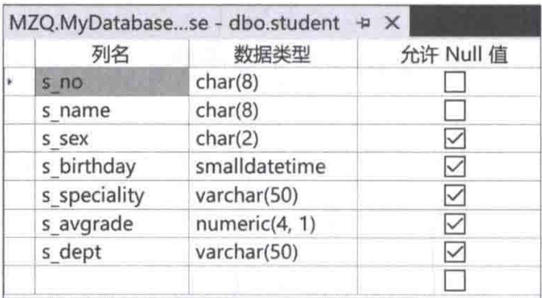
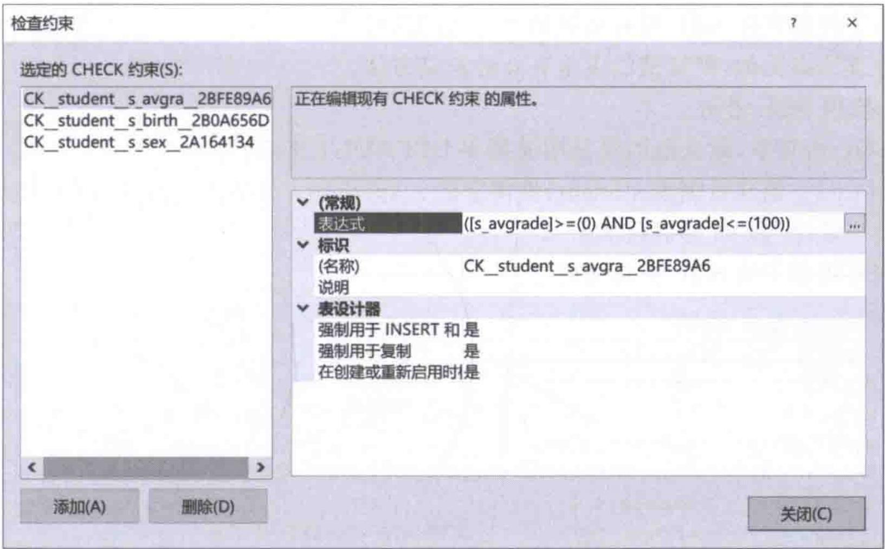
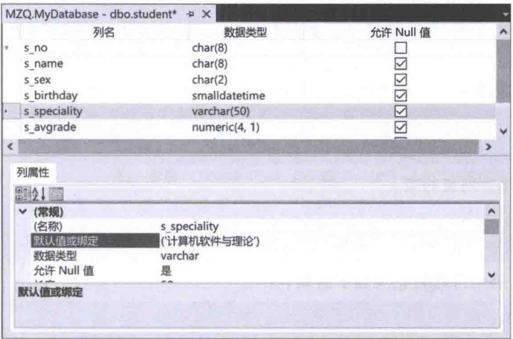
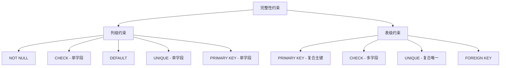

# 第11章-11.4-用户定义完整性的实现

## 基本信息
- **课程**：数据库原理与应用
- **章节**：第11章 11.4节 用户定义完整性的实现
- **日期**：2026-06-30
- **标签**：#完整性 #用户定义完整性 #域完整性 #CHECK约束 #NOT NULL #DEFAULT #UNIQUE #SQL约束

---

## 重点内容

### ⭐⭐⭐ 核心概念
- **用户定义完整性**：面向具体应用的完整性约束，由用户根据业务需求定义
- **域完整性**：通过对指定字段定义约束来实现，属于列级约束
- **表级约束**：基于一个或多个字段的约束，涉及两个以上字段时必须使用表级约束

### ⭐⭐ 约束类型
- **NOT NULL（非空约束）**：字段值不允许为空
- **CHECK（检查约束）**：通过逻辑表达式限制字段取值范围，应用灵活、使用频率高
- **DEFAULT（默认值约束）**：插入记录时若字段无值则自动填入默认值
- **UNIQUE（唯一约束）**：字段值不允许重复

### ⭐ 列级约束与表级约束的区别
- **列级约束**：定义在单个字段后面，只涉及一个字段
- **表级约束**：定义在所有字段之后，可以涉及多个字段
- 涉及两个或以上字段的约束**必须**定义为表级约束

---

## 详细笔记

### 一、域完整性的实现（11.4.1节）

> 📚 **课本出处**：第11章 11.4.1节"域完整性的实现"

域完整性大部分属于用户定义完整性，即是由用户定义的。域完整性是通过对指定的字段定义相应的约束来实现的，这种约束属于**列级约束**，常用的约束主要包括：非空（NOT NULL）约束、唯一（UNIQUE）约束、检查（CHECK）约束和默认值（DEFAULT）约束等。

---

#### 1. 非空约束（NOT NULL）

当对指定的字段创建非空约束后，该字段的输入值**不允许为空（NULL）**，否则操作被拒绝。创建方法是在字段后加上关键字 `NOT NULL`。如果不显式地声明 NOT NULL，则允许其取空值。

> 📚 **课本出处**：第11章 11.4.1节"非空约束"

**【例11.5】** 创建数据表 student，使字段 s_no 和 s_name 不能取空值，其他字段允许取空值。

```sql
CREATE TABLE student(
    s_no char(8) NOT NULL,          -- 创建非空约束
    s_name char(8) NOT NULL,        -- 创建非空约束
    s_sex char(2),
    s_birthday smalldatetime,
    s_speciality varchar(50),
    s_avgrade numeric(4,1),
    s_dept varchar(50)
);
```

- 字段 `s_birthday`、`s_speciality`、`s_avgrade` 和 `s_dept` 没有显式声明 NOT NULL，所以允许为空
- 在 SSMS 中，通过使表结构设计窗口中字段后面的"允许 Null 值"复选框处于**非选中状态**来实现等效操作

#### 📷 图11.2 在SSMS中创建表student



> 📚 **课本出处**：图11.2 展示了在SSMS中创建表时设置非空约束的效果，s_no和s_name的"允许Null值"复选框未勾选

---

#### 2. 唯一约束（UNIQUE）

唯一约束在11.2.1节中作为实体完整性的实现方法已介绍，实际上唯一约束也可以看作域完整性的实现方法。

> 📚 **课本出处**：第11章 11.4.1节"唯一约束"，详见11.2.1节

> 💡 **理解技巧**：UNIQUE约束既可以用于保证实体完整性（作为主键的替代），也可以用于保证域完整性（确保某个非主键字段的取值不重复）。

---

#### 3. 检查约束（CHECK）

检查约束的应用**比较灵活，使用频率高、范围广**，是一种非常有用的约束。定义检查约束的方法很多，常用方法包括：使用SQL语句定义、在SSMS中定义、使用规则定义等。

> 📚 **课本出处**：第11章 11.4.1节"检查约束"

##### （1）使用SQL语句定义

在SQL语言中使用 `CHECK` 子句来定义检查约束：

```sql
CHECK (logical_expression)
```

其中 `logical_expression` 为返回 TRUE 或 FALSE 的逻辑表达式，通常由一个字段或多个字段名构成，只有结果满足该表达式的操作才能被接受，否则拒绝执行。该子句一般嵌入 `CREATE TABLE` 或 `ALTER TABLE` 语句中。

**【例11.6】** 创建数据表 student，要求：性别(s_sex)取值为"男"或"女"，出生日期(s_birthday)在1980年1月1日到2010年1月1日之间，平均成绩(s_avgrade)在0~100之间。

```sql
CREATE TABLE student(
    s_no char(8) PRIMARY KEY,
    s_name char(8),
    s_sex char(2) CHECK(s_sex = '男' OR s_sex = '女'),
    s_birthday smalldatetime CHECK(s_birthday >= '1980-1-1' AND s_birthday <= '2010-1-1'),
    s_speciality varchar(50),
    s_avgrade numeric(4, 1) CHECK(s_avgrade >= 0 AND s_avgrade <= 100),
    s_dept varchar(50)
);
```

##### （2）使用SSMS定义

在 SSMS 中定义检查约束时，右击需要定义检查约束的字段所在行，在弹出菜单中选择"CHECK约束..."命令，弹出"CHECK约束"对话框。单击"添加"按钮，在"表达式"一栏设置逻辑表达式。

#### 📷 图11.3 "CHECK约束"对话框



> 📚 **课本出处**：图11.3 展示了对平均分字段定义检查约束时的设置，表达式为 `([s_avgrade]>=(0) AND [s_avgrade]<=(100))`

##### （3）使用规则定义

使用规则定义检查约束的基本思路是：先创建数据表及满足要求的规则，然后将规则绑定到相应字段上。

对于例11.6，使用规则的实现方式：

```sql
-- 创建数据表
CREATE TABLE student(
    s_no char(8),
    s_name char(8),
    s_sex char(2),
    s_birthday smalldatetime,
    s_speciality varchar(50),
    s_avgrade numeric(4,1),
    s_dept varchar(50)
);
-- 创建规则
CREATE RULE sex_range AS @s_sex = '男' OR @s_sex = '女'
CREATE RULE birthday_range AS @s_birthday >= '1970-1-1' AND @s_birthday <= '2000-1-1'
CREATE RULE avgrade_range AS @s_avgrade >= 0 AND @s_avgrade <= 100
-- 绑定规则
sp_bindrule 'sex_range', 'student.s_sex';
sp_bindrule 'birthday_range', 'student.s_birthday';
sp_bindrule 'avgrade_range', 'student.s_avgrade';
```

> ⚠️ **常见误区**：对于规则的创建和绑定语句，在执行时必须置于批处理语句中的第一条。由于有多条创建语句和绑定语句"连"在一起，因此只能**逐条执行**，而不能一次性执行所有语句。

---

#### 4. 默认值约束（DEFAULT）

当对一个字段定义了默认值约束后，如果在插入记录时该字段没有输入值，则自动被填上定义的默认值。默认值约束也有3种定义方法。

> 📚 **课本出处**：第11章 11.4.1节"默认值约束"

##### （1）使用SQL语句定义

在SQL语句中，默认值约束使用关键字 `DEFAULT` 来定义。

**【例11.7】** 创建数据表 student，使字段 s_speciality 和 s_dept 的初始值分别为"计算机软件与理论"和"计算机科学系"。

```sql
CREATE TABLE student(
    s_no char(8),
    s_name char(8),
    s_sex char(2),
    s_birthday smalldatetime,
    s_speciality varchar(50) DEFAULT '计算机软件与理论',
    s_avgrade numeric(4,1),
    s_dept varchar(50) DEFAULT '计算机科学系'
);
```

##### （2）使用SSMS定义

在 SSMS 中，选择需要定义默认值约束的字段，在窗口底部的"列属性"列表框中将"默认值或绑定"项的值设置为相应的默认值即可。

##### （3）使用规则定义

先创建表和规则，然后将规则绑定到相应字段上。

```sql
-- 创建数据表
CREATE TABLE student(
    s_no char(8),
    s_name char(8),
    s_sex char(2),
    s_birthday smalldatetime,
    s_speciality varchar(50),
    s_avgrade numeric(4,1),
    s_dept varchar(50)
);
-- 创建默认值
CREATE DEFAULT speciality_default AS '计算机软件与理论'
CREATE DEFAULT dept_default AS '计算机科学系'
-- 绑定默认值
sp_binddefault speciality_default, 'student.s_speciality';
sp_binddefault dept_default, 'student.s_dept';
```

#### 📷 图11.4 表结构设计窗口



> 📚 **课本出处**：图11.4 展示了在SSMS表结构设计窗口中设置默认值属性的效果，s_speciality的默认值为"计算机软件与理论"

---

### 二、表级约束完整性的实现（11.4.2节）

> 📚 **课本出处**：第11章 11.4.2节"表级约束完整性的实现"

表级约束是基于**一个或多个字段**的约束。列级约束也可以定义为表级约束，但如果涉及**两个或两个以上字段**的约束则**必须**定义为表级约束（而不能定义为列级约束）。

> ⭐ **核心重点**：区分列级约束和表级约束的关键在于约束是否涉及多个字段。涉及多字段的约束（如复合主键、跨字段CHECK）只能用表级约束。

**【例11.8】** 创建数据表 SC(s_no, c_name, c_grade)，其中将(s_no, c_name)定义为主键，成绩(c_grade)在0到100之间，课程(c_name)只能取值为"英语""数据库原理"或"算法设计与分析"。

##### 方法一：使用表级约束

```sql
CREATE TABLE SC(
    s_no char(8),
    c_name varchar(20),
    c_grade numeric(4,1),
    PRIMARY KEY(s_no, c_name),    -- 将(s_no, c_name)设为主键
    CHECK(c_grade >= 0 AND c_grade <= 100
        AND c_name IN('英语','数据库原理','算法设计与分析'))
);
```

##### 方法二：拆分为列级约束（部分可转换）

```sql
CREATE TABLE SC(
    s_no char(8),
    c_name varchar(20) CHECK(c_name IN('英语','数据库原理','算法设计与分析')),
    c_grade numeric(4,1) CHECK(c_grade >= 0 AND c_grade <= 100),
    PRIMARY KEY(s_no, c_name)     -- 复合主键，必须用表级约束
);
```

> 📌 **考试重点**：`PRIMARY KEY(s_no, c_name)` 涉及两个字段，所以**不能**转化为列级约束来定义。而CHECK约束如果只涉及单个字段，则可以转化为列级约束。
>
> 📚 **课本出处**：第11章 11.4.2节，例11.8



---

## 总结

### 约束类型完整对比表

| 约束类型 | 关键字 | 作用 | 级别 | 允许空值 | 示例 |
|:--------:|:------:|:-----|:----:|:--------:|:-----|
| **非空约束** | NOT NULL | 字段值不允许为空 | 列级 | 否 | `s_no char(8) NOT NULL` |
| **默认值约束** | DEFAULT | 无输入时自动填入默认值 | 列级 | 是 | `s_dept varchar(50) DEFAULT '计算机科学系'` |
| **唯一约束** | UNIQUE | 字段值不允许重复 | 列级/表级 | 是 | `s_email varchar(100) UNIQUE` |
| **检查约束** | CHECK | 通过逻辑表达式限制取值 | 列级/表级 | 是 | `CHECK(s_age >= 0 AND s_age <= 150)` |
| **主键约束** | PRIMARY KEY | 唯一标识表中的每条记录 | 列级/表级 | 否 | `s_no char(8) PRIMARY KEY` |
| **外键约束** | FOREIGN KEY | 建立表间关联关系 | 表级 | 是 | `FOREIGN KEY(s_dept) REFERENCES dept(d_no)` |

### 三种定义方式对比

| 定义方式 | 适用约束 | 特点 |
|:--------:|:--------:|:-----|
| **SQL语句** | 所有约束 | 直接写在CREATE TABLE或ALTER TABLE中，最常用 |
| **SSMS图形界面** | 所有约束 | 通过对话框操作，直观但不易记录 |
| **规则+绑定** | CHECK、DEFAULT | 先创建规则/默认值对象，再用sp_bindrule/sp_binddefault绑定，需逐条执行 |

### 关键要点

1. **域完整性** = 列级约束，针对单个字段定义
2. **表级约束**可替代列级约束，但涉及多字段的约束**必须**用表级约束
3. **NOT NULL** 与 **DEFAULT** 的区别：NOT NULL禁止空值插入，DEFAULT在无值时自动填充
4. **CHECK约束**最灵活，可对单字段或多字段设置逻辑表达式
5. 使用**规则**方式定义约束时，语句必须**逐条执行**，不能一次性执行

---

## 疑问与思考

### ❓ 待解决问题
1. NOT NULL约束和DEFAULT约束在实际使用中如何配合？一个字段能同时设置NOT NULL和DEFAULT吗？（答案：可以，此时如果插入时不提供值则使用默认值，如果显式插入NULL则被拒绝）
2. CHECK约束和触发器都能做数据完整性检查，实际项目中如何选择？CHECK约束更简洁但功能有限，触发器更灵活但开销更大
3. UNIQUE约束允许空值（多个空值），而PRIMARY KEY不允许空值——这个区别在实际应用中有什么影响？
4. 域完整性和实体完整性的本质区别是什么？域完整性约束字段的取值范围，实体完整性通过主键保证元组的唯一标识
5. 当表级CHECK约束涉及多个字段时（如例11.8），能否拆成多个列级CHECK？有些可以（如独立条件），有些不行（如字段间有逻辑关系时）

### 💡 个人理解/技巧
- **NOT NULL vs DEFAULT**：NOT NULL是"拒绝空值"，DEFAULT是"自动补值"。二者解决不同问题但经常配合使用——设置DEFAULT后通常也需要NOT NULL，否则默认值实际上没有意义（空值也能插入）
- **CHECK约束 vs 触发器**：CHECK约束是声明式的、轻量级的，适合简单的范围检查；触发器是过程式的、重量级的，适合复杂的跨表校验
- **UNIQUE vs PRIMARY KEY**：每个表只能有一个PRIMARY KEY但可以有多个UNIQUE；PRIMARY KEY不允许NULL而UNIQUE允许；如果某个字段"逻辑上唯一但可能缺失"就用UNIQUE
- **列级约束 vs 表级约束**：记忆技巧——"单列用列级，多列必须表级"。列级约束写在字段定义后面，表级约束写在所有字段定义之后
- 使用SQL语句定义约束时，建议给约束命名（如 `CONSTRAINT ck_sex CHECK(...)`），便于后续维护和错误定位

---

## 相关链接

### 本节相关图片
- [图11.2 在SSMS中创建表student](../../../images/483160da6c6dcaa9a559814eb8f6f7c84d6c65c02e30967ac19f27fa97bda520.jpg)
- [图11.3 "CHECK约束"对话框](../../../images/c9f5e3e477d9f32ad7b4bf8c49ebe5cc394a746fbb63eacb0c0f0d663c154a65.jpg)
- [图11.4 表结构设计窗口](../../../images/b89a04e01cb5ca8b751bf9ec3076f89b4974daa733983ffff4deb7281700ba92.jpg)

### 关联章节
- 第11章-数据的完整性管理（待创建）
- 第11章-11.1-数据完整性的概念（待创建）
- 第11章-11.2-实体完整性的实现（待创建）
- 第11章-11.3-参照完整性的实现（待创建）
- 第11章-11.5-其他完整性机制（待创建）
- [第2章-2.1-关系模型](../../第2章-关系数据库理论基础/第2章-2.1-关系模型.md) — 2.1.3节"关系的完整性约束"
- [第4章-SQL的数据定义功能](../../第4章-数据库查询语言SQL/) — 4.3.1节"数据表的创建和删除"

---

## 检查清单

- [x] 已理解域完整性的4种约束（NOT NULL、UNIQUE、CHECK、DEFAULT）
- [x] 已掌握每种约束的SQL定义方法
- [x] 已理解列级约束与表级约束的区别
- [x] 已插入课本原图（图11.2、图11.3、图11.4）
- [x] 已记录所有课本SQL代码示例（例11.5、11.6、11.7、11.8）
- [x] 已添加课本出处标注
- [x] 已包含疑问与思考

---

*笔记创建时间：2026-06-30*
