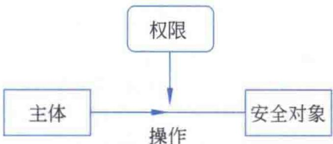
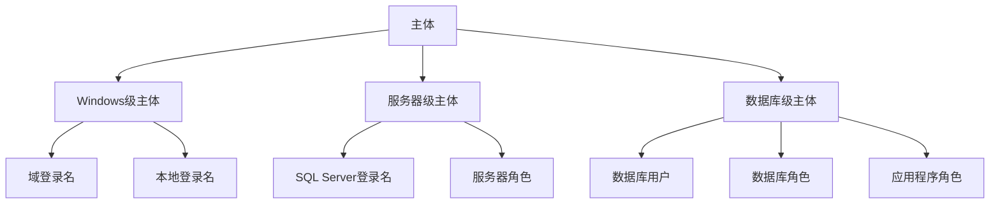

# 第12章-12.1-安全体系结构

## 基本信息
- **课程**：数据库原理与应用
- **章节**：第12章 12.1节 SQL Server安全体系结构
- **日期**：2026-06-30
- **标签**：#安全体系结构 #主体 #安全对象 #权限 #GRANT #REVOKE #DENY

---

## 重点内容

### ⭐⭐⭐ 核心概念
- **安全体系结构三要素**：主体、权限、安全对象，三者构成SQL Server安全模型
- **主体（Principal）**：请求SQL Server资源的实体，拥有唯一SID
- **安全对象（Securable）**：SQL Server授权系统控制对其进行访问的资源
- **权限（Permission）**：用户对特定数据库对象拥有的操作权力

### ⭐⭐ 重要概念
- **三层主体**：Windows级主体、服务器级主体、数据库级主体
- **三层安全对象**：服务器级、数据库级、架构级安全对象
- **权限管理三操作**：GRANT（授予）、REVOKE（收回）、DENY（拒绝）

### ⭐ 关键要点
- 主体必须获得权限才能对安全对象执行操作，否则SQL Server将禁止操作
- 服务器级安全对象的操作权限只能赋给服务器级主体
- 角色是简化权限管理的重要手段，类似于Windows中的"组"

---

## 详细笔记

### 一、安全体系结构概述

SQL Server的安全体系结构由三部分组成：**主体**、**权限**和**安全对象**。要对安全对象执行某操作，主体必须获得对该对象的操作权限，否则SQL Server将禁止这种操作。

> 📚 **课本出处**：第12章 12.1节"SQL Server安全体系结构"

#### 📷 图12.1 主体、权限和安全对象之间的关系

> 📚 **课本出处**：图12.1 展示了主体、权限和安全对象三者之间的关系，主体通过权限作用于安全对象

---

### 二、主体（12.1.1）

主体是可以请求SQL Server资源的实体，实际上是拥有一定权限的特定的数据库对象。每个主体都具有一个**唯一的安全标识符（SID）**。

> 📚 **课本出处**：第12章 12.1.1节"主体"

按影响范围的不同，主体可以分为三类：

#### 1. Windows级主体

Windows级主体包括**Windows域登录名**和**Windows本地登录名**。此类主体只限于服务器级操作，不能将其他安全对象的操作权限授予给此类主体。在Windows认证模式下使用的就是这种Windows级主体。

#### 2. 服务器级主体

服务器级主体包括**SQL Server登录名**以及**服务器角色**。

**SQL Server sa登录名**是具有最大权限的服务器级主体：
- 默认在安装实例时创建
- SQL Server 2017中，sa的默认数据库为master
- 利用sa登录名可以创建其他的SQL Server登录名

**服务器角色**是一组服务器级操作权限的集合：
- 作用域为服务器范围
- "固定"在SQL Server中，用户不能创建或删除（又称"固定服务器角色"）

> 💡 **理解技巧**：角色是若干种权限的集合，类似于Windows操作系统中的"组"。将角色赋给某主体时，该主体即享有该角色包含的所有权限，从而简化权限管理。

##### 服务器级角色及其操作权限

| 服务器角色 | 权限 | 说明 |
|:----------:|:-----|:-----|
| sysadmin | CONTROL SERVER | 可在服务器上执行任何活动，Windows BUILTIN\Administrators组自动成为成员 |
| serveradmin | ALTER SETTINGS、SHUTDOWN、VIEW SERVER STATE等 | 可更改服务器范围配置选项和关闭服务器 |
| securityadmin | ALTER ANY LOGIN | 可管理登录名及其属性，可GRANT/DENY/REVOKE权限，可重置密码 |
| processadmin | ALTER ANY CONNECTION、ALTER SERVER STATE | 可终止SQL Server实例中运行的进程 |
| setupadmin | ALTER ANY LINKED SERVER | 可添加和删除链接服务器 |
| bulkadmin | ADMINISTER BULK OPERATIONS | 可运行BULK INSERT语句 |
| diskadmin | ALTER RESOURCES | 可管理磁盘文件 |
| dbcreator | CREATE DATABASE | 可创建、更改、删除和还原任何数据库 |
| public | -- | 每个SQL Server登录名都属于public角色，拥有查看任何数据库的权限 |

> 📌 **考试重点**：public既是服务器角色也是数据库角色，所有登录名自动成为public的成员。若未向主体授予或拒绝特定权限，该用户将继续拥有public角色的权限。

#### 3. 数据库级主体

数据库级主体包括**数据库用户**、**数据库角色**和**应用程序角色**。

- 创建数据库时，默认创建一个名为**guest**的数据库用户
- 每个数据库用户都自动成为**public**数据库角色的成员
- 数据库角色分为**固定数据库角色**和**用户自定义角色**

##### 固定数据库角色及其权限

| 数据库角色 | 权限 | 说明 |
|:----------:|:-----|:-----|
| db_owner | CONTROL（使用GRANT选项授予） | 可执行数据库的所有配置和维护活动，还可删除数据库 |
| db_securityadmin | ALTER ANY ROLE、CREATE SCHEMA、VIEW DEFINITION | 可修改角色成员身份和管理权限 |
| db_accessadmin | ALTER ANY USER、CREATE SCHEMA | 可为Windows登录名等添加或删除数据库访问权限 |
| db_backupoperator | BACKUP DATABASE、BACKUP LOG、CHECKPOINT | 可备份数据库 |
| db_ddladmin | （多种DDL权限） | 可在数据库中运行任何DDL命令 |
| db_datawriter | DELETE、INSERT、UPDATE | 可在所有用户表中添加、删除或更改数据 |
| db_datareader | SELECT | 可从所有用户表中读取所有数据 |
| db_denydatawriter | 拒绝DELETE、INSERT、UPDATE | 不能添加、修改或删除用户表中的数据 |
| db_denydatareader | 拒绝SELECT | 不能读取用户表中的任何数据 |

> ⚠️ **常见误区**：固定数据库角色一共是9种，不是10种。db_ddladmin包含的权限非常多，涵盖了大量的ALTER和CREATE权限。

---

### 三、安全对象（12.1.2）

安全对象是SQL Server数据库引擎授权系统控制对其进行访问的资源。狭义上，数据库中能够访问的数据库对象（如表、视图、存储过程等）都是安全对象。

> 📚 **课本出处**：第12章 12.1.2节"安全对象"

按照作用范围分类，安全对象可以分为三级：

#### 1. 服务器级安全对象

- 作用范围为服务器
- 包括：**端点**、**登录用户**和**数据库**
- 操作权限只能赋给服务器级主体（如SQL Server登录用户），不能赋给数据库级主体

#### 2. 数据库级安全对象

- 作用范围为数据库
- 包括：用户、角色、应用程序角色、程序集、消息类型、路由、服务、远程服务绑定、全文目录、证书、非对称密钥、对称密钥、约定、架构等
- 操作权限可以赋给数据库级主体

#### 3. 架构级安全对象

- 作用范围为架构
- 架构是自SQL Server 2008开始提供的对象管理机制，是形成单个命名空间的数据库对象的集合
- 包括：数据类型、XML架构集合和对象类（聚合、约束、函数、过程、队列、统计信息、同义词、表、视图等）

> 💡 **理解技巧**：安全对象的三级分类与主体的三层结构一一对应——服务器级主体管理服务器级安全对象，数据库级主体管理数据库级和架构级安全对象。

---

### 四、权限（12.1.3）

权限是指用户对特定数据库对象拥有的操作权力。SQL Server通过授予主体的权限或收回已授予的权限来控制主体对安全对象的操作，从而避免越权非法操作，保证数据库的安全性。

> 📚 **课本出处**：第12章 12.1.3节"权限"

主要权限类别及其适用的安全对象：

| 权限 | 适用对象 |
|:----:|:---------|
| SELECT | 同义词、表和列、表值函数和列、视图和列 |
| UPDATE | 同义词、表和列、视图和列 |
| INSERT | 同义词、表和列、视图和列 |
| DELETE | 同义词、表和列、视图和列 |
| EXECUTE | 过程、标量函数和聚合函数、同义词 |
| REFERENCES | 标量/聚合函数、Service Broker队列、表和列、表值函数和列、视图和列 |
| ALTER | 过程、标量/聚合函数、Service Broker队列、表、表值函数、视图 |
| CONTROL | 过程、标量/聚合函数、Service Broker队列、同义词、表、表值函数、视图 |
| VIEW DEFINITION | 过程、Service Broker队列、标量/聚合函数、同义词、表、表值函数、视图 |
| VIEW CHANGE TRACKING | 表、架构 |
| TAKE OWNERSHIP | 过程、标量/聚合函数、同义词、表、表值函数、视图 |
| RECEIVE | Service Broker队列 |

权限管理通过三种SQL语句实现：
- **GRANT**：授予主体对安全对象的权限
- **REVOKE**：收回已授予主体的权限
- **DENY**：明确拒绝主体对安全对象的权限

> 📌 **考试重点**：GRANT/REVOKE/DENY是安全性控制的核心操作语句，DENY的优先级最高——即使通过角色获得了权限，DENY也会阻止该权限的行使。

---

## 疑问与思考

### ❓ 疑问与解答

1. **为什么主体要分为三个级别？不同级别的主体之间有什么本质区别？**

   💡 主体分为Windows级、服务器级和数据库级，是按**作用域从大到小**划分的。Windows级主体（域/本地登录名）只用于身份认证，本身不直接管理数据库资源；服务器级主体（SQL Server登录名、服务器角色）作用于整个SQL Server实例，可以管理所有数据库；数据库级主体（数据库用户、数据库角色）只作用于特定数据库。分层的原因是**权限最小化原则**——不同层级的管理需求不同，分层可以精确控制谁能在哪个范围内操作，避免不必要的权限暴露。例如，只负责某数据库开发的人员只需数据库级主体即可，不需要服务器级权限。

2. **GRANT、REVOKE和DENY三者有什么区别？DENY的优先级最高具体体现在什么场景？**

   💡 GRANT是授予权限，REVOKE是收回之前授予或拒绝的权限（恢复到"未设置"状态），DENY是明确拒绝权限。三者优先级：**DENY > GRANT > REVOKE**。实际场景：如果用户A属于角色X（被GRANT了SELECT权限）同时又属于角色Y（被DENY了SELECT权限），那么用户A最终**不能**执行SELECT操作，因为DENY优先级最高。REVOKE的作用不是"拒绝"，而是"清除之前的设置"——如果之前GRANT了某权限，REVOKE后该权限变为未设置状态（不是被拒绝，而是取决于其他角色的授权情况）。

3. **安全对象的三级划分（服务器级、数据库级、架构级）有什么实际意义？**

   💡 三级安全对象对应SQL Server的三层逻辑结构：服务器实例包含多个数据库，每个数据库包含多个架构，架构内包含具体的表、视图等对象。分层管理的实际意义在于**权限可以按层级精确分配**——例如，CREATE DATABASE是服务器级安全对象的权限，只能赋给服务器级主体；而对某张表的SELECT权限是架构级安全对象的权限，可以赋给数据库级主体。如果不分层，权限管理将变得混乱，无法实现"某用户只能操作特定数据库的特定表"这种细粒度控制。

4. **public角色的权限在生产环境中应如何控制？它会不会成为安全隐患？**

   💡 public角色是所有登录名/用户自动归属的默认角色，无法删除其成员。在生产环境中，应遵循**最小权限原则**，不向public角色授予任何额外权限（仅保留默认的查看权限即可）。如果向public授予了过多权限，意味着**任何**登录该服务器的用户都能获得这些权限，即使是临时账号或被错误创建的账号。安全隐患的典型例子：误将某张表的SELECT权限授予public，导致所有用户都能读取敏感数据。建议定期审计public角色的权限分配情况。

### 💡 个人理解/技巧
- 安全体系结构可以用"主体->权限->安全对象"三元组来记忆，就像"用户->通行证->场所"的关系
- 服务器级主体和数据库级主体的最大区别在于作用域：服务器级作用于整个SQL Server实例，数据库级只作用于特定数据库
- 三级安全对象的层次关系：服务器 > 数据库 > 架构 > 表/视图/存储过程等
- 8个固定服务器角色可以按功能分类记忆：系统管理(sysadmin)、配置管理(serveradmin)、安全管理(securityadmin)、进程管理(processadmin)、链接管理(setupadmin)、批量操作(bulkadmin)、磁盘管理(diskadmin)、数据库管理(dbcreator)、公共(public)

---

## 总结

### 主体/安全对象/权限三层关系

| 层级 | 主体 | 安全对象 | 权限示例 |
|:----:|:-----|:---------|:---------|
| 服务器级 | SQL Server登录名、服务器角色、Windows级登录名 | 端点、登录用户、数据库 | CONTROL SERVER、CREATE DATABASE |
| 数据库级 | 数据库用户、数据库角色、应用程序角色 | 用户、角色、架构、程序集等 | SELECT、INSERT、UPDATE、DELETE |
| 架构级 | 数据库用户、数据库角色 | 数据类型、表、视图、函数、存储过程等 | SELECT、EXECUTE、ALTER |

### 权限管理三操作

| 操作 | 效果 | 优先级 |
|:----:|:-----|:------:|
| GRANT | 授予权限 | 低 |
| REVOKE | 收回已授予的权限 | 中 |
| DENY | 明确拒绝权限 | 高 |

### 关键要点

1. SQL Server安全体系结构由**主体、权限、安全对象**三部分组成
2. 主体按影响范围分为**Windows级、服务器级、数据库级**三层
3. 安全对象按作用范围分为**服务器级、数据库级、架构级**三层
4. 服务器级安全对象的权限只能赋给服务器级主体，不能跨级
5. 权限管理通过**GRANT、REVOKE、DENY**三种操作实现，DENY优先级最高
6. **public**角色是所有主体自动加入的默认角色

---

## 相关链接

### 本节相关图片
- [图12.1 主体、权限和安全对象之间的关系](../../../images/ae146a463463b8376e8e79c9b525538e0a65af6d37b91debaa9893a84aa144a6.jpg)

### 关联章节
- [第12章-数据的安全性控制](./第12章-数据的安全性控制.md)
- [第12章-12.2-角色](./第12章-12.2-角色.md)

### 课本对应
- 第12章 12.1节 "SQL Server安全体系结构"
- 第12章 12.1.1节 "主体"
- 第12章 12.1.2节 "安全对象"
- 第12章 12.1.3节 "权限"

---

## 检查清单

- [x] 已理解安全体系结构三要素及其关系
- [x] 已掌握三类主体的区别和作用域
- [x] 已掌握三级安全对象的分类
- [x] 已掌握GRANT/REVOKE/DENY三种权限操作
- [x] 已插入课本原图（图12.1）
- [x] 已添加课本出处标注

---

*笔记创建时间：2026-06-30*
