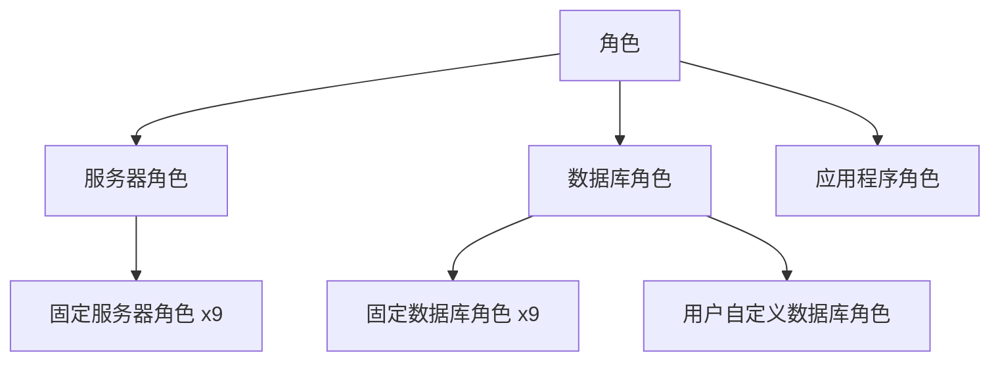
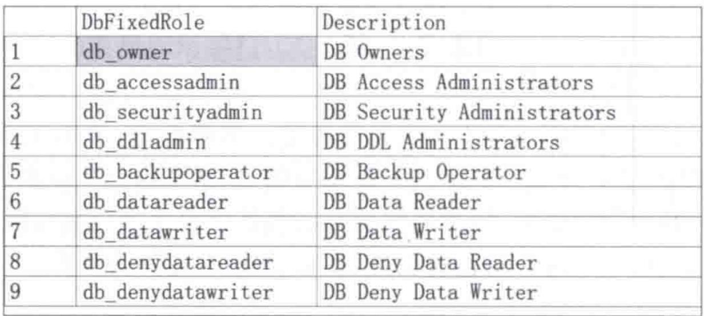

# 第12章-12.2-角色

## 基本信息
- **课程**：数据库原理与应用
- **章节**：第12章 12.2节 角色
- **日期**：2026-06-30
- **标签**：#角色 #服务器角色 #数据库角色 #应用程序角色 #权限管理

---

## 重点内容

### ⭐⭐⭐ 核心概念
- **角色的本质**：相关操作权限的集合，简化权限管理
- **服务器角色**：9种固定服务器角色，用户不能创建或删除
- **数据库角色**：9种固定数据库角色 + 用户自定义数据库角色

### ⭐⭐ 重要概念
- **固定角色**：由SQL Server预定义，不可修改
- **自定义数据库角色**：用户根据需要通过CREATE ROLE创建
- **应用程序角色**：为应用程序分配权限，不包含成员，需密码激活

### ⭐ 关键区别
- 服务器角色作用于服务器级，数据库角色作用于数据库级
- 固定角色不可修改，自定义角色可创建/删除
- 应用程序角色无成员，激活后权限在连接期间有效

---

## 详细笔记

### 一、角色概述

角色是数据安全控制中一个十分重要的概念。简单而言，角色是相关操作权限的集合。根据作用对象的不同，角色可以分为**服务器角色**、**数据库角色**和**应用程序角色**。

> 📚 **课本出处**：第12章 12.2节"角色"

当将一个主体添加到一个角色中，该主体则拥有该角色所包含的全部权限，从而达到**简化权限管理**之目的。角色类似于Microsoft Windows操作系统中的"组"。



---

### 二、服务器角色（12.2.1）

服务器角色是执行服务器级管理的若干权限的集合。将有关服务器级主体添加到服务器角色中，这些主体就拥有了该服务器角色所包含的所有权限。

> 📚 **课本出处**：第12章 12.2.1节"服务器角色"

**固定服务器角色**的特点：
- 已被SQL Server"固化"，用户不能添加、删除或修改
- 一共**9种**：sysadmin、serveradmin、securityadmin、processadmin、setupadmin、bulkadmin、diskadmin、dbcreator、public

各角色权限详细说明：

| 服务器角色 | 中文名称 | 核心权限 |
|:----------:|:--------:|:---------|
| sysadmin | 系统管理员 | 最大最多权限，可完成任何服务器级操作 |
| serveradmin | 服务器管理员 | 对服务器进行设置和关闭的权限 |
| securityadmin | 安全管理员 | 管理登录名及其属性，授予/拒绝/撤销权限，重置密码 |
| processadmin | 进程管理员 | 终止SQL Server实例中运行的进程 |
| setupadmin | 设置管理员 | 添加和删除链接服务器 |
| bulkadmin | 批量操作管理员 | 执行BULK INSERT语句 |
| diskadmin | 磁盘管理员 | 管理磁盘文件 |
| dbcreator | 数据库创建管理员 | 创建、更改、删除和还原任何数据库 |
| public | 公共角色 | 查看任何数据库 |

> 📌 **考试重点**：sysadmin是权限最大的服务器角色，Windows BUILTIN\Administrators组（本地管理员组）的所有成员自动成为sysadmin的成员。

---

### 三、数据库角色（12.2.2）

数据库角色是数据库级的相关操作权限的集合。数据库角色分为两类：

> 📚 **课本出处**：第12章 12.2.2节"数据库角色"

#### 1. 固定数据库角色

数据库创建后自动产生，用户不能更改或删除。可用系统存储过程`sp_helpdbfixedrole`查看，一共**9种**。

#### 📷 图12.2 固定数据库角色及其说明



> 📚 **课本出处**：图12.2 展示了固定数据库角色及其说明

| 数据库角色 | 核心权限 | 说明 |
|:----------:|:---------|:-----|
| db_owner | CONTROL（GRANT选项授予） | 可执行所有配置和维护活动，还可删除数据库 |
| db_securityadmin | ALTER ANY ROLE、CREATE SCHEMA | 可修改角色成员身份和管理权限 |
| db_accessadmin | ALTER ANY USER、CREATE SCHEMA | 可添加或删除数据库访问权限 |
| db_backupoperator | BACKUP DATABASE、BACKUP LOG、CHECKPOINT | 可备份数据库 |
| db_ddladmin | 多种DDL权限 | 可运行任何DDL命令 |
| db_datawriter | DELETE、INSERT、UPDATE | 可在所有用户表中增删改数据 |
| db_datareader | SELECT | 可从所有用户表读取所有数据 |
| db_denydatawriter | 拒绝DELETE、INSERT、UPDATE | 不能增删改用户表数据 |
| db_denydatareader | 拒绝SELECT | 不能读取用户表数据 |

> ⚠️ **常见误区**：db_denydatawriter和db_denydatareader是"拒绝"权限的角色，加入这些角色意味着**被限制**相应的操作，而不是获得权限。

#### 2. 用户自定义数据库角色

用户根据实际需要创建的数据库角色，用`CREATE ROLE`语句完成。

**语法格式**：

```sql
CREATE ROLE role_name [AUTHORIZATION owner_name]
```

- `role_name`：待创建角色的名称
- `owner_name`：将拥有新角色的数据库用户或角色的名称，未指定则为当前用户

【例12.1】创建自定义数据库角色

```sql
USE MyDatabase;
CREATE ROLE MyRole1 AUTHORIZATION user1
```

> 📚 **课本出处**：第12章 12.2.2节【例12.1】

此代码创建了自定义数据库角色MyRole1，该角色为数据库MyDatabase的用户user1所拥有。省略AUTHORIZATION子句，则MyRole1为当前数据库用户所拥有。

**新创建的角色是"空的"**，需要利用GRANT等语句对空角色"填充"权限。

**删除自定义数据库角色**：

```sql
DROP ROLE role_name
```

【例12.2】删除自定义数据库角色

```sql
DROP ROLE MyRole2;
```

> 📚 **课本出处**：第12章 12.2.2节【例12.2】

**删除限制**：
- 无法删除拥有安全对象的角色，须先转移所有权或删除对象
- 无法删除拥有成员的角色，须先删除角色的成员
- **不能使用DROP ROLE删除固定数据库角色**

---

### 四、应用程序角色（12.2.3）

应用程序角色是用于给应用程序（而不是数据库角色或用户）分配权限的一种数据库级角色。

> 📚 **课本出处**：第12章 12.2.3节"应用程序角色"

**应用程序角色的特点**：

| 特点 | 说明 |
|:-----|:-----|
| 不包含成员 | 这与数据库角色不同 |
| 需密码激活 | 通过sp_setapprole提供角色名称和密码来激活 |
| 密码在客户端存储 | 密码必须存储在客户端计算机上，在运行时提供 |
| 激活方式特殊 | 应用程序角色无法从SQL Server内部激活，需客户端应用程序调用 |
| 密码不加密 | 从SQL Server 2005开始，密码以单向哈希存储 |
| 权限仅连接期间有效 | 一旦激活，权限在连接期间保持有效 |
| 继承public权限 | 应用程序角色继承授予public角色的权限 |
| 可切换上下文 | sysadmin成员激活应用程序角色后，安全上下文切换为应用程序角色上下文 |

> 💡 **理解技巧**：应用程序角色就像一个"应用专用通行证"——只有特定应用程序提供密码才能激活，激活后该应用程序就拥有该角色的所有权限，但只在当前连接有效，断开后权限自动失效。

---

## 疑问与思考

### ❓ 疑问与解答

1. **服务器角色和数据库角色在权限管理上最重要的区别是什么？为什么需要分两层？**

   💡 最核心的区别在于**作用域**：服务器角色的权限作用于整个SQL Server实例（如创建数据库、管理登录名、关闭服务器），而数据库角色的权限只作用于特定数据库内部（如对某库的表进行增删改查）。分两层的原因是**职责分离**——负责服务器运维的管理员（如安装实例、配置端口）和负责数据库开发的人员（如设计表结构、编写查询）通常不是同一批人。如果不分层，数据库开发人员可能会意外获得服务器级权限（如关闭整个SQL Server实例），造成严重安全风险。

2. **固定角色的权限为什么不让用户自行修改？自定义角色在什么场景下更实用？**

   💡 固定角色（包括9种固定服务器角色和9种固定数据库角色）是SQL Server出厂预设的**标准管理角色**，其权限经过精心设计以覆盖常见管理场景。不让用户修改是为了**保证系统稳定性**和**安全基线**——如果允许修改sysadmin的权限，可能导致系统管理员失去关键能力。自定义角色的实用场景是**细粒度权限控制**：例如，公司有"财务部门只读"、"财务部门可编辑"两种需求，固定角色中没有恰好匹配的，此时可以创建自定义角色，用GRANT精确授予所需的权限组合。固定角色是"通用套餐"，自定义角色是"私人定制"。

3. **应用程序角色的密码以单向哈希存储，如何验证密码？这种方式安全吗？**

   💡 验证过程是**比对哈希值**：客户端调用`sp_setapprole`提供角色名和明文密码，SQL Server对该密码做同样的哈希运算，然后与数据库中存储的哈希值比较——一致则激活，不一致则拒绝。安全性方面，单向哈希意味着即使数据库文件被泄露，攻击者也无法从哈希值反推出原始密码。但需要注意：密码在客户端是明文存储和传输的，因此**客户端的安全性**成为关键环节。此外，SQL Server 2005之后的哈希算法比早期版本更安全。总体而言，这是一种合理的安全机制，但不是万无一失的——需要配合客户端安全措施一起使用。

4. **为什么应用程序角色不能包含成员？如果多个用户需要共享同一应用权限，应该怎么设计？**

   💡 应用程序角色不包含成员，是因为它的设计初衷不是给人用的，而是**给应用程序用的**。它的激活方式是"提供密码"而非"属于某个用户"，所以不存在"成员"的概念。多个用户共享同一应用权限的典型设计是：所有用户通过同一个应用程序访问数据库，应用程序在连接时调用`sp_setapprole`激活应用程序角色，此时整个连接的安全上下文切换为应用程序角色的身份。例如，一个Web应用的所有用户通过应用程序角色以统一身份查询数据库，不需要为每个终端用户单独授权数据库权限。

### 💡 个人理解/技巧
- **服务器角色vs数据库角色的核心区别**在于作用域：服务器角色影响整个SQL Server实例（如创建数据库、管理登录名），数据库角色只影响特定数据库（如对某库的表进行增删改查）
- **固定角色vs自定义角色的本质区别**：固定角色是"出厂预设"，权限已经确定不能改变；自定义角色是"用户定制"，可以根据业务需求灵活分配权限。固定角色适合常见管理场景，自定义角色适合细粒度的权限控制
- 应用程序角色的使用场景可以理解为：当你的应用程序需要以一个统一的身份访问数据库时，不用为每个数据库用户单独授权，而是通过应用程序角色统一管理
- 9种固定服务器角色可以简化记忆为"管系统、管配置、管安全、管进程、管链接、管批量、管磁盘、管库、公共"
- 固定数据库角色中，deny类角色（db_denydatawriter、db_denydatareader）的名称中包含"deny"，一看就知道是"拒绝"权限，避免与grant类角色混淆

---

## 总结

### 三种角色对比表

| 对比项 | 服务器角色 | 数据库角色 | 应用程序角色 |
|:------:|:---------:|:---------:|:----------:|
| **作用域** | 服务器级 | 数据库级 | 数据库级 |
| **角色数量** | 9种（全部固定） | 9种固定 + 自定义 | 仅自定义 |
| **是否可创建** | 否（固定） | 可创建自定义 | 可创建 |
| **是否可删除** | 否（固定） | 自定义可删除 | 可删除 |
| **是否包含成员** | 是 | 是 | 否 |
| **激活方式** | 成员自动获得权限 | 成员自动获得权限 | 需密码激活 |
| **权限持续时间** | 永久（成员期间） | 永久（成员期间） | 仅连接期间 |
| **典型角色** | sysadmin、serveradmin等 | db_owner、db_datareader等 | 用户自定义 |

### 固定角色 vs 自定义角色

| 对比项 | 固定角色 | 自定义角色 |
|:------:|:--------:|:--------:|
| **创建方式** | SQL Server预定义 | 用户通过CREATE ROLE创建 |
| **可否修改** | 否 | 可通过GRANT/DENY/REVOKE修改权限 |
| **可否删除** | 否 | 可通过DROP ROLE删除 |
| **权限范围** | 预定义的固定权限 | 由用户完全自定义 |
| **使用场景** | 常见管理场景 | 特定业务需求 |

### 关键要点

1. **角色 = 权限集合**，用于简化权限管理
2. 服务器角色**9种固定**，不可创建/删除/修改
3. 数据库角色包括**9种固定** + **用户自定义**
4. 自定义数据库角色用`CREATE ROLE`创建，用`DROP ROLE`删除
5. 新创建的角色是**空的**，需用GRANT填充权限
6. 应用程序角色**无成员**，需密码激活，权限仅连接期间有效
7. 固定数据库角色不能用DROP ROLE删除
8. 删除角色前须先移除其成员和拥有的安全对象

---

## 相关链接

### 本节相关图片
- [图12.2 固定数据库角色及其说明](../../../images/46452c7ff43b771b9df43da984fada52548e62ffa0de11548e79e2b9f809e23d.jpg)

### 关联章节
- [第12章-数据的安全性控制](./第12章-数据的安全性控制.md)
- [第12章-12.1-安全体系结构](./第12章-12.1-安全体系结构.md)

### 课本对应
- 第12章 12.2节 "角色"
- 第12章 12.2.1节 "服务器角色"
- 第12章 12.2.2节 "数据库角色"
- 第12章 12.2.3节 "应用程序角色"

---

## 检查清单

- [x] 已理解角色的本质和分类
- [x] 已掌握9种固定服务器角色及其权限
- [x] 已掌握9种固定数据库角色及其权限
- [x] 已理解用户自定义数据库角色的创建和删除
- [x] 已理解应用程序角色的特点和激活方式
- [x] 已插入课本原图（图12.2）
- [x] 已添加课本出处标注

---

*笔记创建时间：2026-06-30*
