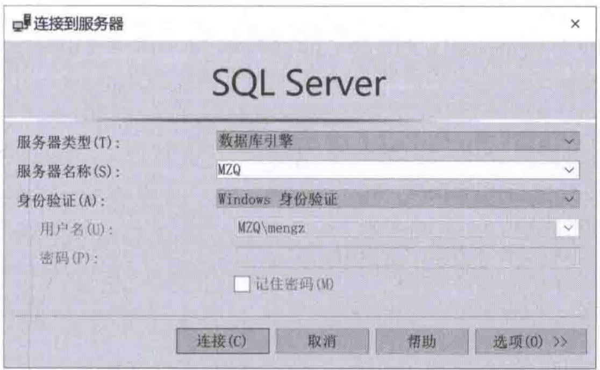
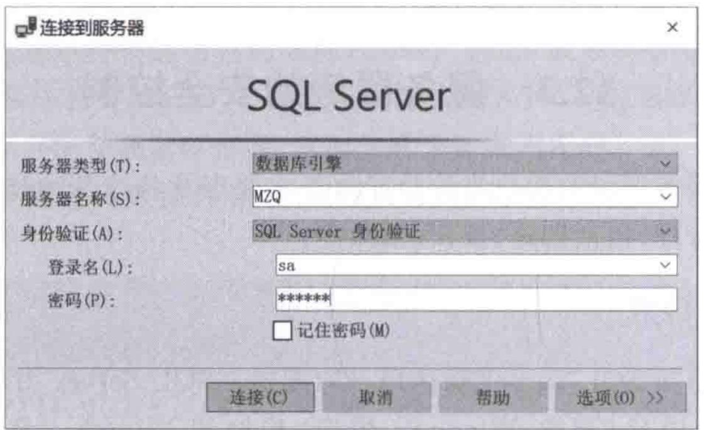

# 第12章-12.3-服务器级安全控制

## 基本信息
- **课程**：数据库原理与应用
- **章节**：第12章 12.3节 服务器级的安全控制
- **日期**：2026-06-30
- **标签**：#安全性 #服务器安全 #登录管理 #身份验证 #GRANT #REVOKE #DENY #SQLServer

---

## 重点内容

### ⭐⭐⭐ 核心概念
- **身份验证模式**：Windows身份验证模式 vs 混合模式（Windows + SQL Server验证）
- **登录管理**：CREATE LOGIN / DROP LOGIN 的完整语法和使用
- **权限管理三剑客**：GRANT（授权）、REVOKE（收回）、DENY（拒绝）的区别与用法

### ⭐⭐ 关键语法
- `CREATE LOGIN` 创建SQL Server登录和Windows登录
- `sys.server_principals` 查看所有登录信息
- `GRANT/REVOKE/DENY` 对登录进行服务器级权限管理
- `sp_addsrvrolemember / sp_dropsrvrolemember` 管理服务器角色成员

### ⭐ 重要区分
- **登录（Login）vs 用户（User）**：登录用于连接服务器，用户用于访问数据库
- **GRANT vs REVOKE vs DENY**：DENY优先级最高，可覆盖角色继承的权限

---

## 详细笔记

### 一、身份验证模式（12.3.1）

身份验证模式是指SQL Server确认用户的方式。SQL Server用户有两种来源：
- **Windows用户**：账号和密码由Windows操作系统建立、维护和管理
- **SQL Server用户**：账号和密码由SQL Server服务器创建、维护和管理，与Windows无关

> 📚 **课本出处**：第12章 12.3.1节"身份验证模式"

#### 1. Windows身份验证模式

在这种认证模式下，SQL Server允许Windows用户连接到SQL Server服务器。用户只要能够登录Windows，再登录SQL Server时就不需要进行身份认证了。

**工作原理**：
- 用户先登录Windows系统
- SQL Server服务器请求Windows操作系统对登录用户的账号和密码进行验证
- Windows系统中保存了登录用户的所有信息，通过对比即可确认身份

#### 📷 图12.3 Windows身份验证模式登录界面



> 📚 **课本出处**：图12.3 展示了Windows身份验证模式的登录界面

#### 2. 混合模式（SQL Server验证模式）

在这种验证模式下，用户登录SQL Server时必须提供有效的登录名和密码，这些登录名和密码保存在SQL Server数据库中，与Windows无关。

> 📚 **课本出处**：第12章 12.3.1节"SQL Server验证模式"

#### 📷 图12.4 SQL Server验证模式登录界面



> 📚 **课本出处**：图12.4 展示了SQL Server验证模式的登录界面

> ⚠️ **常见误区**：登录服务器时，"服务器类型"下拉框中要选择"数据库引擎"一项，表示要登录到数据库服务器。

---

### 二、创建登录（12.3.2）

> 📚 **课本出处**：第12章 12.3.2节"创建登录"

#### 1. CREATE LOGIN 基本语法

```sql
CREATE LOGIN loginName { WITH <option_list1> | FROM <sources> }
```

其中各参数含义：

| 参数 | 说明 |
|:----:|:-----|
| loginName | 登录名，支持4种类型：SQL Server登录名、Windows登录名、证书映射登录名、非对称密钥映射登录名 |
| PASSWORD | 指定登录名的密码，仅适用于SQL Server登录名 |
| MUST_CHANGES | 首次登录时强制用户更改密码 |
| HASHED | 指定密码已经过哈希运算 |
| SID | 指定新登录名的GUID |
| DEFAULT_database | 指定默认数据库，未指定则为master |
| DEFAULT_language | 指定默认语言 |
| CHECK_EXPIRATION | 是否强制密码过期策略，默认OFF |
| CHECKPOLICY | 是否强制Windows密码策略，默认ON |
| CREDENTIAL | 指定映射到新登录名的凭据名称 |
| WINDOWS | 将登录名映射到Windows登录名 |
| CERTIFICATE | 指定关联的证书名称 |
| ASYMMETRIC KEY | 指定关联的非对称密钥名称 |

#### 2. 创建SQL Server登录

**【例12.3】** 以最简洁方式创建SQL Server登录名：

```sql
CREATE LOGIN myLogin1 WITH PASSWORD = '123456';
GO
```

> 💡 **理解技巧**：该语句未指定默认数据库，SQL Server会自动将master设为默认数据库。如果加上`MUST_CHANGES`选项，则首次登录时会强制用户更改密码。

**【例12.4】** 创建指定默认数据库的SQL Server登录名：

```sql
CREATE LOGIN myLogin2
WITH PASSWORD = '123456',
DEFAULT_database = MyDatabase; -- 指定默认数据库
GO
```

创建登录后，还需要在目标数据库中创建对应的数据库用户，否则无法正常访问：

```sql
-- 方法一：创建同名数据库用户
USE MyDatabase;
EXEC sp_grantdbaccess 'myLogin2';
GO

-- 方法二：创建不同名的数据库用户
USE MyDatabase;
CREATE USER User_myLogin2 FOR LOGIN myLogin2;
```

> ⚠️ **常见误区**：如果指定了master以外的数据库作为默认数据库，必须创建基于此登录的数据库用户，否则不能正常登录服务器。

#### 3. 创建Windows登录

**【例12.5】** 创建Windows登录名：

```sql
CREATE LOGIN [MZQ\sql2017]
FROM WINDOWS
WITH DEFAULT_database = MyDatabase; -- 指定默认数据库
GO
USE MyDatabase;
GO
EXEC sp_grantdbaccess 'MZQ\sql2017'; -- 创建同名数据库用户名（必须）
GO
```

> 📌 **考试重点**：`[MZQ\sql2017]`中的方括号不能省略，MZQ为计算机名。

---

### 三、查看登录（12.3.3）

> 📚 **课本出处**：第12章 12.3.3节"查看登录"

#### 1. 查看所有登录

服务器级主体的信息保存在系统目录视图`sys.server_principals`中。SQL Server登录名的type列值为`'S'`，Windows登录名的type列值为`'U'`。

**【例12.6】** 查看服务器登录名的基本信息：

```sql
SELECT
    name AS 登录名,
    type_desc AS 类型说明,
    is_disabled AS 禁用_启用,
    create_date AS 创建时间,
    modify_date AS 最近修改时间,
    default_database_name AS 默认数据库,
    default_language_name AS 默认语言
FROM sys.server_principals
WHERE type = 'S' OR type = 'U';
```

#### 2. 查看当前登录

函数`SYSTEM_USER`可用于返回当前登录的名称：
- Windows身份验证登录：返回 `DOMAIN\user_login_name` 格式
- SQL Server身份验证登录：返回SQL Server登录标识名称

**【例12.7】** 查看当前登录名：

```sql
PRINT SYSTEM_USER;
```

---

### 四、登录的权限管理（12.3.4）

> 📚 **课本出处**：第12章 12.3.4节"登录的权限管理"

每一个刚创建的登录，会自动成为角色`public`的成员，但这种成员仅拥有公众访问权，没有任何操作权。因此需要对新创建的登录进行授权。

授权有两种途径：**GRANT语句**和**服务器角色**。

#### 1. GRANT — 授予权限

**语法**：

```sql
GRANT permission [,...n]
ON LOGIN::SQLServer_login
TO <serverprincipal> [,...n]
[WITH GRANT OPTION]
[AS SQLServer_login]
```

> 📌 **考试重点**：只有在当前数据库为master时，才可授予服务器作用域内的权限。

**查看可用权限**：

```sql
SELECT DISTINCT permission_name
FROM sys.fn_builtin_permissions('SERVER');
```

**【例12.8】** 对登录用户授权：

```sql
-- 授予IMPERSONATE操作权限
USE master;
GRANT IMPERSONATE ON LOGIN::myLogin1 TO [MZQ\sql2017];

-- 授予创建数据库的权限
USE master;
GRANT CREATE ANY DATABASE TO [MZQ\sql2017];
```

**通过服务器角色授权**：

系统存储过程`sp_addsrvrolemember`可将登录添加为服务器角色成员：

```sql
sp_addsrvrolemember [ @loginame = ] 'login', [ @rolename = ] 'role'
```

**【例12.9】** 创建登录并授予超级权限：

```sql
CREATE LOGIN myLogin3
WITH PASSWORD = '123456',
DEFAULT_database = MyDatabase;
GO
USE MyDatabase;
GO
EXEC sp_grantdbaccess 'myLogin3';
GO
-- 将myLogin3添加为sysadmin的成员
EXEC sp_addsrvrolemember 'myLogin3', 'sysadmin';
GO
```

> 💡 **理解技巧**：`sysadmin`角色拥有所有操作权限（超级权限），添加为该成员后与sa具有同样的权限。

#### 2. REVOKE — 收回权限

**语法**：

```sql
REVOKE [GRANT OPTION FOR] permission [,...n]
ON LOGIN::SQLServer_login
{FROM | TO} <serverprincipal> [,...n]
[CASCADE]
[AS SQLServer_login]
```

关键参数区别：
- `GRANT OPTION FOR`：撤销向其他主体授予指定权限的权限，但不撤销该权限本身
- `CASCADE`：撤销的权限也会从此主体授予或拒绝该权限的其他主体中撤销

**【例12.10】** 对登录收回指定权限：

```sql
USE master;
REVOKE IMPERSONATE ON LOGIN::myLogin1 FROM [MZQ\sql2017];
REVOKE CREATE ANY DATABASE FROM [MZQ\sql2017];
```

**从服务器角色中删除成员**：

系统存储过程`sp_dropsrvrolemember`：

```sql
sp_dropsrvrolemember [ @loginame = ] 'login', [ @rolename = ] 'role';
```

**【例12.11】** 将登录从sysadmin角色中删除：

```sql
EXEC sp_dropsrvrolemember 'myLogin3', 'sysadmin'
```

> 💡 **理解技巧**：执行后，myLogin3几乎失去所有操作权限（除非还拥有其他角色权限）。

#### 3. DENY — 拒绝权限

**语法**：

```sql
DENY permission [,...n]
ON LOGIN::SQLServer_login
TO <serverprincipal> [,...n]
[CASCADE]
[AS SQLServer_login]
```

> ⭐⭐ **核心重点**：DENY与REVOKE的关键区别：
> - **REVOKE**不能收回通过服务器角色成员资格继承的权限
> - **DENY**可以"收回"这些权限，优先级最高

**【例12.12】** 拒绝对登录名的IMPERSONATE权限：

```sql
USE master;
DENY IMPERSONATE ON LOGIN::myLogin1 TO [MZQ\sql2017];
```

**【例12.13】** 拒绝服务器角色中的指定权限：

```sql
USE master;
-- 将MZQ\sql2017添加为serveradmin的成员
EXEC sp_addsrvrolemember [MZQ\sql2017], 'serveradmin';
-- 拒绝serveradmin中的SHUTDOWN权限
DENY SHUTDOWN TO [MZQ\sql2017];
```

> 💡 **理解技巧**：DENY的实际意义是——即使通过角色继承获得了某个权限，DENY也可以单独屏蔽该权限，实现精细化控制。

---

### 五、删除登录（12.3.5）

> 📚 **课本出处**：第12章 12.3.5节"删除登录"

使用`DROP LOGIN`语句：

```sql
DROP LOGIN login_name
```

**【例12.14】** 删除已有的登录：

```sql
DROP LOGIN myLogin2;
```

> ⚠️ **常见误区**：以下情况不能删除登录：
> 1. 不能删除SQL Server `sa`账户
> 2. 不能删除正在使用的登录
> 3. 不能删除拥有任何安全对象、服务器级对象或SQL Server代理作业的登录
> 4. 不能同时删除多个登录

---

## 总结

### 服务器级登录管理操作一览表

| 操作 | SQL语句/存储过程 | 示例 |
|:----:|:----------------:|:-----|
| **创建SQL Server登录** | `CREATE LOGIN ... WITH PASSWORD` | `CREATE LOGIN myLogin1 WITH PASSWORD = '123456'` |
| **创建Windows登录** | `CREATE LOGIN ... FROM WINDOWS` | `CREATE LOGIN [MZQ\sql2017] FROM WINDOWS` |
| **查看所有登录** | 查询 `sys.server_principals` | `SELECT * FROM sys.server_principals WHERE type IN ('S','U')` |
| **查看当前登录** | `PRINT SYSTEM_USER` | `PRINT SYSTEM_USER` |
| **授予权限** | `GRANT ... ON LOGIN::... TO ...` | `GRANT CREATE ANY DATABASE TO [MZQ\sql2017]` |
| **收回权限** | `REVOKE ... ON LOGIN::... FROM ...` | `REVOKE IMPERSONATE ON LOGIN::myLogin1 FROM [MZQ\sql2017]` |
| **拒绝权限** | `DENY ... ON LOGIN::... TO ...` | `DENY SHUTDOWN TO [MZQ\sql2017]` |
| **添加到服务器角色** | `sp_addsrvrolemember` | `EXEC sp_addsrvrolemember 'myLogin3', 'sysadmin'` |
| **从服务器角色移除** | `sp_dropsrvrolemember` | `EXEC sp_dropsrvrolemember 'myLogin3', 'sysadmin'` |
| **删除登录** | `DROP LOGIN ...` | `DROP LOGIN myLogin2` |

### GRANT / REVOKE / DENY 对比

| 特性 | GRANT | REVOKE | DENY |
|:----:|:-----:|:------:|:----:|
| **作用** | 授予权限 | 收回已授予的权限 | 拒绝权限 |
| **能否覆盖角色继承** | - | 不能 | 能 |
| **优先级** | 低 | 中 | 高 |
| **CASCADE选项** | - | 级联收回 | 级联拒绝 |

### 关键要点

1. **身份验证模式**：Windows验证更安全便捷，混合模式更灵活，实际生产中常选混合模式
2. **登录vs用户**：登录（Login）用于连接服务器，用户（User）用于访问数据库，创建非master默认数据库的登录时必须创建对应数据库用户
3. **权限管理三原则**：GRANT授予、REVOKE收回、DENY拒绝，DENY优先级最高
4. **删除限制**：sa账户不可删除，正在使用的登录不可删除

---

## 疑问与思考

### ❓ 待解决问题
1. Windows身份验证模式和混合模式在实际生产环境中各适用于什么场景？企业环境中是否通常只使用Windows身份验证模式以提高安全性？
2. GRANT、REVOKE和DENY三者的优先级具体是如何判定的？当同一个登录通过不同角色获得了冲突的权限设置时，最终结果如何确定？
3. 服务器级的"登录"（Login）和数据库级的"用户"（User）之间是什么关系？一个登录可以映射到多个数据库用户吗？
4. `WITH GRANT OPTION`具体有什么作用？在什么场景下需要使用它？

### 💡 答疑解惑
1. **Windows验证 vs 混合模式选择**：Windows验证模式适用于内部企业环境，依赖Active Directory统一管理账户，安全性更高（密码由域控制器统一策略管控），用户无需额外记忆密码。混合模式适用于需要外部用户访问的场景（如第三方应用连接数据库），或非域环境。实际生产中两者常同时启用（即混合模式），既允许内部员工通过Windows验证快速登录，也保留SQL Server登录供外部系统使用。单纯使用Windows验证虽然更安全，但灵活性不足。

2. **GRANT / REVOKE / DENY 三者区别**：这三者构成了SQL Server权限管理的核心机制。**GRANT** 是授予权限，使主体获得对安全对象的操作能力。**REVOKE** 是收回之前通过GRANT直接授予的权限，但关键局限是它不能收回通过角色成员资格继承的权限。**DENY** 是拒绝权限，优先级最高，即使用户通过角色继承获得了某权限，DENY也能将其屏蔽。优先级判定规则：DENY > 角色继承的GRANT > 直接GRANT，而REVOKE只是将权限恢复到未授权状态（相当于撤销一次GRANT操作）。例如，用户通过serveradmin角色拥有SHUTDOWN权限，REVOKE无法收回这个权限，但DENY SHUTDOWN可以屏蔽它。

3. **登录（Login） vs 数据库用户（User）**：登录是服务器级别的身份凭证，用于通过身份验证连接到SQL Server服务器，相当于"进入大楼的门禁卡"。数据库用户是数据库级别的主体，用于在具体数据库中执行操作，相当于"进入某个办公室的工位钥匙"。一个登录可以映射到多个数据库用户——在不同数据库中创建不同的数据库用户（不同名），用同一个登录名连接服务器后访问不同数据库时，SQL Server会自动匹配对应数据库中的用户。但每个数据库用户只能关联一个登录名。

4. **WITH GRANT OPTION 的作用**：该选项允许被授权的主体将获得的权限进一步转授给其他主体。例如执行 `GRANT CREATE ANY DATABASE TO [MZQ\sql2017] WITH GRANT OPTION` 后，[MZQ\sql2017] 不仅自身拥有创建数据库的权限，还能将该权限授予其他登录。转授后形成权限链，如果需要收回转授能力，可以使用 `REVOKE GRANT OPTION FOR ...`，这只撤销转授能力而不影响被授权者自身的权限。

### 💡 个人理解/技巧
- **登录vs用户**：可以类比为——登录是"门禁卡"（进入大楼），用户是"工位钥匙"（进入具体办公室）。一个门禁卡可以在不同楼层有不同的工位钥匙
- **GRANT vs REVOKE vs DENY**：GRANT是"给你开绿灯"，REVOKE是"把绿灯撤掉"（回到默认状态），DENY是"直接给你亮红灯"。DENY的红灯优先级最高，即使角色给了绿灯也会被挡住
- **Windows验证的优势**：利用Windows的账户管理机制，密码策略统一管理，用户不需要记住多套密码
- **删除登录的限制**：这些限制是为了防止误操作导致系统崩溃，特别是sa账户是系统管理的核心，一旦删除将无法管理服务器
- **实际开发中**：一般不直接给个人登录授权，而是通过角色进行权限管理，这样更便于维护和审计

---

## 相关链接

### 本节相关图片
- [图12.3 Windows身份验证模式登录界面](../../../images/999025fe1aedacac181db5f67c85fd79a188e04e7d4aa59370b737ed64ea1945.jpg)
- [图12.4 SQL Server验证模式登录界面](../../../images/4817a71026f97f0ca8c305edd24373cff445623d4c9db38abeb8c3ad6c1af688.jpg)

### 关联章节
- [第12章-12.1-SQL Server安全体系结构](./第12章-12.1-SQLServer安全体系结构.md)
- [第12章-12.2-角色](./第12章-12.2-角色.md)
- [第12章-12.4-数据库级安全控制](./第12章-12.4-数据库级安全控制.md)
- [第12章-12.5-架构级安全控制](./第12章-12.5-架构级安全控制.md)
- [第12章-12.6-数据库用户授权举例](./第12章-12.6-数据库用户授权举例.md)

---

## 检查清单

- [x] 已理解两种身份验证模式的区别
- [x] 已掌握CREATE LOGIN创建SQL Server登录和Windows登录
- [x] 已掌握通过sys.server_principals查看登录信息
- [x] 已掌握GRANT/REVOKE/DENY三种权限管理方式
- [x] 已掌握通过服务器角色管理登录权限
- [x] 已掌握DROP LOGIN删除登录及限制条件
- [x] 已插入课本原图（图12.3、图12.4）
- [x] 已添加课本出处标注

---

*笔记创建时间：2026-06-30*
