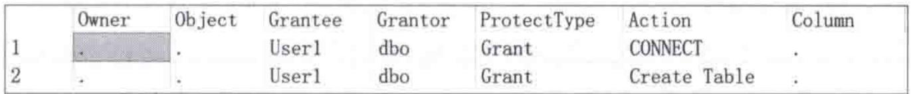
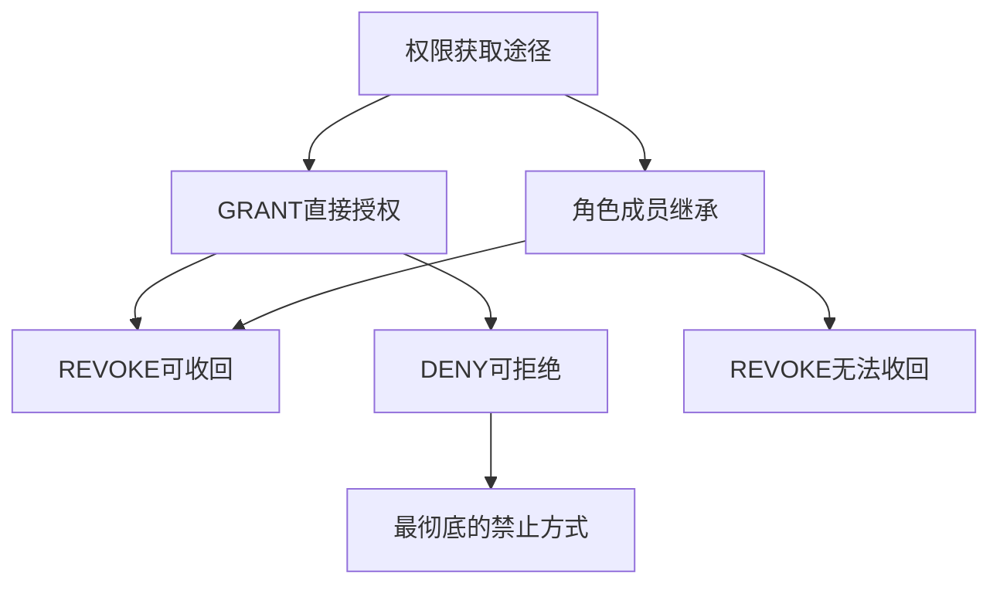

# 第12章-12.4-数据库级安全控制

## 基本信息
- **课程**：数据库原理与应用
- **章节**：第12章 12.4节 数据库级的安全控制
- **日期**：2026-06-30
- **标签**：#数据库安全 #用户管理 #权限管理 #GRANT #REVOKE #DENY

---

## 重点内容

### ⭐⭐⭐ 核心概念
- **数据库级主体**：数据库用户、数据库角色、应用程序角色
- **数据库级安全对象**：用户、角色、应用程序角色、架构、表、视图、存储过程等
- **三大权限操作**：GRANT（授权）、REVOKE（收回）、DENY（拒绝）

### ⭐⭐ 用户管理
- **dbo用户**：数据库范围内拥有最高权限，sysadmin成员自动映射
- **guest用户**：允许已登录用户访问数据库，需授予CONNECT权限
- **登录名与数据库用户**：登录名用于连接服务器，数据库用户用于访问数据库

### ⭐ 权限层级
- 对数据库级主体的操作权限：CONTROL、IMPERSONATE、ALTER、VIEW DEFINITION
- 对数据库的操作权限：CREATE TABLE、CREATE VIEW、CREATE PROCEDURE等
- WITH GRANT OPTION允许权限转授

---

## 详细笔记

### 一、数据库用户的管理（12.4.1）

数据库级主体包括数据库用户、数据库角色和应用程序角色，数据库级的安全控制主要是通过对这些主体的管理来实现。

> 📚 **课本出处**：第12章 12.4节"数据库级的安全控制"

服务器登录名用于连接SQL Server服务器，但不能访问数据库，只有数据库用户才能访问数据库。一个数据库可以拥有多个数据库用户，一个数据库用户也可以访问多个数据库（在有权限的前提下）。所有数据库用户总是与某一个登录名相关联，且只能关联一个登录名。

#### 1. 两个特殊用户——dbo和guest

> 📚 **课本出处**：第12章 12.4.1节"数据库用户的管理"

**dbo用户**：在数据库范围内拥有最高的权限，可以执行一切操作。固定服务器角色sysadmin的任何成员都映射到每个数据库内的用户dbo上。

**【例12.15】** 创建超级登录用户：

```sql
CREATE LOGIN AdminUser WITH PASSWORD = '123456',
    DEFAULT_database = MyDatabase;
GO
-- 将AdminUser添加为sysadmin的成员
EXEC sp_addsrvrolemember 'AdminUser', 'sysadmin';
```

执行后AdminUser自动映射到所有数据库内的dbo用户，不需要再创建数据库用户。

**guest用户**：允许任何已登录到SQL Server服务器的用户访问数据库，但需要对该用户授予CONNECT权限。

**【例12.16】** 创建guest登录用户：

```sql
CREATE LOGIN GuestUser WITH PASSWORD = '123',
    DEFAULT_database = MyDatabase;
GO
USE MyDatabase;
GRANT CONNECT TO GUEST;
USE DB_test;
GRANT CONNECT TO GUEST;
```

禁用guest用户（收回CONNECT权限）：

```sql
REVOKE CONNECT TO GUEST;
```

> ⚠️ **常见误区**：用户dbo和guest都不能被删除。

查看当前登录名和数据库用户名：

```sql
PRINT '当前登录名：' + SYSTEM_USER;
PRINT '当前数据库用户名：' + USER_NAME();
```

---

#### 2. 创建数据库用户

> 📚 **课本出处**：第12章 12.4.1节"创建数据库用户"

CREATE USER语句语法：

```sql
CREATE USER user_name
{ {FOR | FROM}
  {
    LOGIN login_name
    | CERTIFICATE cert_name
    | ASYMMETRIC KEY asym_key_name
  }
  | WITHOUT LOGIN
}
[ WITH DEFAULT_SCHEMA = schema_name ]
```

参数说明：
- **user_name**：数据库用户名称
- **LOGIN login_name**：指定所依赖的服务器登录名
- **CERTIFICATE cert_name**：指定要创建数据库用户的证书
- **ASYMMETRIC KEY asym_key_name**：指定要创建数据库用户的非对称密钥
- **WITH DEFAULT_SCHEMA = schema_name**：指定默认架构
- **WITHOUT LOGIN**：不映射到现有登录名

> 💡 **理解技巧**：如果省略FOR LOGIN子句，数据库用户名必须与所依赖的登录名同名。

**【例12.17】** 利用服务器登录创建数据库用户（同名）：

```sql
CREATE LOGIN myLogin4 WITH PASSWORD = '123456';
GO
USE MyDatabase;
GO
CREATE USER myLogin4;  -- 基于myLogin4创建同名的数据库用户
```

**【例12.18】** 基于一个登录创建多个数据库用户：

```sql
-- 创建登录
CREATE Login myLogin5 WITH PASSWORD = '123456';
GO
-- 创建3个数据库
CREATE DATABASE DB_test1;
GO
CREATE DATABASE DB_test2;
GO
CREATE DATABASE DB_test3;
GO
-- 分别创建用户
USE DB_test1;
GO
CREATE USER DB_user1 FOR LOGIN myLogin5;
GO
USE DB_test2;
GO
CREATE USER DB_user2 FOR LOGIN myLogin5;
GO
USE DB_test3;
GO
CREATE USER DB_user3 FOR LOGIN myLogin5;
GO
```

> 💡 **理解技巧**：登录名成功连接服务器后，试图进入某个数据库时，SQL Server登录名将获取该数据库用户的名称和ID进行验证。登录名隐式使用数据库用户。

---

#### 3. 查看数据库用户

利用系统存储过程sp_helpuser查看当前数据库中数据库级主体的信息：

```sql
USE MyDatabase;
GO
sp_helpuser;
```

返回结果结构：

| 列名 | 数据类型 | 说明 |
|:----:|:-------:|:-----|
| UserName | sysname | 当前数据库中的用户 |
| RoleName | sysname | UserName所属的角色 |
| LoginName | sysname | UserName的登录名 |
| DefDBName | sysname | UserName的默认数据库 |
| DefSchemaName | sysname | 数据库用户的默认架构 |
| UserID | smallint | 当前数据库中UserName的ID |
| SID | smallint | 用户的安全标识号 |

查看当前数据库用户名称：

```sql
PRINT USER_NAME();
```

---

#### 4. 修改数据库用户

> 📚 **课本出处**：第12章 12.4.1节"修改数据库用户"

ALTER USER语句语法：

```sql
ALTER USER userName WITH <set_item> [,...n]
```

其中 `<set_item>` 可以修改三个属性：名称、架构、所依赖的登录名。

**【例12.21】** 修改数据库用户的架构和登录名：

```sql
CREATE Login myLogin6 WITH PASSWORD = 'akh8#Ucfgsr7mAcxo3Bfe';
CREATE Login myLogin7 WITH PASSWORD = 'akh8#Ucfgsr7mAcxo3Bfe';
GO
USE MyDatabase;
GO
CREATE USER user1 FOR Login myLogin6;
GO
ALTER USER user1 WITH DEFAULT_SCHEMA = Purchasing, LOGIN = myLogin7;
```

---

#### 5. 删除数据库用户

```sql
DROP USER user_name;
```

**【例12.22】** 删除数据库用户：

```sql
DROP USER user1;
```

> ⚠️ **常见误区**：不能删除dbo和guest这两个特殊用户。

---

### 二、安全对象的权限管理（12.4.2）

> 📚 **课本出处**：第12章 12.4.2节"安全对象的权限管理"

数据库级主体必须拥有相关权限后，才能对数据库级安全对象执行对应的操作。

#### 📷 图12.6 User1当前拥有的权限



> 📚 **课本出处**：图12.6 展示了执行REVOKE收回权限后，用户User1所拥有的权限查询结果

---

#### 1. 授权——GRANT语句

##### （1）对数据库级主体的操作权限授权

```sql
GRANT permission[,...n]
ON { [USER::database_user] | [ROLE::database-role] | [APPLICATION ROLE::application-role] }
TO <databaseprincipal> [,...n]
[WITH GRANT OPTION] [AS <databaseprincipal>]
```

> 💡 **理解技巧**：WITH GRANT OPTION表示该主体还可以向其他主体授予所指定的权限（权限转授）。

**【例12.23】** 将对一个用户的CONTROL权限赋给另一个用户：

```sql
CREATE Login myLogin8_1 WITH PASSWORD = '123456';
GO
CREATE Login myLogin8_2 WITH PASSWORD = '123456';
GO
USE MyDatabase;
GO
CREATE USER User1 FOR Login myLogin8_1;
GO
CREATE USER User2 FOR Login myLogin8_2;
USE MyDatabase;
GRANT CONTROL ON USER::User2 TO User1;
```

对数据库级主体的操作权限：

| 主体类型 | 可授予权限 |
|:--------:|:---------|
| 数据库用户 | CONTROL、IMPERSONATE、ALTER、VIEW DEFINITION |
| 数据库角色 | CONTROL、TAKE OWNERSHIP、ALTER、VIEW DEFINITION |
| 应用程序角色 | CONTROL、ALTER、VIEW DEFINITION |

##### （2）对数据库的操作权限授权

```sql
GRANT <permission> [,...n]
TO <databaseprincipal> [,...n]
[WITH GRANT OPTION] [AS <databaseprincipal>]
```

查看可授予的数据库操作权限：

```sql
SELECT permission_name FROM sys.fn_builtinpermissions('DATABASE');
```

> 📌 **考试重点**：ALL表示同时授予BACKUP DATABASE、BACKUP LOG、CREATE DATABASE、CREATE DEFAULT、CREATE FUNCTION、CREATE PROCEDURE、CREATE RULE、CREATE TABLE和CREATE VIEW权限，但不表示所有权限。

**【例12.24】** 将数据库操作权限赋给用户：

```sql
USE MyDatabase;
GRANT CREATE TABLE, CREATE VIEW, CREATE PROCEDURE TO User1;
```

**【例12.25】** 允许用户转授权限：

```sql
USE MyDatabase;
GRANT VIEW DEFINITION ON ROLE::MyRole1 TO user1 WITH GRANT OPTION;
```

---

#### 2. 查看权限——sp_helpprotect存储过程

```sql
EXEC sp_helpprotect @username = 'User1';
-- 或
EXEC sp_helpprotect NULL, 'User1';
```

---

#### 3. 收回权限——REVOKE语句

##### （1）收回对数据库级主体的操作权限

```sql
REVOKE [GRANT OPTION FOR] permission[,...n]
ON { [USER::database_user] | [ROLE::database-role] | [APPLICATION ROLE::application-role] }
{FROM|TO} <databaseprincipal> [,...n]
[CASCADE] [AS <databaseprincipal>]
```

> 📌 **考试重点**：
> - **GRANT OPTION FOR**：只撤销向其他主体授予指定权限的权限，不撤销该权限本身
> - **CASCADE**：撤销的权限也会从此主体授予或拒绝该权限的其他主体中撤销

**【例12.27】** 收回用户拥有的对另一个用户的CONTROL权限：

```sql
USE MyDatabase;
REVOKE CONTROL ON USER::User2 FROM User1;
```

**【例12.28】** 收回用户转授权限的能力（保留权限本身）：

```sql
USE MyDatabase;
REVOKE GRANT OPTION FOR VIEW DEFINITION ON ROLE::MyRole1 FROM User1;
```

同时收回权限和转授能力：

```sql
USE MyDatabase;
REVOKE VIEW DEFINITION ON ROLE::MyRole1 FROM User1 CASCADE;
```

##### （2）收回对数据库的操作权限

```sql
REVOKE [GRANT OPTION FOR] <permission> [,...n]
{TO | FROM} <databaseprincipal> [,...n]
[CASCADE] [AS <databaseprincipal>]
```

**【例12.29】** 收回数据库用户的部分操作权限：

```sql
USE MyDatabase;
REVOKE CREATE VIEW, CREATE PROCEDURE FROM User1;
```

---

#### 4. 拒绝权限——DENY语句

> ⭐ **核心重点**：REVOKE只能收回GRANT授予的权限，不能收回通过角色继承的权限。要彻底禁止某权限，应使用DENY。

```sql
DENY {ALL [PRIVILEGES]}
| permission [ (column[,...n])][,...n]
[ON [class::]securable]
TO principal [,...n]
[CASCADE] [AS principal]
```

**【例12.30】** 拒绝用户User1对User2的CONTROL权限：

```sql
USE MyDatabase;
DENY CONTROL ON USER::User2 TO User1;
```

**【例12.31】** 拒绝用户拥有对数据库的CREATE TABLE权限：

```sql
USE MyDatabase;
DENY CREATE TABLE TO User1;
```

解除拒绝（通过重新授权）：

```sql
USE MyDatabase;
GRANT CREATE TABLE TO User1;
```

---

### 三、GRANT / REVOKE / DENY 对比

| 操作 | 作用 | 特点 |
|:----:|:-----|:-----|
| **GRANT** | 授予权限 | 使主体获得对安全对象的操作权限 |
| **REVOKE** | 收回权限 | 收回GRANT授予的权限，但不能收回角色继承的权限 |
| **DENY** | 拒绝权限 | 彻底禁止某权限，优先级最高，覆盖GRANT和角色继承 |



---

## 总结

### 数据库用户管理要点

| 操作 | 语法 | 说明 |
|:----:|:-----|:-----|
| 创建用户 | `CREATE USER name FOR LOGIN loginName` | 基于登录名创建 |
| 修改用户 | `ALTER USER name WITH ...` | 可修改名称、架构、登录名 |
| 删除用户 | `DROP USER name` | 不能删除dbo和guest |
| 查看用户 | `sp_helpuser` | 返回所有数据库用户信息 |

### 权限管理要点

| 操作 | 语法示例 | 关键参数 |
|:----:|:---------|:---------|
| 授权 | `GRANT SELECT ON table TO user` | WITH GRANT OPTION允许转授 |
| 收回 | `REVOKE SELECT ON table FROM user` | CASCADE连带收回下级权限 |
| 拒绝 | `DENY SELECT ON table TO user` | 优先级最高，覆盖一切 |

---

## 疑问与思考

### ❓ 待解决问题
1. 当一个用户同时被GRANT和DENY同一权限时，最终结果是什么？DENY为什么优先？
2. `sp_addrolemember`的用途是什么？与直接GRANT权限相比有什么优势？
3. WITH GRANT OPTION转授的权限链如果过长，如何有效管理？级联授权有什么注意事项？
4. 权限继承规则是怎样的？通过角色继承的权限与直接授权有什么区别？

### 💡 答疑解惑
1. **DENY为什么优先**：DENY的优先级在SQL Server权限体系中是最高的，这是其设计原则。当同一权限存在冲突的GRANT和DENY设置时，DENY始终生效。原因是DENY代表"明确禁止"，在安全模型中"明确拒绝"必须优先于"允许"，这符合安全领域的最小权限原则。具体判定规则：如果用户直接被GRANT了某权限，同时又被DENY了同一权限，DENY生效；如果用户通过角色成员资格继承了GRANT权限，被个人DENY后，DENY仍然生效。只有移除DENY设置后，用户才能重新通过GRANT或角色继承获得该权限。

2. **sp_addrolemember 用途**：`sp_addrolemember` 用于将数据库用户添加为数据库角色的成员，语法为 `sp_addrolemember 'role_name', 'user_name'`。与直接GRANT权限相比，通过角色管理的优势在于：一是批量管理，一个角色可以包含多个用户，修改角色权限即可影响所有成员；二是便于维护和审计，权限集中在角色层面，而非分散在各个用户上；三是符合职责分离原则，管理员只需管理角色的权限分配，用户管理由另一个流程负责。实际项目中应优先通过角色授权，而非直接GRANT。

3. **WITH GRANT OPTION 级联授权**：WITH GRANT OPTION允许被授权者将权限进一步转授给其他主体，形如A授权给B，B再授权给C。这种级联授权需要谨慎管理：一是权限链可能过长导致难以追溯权限来源；二是如果要收回权限，需要使用CASCADE选项才能连带收回下级所有被转授的权限。实际项目中，应定期审计权限转授链（可通过查询系统视图追踪），并对关键权限限制转授，或在收回时使用CASCADE确保彻底清除。

4. **权限继承规则**：数据库用户可以通过两种途径获得权限：直接GRANT和角色成员资格继承。规则如下：直接GRANT的权限可通过REVOKE收回；角色继承的权限无法通过REVOKE收回（因为REVOKE作用于直接授权，不作用于角色成员关系），必须使用DENY来屏蔽或通过sp_droprolemember移除角色成员资格来解除。最终权限判定为：所有GRANT来源（直接+继承）取并集，再与DENY取交集（DENY覆盖一切）。即只要存在DENY，该权限就被禁止，无论有多少GRANT来源。

### 💡 个人理解/技巧
- 登录名和数据库用户的关系可以类比：登录名是"门禁卡"（进入大楼），数据库用户是"工位卡"（进入具体办公室）
- 一个登录名可以创建多个数据库用户名来访问不同数据库，相当于一个人在不同部门有不同工牌
- GRANT/REVOKE/DENY三者的关系：GRANT是"允许"，REVOKE是"取消允许"，DENY是"明确禁止"。DENY的优先级最高
- sp_helpuser是查看用户信息的利器，返回结果中可以看到用户、角色、登录名的完整映射关系
- 删除表后，依附于该表的权限自动失效，即使重建同名表也要重新授权

---

## 相关链接

### 本节相关图片
- [图12.6 User1当前拥有的权限](../../../images/ff7b3b93f705dfca2f4a3c2498a08eba5cb33ea1e6e92681f83fa833c862544b.jpg)

### 关联章节
- [第12章-数据的安全性控制](./第12章-12.5-架构级安全控制.md)（下一节）
- 第12章-12.3-服务器级安全控制（前一节）
- 第12章-12.2-角色
- 第12章-12.1-SQL Server安全体系结构

---

## 检查清单

- [x] 已理解数据库用户与登录名的关系
- [x] 已掌握dbo和guest两个特殊用户的作用
- [x] 已掌握CREATE USER、ALTER USER、DROP USER语法
- [x] 已掌握GRANT、REVOKE、DENY三种权限操作
- [x] 已理解WITH GRANT OPTION的权限转授机制
- [x] 已插入课本原图（图12.6）
- [x] 已添加课本出处标注

---

*笔记创建时间：2026-06-30*
