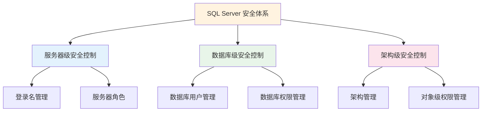

# 第12章-12.5-架构级安全控制

## 基本信息
- **课程**：数据库原理与应用
- **章节**：第12章 12.5节 架构级的安全控制
- **日期**：2026-06-30
- **标签**：#数据库安全 #架构 #Schema #CREATE SCHEMA #对象权限

---

## 重点内容

### ⭐⭐⭐ 核心概念
- **架构（Schema）**：形成单个命名空间的数据库对象集合，是数据对象管理的逻辑单位
- **架构与用户分离**：自SQL Server 2005起，架构与数据库用户分离，是重要改进
- **架构权限管理**：通过GRANT/REVOKE/DENY控制对架构及其包含对象的访问

### ⭐⭐ 架构管理
- **创建**：CREATE SCHEMA（可同时创建表、授权、拒绝）
- **修改**：ALTER SCHEMA（传输安全对象）、ALTER AUTHORIZATION（修改拥有者）
- **删除**：DROP SCHEMA（前提：架构内无对象）

### ⭐ 对象级权限
- 架构级安全对象：表、视图、存储过程、函数等
- 通过ON [OBJECT::] [schema_name.]object_name指定具体对象

---

## 详细笔记

### 一、架构及其管理（12.5.1）

#### 1. 架构的概念

> 📚 **课本出处**：第12章 12.5.1节"架构及其管理"

架构（Schema）是形成单个命名空间的数据库对象的集合，它包括数据类型、XML架构集合和对象类，其中对象类又包括聚合、约束、函数、过程、队列、统计信息、同义词、表、视图等。

**关键规则**：在同一个架构中不能存在重名的数据库对象。例如，一个架构中不允许存在同名的两个表，只有位于不同架构中的两个表才能重名。

> 💡 **理解技巧**：可以把架构想象成"文件夹"——同一个文件夹下不能有同名文件，但不同文件夹下可以。

**架构与用户分离的历史**：

| 版本 | 架构与用户关系 | 特点 |
|:----:|:-------------:|:-----|
| SQL Server 2000 | 架构和用户合一 | 每个用户都是同名架构的所有者 |
| SQL Server 2005起 | 架构与用户分离 | 多个用户可拥有同一架构，删除用户无需重命名对象 |

架构与用户分离的好处：
- 多个用户可以通过角色成员身份或Windows组成员身份拥有一个架构
- 删除数据库用户时，不需要对该用户架构所包含的对象进行重命名
- 通过默认架构的共享，可以实现统一名称解析
- 可以用更大的粒度管理架构和架构包含的对象的权限

**架构类型**：
- **系统架构**：系统内置的架构（如dbo）
- **用户自定义架构**：由用户创建的架构

> 📌 **考试重点**：每个用户都有一个默认架构。如果不指定，则使用系统架构dbo作为用户的默认架构。

---

#### 2. 创建架构——CREATE SCHEMA

> 📚 **课本出处**：第12章 12.5.1节"创建架构"

语法：

```sql
CREATE SCHEMA schema_name_clause [<schema_element> [...n]]
```

其中：

```txt
<schema_name_clause> ::=
    { schema_name | AUTHORIZATION owner_name
      | schema_name AUTHORIZATION owner_name }

<schema_element> ::=
    { table_defined | view_defined | grant_statement
      | revoke_statement | deny_statement }
```

参数说明：
- **schema_name**：架构名称，在数据库内唯一
- **AUTHORIZATION owner_name**：指定拥有架构的数据库级主体
- **table_defined**：在架构内创建表的CREATE TABLE语句
- **view_defined**：在架构内创建视图的CREATE VIEW语句
- **grant_statement / revoke_statement / deny_statement**：在架构内进行权限操作

**【例12.32】** 创建架构实例（同时建表和授权）：

```sql
USE MyDatabase;
GO
CREATE SCHEMA mySchema1 AUTHORIZATION User1
    CREATE TABLE T1(c1 int, c2 int, c3 int)
    GRANT SELECT TO User2
    DENY INSERT TO User2;
```

> 💡 **理解技巧**：CREATE SCHEMA可以在一条语句中同时完成创建架构、创建对象、授权和拒绝操作，非常高效。

---

#### 3. 修改架构

##### （1）在架构之间传输安全对象——ALTER SCHEMA

**【例12.33】** 将表T1从mySchema1传输到mySchema2：

```sql
ALTER SCHEMA mySchema2 TRANSFER mySchema1.T1;
```

##### （2）修改架构的拥有者——ALTER AUTHORIZATION

**【例12.34】** 将架构mySchema1的拥有者改为User2：

```sql
ALTER AUTHORIZATION ON SCHEMA::mySchema1 TO User2;
```

---

#### 4. 查看架构

**【例12.35】** 查看当前数据库中的所有架构：

```sql
USE MyDatabase;
SELECT name 架构名 FROM sys.schemas;
```

**【例12.36】** 查看架构的拥有者：

```sql
USE MyDatabase;
SELECT a.name 架构, b.name 拥有者
FROM sys.schemas a
JOIN sys.database_principals b
    ON a.principal_id = b.principal_id;
```

**【例12.37】** 查看指定架构包含的对象：

```sql
USE MyDatabase;
GO
CREATE SCHEMA mySchema3 AUTHORIZATION User1;
GO
CREATE TABLE mySchema3.T3_1(c1 int, c2 int);
CREATE TABLE mySchema3.T3_2(c1 int, c2 int);
CREATE TABLE mySchema3.T3_3(c1 int, c2 int);
SELECT b.name 架构名, a.name 包含的对象名, a.type 对象类型
FROM sys.objects a
JOIN sys.schemas b ON a.schema_id = b.schema_id
WHERE b.name = 'mySchema3';
```

---

#### 5. 删除架构——DROP SCHEMA

```sql
DROP SCHEMA schema_name;
```

> ⚠️ **常见误区**：要删除的架构不能包含任何对象，否则删除操作将失败！

**【例12.38】** 删除架构前需先处理其中的对象：

```sql
-- 方法1：删除架构内的所有表
USE MyDatabase;
DROP TABLE mySchema3.T3_1, mySchema3.T3_2, mySchema3.T3_3;
-- 然后删除架构
DROP SCHEMA mySchema3;

-- 方法2：将对象传输到其他架构
USE MyDatabase;
ALTER SCHEMA mySchema2 TRANSFER mySchema3.T3_1;
ALTER SCHEMA mySchema2 TRANSFER mySchema3.T3_2;
ALTER SCHEMA mySchema2 TRANSFER mySchema3.T3_3;
-- 然后删除架构
DROP SCHEMA mySchema3;
```

---

#### 6. 架构权限的管理

> 📚 **课本出处**：第12章 12.5.1节"架构权限的管理"

查看可授予的架构操作权限：

```sql
SELECT permission_name 权限名
FROM sys.fn_builtinpermissions('SCHEMA');
```

##### 授权——GRANT

```sql
GRANT permission [,...n]
ON SCHEMA::schema_name
TO databaseprincipal [,...n]
[WITH GRANT OPTION] [AS grantingprincipal]
```

**【例12.39】** 将架构操作权限赋给数据库主体：

```sql
USE MyDatabase;
GRANT INSERT, UPDATE, DELETE ON SCHEMA::mySchema1 TO User1;
```

##### 收回权限——REVOKE

```sql
REVOKE INSERT ON SCHEMA::mySchema1 FROM User1;
```

##### 拒绝权限——DENY

```sql
DENY INSERT ON SCHEMA::mySchema1 TO User1;
```

---

### 二、安全对象的权限管理（12.5.2）

> 📚 **课本出处**：第12章 12.5.2节"安全对象的权限管理"

架构级安全对象包括数据类型、XML架构集合和对象类（聚合、约束、函数、过程、队列、统计信息、同义词、表、视图等）。

> 💡 **理解技巧**：服务器级和数据库级的安全控制分别是数据的最外层和次外层保护，而架构级的安全控制则是数据的最内层保护——"贴身侍卫"。如果一个主体拥有了对架构的访问权限，那么它对该架构内的所有安全对象都具有相应的访问权限。

#### 对象级权限授权——GRANT

```sql
GRANT <permission> [,...n]
ON [OBJECT::] [schema_name.] object_name [ (column [,...n]) ]
TO <databaseprincipal> [,...n]
[WITH GRANT OPTION] [AS <databaseprincipal>]
```

查看可授予的对象权限：

```sql
SELECT permission_name FROM sys.fn_builtinpermissions('OBJECT');
```

**ALL对不同对象的含义**：

| 对象类型 | ALL包含的权限 |
|:--------:|:------------|
| 标量函数 | EXECUTE、REFERENCES |
| 表值函数 | DELETE、INSERT、REFERENCES、SELECT、UPDATE |
| 存储过程 | EXECUTE |
| 表 | DELETE、INSERT、REFERENCES、SELECT、UPDATE |
| 视图 | DELETE、INSERT、REFERENCES、SELECT、UPDATE |

**【例12.40】** 授予对表的SELECT权限：

```sql
GRANT SELECT ON OBJECT::dbo.Student TO User1;
```

**【例12.41】** 授予对存储过程的EXECUTE权限：

```sql
GRANT EXECUTE ON OBJECT::dbo.MyPro1 TO MyRole1;
```

收回权限：

```sql
REVOKE EXECUTE ON OBJECT::dbo.MyPro1 FROM MyRole1;
```

---

### 三层安全控制体系



---

## 总结

### 架构管理操作汇总

| 操作 | 语法 | 注意事项 |
|:----:|:-----|:---------|
| 创建架构 | `CREATE SCHEMA name AUTHORIZATION owner` | 可同时创建对象和授权 |
| 修改架构（传输对象） | `ALTER SCHEMA target TRANSFER source.object` | 对象从源架构转移到目标架构 |
| 修改架构拥有者 | `ALTER AUTHORIZATION ON SCHEMA::name TO newOwner` | 所有权转移 |
| 删除架构 | `DROP SCHEMA name` | 架构内不能有对象 |
| 查看架构 | `SELECT * FROM sys.schemas` | 使用系统目录视图 |

### 架构级权限管理汇总

| 操作 | 语法示例 | 说明 |
|:----:|:---------|:-----|
| 授权架构 | `GRANT INSERT ON SCHEMA::name TO user` | 对架构内所有对象生效 |
| 授权对象 | `GRANT SELECT ON OBJECT::schema.table TO user` | 对特定对象授权 |
| 收回权限 | `REVOKE ... FROM user` | 使用FROM而非TO |
| 拒绝权限 | `DENY ... TO user` | 优先级最高 |

---

## 疑问与思考

### ❓ 疑问与思考

#### 1. 架构与用户分离后，实际项目中如何合理规划架构？
> 💡 SQL Server 2005起架构与用户分离，实际项目中通常按**功能模块**划分架构（如Sales、HR、Inventory），而非按用户角色划分。这样做的好处是：同一模块的所有对象归入一个架构，权限可以按架构整体授予，模块增删时只影响对应架构，与用户变动解耦。例如销售模块的表、视图、存储过程都放在Sales架构下，对Sales架构的授权一次完成。

#### 2. 如果一个用户对架构有INSERT权限，但对架构内某张表有DENY INSERT，最终结果如何？
> 💡 在SQL Server的权限体系中，**DENY优先级最高**。即使用户通过架构获得了对所有表的INSERT权限，只要对某张具体表执行了DENY INSERT，该用户就不能对那张表执行INSERT操作。但该用户仍然可以对架构内**其他未被DENY的表**正常执行INSERT。这体现了对象级权限优先于架构级权限的原则。

#### 3. 不指定schema_name时，系统如何找到对象？
> 💡 SQL Server按照**默认架构搜索顺序**解析未限定名称的对象：首先在用户的默认架构中查找，如果未找到则在dbo架构中查找。每个数据库用户都有一个默认架构（通过 `DEFAULT_SCHEMA` 设置），如果不设置则默认为dbo。因此，如果在默认架构和dbo中都不存在同名对象，查询就会报错。建议始终使用 `schema_name.object_name` 的完整限定格式来避免歧义。

### 💡 个人理解/技巧
- 架构是三层安全控制中最内层的保护，可以理解为"贴身侍卫"
- CREATE SCHEMA语句非常强大，一条语句可以同时完成创建架构、建表、授权、拒绝四种操作
- 架构与用户分离是SQL Server 2005的重要改进，核心好处是删除用户时不需要重命名对象
- 查看架构信息主要依赖两个系统目录视图：sys.schemas（架构信息）和sys.objects（对象信息）
- ALTER SCHEMA ... TRANSFER可以在架构间移动对象，比删除重建更高效

---

## 相关链接

### 关联章节
- [第12章-12.4-数据库级安全控制](./第12章-12.4-数据库级安全控制.md)（前一节）
- [第12章-12.6-授权举例](./第12章-12.6-授权举例.md)（下一节）
- 第12章-12.3-服务器级安全控制
- 第12章-12.2-角色
- 第12章-12.1-SQL Server安全体系结构

---

## 检查清单

- [x] 已理解架构的概念和作用
- [x] 已掌握架构与用户分离的意义
- [x] 已掌握CREATE SCHEMA、ALTER SCHEMA、DROP SCHEMA语法
- [x] 已掌握架构级和对象级的GRANT/REVOKE/DENY
- [x] 已理解三层安全控制体系
- [x] 已添加课本出处标注

---

*笔记创建时间：2026-06-30*
