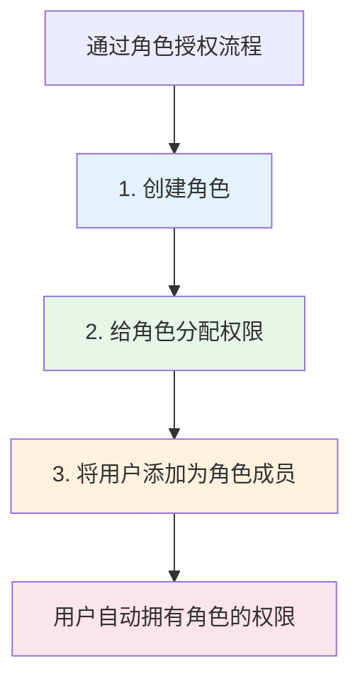
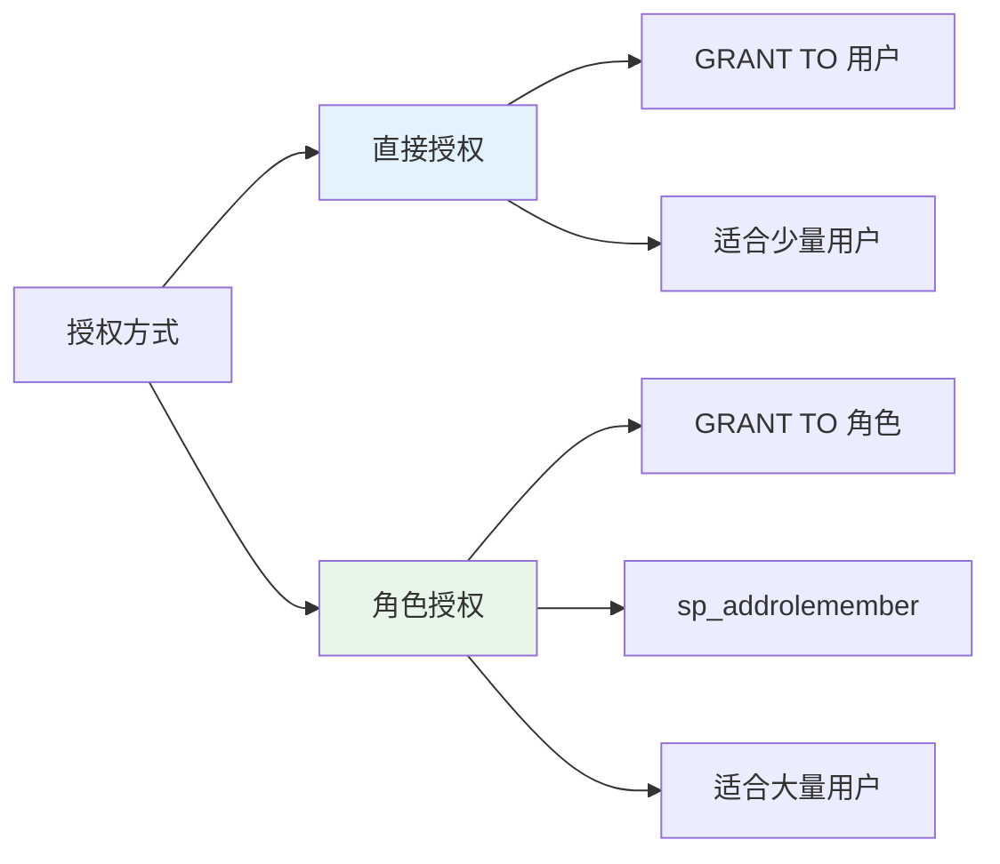

# 第12章-12.6-授权举例

## 基本信息
- **课程**：数据库原理与应用
- **章节**：第12章 12.6节 数据库用户授权举例
- **日期**：2026-06-30
- **标签**：#数据库安全 #授权 #GRANT #角色授权 #批量授权

---

## 重点内容

### ⭐⭐⭐ 核心方法
- **直接授权**：将权限逐一授予各个用户（适用于用户少的场景）
- **通过角色授权**：创建角色→分配权限→将用户添加为角色成员（适用于用户多的场景）

### ⭐⭐ 授权操作
- SELECT/INSERT/DELETE/UPDATE：基本的数据操作权限
- 列级授权：GRANT UPDATE(col1, col2) 仅允许更新指定列
- ALL PRIVILEGES：授予所有权限
- WITH GRANT OPTION：允许权限转授

### ⭐ 视图辅助授权
- 通过视图限制用户只能查看和修改部分数据

---

## 详细笔记

### 一、直接给数据库用户授权（12.6.1）

> 📚 **课本出处**：第12章 12.6.1节"直接给数据库用户授权"

数据库用户是登录名和数据库对象之间的桥梁，其拥有的访问权限在很大程度上决定着登录名的访问权限。

**准备工作**：创建登录名和数据库用户

```sql
CREATE LOGIN mydb_login       -- 创建登录名
WITH PASSWORD = '123456',
    DEFAULT_database = MyDatabase;
GO
USE MyDatabase;
CREATE USER mydb_user FOR LOGIN mydb_login  -- 创建与登录名不重名的数据库用户名
```

> 💡 **理解技巧**：此时用mydb_login登录服务器后，不能对数据表做任何操作，需要通过授权才能访问。

---

#### 1. 授予查询权限

**【例12.42】** 将查询表student的权限授给mydb_user：

```sql
GRANT SELECT ON student TO mydb_user
```

执行后，mydb_user可以执行 `SELECT * FROM student`。

---

#### 2. 授予增删改权限

**【例12.43】** 将对表student的增、删、改权限授给mydb_user：

```sql
GRANT INSERT, DELETE, UPDATE ON student TO mydb_user
```

##### 列级授权

GRANT还支持对指定的列进行更新授权：

```sql
GRANT UPDATE(s_avgrade, s_speciality) ON student TO mydb_user
```

> 📌 **考试重点**：执行上述语句后，mydb_user只能更新s_avgrade和s_speciality两列，不能更新其他列。

---

#### 3. 授予所有权限

**【例12.44】** 将对表student的所有权限授给mydb_user：

```sql
GRANT ALL PRIVILEGES ON student TO mydb_user
```

> ⚠️ **常见误区**：这些权限包括SELECT、INSERT、DELETE、UPDATE等，但SQL Server后续版本可能不支持该语句。

---

#### 4. 收回权限

**【例12.45】** 从mydb_user中收回对表student的增、删、改权限：

```sql
REVOKE DELETE, SELECT, UPDATE(s_avgrade, s_speciality) ON student FROM mydb_user
```

> ⚠️ **常见误区**：当删除表student后，依附于该表的相关权限也不复存在了，即使再创建同名的表也要重新授权。

---

#### 5. 通过视图实现精细授权

**【例12.46】** 让数据库用户只能查询和修改部分数据。

假设要求：mydb_user只能查询平均成绩及格的学生信息，同时只能修改这些学生的平均成绩。

**步骤1**：创建视图

```sql
CREATE VIEW myview
AS
SELECT * FROM student
WHERE s_avgrade >= 60
```

**步骤2**：对视图授权

```sql
GRANT SELECT, UPDATE(s_avgrade) ON myview TO mydb_user
```

**效果**：
- 可以执行：`SELECT * FROM myview` -- 查询及格学生
- 可以执行：`UPDATE myview SET s_avgrade = 100` -- 修改平均成绩
- 不能执行：`UPDATE myview SET s_speciality = '计算机应用技术'` -- 修改其他列

> 💡 **理解技巧**：视图是实现精细化权限控制的重要手段，可以将权限限制到特定行和特定列。

---

#### 6. 数据定义权限与转授

**【例12.47】** 将数据定义权限授给mydb_user，并允许再转授：

```sql
GRANT ALTER TO mydb_user WITH GRANT OPTION
```

执行后mydb_user可以执行CREATE TABLE、CREATE VIEW、DROP TABLE等语句，并且可以将这些权限再授给其他用户。

---

### 二、通过角色给数据库用户授权（12.6.2）

> 📚 **课本出处**：第12章 12.6.2节"通过角色给数据库用户授权"

直接授权的方式在用户较多时显得繁杂。角色是权限的集合，角色的成员可以拥有角色包含的所有权限。通过创建角色并赋予相应权限，可以实现批量授权。



---

#### 1. 创建角色并授权

**【例12.48】** 创建数据库角色，赋予权限，批量授权：

**步骤1**：创建角色

```sql
CREATE ROLE mydb_role
```

**步骤2**：将权限授给角色

```sql
GRANT SELECT, UPDATE, DELETE ON student TO mydb_role
```

**步骤3**：将用户添加为角色成员

```sql
sp_addrolemember mydb_role, mydb_user
```

执行后，mydb_user自动拥有对表student的SELECT、UPDATE、DELETE权限。

---

#### 2. 删除角色中的权限

**【例12.49】** 删除角色中指定的权限，使用户失去相应权限：

```sql
REVOKE SELECT ON student FROM mydb_role
```

其结果是，所有mydb_role成员（包括mydb_user）的SELECT权限被收回。

---

#### 3. 将用户从角色中移除

**【例12.50】** 将用户从角色中删除，使其失去角色包含的全部权限：

```sql
sp_droprolemember mydb_role, mydb_user
```

执行后，mydb_user失去mydb_role包含的所有权限。

---

### 三、两种授权方式对比

| 对比项 | 直接授权 | 通过角色授权 |
|:------:|:---------|:------------|
| **操作方式** | GRANT直接授予用户 | 创建角色→授权角色→添加用户 |
| **适用场景** | 用户少、权限简单 | 用户多、权限统一 |
| **管理复杂度** | 用户多时繁琐 | 集中管理，简化操作 |
| **权限回收** | 逐一收回 | 回收角色权限或移除角色成员 |
| **可维护性** | 较低 | 较高 |
| **批量操作** | 不支持 | 天然支持 |



---

## 总结

### 完整授权流程示例

#### 直接授权完整流程

```sql
-- 1. 创建登录名
CREATE LOGIN mydb_login WITH PASSWORD = '123456',
    DEFAULT_database = MyDatabase;
GO
-- 2. 创建数据库用户
USE MyDatabase;
CREATE USER mydb_user FOR LOGIN mydb_login;
GO
-- 3. 授予查询权限
GRANT SELECT ON student TO mydb_user;
-- 4. 授予增删改权限
GRANT INSERT, DELETE, UPDATE ON student TO mydb_user;
-- 5. 授予数据定义权限（可转授）
GRANT ALTER TO mydb_user WITH GRANT OPTION;
```

#### 通过角色授权完整流程

```sql
-- 1. 创建登录名
CREATE LOGIN mydb_login WITH PASSWORD = '123456',
    DEFAULT_database = MyDatabase;
GO
-- 2. 创建数据库用户
USE MyDatabase;
CREATE USER mydb_user FOR LOGIN mydb_login;
GO
-- 3. 创建角色
CREATE ROLE mydb_role;
GO
-- 4. 给角色分配权限
GRANT SELECT, UPDATE, DELETE ON student TO mydb_role;
GO
-- 5. 将用户添加为角色成员
sp_addrolemember mydb_role, mydb_user;
GO
-- --- 权限回收方式 ---
-- 方式A：从角色中移除用户
sp_droprolemember mydb_role, mydb_user;
-- 方式B：收回角色中的特定权限
REVOKE SELECT ON student FROM mydb_role;
```

### 授权方式对比表

| 授权方式 | 操作步骤 | 适用场景 | 权限回收 | 优缺点 |
|:--------:|:---------|:---------|:---------|:-------|
| **直接授权** | `GRANT ... TO user` | 用户少、权限差异化大 | `REVOKE ... FROM user` | 简单直接，但用户多时管理困难 |
| **通过角色授权** | 创建角色→授权角色→添加成员 | 用户多、权限标准化 | 移除成员或回收角色权限 | 集中管理，批量操作，易于维护 |
| **视图辅助授权** | 创建视图→对视图授权 | 需要限制行/列级访问 | 删除视图或收回视图权限 | 精细化控制，安全性高 |

### 常用权限速查

| 权限类型 | 语法示例 | 作用 |
|:--------:|:---------|:-----|
| 查询 | `GRANT SELECT ON table TO user` | 允许查询数据 |
| 插入 | `GRANT INSERT ON table TO user` | 允许插入数据 |
| 删除 | `GRANT DELETE ON table TO user` | 允许删除数据 |
| 更新 | `GRANT UPDATE ON table TO user` | 允许更新所有列 |
| 列级更新 | `GRANT UPDATE(col) ON table TO user` | 只允许更新指定列 |
| 全部权限 | `GRANT ALL PRIVILEGES ON table TO user` | 授予所有权限 |
| 数据定义 | `GRANT ALTER TO user` | 允许创建/修改/删除对象 |
| 转授权 | `...WITH GRANT OPTION` | 允许将权限再授给他人 |

---

## 疑问与思考

### ❓ 疑问与思考

#### 1. 直接授权与通过角色授权可以同时使用吗？当两者产生冲突时如何处理？
> 💡 可以同时使用。一个用户既可以被直接GRANT某个权限，也可以通过角色间接获得权限。冲突处理遵循**最终权限叠加**原则：直接授权和角色授权的权限是**并集**关系，即只要其中一种方式授予了某个权限，用户就拥有该权限。但如果任何路径上存在DENY，则DENY优先，该权限被禁止。例如用户直接GRANT了SELECT，又通过角色被DENY了SELECT，最终结果是不能SELECT。

#### 2. sp_addrolemember的用法和注意事项是什么？
> 💡 语法为 `sp_addrolemember '角色名', '用户名'`。一个用户可以同时属于多个角色，获得所有角色权限的并集。注意事项：(1) 参数用字符串形式传入，用单引号包裹；(2) 调用者需要有ALTER ANY ROLE权限；(3) 不能将角色添加为自身成员（禁止循环嵌套）；(4) 移除成员使用 `sp_droprolemember`；(5) 角色成员的身份是**实时生效**的，添加后立即获得权限，移除后立即失去权限。

#### 3. 收回权限时的级联问题（WITH GRANT OPTION）
> 💡 当使用 `WITH GRANT OPTION` 授予权限后，被授权者可以将该权限再转授给其他用户。此时收回权限需要特别注意：(1) 如果只写 `REVOKE ... FROM user`，SQL Server会**级联收回**该用户转授出去的所有权限（即用户A授给B，收回A时B也失去权限）；(2) 如果加上 `CASCADE` 关键字，效果相同且是显式声明级联；(3) 如果加上 `GRANT OPTION FOR`，则只收回转授权本身，不影响被授权者已经直接获得的权限。实际项目中应定期审计权限链，防止权限扩散失控。

### 💡 个人理解/技巧
- **直接授权 vs 角色授权**：小项目用直接授权够用，企业级项目一定要用角色授权，这是权限管理的最佳实践
- **视图授权**是实现行列级安全的重要手段——不给用户直接访问表的权限，而是通过视图暴露需要的数据子集
- **权限转授的管理**：WITH GRANT OPTION虽然方便，但容易导致权限扩散，实际项目中应谨慎使用，并定期审计权限链
- **表删除与权限**：删除表后权限自动失效，这是需要注意的细节——重建同名表不等于恢复权限
- **sp_addrolemember**是批量授权的核心，理解了"角色是权限的集合"这一概念，整个授权体系就通了

---

## 相关链接

### 关联章节
- [第12章-12.4-数据库级安全控制](./第12章-12.4-数据库级安全控制.md)
- [第12章-12.5-架构级安全控制](./第12章-12.5-架构级安全控制.md)
- 第12章-12.2-角色
- 第12章-12.3-服务器级安全控制
- 第12章-12.1-SQL Server安全体系结构

---

## 检查清单

- [x] 已掌握直接授权的完整流程
- [x] 已掌握通过角色授权的完整流程
- [x] 已理解列级授权的语法和效果
- [x] 已理解视图辅助授权的原理
- [x] 已掌握WITH GRANT OPTION权限转授
- [x] 已理解两种授权方式的区别和适用场景
- [x] 已添加课本出处标注

---

*笔记创建时间：2026-06-30*
