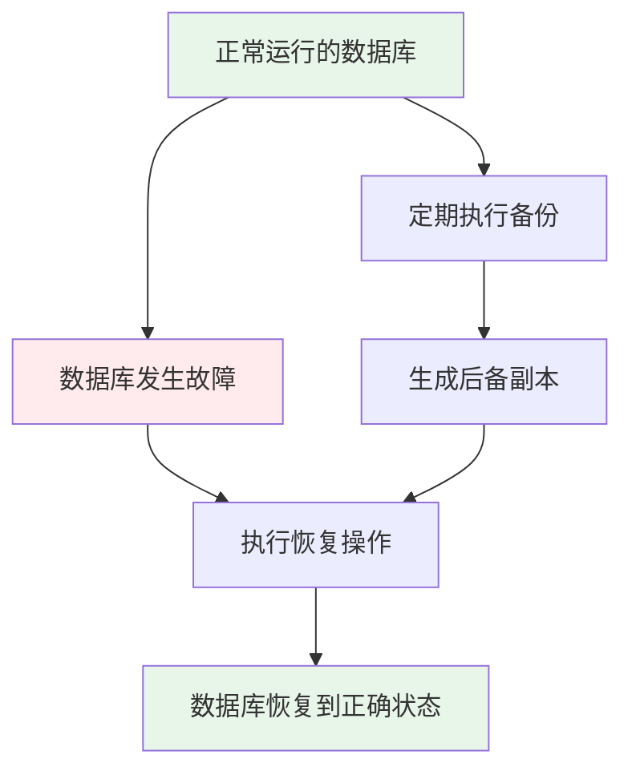
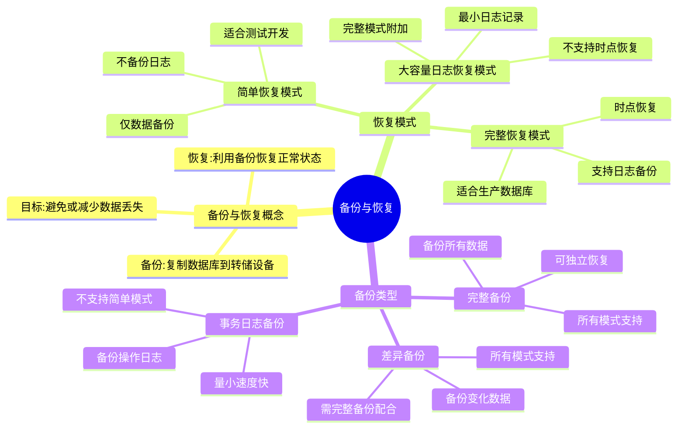

# 第13章-13.1-备份和恢复概述

## 基本信息
- **课程**：数据库原理与应用
- **章节**：第13章 13.1节 备份和恢复概述
- **日期**：2026-06-30
- **标签**：#数据库备份 #数据库恢复 #恢复模式 #备份类型 #事务日志

---

## 重点内容

### ⭐⭐⭐ 核心概念
- **备份**：定期把数据库复制到转储设备的过程
- **恢复**：利用备份的后备副本把数据库由故障状态转变为无故障状态的过程
- **三种恢复模式**：简单恢复模式、完整恢复模式、大容量日志恢复模式
- **三种备份类型**：完整备份、差异备份、事务日志备份

### ⭐⭐ 重要概念
- **完整恢复模式**：最理想的还原程度，支持时点恢复，但备份内容多、代价昂贵
- **差异备份**：对自上次完整备份以来发生变化的数据进行备份，不能独立恢复
- **事务日志备份**：记录操作日志而非数据本身，需与完整备份结合使用

### ⭐ 基础概念
- **简单恢复模式**：不备份日志，管理开销最小，但可能丢失最近更新
- **大容量日志恢复模式**：完整恢复模式的附加模式，用于大容量复制操作
- **尾日志备份**：故障发生后到执行备份时的操作记录，防止修改工作丢失

---

## 详细笔记

### 一、备份和恢复的概念

#### 1. 为什么需要备份

> 📚 **课本出处**：第13章 13.1.1节"备份和恢复的概念"

前两章分别介绍了通过数据的**完整性控制**和**安全性控制**来保证数据安全，但这种安全是相对的。以下因素都可能造成数据损坏或丢失：

| 威胁类型 | 具体例子 |
|:--------:|:---------|
| DBMS软件故障 | 数据库管理系统本身出现问题 |
| 硬件故障 | 计算机出现不可修复的故障 |
| 人为误操作 | 操作人员误删除数据 |
| 自然灾害 | 火灾、水灾等不可抗拒的客观因素 |

> ⚠️ **常见误区**：完整性控制和安全性控制并不能解决上述所有问题，备份和恢复是另一种不可或缺的数据保护措施。

#### 2. 备份的定义

**备份（Backup）**：定期地把数据库复制到转储设备的过程。

- **转储设备**：用于存储数据库副本的磁带或磁盘
- **后备副本（后援副本）**：存储的数据库副本数据，也称为备份

#### 3. 恢复的定义

**恢复（Recovery）**：利用备份的后备副本把数据库由存在故障的状态转变为无故障状态的过程。

**核心目标**：在数据库遭到破坏时能够恢复到破坏前的正确状态，避免或最大限度地减少数据丢失。

> 💡 **理解技巧**：备份是"未雨绸缪"，恢复是"亡羊补牢"。备份是手段，恢复是目的。



---

### 二、恢复模式及其切换

> 📚 **课本出处**：第13章 13.1.2节"恢复模式及其切换"

恢复模式是数据库的一项属性，决定了数据库在什么模式下进行备份和恢复。数据备份需要在给定的恢复模式下完成，**不同的恢复模式下备份的内容和方法有所不同**。

#### 1. 简单恢复模式（SIMPLE）

> 📚 **课本出处**：第13章 13.1.2节"1. 简单恢复模式"

**主要特点**：
- 只对数据进行备份，**不对日志进行备份**
- 不需要管理事务日志空间，最大程度地减少日志管理开销
- 是最简单的备份和还原形式

**支持的备份类型**：
- 数据库备份
- 文件备份
- **不支持**日志备份

**风险**：如果数据库损坏，只能恢复到**最近数据备份的末尾**，之后所做的更新全部丢失。

**适用场景**：
- 测试和开发数据库
- 主要包含只读数据的数据库（如数据仓库）
- 小型生产数据库

> ⚠️ **常见误区**：简单恢复模式并不适合生产系统，因为对生产系统而言，丢失最新的更改是无法接受的。

#### 2. 完整恢复模式（FULL）

> 📚 **课本出处**：第13章 13.1.2节"2. 完整恢复模式"

**主要特点**：
- 支持数据备份和**日志备份**
- 完整记录所有事务，将事务日志记录保留到备份完毕为止
- 支持还原单个数据页

**支持的备份类型**：
- 数据库备份
- 文件和文件组备份
- 日志备份

**核心优势**：
- 可以将数据库还原到日志备份内包含的**任何时点**（"时点恢复"）
- 可在严重故障后备份活动日志，将数据库还原到**没有发生数据丢失的故障点**
- 最大范围内防止故障时丢失数据

**缺点**：
- 需要使用存储空间
- 增加还原时间和复杂性
- 对数据量大的数据库，时间和空间代价都是昂贵的

> 💡 **理解技巧**：完整恢复模式是"最安全但最昂贵"的方案——还原程度最理想，但备份内容多、代价大。是生产数据库的最佳选择。

#### 3. 大容量日志恢复模式（BULK_LOGGED）

> 📚 **课本出处**：第13章 13.1.2节"3. 大容量日志恢复模式"

**主要特点**：
- 完整恢复模式的**附加模式**，特殊用途
- 也需要日志备份，将日志记录保留到备份完毕为止
- 使用**最小方式**记录大多数大容量操作，减少日志空间使用量
- **不支持时点恢复**，可能造成一些数据库更改的丢失

**支持的备份类型**：
- 数据库备份
- 文件和文件组备份

**适用场景**：
- 执行大规模大容量操作（如大容量导入或索引创建）
- 需要提高性能并减少日志空间使用量时

#### 4. 恢复模式的切换

恢复模式是数据库的一项属性，可以通过系统目录视图查看：

```sql
-- 查看数据库的恢复模式
SELECT name 数据库名, recovery_model_desc 恢复模式  
FROM sys.databases  
WHERE name = 'MyDatabase';
```

> 📚 **课本出处**：第13章 13.1.2节，SQL示例用于查看恢复模式

输出结果中：**SIMPLE**（简单）、**FULL**（完整）、**BULK_LOGGED**（大容量日志）。

恢复模式的切换使用 `ALTER DATABASE` 语句：

```sql
-- 切换为大容量日志恢复模式
ALTER DATABASE MyDatabase SET RECOVERY BULK_LOGGED;

-- 切换为完整恢复模式
ALTER DATABASE MyDatabase SET RECOVERY FULL;

-- 切换为简单恢复模式
ALTER DATABASE MyDatabase SET RECOVERY SIMPLE;
```

> 📚 **课本出处**：第13章 13.1.2节，SQL示例用于切换恢复模式

**模式选择总结**：
- 测试/开发数据库 -> 简单恢复模式
- 生产数据库 -> **完整恢复模式**（最佳选择）
- 大容量操作期间 -> 可临时切换为大容量日志恢复模式作为补充

---

### 三、备份类型

> 📚 **课本出处**：第13章 13.1.3节"备份类型"

备份类型主要包括**完整备份**、**差异备份**和**事务日志备份**。在不同的恢复模式下，允许的备份类型有所不同。

#### 1. 完整备份（Full Backup）

> 📚 **课本出处**：第13章 13.1.3节"1. 完整备份"

**定义**：备份包括特定数据库（或一组特定的文件组或文件）中的**所有数据**，以及可以恢复这些数据的足够多的日志信息。

**特点**：
- 备份所有数据
- 需要较大的存储空间
- 可以**独立完成**数据库恢复
- 恢复到备份时刻的状态

**限制**：备份后到出现故障之间所做的修改将**丢失**。

**适用范围**：所有恢复模式都支持。

#### 2. 差异备份（Differential Backup）

> 📚 **课本出处**：第13章 13.1.3节"2. 差异备份"

**定义**：对**自上次完整备份以来**发生过变化的数据库数据进行备份，又称**增量备份**。

**特点**：
- 只记录自基础备份以来发生变化的数据
- 备份内容仍为数据库中的数据，所需时间和空间仍然较大
- 较完整备份在性能上有显著提高
- **不能单独恢复**，必须与基础完整备份结合

**适用范围**：所有恢复模式都支持。


> 💡 **理解技巧**：差异备份以最近一次完整备份为"基础"，记录此后所有变化。恢复时只需：基础完整备份 + 最近一次差异备份。

#### 3. 事务日志备份（Transaction Log Backup）

> 📚 **课本出处**：第13章 13.1.3节"3. 事务日志备份"

**定义**：记录了自上次日志备份到本次日志备份之间的**所有数据库操作**（日志记录）。

**特点**：
- 记录的是时间段内的操作日志，而非数据库数据
- 备份数据量小，所需时间和存储空间小
- **不能单独恢复**，必须与完整备份结合
- "完整备份 + 日志备份"是常采用的备份方法

**适用范围**：仅适用于**完整恢复模式**或**大容量日志恢复模式**，**不适用于**简单恢复模式。

**日志备份的分类**：

| 类型 | 说明 |
|:----:|:-----|
| 纯日志备份 | 仅包含某一个时间段内的日志记录 |
| 大量日志备份 | 主要用于记录大批量的批处理操作 |
| 尾日志备份 | 包含数据库发生故障后到执行尾日志备份时的操作，防止故障后修改工作丢失 |

> 📚 **课本出处**：第13章 13.1.3节，日志备份分类

> 📌 **考试重点**：自SQL Server 2005开始，一般要求**先进行尾日志备份**，然后才能恢复当前数据库。

---

## 总结

### 恢复模式对比

| 对比项 | 简单恢复模式 | 完整恢复模式 | 大容量日志恢复模式 |
|:------:|:----------:|:----------:|:----------------:|
| **日志备份** | 不支持 | 支持 | 支持 |
| **时点恢复** | 不支持 | 支持 | 不支持 |
| **备份数据量** | 最小 | 最大 | 较大 |
| **管理开销** | 最小 | 最大 | 较大 |
| **数据丢失风险** | 可能丢失最近更新 | 最小 | 可能丢失部分更改 |
| **数据库备份** | 支持 | 支持 | 支持 |
| **文件备份** | 支持 | 支持 | 支持 |
| **适用场景** | 测试/开发/只读数据 | 生产数据库 | 大容量操作期间 |

### 备份类型对比

| 对比项 | 完整备份 | 差异备份 | 事务日志备份 |
|:------:|:------:|:-------:|:----------:|
| **备份内容** | 所有数据 | 自上次完整备份以来变化的数据 | 日志操作记录 |
| **存储空间** | 大 | 较大 | 小 |
| **备份时间** | 长 | 较长 | 短 |
| **能否独立恢复** | 能 | 不能 | 不能 |
| **恢复基准** | 无需基准 | 需要基础完整备份 | 需要完整备份 |
| **简单模式** | 支持 | 支持 | 不支持 |
| **完整模式** | 支持 | 支持 | 支持 |
| **大容量日志模式** | 支持 | 支持 | 支持 |

### 知识点脑图



### 关键要点

1. **备份与恢复是独立于完整性控制和安全性控制的另一种数据保护措施**
2. **恢复模式决定备份的内容和方法**，不同模式下允许的备份类型不同
3. **完整恢复模式是生产数据库的最佳选择**，支持时点恢复
4. **完整备份可独立恢复**，差异备份和日志备份都必须配合完整备份使用
5. **"完整备份 + 日志备份"是常用的备份策略组合**
6. **尾日志备份**自SQL Server 2005起是恢复操作的必要前置步骤

---

## 疑问与思考

### ❓ 三种恢复模式的区别与选择
- **问题**：简单恢复模式、完整恢复模式、大容量日志恢复模式在实际生产中如何根据业务需求选择？切换恢复模式会不会导致当前备份链断裂？
- 💡 **答案**：简单恢复模式不备份日志，管理最简单但恢复粒度最粗，适合测试环境或只读数据仓库；完整恢复模式支持日志备份和时点恢复，是生产数据库的首选；大容量日志模式是完整模式的"临时补充"，执行大批量导入/索引重建时临时切换以减少日志开销。切换恢复模式本身不会导致备份链断裂，但从完整模式切换到简单模式后，事务日志备份链会中断——切换前必须先进行一次日志备份，否则日志链断裂后无法实现真正的时点恢复。

### ❓ 完整备份、差异备份与日志备份的区别
- **问题**：差异备份和事务日志备份都是"不能独立恢复"的备份类型，二者的核心区别是什么？在什么场景下应该优先选择差异备份，什么场景下优先选择日志备份？
- 💡 **答案**：差异备份记录的是自上次完整备份以来所有**数据的变化**（数据本身），恢复时只需"完整备份 + 最近差异备份"两步即可，恢复速度快但备份体积随时间增长。日志备份记录的是**操作序列**（事务日志），体积小、频率高，恢复时可能需要按顺序回放多段日志，恢复时间长但恢复粒度更细。当数据量相对稳定且希望快速恢复时优先差异备份；当需要将数据库恢复到精确时间点或数据变化频繁时优先日志备份。实际中常组合使用："完整备份 + 差异备份 + 日志备份"兼顾恢复速度和粒度。

### ❓ 为什么需要日志备份
- **问题**：为什么不能只用完整备份和差异备份，还需要日志备份？
- 💡 **答案**：完整备份和差异备份只能恢复到备份完成那一刻的状态。如果数据库在差异备份之后、下一次备份之前发生故障，期间所有操作都会丢失。日志备份记录的是每一笔事务的操作记录，间隔可以设得很短（如每5分钟），因此能最大限度减少故障窗口内的数据丢失。对于使用完整恢复模式的生产数据库，日志备份是实现"时点恢复"的关键——只有日志备份才能把数据库精确恢复到故障发生前的任意时刻。

### ❓ 尾日志备份的操作与处理
- **问题**：尾日志备份的具体操作步骤是什么？如果数据库已经损坏到无法进行尾日志备份，应该如何处理？
- 💡 **答案**：尾日志备份的操作就是普通的日志备份（`BACKUP LOG 数据库名 TO DISK = '...' WITH NORECOVERY`），只不过时机是在故障发生后、恢复操作之前。SQL Server 2005 起要求先做尾日志备份，目的是保全故障前尚未备份的日志记录。如果数据库已损坏到无法进行尾日志备份，只能放弃最后这段时间的日志，利用之前的完整备份和日志备份恢复到最近的日志备份点，这意味着最后一批事务会丢失。

### 💡 个人理解/技巧
- 三种恢复模式的区别可以用"安全性 vs 性能"来理解：完整恢复模式最安全但开销最大，简单恢复模式最轻量但最不安全，大容量日志模式介于两者之间但有特殊用途
- 备份类型可以类比为：完整备份是"全拍快照"，差异备份是"只拍变化的部分"，日志备份是"记录做了什么操作"
- "完整备份 + 日志备份"组合是生产环境中最常用的方案，兼顾了安全性和灵活性
- 记忆技巧：日志备份只在完整模式和大容量日志模式下可用，简单模式不支持——因为简单模式的核心就是"不备份日志"
- 恢复的完整流程：尾日志备份 -> 完整备份（如需要）-> 差异备份 -> 日志备份，按时间顺序依次恢复

---

## 相关链接

### 关联章节
- [第13章-数据库备份与恢复](./第13章-数据库备份与恢复.md)（章节目录）
- 第13章-13.2-完整数据库备份与恢复（待创建）
- 第13章-13.3-差异数据库备份与恢复（待创建）
- 第13章-13.4-事务日志备份与恢复（待创建）
- 第13章-13.5-一种备份案例（待创建）

### 前置知识
- [第10章-事务管理与并发控制](../../章节笔记/)（事务日志的概念）
- [第12章-数据的安全性控制](../../章节笔记/)（安全性控制的局限性）

---

*笔记创建时间：2026-06-30*
