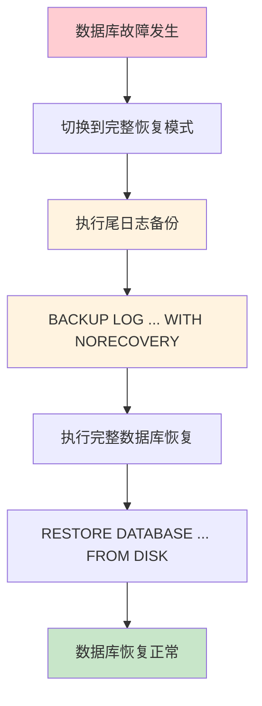

# 第13章-13.2-完整数据库备份与恢复

## 基本信息
- **课程**：数据库原理与应用
- **章节**：第13章 13.2节 完整数据库备份与恢复
- **日期**：2026-06-30
- **标签**：#数据库备份 #完整备份 #备份恢复 #BACKUP #RESTORE

---

## 重点内容

### ⭐⭐⭐ 核心语法
- **BACKUP DATABASE**：完整数据库备份语句，备份数据库中所有数据
- **RESTORE DATABASE**：完整数据库恢复语句，恢复到备份时刻的状态
- **备份选项**：FORMAT（覆盖创建新媒体集）、INIT（覆盖现有备份集）、NOINIT（追加）

### ⭐⭐ 关键要点
- 完整数据库备份是所有恢复模式都支持的基础备份方式
- 完整备份需要较大存储空间，不宜频繁执行
- 完整恢复模式下恢复需要先做尾日志备份
- 备份设备可通过系统存储过程管理

### ⭐ 备份方式
- 可备份到**逻辑备份设备**（需先创建设备）
- 也可直接备份到**磁盘文件**（使用 DISK 关键字）

---

## 详细笔记

### 一、完整数据库备份

完整数据库备份是对数据库中**所有数据**进行备份，因此需要较大的存储空间。完整数据库备份及其恢复分别利用 `BACKUP DATABASE` 语句和 `RESTORE DATABASE` 语句来完成。

> 📚 **课本出处**：第13章 13.2节"完整数据库备份与恢复"

#### 1. BACKUP DATABASE 语法要点

**基本语法**：

```sql
BACKUP DATABASE 数据库名
TO 备份设备 | DISK = '文件路径'
WITH 选项列表;
```

**常用选项**：

| 选项 | 说明 |
|:----:|:-----|
| `FORMAT` | 覆盖媒体标头和备份集，创建新媒体集（覆盖所有现有备份） |
| `INIT` | 覆盖现有备份集，但保留媒体标头 |
| `NOINIT` | 追加备份到现有文件末尾（默认值） |
| `DESCRIPTION` | 为备份集添加描述信息 |

> ⚠️ **常见误区**：FORMAT 会覆盖文件中**所有**现有备份并创建新媒体集，而 INIT 只覆盖现有备份集但保留媒体头。不要混淆两者。

#### 2. 管理备份设备

- **创建备份设备**：`sp_addumpdevice` 系统存储过程
- **查询备份设备**：`sys.backup_devices` 系统目录视图
- **删除备份设备**：`sp_dropdevice` 系统存储过程

```sql
-- 查看所有逻辑备份设备
SELECT * FROM sys.backup_devices;

-- 删除备份设备
EXEC sp_dropdevice 'MyDatabase_disk';
```

> 📚 **课本出处**：第13章 13.2.1节"完整数据库备份"

#### 3. 例13.1 — 简单恢复模式下完整备份

在简单恢复模式下对数据库 MyDatabase 进行完整备份。先创建逻辑备份设备，再执行备份：

```sql
USE master;  -- 关闭数据库MyDatabase
GO
ALTER DATABASE MyDatabase SET RECOVERY SIMPLE;  -- 切换到简单恢复模式
GO
-- 创建备份设备
EXEC sp_addumpdevice 'disk', 'MyDatabase_disk', 'D:\Backup\MyDatabase_disk.bak';
GO
-- 进行完整数据库备份
BACKUP DATABASE MyDatabase TO MyDatabase_disk WITH FORMAT;
GO
```

> 💡 **理解技巧**：`USE master` 的目的是关闭数据库 MyDatabase，因为切换恢复模式时数据库必须处于未使用状态。FORMAT 选项确保备份文件是全新的。

也可以不使用逻辑备份设备，直接备份到磁盘文件：

```sql
BACKUP DATABASE MyDatabase TO DISK = 'D:\Backup\MyDatabase_disk.bak' WITH FORMAT;
```

> 📚 **课本出处**：第13章 13.2.1节【例13.1】

---

### 二、完整数据库恢复

利用备份文件，可以将数据库恢复到备份时刻的状态。

> 📚 **课本出处**：第13章 13.2.2节"完整数据库恢复"

#### 1. RESTORE DATABASE 语法要点

**基本语法**：

```sql
RESTORE DATABASE 数据库名
FROM DISK = '备份文件路径'
[WITH 选项列表];
```

**常用选项**：

| 选项 | 说明 |
|:----:|:-----|
| `NORECOVERY` | 恢复后数据库处于还原状态，可继续应用后续备份 |
| `RECOVERY` | 恢复后数据库恢复正常状态（默认值） |
| `REPLACE` | 覆盖现有数据库 |
| `FILE = n` | 指定使用备份文件中的第n个备份集 |

> 📚 **课本出处**：第13章 13.2.2节"完整数据库恢复"

#### 2. 例13.2 — 简单恢复模式下恢复

利用例13.1中的完整备份恢复数据库 MyDatabase：

```sql
RESTORE DATABASE MyDatabase FROM DISK = 'D:\Backup\MyDatabase_disk.bak';
```

> 💡 **理解技巧**：简单模式下备份的文件，在任何恢复模式下都可以恢复，效果一样。

> 📚 **课本出处**：第13章 13.2.2节【例13.2】（注：课本原文此处编号为例13.2）

#### 3. 例13.3 — 完整恢复模式下备份与恢复

在完整恢复模式下，恢复时必须先进行**尾日志备份**，然后才能恢复数据库。

**第一步：在完整恢复模式下进行完整备份**

```sql
USE master;
GO
ALTER DATABASE MyDatabase SET RECOVERY FULL;  -- 切换到完整恢复模式
GO
-- 完整数据库备份
BACKUP DATABASE MyDatabase TO DISK = 'D:\Backup\MyDatabase_full.bak' WITH FORMAT;
GO
```

**第二步：故障时恢复数据库（含尾日志备份）**

```sql
USE master;
GO
ALTER DATABASE MyDatabase SET RECOVERY FULL;  -- 切换到完整恢复模式
-- 尾日志备份（必须在完整恢复模式下进行）
BACKUP LOG MyDatabase TO DISK = 'D:\Backup\MyDatabase_full.bak' WITH NORECOVERY;
GO
-- 恢复数据库
RESTORE DATABASE MyDatabase FROM DISK = 'D:\Backup\MyDatabase_full.bak';
GO
```

> ⭐ **核心重点**：完整恢复模式下，恢复前必须先做尾日志备份（Tail Log Backup），使用 `WITH NORECOVERY` 选项，将未备份的日志记录保存下来，然后才能执行 RESTORE。

> 📚 **课本出处**：第13章 13.2.2节【例13.3】（注：课本原文此处编号为例13.3）



---

## 总结

### 关键要点

1. **完整备份**是所有恢复模式的基础，备份数据库中**全部数据**
2. **FORMAT** 选项创建全新媒体集，覆盖所有现有备份
3. 完整恢复模式下恢复需要**尾日志备份**步骤
4. 备份设备可通过 `sp_addumpdevice` / `sp_dropdevice` 管理，也可直接使用 DISK 路径
5. **NORECOVERY** 使数据库保持还原状态，允许继续应用后续备份；**RECOVERY** 使数据库恢复正常

### 恢复模式对完整备份恢复的影响

| 恢复模式 | 备份时 | 恢复时 | 是否需要尾日志备份 |
|:--------:|:------:|:------:|:------------------:|
| 简单模式 | BACKUP DATABASE | RESTORE DATABASE | 否 |
| 完整模式 | BACKUP DATABASE | 尾日志备份 + RESTORE DATABASE | 是 |

---

## 疑问与思考

### ❓ INIT 与 NOINIT 的区别与使用场景
- **问题**：INIT 和 NOINIT 选项在实际生产环境中的使用场景分别是什么？什么时候该追加、什么时候该覆盖？
- 💡 **答案**：INIT 覆盖现有备份集并保留媒体头，相当于"清空文件再写入"，适合希望备份文件只保留最新一次备份的场景，如单次完整备份后不再追加。NOINIT（默认值）将新备份追加到文件末尾，适合需要在一个文件中保存多次备份记录的场景，例如在一个 .bak 文件中先后存放完整备份和差异备份。生产中通常配合 FORMAT 一起使用 FORMAT+INIT 来彻底重置备份文件，确保媒体集是全新的；NOINIT 则更安全，不会意外覆盖历史备份。

### ❓ NORECOVERY 与 REPLACE 的区别与风险
- **问题**：如果在恢复时使用了 REPLACE 选项，会有什么风险？生产环境中如何避免误覆盖？
- 💡 **答案**：NORECOVERY 让数据库恢复后保持"还原中"状态，数据库不可用但可以继续应用后续备份（如差异备份、日志备份）；RECOVERY（默认值）则让数据库恢复正常可用状态。REPLACE 选项会强制覆盖现有数据库，即使备份并非来自该数据库也会覆盖——这是它的风险所在。生产环境中应避免随意使用 REPLACE，正常恢复不需要它，因为 RESTORE 默认就能恢复到同名数据库。误用 REPLACE 可能覆盖一个正常运行的数据库。防止误操作的方法包括：恢复前确认备份文件来源、使用测试环境验证、通过权限控制限制 RESTORE 权限。

### ❓ 为什么完整恢复模式需要尾日志备份
- **问题**：尾日志备份（Tail Log Backup）具体记录了哪些内容？如果尾日志备份失败怎么办？
- 💡 **答案**：尾日志备份记录的是数据库最后一次日志备份之后到故障发生时刻之间的所有日志操作。在完整恢复模式下，这些操作日志保存在事务日志文件中尚未备份，尾日志备份的目的就是把这部分日志保存下来，防止故障后的修改工作丢失。如果尾日志备份失败（例如日志文件也已损坏），则只能放弃最后这段时间的数据，恢复到上一次成功完成的日志备份点。因此，日志备份的频率越高，故障时可能丢失的数据就越少。

### 💡 个人理解/技巧
- 完整备份可以理解为对数据库做一次"快照"，保存那一刻的全部数据
- NORECOVERY 就像"还没封口"，可以继续往里添加东西（后续备份）；RECOVERY 就像"已经封口"，数据库正式开放
- 简单恢复模式不需要维护事务日志，所以恢复更简单但无法做时间点恢复
- 完整恢复模式需要尾日志备份，是因为日志中可能有未完成的事务需要记录

---

## 相关链接

### 关联章节
- 第13章-13.1-备份与恢复概述（待创建）
- [第13章-13.3-差异数据库备份与恢复](./第13章-13.3-差异数据库备份与恢复.md)
- [第13章-13.4-事务日志备份与恢复](./第13章-13.4-事务日志备份与恢复.md)

---

## 检查清单

- [x] 已掌握 BACKUP DATABASE 语法和 FORMAT/INIT/NOINIT 选项
- [x] 已掌握 RESTORE DATABASE 语法和 REPLACE/NORECOVERY/RECOVERY 选项
- [x] 已理解简单模式与完整模式下恢复流程的区别
- [x] 已掌握尾日志备份的概念和操作
- [x] 已记录例13.1-13.3的完整代码
- [x] 已添加课本出处标注

---

*笔记创建时间：2026-06-30*
