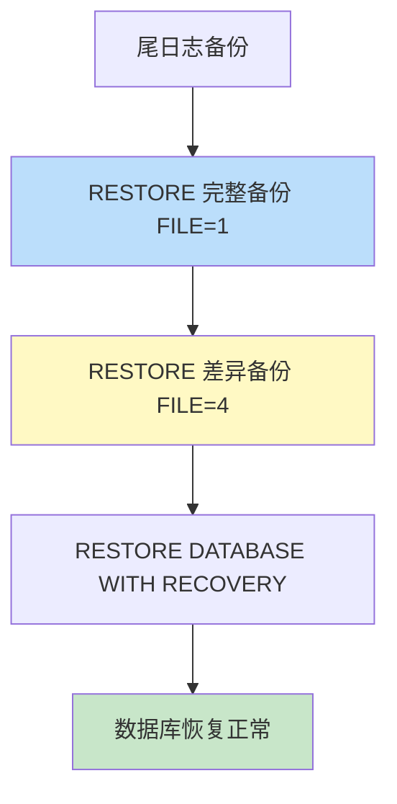

# 第13章-13.3-差异数据库备份与恢复

## 基本信息
- **课程**：数据库原理与应用
- **章节**：第13章 13.3节 差异数据库备份与恢复
- **日期**：2026-06-30
- **标签**：#差异备份 #数据库备份 #备份恢复 #DIFFERENTIAL #BACKUP #RESTORE

---

## 重点内容

### ⭐⭐⭐ 核心概念
- **差异备份**：自创建完整备份后，对更改的数据区进行的备份
- **DIFFERENTIAL 选项**：BACKUP DATABASE 语句中用于差异备份的关键选项
- **恢复顺序**：完整备份 -> 最新差异备份 -> (日志备份)

### ⭐⭐ 关键要点
- 差异备份基于最近的完整备份（基础备份）
- 比完整备份更快、更节省空间
- 每个差异备份包含自基础备份以来**所有**更改的数据
- 恢复时只需基础备份 + 最新的一个差异备份

### ⭐ 备份集管理
- 同一备份文件中每个备份形成独立的备份集
- Position 属性标识备份集在文件中的位置
- `RESTOREHEADERONLY` 可查看备份集信息

---

## 详细笔记

### 一、差异数据库备份概述

完整数据库备份相当于对整个数据库进行复制。当数据量很大时，这种操作是费时的，且会严重降低系统的性能。因此，完整数据库备份是一种"沉重"的备份操作，不宜经常进行。

差异备份是一种**"轻量级"**的备份方法，只备份自创建完整备份后被更改的数据区，具有**存储空间耗费少、创建速度快**的优点。

> 📚 **课本出处**：第13章 13.3节"差异数据库备份与恢复"

#### 差异备份的核心原理


**关键理解**：
- 差异备份需要基于一个最近的**完整备份**（称为基础备份）
- 每次差异备份记录的是**自完整备份以来**所有更改的数据区
- 因此，越新的差异备份包含的数据变化越多，文件也越大

> 💡 **理解技巧**：差异备份不像增量备份那样只记录上一次备份后的变化，而是记录从基础备份到当前时刻的所有变化。因此恢复时只需"基础备份 + 最新差异备份"两步。

---

### 二、差异数据库备份操作

差异数据库备份使用 `BACKUP DATABASE` 语句，与完整备份不同的是要带 `DIFFERENTIAL` 选项。

> 📚 **课本出处**：第13章 13.3.1节"差异数据库备份"

#### 1. BACKUP DATABASE 差异备份语法

```sql
-- 先创建完整备份（基础备份）
BACKUP DATABASE 数据库名
TO DISK = '备份文件路径'
WITH DESCRIPTION = '描述信息', FORMAT;

-- 创建差异备份
BACKUP DATABASE 数据库名
TO DISK = '备份文件路径'
WITH DESCRIPTION = '描述信息'
DIFFERENTIAL;
```

> ⚠️ **常见误区**：差异备份也使用 `BACKUP DATABASE` 语句，而非单独的语句。区别仅在于多了一个 `DIFFERENTIAL` 选项。

#### 2. 例13.4 — 创建差异数据库备份

先创建完整数据库备份（基础备份），然后创建差异数据库备份：

**第一步：创建完整备份（基础备份）**

```sql
USE master;
GO
ALTER DATABASE MyDatabase SET RECOVERY FULL;  -- 切换到完整恢复模式
GO
-- 完整数据库备份（基础备份）
BACKUP DATABASE MyDatabase
TO DISK = 'D:\Backup\MyDatabaseBackup.bak'
WITH DESCRIPTION = '这是基础备份', FORMAT;
GO
```

**第二步：定期创建差异备份**

```sql
-- 差异数据库备份
BACKUP DATABASE MyDatabase
TO DISK = 'D:\Backup\MyDatabaseBackup.bak'
WITH DESCRIPTION = '第1次差异备份'
DIFFERENTIAL;
GO
```

> 💡 **理解技巧**：建议每执行一次差异备份就修改 DESCRIPTION，以便区分不同的备份集。例如 `DESCRIPTION='第1次差异备份'`、`DESCRIPTION='第2次差异备份'` 等。

> 📚 **课本出处**：第13章 13.3.1节【例13.4】

#### 3. 查看备份集信息

使用 `RESTOREHEADERONLY` 语句查看备份文件中的所有备份集：

```sql
RESTOREHEADERONLY FROM DISK = 'D:\Backup\MyDatabaseBackup.bak';
```

备份集的 `BackupType` 值含义：

| BackupType | 含义 |
|:----------:|:-----|
| 1 | 完整备份 |
| 2 | 日志备份 |
| 5 | 差异备份 |

> 📚 **课本出处**：第13章 13.3.1节，图13.1展示了差异数据库备份形成的备份集

---

### 三、差异数据库恢复

利用差异备份及其基础备份所得到的备份文件，可以将数据库恢复到**任何一次备份时**的状态。

恢复顺序：**完整备份（基础备份）-> 目标差异备份**

> 📚 **课本出处**：第13章 13.3.2节"差异数据库恢复"

#### 例13.5 — 利用差异备份恢复到指定状态

利用例13.4的备份文件，将数据库恢复到**第3次差异备份**时的状态。

在例13.4中，先执行了1次完整备份，然后依次4次差异备份，共形成5个备份集：

| 备份集位置(Position) | 类型 | 说明 |
|:--------------------:|:----:|:-----|
| 1 | 完整备份 | 基础备份 |
| 2 | 差异备份 | 第1次差异备份 |
| 3 | 差异备份 | 第2次差异备份 |
| 4 | 差异备份 | 第3次差异备份 |
| 5 | 差异备份 | 第4次差异备份 |

恢复到第3次差异备份时的状态，需要使用**备份集1**（基础备份）和**备份集4**（第3次差异备份），跳过中间的备份集2和备份集3：

```sql
USE master;
GO
ALTER DATABASE MyDatabase SET RECOVERY FULL;
GO
-- 先进行尾日志备份，进入还原状态
BACKUP LOG MyDatabase TO DISK = 'D:\Backup\MyDatabaseBackup.bak' WITH NORECOVERY;
GO
-- 利用备份集1（基础备份，必须先恢复）
RESTORE DATABASE MyDatabase FROM DISK = 'D:\Backup\MyDatabaseBackup.bak'
WITH FILE = 1, NORECOVERY;
GO
-- 利用备份集4（恢复到第3次差异备份时的状态）
RESTORE DATABASE MyDatabase FROM DISK = 'D:\Backup\MyDatabaseBackup.bak'
WITH FILE = 4, NORECOVERY;
GO
-- 恢复数据库（真正恢复完毕）
RESTORE DATABASE MyDatabase WITH RECOVERY;
GO
```

> ⭐ **核心重点**：差异恢复的关键是 `FILE = n` 参数，它指定使用备份文件中的第几个备份集。恢复到第N次差异备份时，FILE 的值 = N + 1（因为Position 1是完整备份）。

> 📚 **课本出处**：第13章 13.3.2节【例13.5】



#### 恢复要点

1. 如果希望恢复到**第4次差异备份**时的状态，只需将 `FILE=4` 改为 `FILE=5`
2. 差异恢复只需要**基础备份 + 目标差异备份**，中间的差异备份是多余的
3. 即使中间的备份集不需要，它们仍然占用存储空间——这是差异备份的**数据冗余**问题

> ⚠️ **常见误区**：虽然恢复时不需要中间的差异备份，但创建它们时它们仍然占用空间。差异备份比完整备份快，但仍会出现较大的数据冗余，因为每次差异备份都包含自完整备份以来的所有更改。

---

## 总结

### 差异备份 vs 完整备份对比

| 对比项 | 完整备份 | 差异备份 |
|:------:|:--------:|:--------:|
| **备份内容** | 数据库全部数据 | 自完整备份后更改的数据 |
| **存储空间** | 大 | 小（比完整备份） |
| **创建速度** | 慢 | 快 |
| **依赖关系** | 无依赖 | 依赖基础备份（完整备份） |
| **恢复步骤** | 仅需备份本身 | 完整备份 + 最新差异备份 |
| **BACKUP语句** | BACKUP DATABASE | BACKUP DATABASE ... DIFFERENTIAL |

### 恢复步骤表

| 步骤 | 操作 | WITH选项 |
|:----:|:-----|:---------|
| 1 | 尾日志备份 | `BACKUP LOG ... WITH NORECOVERY` |
| 2 | 还原完整备份（基础备份） | `RESTORE DATABASE ... WITH FILE=1, NORECOVERY` |
| 3 | 还原目标差异备份 | `RESTORE DATABASE ... WITH FILE=n, NORECOVERY` |
| 4 | 恢复数据库 | `RESTORE DATABASE ... WITH RECOVERY` |

---

## 疑问与思考

### ❓ 待解决问题
1. 差异备份相比完整备份有哪些优势？
2. FILE=n 参数在恢复中起什么作用？
3. 恢复时为什么必须遵循特定顺序？

### 💡 差异备份相比完整备份的优势
- 差异备份只记录自完整备份以来更改的数据区，而完整备份要复制整个数据库
- 差异备份创建速度更快、占用存储空间更少，适合在两次完整备份之间频繁使用
- 恢复时只需"基础完整备份 + 最新差异备份"两步，比多次应用增量备份更简洁
- 可以通过增加差异备份频率来缩短恢复点目标（RPO），而不需要频繁执行开销大的完整备份

### 💡 FILE=n 参数用途
- `FILE=n` 指定从备份文件中选择第 n 个备份集进行恢复，因为一个 `.bak` 文件可以包含多个备份集
- 例如完整备份在 Position=1，第3次差异备份在 Position=4，则 `FILE=1` 恢复完整备份，`FILE=4` 恢复目标差异备份
- 使用 `RESTOREHEADERONLY` 可以查看每个备份集的 Position 值，帮助确定正确的 FILE 参数
- FILE 参数是差异恢复中精确定位目标备份集的关键手段

### 💡 差异备份恢复顺序
- 恢复顺序为：完整备份（FILE=1）-> 目标差异备份（FILE=n），中间的差异备份可以跳过
- 完整备份必须先恢复，因为它提供了数据库的数据基础；差异备份中的"差异"是相对于完整备份的，脱离基础备份没有意义
- 即使有多个差异备份存在，恢复时只需用最新的一个（或目标时刻的那一个），因为差异备份记录的是累计变化
- 最后一步必须使用 `WITH RECOVERY`，否则数据库会保持在还原状态，无法正常访问
- 差异备份的"差异"是相对于**完整备份**的，不是相对于上一次差异备份
- 差异备份恢复比完整备份恢复更快速，因为跳过了中间的差异备份集
- 想象差异备份像"补丁"：基础备份是完整的底图，每次差异备份记录了从底图到现在所有的变化，最新的差异备份包含所有变化
- 虽然恢复时只用最新差异备份，但中间的备份集仍有价值——它们可以在不同时刻创建多个恢复点

---

## 相关链接

### 关联章节
- [第13章-13.2-完整数据库备份与恢复](./第13章-13.2-完整数据库备份与恢复.md)
- [第13章-13.4-事务日志备份与恢复](./第13章-13.4-事务日志备份与恢复.md)

---

## 检查清单

- [x] 已理解差异备份的概念和 DIFFERENTIAL 选项
- [x] 已掌握差异备份的创建语法
- [x] 已理解差异恢复的顺序：完整备份 -> 最新差异备份
- [x] 已掌握 FILE=n 参数指定备份集的方法
- [x] 已理解差异备份的数据冗余问题
- [x] 已记录例13.4-13.5的完整代码
- [x] 已添加课本出处标注

---

*笔记创建时间：2026-06-30*
