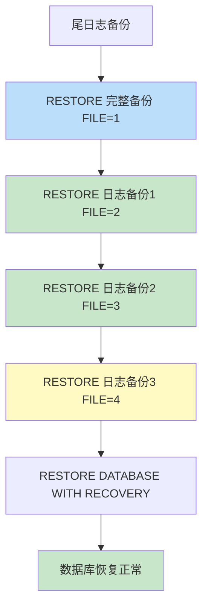

# 第13章-13.4-事务日志备份与恢复

## 基本信息
- **课程**：数据库原理与应用
- **章节**：第13章 13.4节 事务日志备份与恢复
- **日期**：2026-06-30
- **标签**：#事务日志 #日志备份 #时间点恢复 #BACKUPLOG #RESTORELOG #STOPAT

---

## 重点内容

### ⭐⭐⭐ 核心概念
- **事务日志备份**：备份事务日志中的操作记录（不是数据本身）
- **BACKUP LOG**：创建日志备份的语句
- **RESTORE LOG**：恢复日志备份的语句
- **STOPAT 时间点恢复**：将数据库恢复到指定时刻的状态

### ⭐⭐ 关键要点
- 日志备份只能在**完整恢复模式**和**大容量日志恢复模式**下创建
- 日志备份依赖于最近的完整数据库备份
- 恢复时必须按顺序依次应用所有日志备份
- 恢复顺序：完整备份 -> 日志备份1 -> 日志备份2 -> ... -> 目标日志备份

### ⭐ 日志备份与差异备份的本质区别
- 日志备份：记录**操作记录**（事务操作），不是数据本身
- 差异备份：备份**更改的数据区**（数据本身）

---

## 详细笔记

### 一、事务日志备份概述

事务日志备份（简称日志备份）包括创建备份时处于活动状态的部分事务日志，以及先前日志备份中未备份的所有日志记录。与数据备份不同，日志备份记录的是**操作记录**，而非数据本身。

> 📚 **课本出处**：第13章 13.4节"事务日志备份与恢复"

#### 日志备份的特点

| 特点 | 说明 |
|:----:|:-----|
| 备份内容 | 事务操作记录，不是数据本身 |
| 备份大小 | 比数据备份小得多 |
| 适用恢复模式 | 完整恢复模式、大容量日志恢复模式 |
| 依赖关系 | 依赖于最近的一次完整数据库备份 |
| 频率要求 | 越频繁，备份集越小，恢复点越精确 |

> ⭐ **核心重点**：日志备份的每一次创建都是对上一次备份之后的操作进行记录。备份得越频繁，所形成的备份集就越小。

> 📚 **课本出处**：第13章 13.4.1节"事务日志备份"

#### 日志备份 vs 差异备份

| 对比项 | 事务日志备份 | 差异数据库备份 |
|:------:|:-----------:|:-------------:|
| **备份内容** | 操作记录（事务日志） | 更改的数据区 |
| **备份大小** | 小 | 相对较大 |
| **恢复粒度** | 可恢复到任意时刻（时间点恢复） | 只能恢复到某次备份时刻 |
| **恢复方式** | 必须按顺序依次应用 | 只需完整备份 + 最新差异备份 |
| **依赖关系** | 依赖完整备份 | 依赖完整备份（基础备份） |

> 💡 **理解技巧**：差异备份像"存档文件的差异"，日志备份像"操作录像"。差异备份记录"数据从完整备份以来变了什么"，日志备份记录"执行了哪些操作"。

---

### 二、创建事务日志备份

使用 `BACKUP LOG` 语句创建日志备份。

#### 1. BACKUP LOG 语法

```sql
BACKUP LOG 数据库名
TO DISK = '备份文件路径'
[WITH DESCRIPTION = '描述信息'];
```

> 📚 **课本出处**：第13章 13.4.1节"事务日志备份"

#### 2. 例13.6 — 创建事务日志备份

以数据库 MyDatabase 为例，先创建完整备份，然后依次创建4个日志备份：

```sql
USE master;
GO
ALTER DATABASE MyDatabase SET RECOVERY FULL;  -- 切换到完整模式
GO
-- 先创建完整数据库备份
BACKUP DATABASE MyDatabase TO DISK = 'D:\Backup\MyDatabase_Log.bak'
WITH DESCRIPTION = '1. 创建完整数据库备份', FORMAT;
GO
-- 创建日志备份1
BACKUP LOG MyDatabase TO DISK = 'D:\Backup\MyDatabase_Log.bak'
WITH DESCRIPTION = '2. 创建日志备份1';
GO
-- 创建日志备份2
BACKUP LOG MyDatabase TO DISK = 'D:\Backup\MyDatabase_Log.bak'
WITH DESCRIPTION = '3. 创建日志备份2';
GO
-- 创建日志备份3
BACKUP LOG MyDatabase TO DISK = 'D:\Backup\MyDatabase_Log.bak'
WITH DESCRIPTION = '4. 创建日志备份3';
GO
-- 创建日志备份4
BACKUP LOG MyDatabase TO DISK = 'D:\Backup\MyDatabase_Log.bak'
WITH DESCRIPTION = '5. 创建日志备份4';
GO
```

> 📚 **课本出处**：第13章 13.4.1节【例13.6】

执行后形成的备份集结构：

| 备份集位置(Position) | BackupType | 说明 |
|:--------------------:|:----------:|:-----|
| 1 | 1（完整备份） | 完整数据库备份 |
| 2 | 2（日志备份） | 日志备份1 |
| 3 | 2（日志备份） | 日志备份2 |
| 4 | 2（日志备份） | 日志备份3 |
| 5 | 2（日志备份） | 日志备份4 |

> 📚 **课本出处**：第13章 13.4.2节，图13.2展示了日志备份形成的备份集

---

### 三、事务日志恢复

在利用日志备份恢复数据库之前，先利用最近的完整数据库备份来恢复数据库，然后再**按顺序依次**利用日志备份恢复数据库。

> 📚 **课本出处**：第13章 13.4.2节"事务日志恢复"

#### 1. RESTORE LOG 语法

```sql
RESTORE LOG 数据库名
FROM DISK = '备份文件路径'
WITH FILE = n, NORECOVERY;
```

> ⚠️ **常见误区**：日志恢复与差异恢复不同，日志备份必须**按顺序依次应用**，不能跳过。例如恢复到日志备份3，需要依次应用日志备份1、2、3，而不是只应用完整备份和日志备份3。

#### 2. 例13.7 — 利用日志备份恢复到指定状态

利用例13.6的备份文件，将数据库恢复到**日志备份3**时的状态：

```sql
USE master;
GO
IF db_id('MyDatabase') IS NOT NULL
ALTER DATABASE MyDatabase SET RECOVERY FULL;  -- 切换到完整模式
GO
-- 尾日志备份，进入还原状态
IF db_id('MyDatabase') IS NOT NULL
BACKUP LOG MyDatabase TO DISK = 'D:\Backup\MyDatabase_Log.bak' WITH NORECOVERY;
GO
-- 利用备份集1（完整数据库备份）
RESTORE DATABASE MyDatabase FROM DISK = 'D:\Backup\MyDatabase_Log.bak'
WITH FILE = 1, NORECOVERY;
GO
-- 利用备份集2（日志备份1）
RESTORE LOG MyDatabase FROM DISK = 'D:\Backup\MyDatabase_Log.bak'
WITH FILE = 2, NORECOVERY;
GO
-- 利用备份集3（日志备份2）
RESTORE LOG MyDatabase FROM DISK = 'D:\Backup\MyDatabase_Log.bak'
WITH FILE = 3, NORECOVERY;
GO
-- 利用备份集4（日志备份3）
RESTORE LOG MyDatabase FROM DISK = 'D:\Backup\MyDatabase_Log.bak'
WITH FILE = 4, NORECOVERY;
GO
RESTORE DATABASE MyDatabase WITH RECOVERY;  -- 恢复数据库
GO
```

> ⭐ **核心重点**：恢复到日志备份3，需要依次应用完整备份 + 日志备份1 + 日志备份2 + 日志备份3，共4个备份集，**不能跳过任何一个中间日志备份**。

> 📚 **课本出处**：第13章 13.4.2节【例13.7】



#### 日志恢复 vs 差异恢复的关键区别

恢复到"备份集中第N个位置"时：

| 恢复类型 | 需要的备份集 | 是否可以跳过中间备份 |
|:--------:|:-----------:|:-------------------:|
| **差异恢复** | 完整备份 + 目标差异备份 | 是（跳过中间差异备份） |
| **日志恢复** | 完整备份 + 所有中间日志备份 | 否（必须按顺序依次应用） |

> 💡 **理解技巧**：差异备份记录的是"累计变化"，最新的差异备份已包含所有变化；日志备份记录的是"增量操作"，每个日志备份只记录上一次到本次之间的操作，因此必须全部按序应用。

---

### 四、时间点恢复（STOPAT）

日志备份的一大优势是支持**时间点恢复**，可以将数据库恢复到某个精确时刻，而不仅仅是备份时刻。

使用 `RESTORE LOG` 语句配合 `WITH STOPAT` 选项：

```sql
RESTORE LOG 数据库名
FROM DISK = '备份文件路径'
WITH STOPAT = 'YYYY-MM-DD HH:MM:SS', NORECOVERY;
```

> 📚 **课本出处**：第13章 13.4节"事务日志备份与恢复"概述部分

> 💡 **理解技巧**：时间点恢复用于精确定位到故障发生的那个时刻，丢弃故障后的操作。这在数据误删等场景下非常有用——可以在误操作之前的时间点"暂停"恢复。

---

## 总结

### 三种备份方式对比

| 对比项 | 完整备份 | 差异备份 | 日志备份 |
|:------:|:--------:|:--------:|:--------:|
| **备份内容** | 全部数据 | 自完整备份后更改的数据 | 事务操作记录 |
| **备份大小** | 最大 | 中等 | 最小 |
| **创建速度** | 最慢 | 较快 | 最快 |
| **存储消耗** | 高 | 中 | 低 |
| **恢复速度** | 中 | 快 | 慢（需按序应用） |
| **恢复粒度** | 备份时刻 | 某次差异备份时刻 | 任意时间点 |
| **依赖关系** | 无 | 依赖完整备份 | 依赖完整备份 |
| **适用恢复模式** | 所有 | 所有 | 仅完整/大容量日志模式 |
| **核心语句** | BACKUP DATABASE | BACKUP DATABASE ... DIFFERENTIAL | BACKUP LOG |
| **恢复语句** | RESTORE DATABASE | RESTORE DATABASE | RESTORE LOG |

### 恢复步骤表

**完整备份恢复**：

| 步骤 | 操作 | 语句 |
|:----:|:-----|:-----|
| 1 | 恢复数据库 | `RESTORE DATABASE ... FROM DISK` |

**差异备份恢复**（以完整恢复模式为例）：

| 步骤 | 操作 | 语句 |
|:----:|:-----|:-----|
| 1 | 尾日志备份 | `BACKUP LOG ... WITH NORECOVERY` |
| 2 | 还原完整备份 | `RESTORE DATABASE ... WITH FILE=1, NORECOVERY` |
| 3 | 还原差异备份 | `RESTORE DATABASE ... WITH FILE=n, NORECOVERY` |
| 4 | 恢复数据库 | `RESTORE DATABASE WITH RECOVERY` |

**日志备份恢复**（以完整恢复模式为例）：

| 步骤 | 操作 | 语句 |
|:----:|:-----|:-----|
| 1 | 尾日志备份 | `BACKUP LOG ... WITH NORECOVERY` |
| 2 | 还原完整备份 | `RESTORE DATABASE ... WITH FILE=1, NORECOVERY` |
| 3 | 依次还原每个日志备份 | `RESTORE LOG ... WITH FILE=n, NORECOVERY` |
| 4 | 恢复数据库 | `RESTORE DATABASE WITH RECOVERY` |

### 恢复顺序为什么是"完整 -> 差异 -> 日志"

1. **完整备份**是基础，包含数据库某一时刻的全部数据快照
2. **差异备份**基于完整备份记录累计变化，需要先有完整备份作为起点
3. **日志备份**记录操作序列，必须从完整备份的起点开始，按顺序逐个应用才能正确重放所有事务操作
4. 三者构成一个**递进式**的恢复链：完整备份提供数据基础 -> 差异/日志备份在此基础上逐步推进到目标状态

---

## 疑问与思考

### ❓ 待解决问题
1. 恢复顺序为什么是完整 -> 差异 -> 日志？
2. STOPAT 时间点恢复有什么实际用途？
3. 日志备份频率如何选择？

### 💡 恢复顺序为什么是"完整 -> 差异 -> 日志"
- 完整备份提供数据库某一时刻的全部数据快照，是所有恢复的基础起点
- 差异备份基于完整备份记录累计变化，必须先有完整备份作为参照点才能还原差异数据
- 日志备份记录的是连续的事务操作序列，必须从完整备份的起点开始按顺序逐个应用，才能正确重放所有事务操作
- 三者构成递进式恢复链：完整备份提供数据基础 -> 差异/日志备份在此基础上逐步推进到目标状态

### 💡 STOPAT 时间点恢复用途
- STOPAT 可以将数据库恢复到故障发生前的精确时刻，而非只能恢复到某个备份时刻
- 典型应用场景：误删数据后恢复到误操作发生前一秒，避免数据丢失
- 实现原理：应用日志备份时，SQL Server 会逐条检查事务时间戳，遇到 STOPAT 之后的事务就停止回滚
- 精度受日志备份频率限制——如果日志备份间隔较长，恢复时间点只能精确到最近一次日志备份之前

### 💡 日志备份频率选择
- 频率越高，备份集越小，恢复点目标（RPO）越精确，可恢复到更细粒度的时间点
- 频率过低会导致恢复点损失增大——两次日志备份之间的所有事务操作在恢复时都会丢失
- 生产环境中常见策略：每15-30分钟备份一次日志，兼顾性能开销和恢复精度
- 高可用系统（如电商、金融）可能每5-10分钟备份一次，而一般业务系统可适当放宽间隔
- 三种备份可以这样理解：完整备份是"照片"，差异备份是"底片差异"，日志备份是"操作录像"
- 日志备份为什么不能跳过？因为日志记录的是**连续的操作序列**，跳过任何一步都会导致后续操作无法正确重放（就像看视频不能直接跳到第10集而不看第1-9集）
- 时间点恢复是日志备份最大的优势，适合处理"误删数据"场景：恢复到误操作发生前一秒
- 备份策略建议：定期完整备份 + 频繁差异备份 + 最频繁的日志备份，兼顾恢复速度和恢复粒度
- NORECOVERY 在每次恢复步骤中都很关键——只有最后一步才用 RECOVERY

---

## 相关链接

### 关联章节
- [第13章-13.2-完整数据库备份与恢复](./第13章-13.2-完整数据库备份与恢复.md)
- [第13章-13.3-差异数据库备份与恢复](./第13章-13.3-差异数据库备份与恢复.md)

---

## 检查清单

- [x] 已理解日志备份的概念和适用恢复模式
- [x] 已掌握 BACKUP LOG 语法
- [x] 已掌握 RESTORE LOG 语法和时间点恢复（STOPAT）
- [x] 已理解日志备份与差异备份的本质区别
- [x] 已理解恢复顺序为什么是"完整 -> 差异 -> 日志"
- [x] 已记录例13.6-13.7的完整代码
- [x] 已完成三种备份方式的对比表和恢复步骤表
- [x] 已添加课本出处标注

---

*笔记创建时间：2026-06-30*
