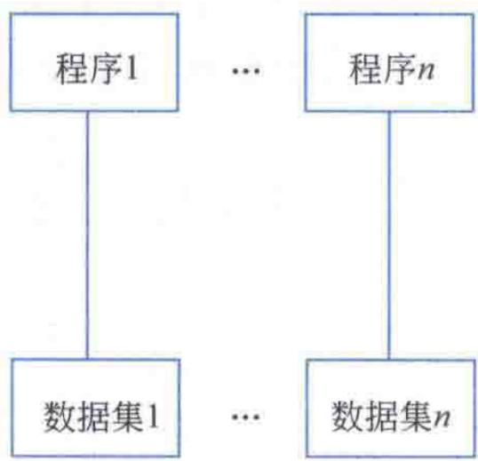
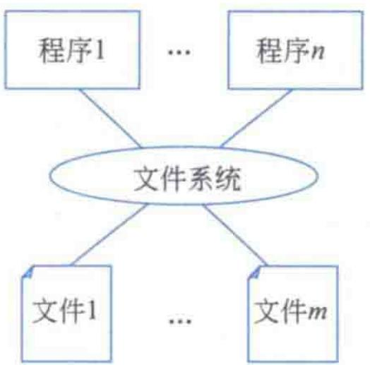
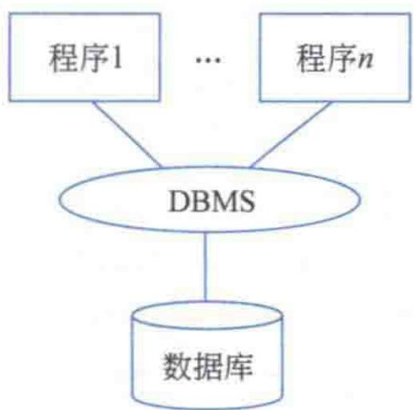
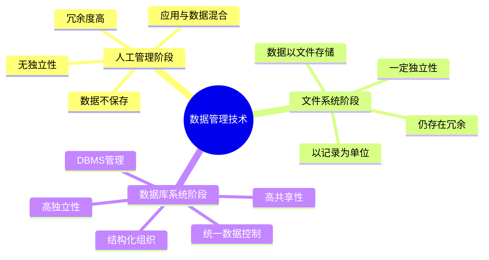

# 第1章-1.1-数据管理技术

## 基本信息
- **课程**：数据库原理与应用
- **章节**：第1章 1.1节 数据管理技术
- **日期**：2026-06-30
- **标签**：#数据管理 #数据库发展 #文件系统 #数据库系统 #人工管理

---

## 重点内容

### ⭐⭐⭐ 核心概念
- **信息与数据**：信息是数据的内涵，数据是信息的符号化表示
- **数据处理与数据管理**：数据管理是数据处理的核心内容
- **数据管理技术三阶段**：人工管理 -> 文件系统 -> 数据库系统

### ⭐⭐ 阶段特征
- **人工管理**：数据不保存、无独立性、冗余度高
- **文件系统**：数据以文件存储、有一定独立性、但冗余仍较大
- **数据库系统**：结构化、共享性好、独立性高、统一控制

### ⭐ 关键区别
- 三个阶段的根本区别在于**应用程序和数据的关系**
- 从"混合"到"部分分离"再到"高度分离"

---

## 详细笔记

### 一、数据管理的概念

#### 1. 信息与数据

**信息（Information）**：现实世界中对客观事物的反映，是经过加工后客观事物反映的数据表现形式，具有潜在或明显的实际应用价值。

> 📚 **课本出处**：第1章 1.1.1节"数据管理的概念"

**信息的主要特征**：

| 特征 | 说明 |
|:----:|:-----|
| 可传递性 | 信息可以传递，但必须有载体，且传递过程消耗能量 |
| 可感知性 | 信息可以被人类感知，感知方式因信息源不同而呈现多样性 |
| 可管理性 | 信息可以被加工、存储、传播、再生和增值 |

**数据（Data）**：描述事物的符号记录，是信息的符号化表示，是信息的载体。

- 符号形式可以是语言、图表、数字、声音等
- 在数据库中，符号形式多表现为记录格式
- 信息的内容不会随着数据表现形式的不同而改变

> 💡 **理解技巧**：数据是"载体"，信息是"内涵"。同一信息可以用不同的数据形式表达，例如学生的成绩信息可以用数字表示，也可以用等级表示。

**信息与数据的关系**：

- 数据是信息的**载体**，可以有多种表现形式
- 信息是数据的**内涵**，仅由客观事物的属性确定
- 实际应用中，"信息处理"和"数据处理"通常意指相同内涵

---

#### 2. 数据处理与数据管理

**数据处理（信息处理）**：用计算机对各种类型数据进行的操作，包括采集、转换、分类、存储、排序、加工、维护、统计和传输等一系列活动。

> 📚 **课本出处**：第1章 1.1.1节"数据处理与数据管理"

- 最终结果可能会产生新的数据和信息
- 目的：从原始数据中提取有价值的、可作决策依据的信息

**数据管理**：数据处理中基本操作的集合，如数据存储、分类、统计和检索等。

- 数据管理是数据处理的**核心内容**
- 数据库系统的基本功能就是数据管理

---

### 二、数据管理技术的发展过程

数据管理技术从20世纪50年代以前便已开始形成和发展，主要经历了**人工管理**、**文件系统**和**数据库系统**三个阶段。

> 📚 **课本出处**：第1章 1.1.2节"数据管理技术的发展过程"

#### 1. 人工管理阶段（~1950年代中期）

> 📚 **课本出处**：第1章 1.1.2节"人工管理阶段"

**时代背景**：
- 世界首台计算机ENIAC于1946年诞生
- 主要应用于科学计算，处理数值数据，数据量不大
- 没有操作系统，没有数据管理软件
- 以批处理方式对数据进行计算
- 存储设备为磁带、卡片等

**主要特点**：

| 特点 | 说明 |
|:----:|:-----|
| 数据不保存 | 数据量小，无需保存；计算机本身没有有效的存储设备 |
| 缺乏独立性 | 数据依赖于应用程序，数据的逻辑结构与程序紧密联系 |
| 冗余度高 | 一组数据只能为一个程序所拥有，不能共享 |

> ⚠️ **常见误区**：人工管理阶段不是说完全不用计算机，而是指计算机没有专门的数据管理软件，数据管理需要人工干预。

#### 📷 图1.1 人工管理阶段

> 📚 **课本出处**：图1.1 展示了人工管理阶段应用程序与数据的关系，应用程序和数据是"混合"在一起的

---

#### 2. 文件系统阶段（1950年代后期~1960年代中期）

> 📚 **课本出处**：第1章 1.1.2节"文件系统阶段"

**时代背景**：
- 计算机除科学计算外，大量用于数据管理
- 已有操作系统，并开发了文件管理系统
- 数据的批处理发展到文件的批处理，可实现一定程度的联机实时处理
- 硬件出现了磁盘、磁鼓等外部存储设备

**主要特点（优点）**：

| 特点 | 说明 |
|:----:|:-----|
| 应用转向数据处理 | 数据处理成为计算机应用的主要目的 |
| 数据以文件存储 | 数据按一定逻辑结构组成文件，通过文件实现外部存储 |
| 一定独立性 | 文件的逻辑结构与存储结构可以自由转换，多程序可访问同一数据 |
| 文件形式多样化 | 产生了索引文件、链接文件、顺序文件等多种文件类型 |
| 以记录为单位存取 | 基本上以记录为单位实现数据的存取 |

**需要改进的三点不足**：

1. **数据和程序并不相互独立，冗余度仍较大** — 数据是面向应用的，不同程序还需建立自己的数据文件
2. **难以保证数据一致性** — 文件之间没有关联机制，更改一个数据时难以同步更新其他副本
3. **数据表达能力有限** — 文件中的数据结构比较单一，难以表示复杂的数据关系

#### 📷 图1.2 文件系统阶段

> 📚 **课本出处**：图1.2 展示了文件系统阶段应用程序通过文件系统完成对数据的访问，实现了数据和程序一定程度的分离

---

#### 3. 数据库系统阶段（1960年代中后期~至今）

> 📚 **课本出处**：第1章 1.1.2节"数据库系统阶段"

**时代背景**：
- 数据量很大，管理功能越来越强大
- 硬件：大容量磁盘、高主频CPU
- 软件：数据库管理系统（DBMS）取代文件系统
- 数据集中存放在数据库中，通过DBMS访问

**主要特点（6点）**：

| 特点 | 说明 |
|:----:|:-----|
| 数据组织的结构化 | 数据按一定结构组织，文件之间有关联，具有统一的逻辑结构 |
| 减少冗余，增强共享 | 数据不再面向特定应用，而是面向整个系统，可为多个应用共享 |
| 保证数据一致性 | 通过建立文件间关联，更新数据时相关数据同步更改 |
| 较高的数据独立性 | 包括物理独立性和逻辑独立性，通过两个映像功能实现 |
| 以数据项为单位存取 | 相对文件系统，实现更小粒度的数据处理 |
| 统一的数据控制 | 安全性控制、完整性控制、并发控制和一致性控制 |

> ⭐ **核心重点**：数据的**结构化**是数据库的主要特征之一，是数据库和文件系统的**最大和根本的区别**。

#### 📷 图1.3 数据库系统阶段

> 📚 **课本出处**：图1.3 展示了数据库系统阶段应用程序通过DBMS对数据进行访问，实现了数据和程序的高度分离

---

## 总结

### 三个阶段特点对比

| 对比项 | 人工管理阶段 | 文件系统阶段 | 数据库系统阶段 |
|:------:|:----------:|:----------:|:----------:|
| **时间** | ~1950年代中期 | 1950年代后期~1960年代中期 | 1960年代中后期~至今 |
| **存储设备** | 磁带、卡片 | 磁盘、磁鼓 | 大容量磁盘 |
| **数据管理者** | 无（人工） | 文件管理系统 | DBMS |
| **数据保存** | 不保存 | 以文件长期保存 | 集中存放在数据库 |
| **数据共享性** | 无共享 | 有一定共享 | 高度共享 |
| **数据独立性** | 无独立性 | 一定独立性 | 高度独立 |
| **数据冗余** | 高 | 较高 | 低 |
| **数据结构** | 无结构 | 记录级结构 | 结构化 |
| **数据存取单位** | 无 | 记录 | 数据项 |
| **数据控制** | 无 | 无 | 安全性/完整性/并发/一致性 |

### 知识点脑图

### 关键要点

1. **信息与数据**：数据是信息的载体，信息是数据的内涵，二者在实际应用中常互换使用
2. **数据管理是数据处理的核心**：数据库系统的基本功能就是数据管理
3. **三阶段的渐进过程**：应用程序与数据从"混合"到"部分分离"再到"高度分离"
4. **数据库系统的核心优势**：结构化、共享性、独立性、一致性
5. **数据结构化**是数据库与文件系统的根本区别

---

## 疑问与思考

### ❓ 待解决问题
1. 信息和数据在实际应用中如何区分使用？什么情况下应该严格区分？
2. 文件系统到数据库系统的转变中，DBMS具体解决了哪些文件系统无法解决的问题？
3. 数据库系统的物理独立性和逻辑独立性分别通过什么机制实现？（详见1.3.2节）
4. 人工管理阶段的"数据依赖于应用程序"具体是什么意思？为什么说修改数据逻辑结构就必须重新组织存储结构？

### 💡 个人理解/技巧
- 信息与数据的关系可以类比：信息是"意思"，数据是"文字"，同样的意思可以用不同的文字表达
- 三个阶段的本质区别可以用一句话概括：数据与程序的分离程度越来越高
- 数据库系统6个特点中，"结构化"是核心，其余5个都是结构化带来的好处
- 文件系统的3个不足恰好对应数据库系统的3个优势：冗余->共享、不一致->一致性、表达有限->结构化

---

## 相关链接

### 本节相关图片
- [图1.1 人工管理阶段](../../../images/ac47afc77943ef8dd344861541a913657306e61fbf0d70fff9e7c5e61d48cd7e.jpg)
- [图1.2 文件系统阶段](../../../images/49d039aa5cefa20ed80dc0815cd11708b7a8e131a0c8ec8aafedf66cf35efc2d.jpg)
- [图1.3 数据库系统阶段](../../../images/8153a54f73aec998ba7131a242b80e5185c588f1c0c204f1c6cc36d5f62ac622.jpg)

### 关联章节
- [第1章-数据库概述](./第1章-数据库概述.md)
- 第1章-1.2-大数据管理技术（待创建）
- 第1章-1.3-数据库系统概述（待创建）
- [第2章-2.1-关系模型](../../第2章-关系数据库理论基础/第2章-2.1-关系模型.md)

---

## 检查清单

- [x] 已理解信息与数据的概念和区别
- [x] 已理解数据处理与数据管理的关系
- [x] 已掌握数据管理技术三阶段的特点
- [x] 已插入课本原图（图1.1、图1.2、图1.3）
- [x] 已记录重点标记
- [x] 已添加课本出处标注

---

*笔记创建时间：2026-06-30*
