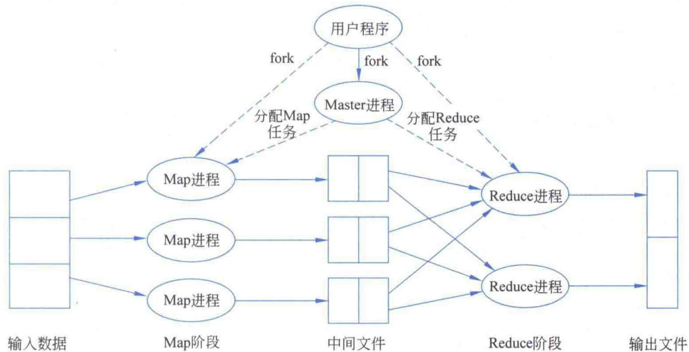
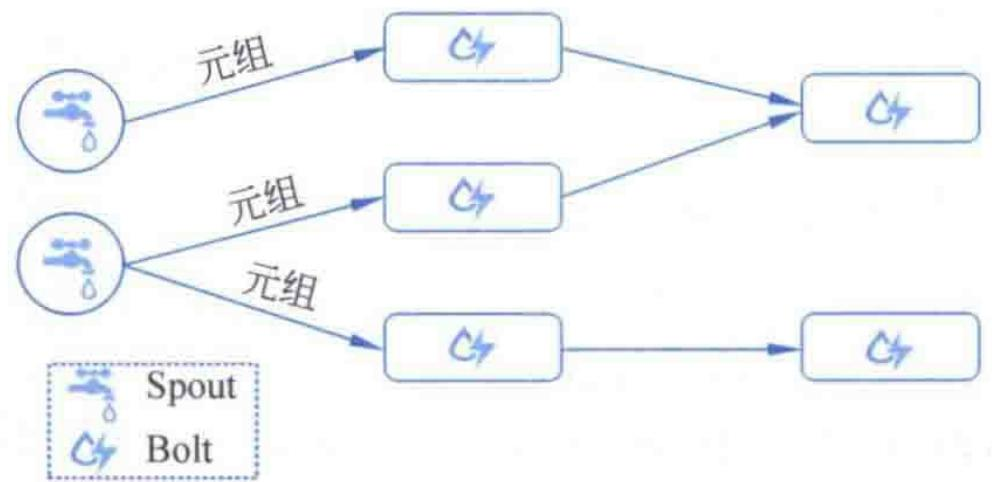
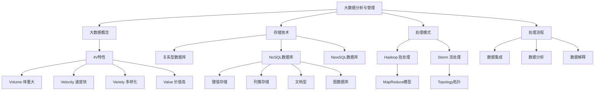

# 第1章 1.2 大数据分析与管理技术（选学）

## 基本信息
- **课程**：数据库原理
- **章节**：第1章 1.2 大数据分析与管理技术（*选学）
- **日期**：2026-06-30
- **标签**：#数据库原理 #大数据 #NoSQL #NewSQL #Hadoop #Storm

## 重点内容

- ⭐⭐⭐ 大数据的4V特性
- ⭐⭐⭐ NoSQL数据库的4种类型及特点
- ⭐⭐ NewSQL数据库的概念与特点
- ⭐ Hadoop批处理模式（MapReduce）
- ⭐ Storm流处理模式
- ⭐ 大数据处理基本流程（集成、分析、解释）

## 详细笔记

### 1.2.1 关于大数据

📚 出处：第1章 1.2.1节"关于大数据"

大数据（big data）指数据规模巨大到无法通过目前主流的软件工具在合理时间内完成处理的数据集。大数据的含义会随技术发展而不断演化。

⭐⭐⭐ **大数据的4V特性**：

| 特性 | 英文 | 含义 | 示例 |
|:----:|:----:|:-----|:-----|
| 体量大 | Volume | 数据量极为庞大，TB/PB级甚至更大 | 对存储和处理提出更高要求 |
| 速度快 | Velocity | 数据高速增长，产生速度不断加快 | 实时处理是挑战 |
| 多样化 | Variety | 包含结构化和非结构化数据 | 文本、视频、图像、语音、图等 |
| 价值高 | Value | 蕴藏巨大价值，但价值密度低 | 监控视频中有价值画面仅几秒 |

💡 理解：4V中Volume和Variety决定了数据的规模和复杂度，Velocity决定了处理的时效要求，Value则是我们进行大数据分析的根本动力。价值密度低是容易忽略的特点。

### 1.2.2 大数据存储技术

📚 出处：第1章 1.2.2节"大数据存储技术"

#### 传统关系型数据库的局限

传统关系型数据库（Oracle、DB2、SQL Server、MySQL）在大数据时代面临以下问题：

1. 无法保证对大数据的查询效率（10亿条记录SQL查询效率极低）
2. 无法应对繁多的数据类型（非结构化数据占比超过90%）
3. 横向可扩展能力不足（难以基于廉价服务器扩充）
4. 很难满足高并发访问需求（每秒上万次读写请求）

#### NoSQL数据库

NoSQL（Not only SQL）是对非关系型数据库的统称，采用非关系数据模型，通常没有固定表结构，没有复杂的查询优化机制，没有严格的ACID约束。

⭐⭐⭐ **NoSQL数据库四大类型**：

| 类型 | 数据模型 | 优点 | 缺点 | 代表产品 |
|:----:|:--------:|:-----|:-----|:---------|
| 键值存储 | 哈希表（Key-Value） | 简单、易部署、查询速度快 | 数据无结构 | Redis、Voldemort、Oracle BDB |
| 列簇存储 | 列簇式存储 | 查找速度快、可扩展性强 | 功能相对局限 | Cassandra、HBase、Riak |
| 文档型 | 键值对（值为结构化数据） | 表结构可变，不需预定义 | 查询性能不高，缺乏统一查询语法 | MongoDB、CouchDB |
| 图数据库 | 图结构 | 可用图算法（最短路径、N度关系） | 需整个图计算 | Neo4J、InfoGrid、Infinite Graph |

💡 理解：键值存储像字典查单词；列簇存储把同一列数据放一起，适合统计分析；文档型存储JSON等半结构化文档；图数据库用节点和边表示关系，适合社交网络。

#### NewSQL数据库

NewSQL数据库兼具NoSQL的海量数据存储管理能力和传统数据库的ACID及SQL特性。

**两个共同特点**：
1. 都支持关系数据模型
2. 都用SQL作为主要访问接口

**代表产品**：

| 产品 | 特点 |
|:----:|:-----|
| Spanner | Google全球分布式同步复制数据库 |
| PostgreSQL | 开源，稳定性强，GIS领域优势 |
| SAP HANA | 基于内存计算，面向企业分析 |
| VoltDB | 基于内存，并发事务处理比传统快45倍 |
| MemSQL | SQL兼容，速度比MySQL快30倍 |
| Amazon RDS / SQL Azure | 云端NewSQL数据库 |

#### 三大存储阵营

```
传统关系型数据库  +  NoSQL数据库  +  NewSQL数据库  =  三大阵营共存
```

📌 考试重点：三大阵营各有应用场景和发展空间，传统关系型数据库并没有被取代，三者共存是当前格局。

### 1.2.3 大数据处理模式

📚 出处：第1章 1.2.3节"大数据处理模式"

大数据处理必须借助并行分布式处理方法，分为**批处理**和**流处理**两种模式。

#### 1. 批处理——Hadoop（MapReduce）

批处理是对数据**先存储后统一处理**。Hadoop是Apache基金会的开源分布式批处理架构，实现了MapReduce编程模型。

**MapReduce三个角色**：
- **Master进程**：负责任务的划分与调度
- **Map进程**：执行Map任务
- **Reduce进程**：执行Reduce任务

**MapReduce执行流程**：
1. 用户程序创建Master进程
2. Master划分任务并分配Map/Reduce进程
3. Map进程读取输入数据，执行Map函数，产生中间结果
4. Reduce进程获取中间结果，排序后执行Reduce函数
5. 输出最终结果到文件

#### 📷 图1.4 MapReduce执行流程



> 📚 出处：图1.4 展示了MapReduce的执行流程：输入数据经Map阶段并行处理产生中间文件，再由Reduce阶段归约整理得到输出文件

**Hadoop优点**：方便部署、容错健壮、容易扩展、使用简单、免费开源。

**Hadoop典型应用**：网络搜索、日志处理、推荐系统、数据分析、视频图像分析、数据集成。

#### 2. 流处理——Storm

流处理把源源不断产生的数据视为数据流，**每当新数据到达就立刻处理并返回结果**，适合实时分析应用。

**Storm核心概念**：
- **拓扑（Topology）**：有向无环图（DAG），一经启动永久运行
- **Spout**：数据产生者，从外部源读取数据喷射元组
- **Bolt**：数据消费者，处理和转发数据元组
- **元组（Tuple）**：数据在拓扑中转发和处理的基本单位

**Storm数据分发策略**：随机分组、按字段分组、全局分组、广播发送。

#### 📷 图1.5 一个典型的Storm拓扑结构



> 📚 出处：图1.5 展示了Storm拓扑结构，Spout产生数据元组，经多个Bolt级联处理

**Storm优点**：易整合、易使用、易扩展、易纠错、可靠的消息处理、免费开源。

#### 批处理 vs 流处理对比

| 对比维度 | 批处理（Hadoop） | 流处理（Storm） |
|:--------:|:-----------------:|:---------------:|
| 处理方式 | 先存储后统一处理 | 数据到达即刻处理 |
| 适用场景 | 大规模离线分析 | 实时分析（点击统计、股票交易、传感器检测） |
| 运行模式 | 作业执行完毕即结束 | 拓扑启动后永久运行 |
| 核心模型 | MapReduce（Master/Map/Reduce） | Topology（Spout/Bolt） |

### 1.2.4 大数据处理的基本流程

📚 出处：第1章 1.2.4节"大数据处理的基本流程"

大数据处理包括三个步骤：

#### 1. 数据集成
对数据源抽取的数据进行访问、解析、规范化、标准化、整合、清洗、抽取等操作，把不同来源、格式的数据有机集中。

📌 重要数据：大数据项目中80%的工作都是清洗数据。数据集成做不好会导致整个项目延期甚至失败。

#### 2. 数据分析
大数据处理的核心环节，大数据的价值通过数据分析得以实现。面临的挑战：
- 价值密度低，需要高效清洗整合
- 产生速度快，需要实时分析，在实时性和准确性间取平衡
- 规模庞大类型庞杂，数据分布特性难以获取

#### 3. 数据解释
将分析结果以用户容易理解的方式展示。常见可视化技术：标签云、历史流、空间信息流等。可视化工具：Tableau、FusionCharts、D3.js、海致BDP等。

## 疑问与思考

❓ **大数据的4V特性之间有什么关系？**

💡 4V是相互关联的：Volume（体量大）和Variety（多样化）决定了数据的规模和复杂度，Velocity（速度快）决定了处理的时效性要求，Value（价值高）是驱动大数据分析的根本原因。正是因为体量大、类型多、产生快，才需要新的存储和处理技术。

❓ **NoSQL和NewSQL的核心区别是什么？**

💡 NoSQL放弃了关系模型和ACID特性，换取了扩展性和性能；NewSQL则试图同时拥有两者的优势——既支持关系模型和ACID事务，又具备NoSQL的横向扩展能力。NewSQL是数据库发展的必然方向。

❓ **批处理和流处理分别适合什么场景？**

💡 批处理适合对已存储的大量数据进行统一分析（如日志分析、推荐系统），对实时性要求不高；流处理适合需要实时响应的场景（如股票交易监控、网页点击统计），数据到达后需要立即处理。

❓ **为什么说"大数据的价值密度低"？**

💡 大数据中蕴含巨大价值，但有用信息占比很小。例如连续监控视频中，有价值的画面可能仅持续几秒钟，其余都是无用数据。因此需要高效分析技术从海量数据中提取有价值的部分。

❓ **关系型数据库在大数据时代有哪些不足？**

💡 主要有四点：查询效率低（大表SQL慢）、无法处理非结构化数据（非结构化超90%）、横向扩展能力差、难以满足高并发需求。这些问题推动了NoSQL和NewSQL的诞生。

## 总结

### 4V特性

| 特性 | 关键词 | 核心挑战 |
|:----:|:------:|:---------|
| Volume | 体量大 | 存储和计算能力 |
| Velocity | 速度快 | 实时处理能力 |
| Variety | 多样化 | 多类型数据管理 |
| Value | 价值高 | 价值密度低，提取困难 |

### NoSQL四大类型

| 类型 | 核心思想 | 适用场景 | 代表产品 |
|:----:|:--------:|:---------|:---------|
| 键值存储 | 简单快速查询 | 缓存、会话管理 | Redis |
| 列簇存储 | 列式存储提高查询 | 分布式海量数据 | HBase、Cassandra |
| 文档型 | 结构化文档存储 | Web应用 | MongoDB |
| 图数据库 | 图结构关系分析 | 社交网络、推荐系统 | Neo4J |

### 知识结构脑图



## 相关链接

- 📚 出处：第1章 1.2节"大数据分析与管理技术"（选学）
- 📚 前置知识：第1章 1.1节"数据管理技术"
- 📚 关联内容：第1章 1.3节"数据库系统概述"
- 🌐 拓展：Apache Hadoop官网 https://hadoop.apache.org/
- 🌐 拓展：Apache Storm官网 https://storm.apache.org/
