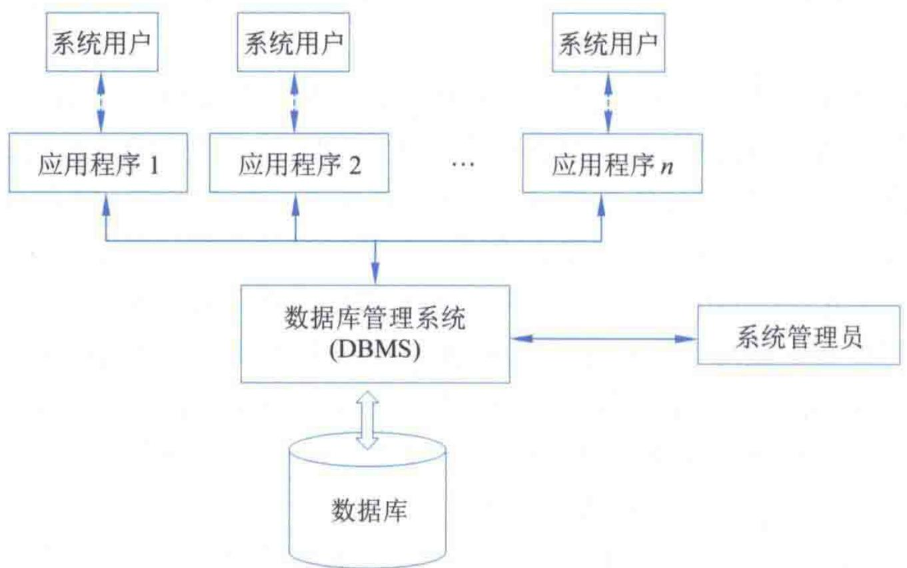
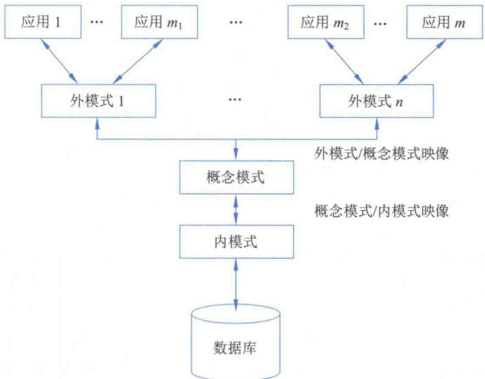
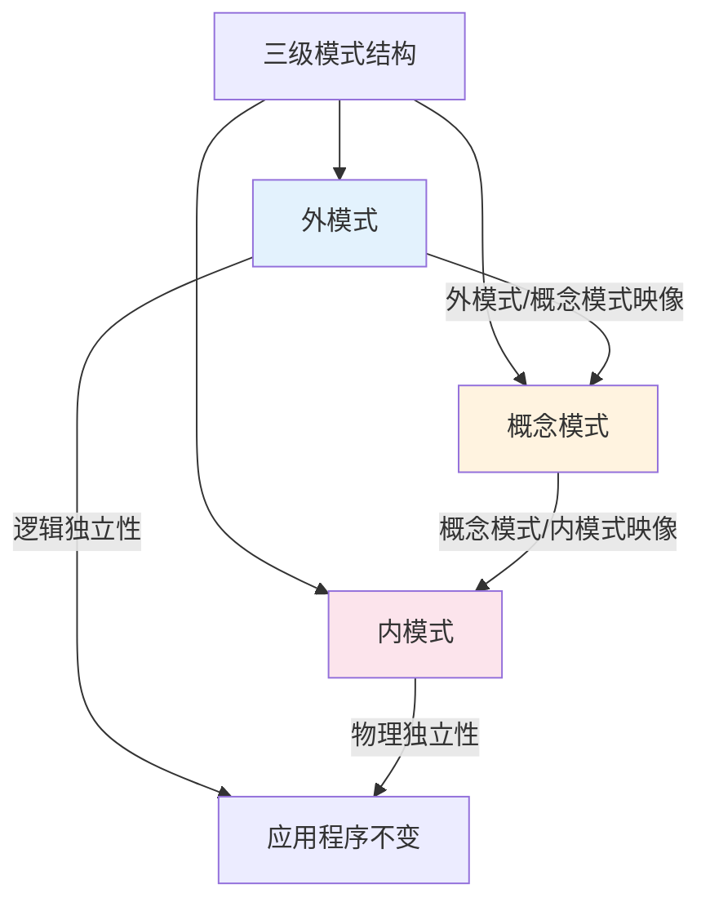
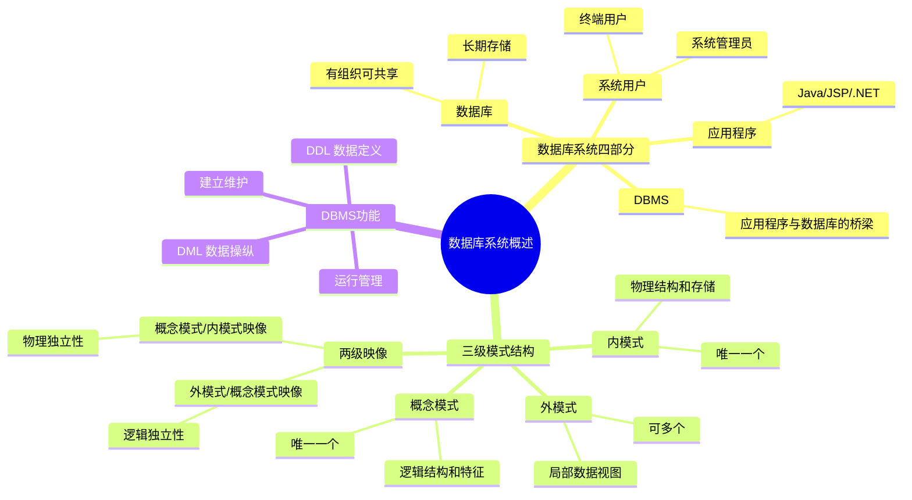

# 第1章-1.3-数据库系统概述

## 基本信息
- **课程**：数据库原理与应用
- **章节**：第1章 1.3节 数据库系统概述
- **日期**：2026-06-30
- **标签**：#数据库系统 #三级模式 #SPARC #DBMS #数据独立性

---

## 重点内容

### ⭐⭐⭐ 核心概念
- **数据库系统四部分**：数据库、DBMS、应用程序、系统用户
- **三级模式结构**：内模式、概念模式、外模式 + 两级映像
- **数据独立性**：逻辑独立性、物理独立性

### ⭐⭐ DBMS的功能
- 数据库定义功能（DDL）
- 数据操纵功能（DML）
- 数据库运行管理功能
- 数据库的建立和维护功能

### ⭐ 关键区别
- 三级模式是SPARC分级结构（1975年提出）的核心
- 外模式/概念模式映像 -> 逻辑独立性
- 概念模式/内模式映像 -> 物理独立性

---

## 详细笔记

### 一、数据库系统

数据库技术是数据管理技术的一次质的飞跃。数据库系统是以数据库技术为核心的计算机应用系统，主要目的是处理生产和实践过程中产生的数据和信息，实现生产过程管理的自动化和信息化。

> 📚 **课本出处**：第1章 1.3节"数据库系统概述"

从逻辑结构看，数据库系统一般包含4部分：数据库、数据库管理系统、应用程序和系统用户，其关系如图1.6所示。

#### 📷 图1.6 数据库系统各部分之间的关系

> 📚 **课本出处**：图1.6 展示了数据库系统四个组成部分之间的关系

---

#### 1. 数据库

数据库是数据库系统存放结构化数据的地方，是**长期存储的、有组织的、可共享的数据的集合**。

- 数据最终以文件形式存储在磁盘上
- 只有DBMS才能对这些文件进行存取操作
- 每个数据库至少有一个数据文件
- SQL Server数据文件以 `.mdf` 或 `.ndf` 为扩展名

> 📚 **课本出处**：第1章 1.3.1节"数据库系统"

#### 2. 数据库管理系统（DBMS）

DBMS是数据库的管理软件，是**应用程序和数据库之间的桥梁**。

- 应用程序必须通过DBMS才能存取数据库中的数据
- DBMS对数据的存取操作最终体现为对数据文件的更新和修改
- 应用程序不能直接执行更新和修改操作

#### 3. 应用程序

应用程序是通过访问数据库来完成用户操作的程序，介于系统用户和DBMS之间。

- 用户通过操作应用程序来获取需求
- 应用程序通过DBMS访问数据库来实现需求
- 开发一般要占大部分时间
- 可用Java、JSP、.NET等技术开发

#### 4. 系统用户

系统用户大致分为两类：

| 用户类型 | 说明 |
|:--------:|:-----|
| 系统用户（终端用户） | 应用程序的用户，整个数据库系统的最终使用者 |
| 系统管理员 | 分不同级别，负责数据库的管理和维护工作 |

> 💡 **理解技巧**：数据库系统四部分的关系可以理解为：用户 -> 应用程序 -> DBMS -> 数据库，层层递进，每一层都有其不可替代的作用。

---

### 二、数据库系统的三级模式结构

三级模式结构是由美国国家标准学会（ANSI）所属的标准计划和要求委员会（SPARC）于1975年提出的，称为**SPARC分级结构**。

> 📚 **课本出处**：第1章 1.3.2节"数据库系统的三级模式结构"

三级模式结构将数据库系统抽象为3个层次，分别为**内模式、概念模式和外模式**。各模式的关系如图1.7所示。

#### 📷 图1.7 数据库系统的SPARC分级结构

> 📚 **课本出处**：图1.7 展示了数据库系统三级模式的层次关系及两级映像

---

#### 1. 内模式（存储模式/物理模式）

内模式是数据在数据库系统中**最底层的表示**。

- 描述数据的**物理结构和存储方式**
- 定义存储记录的类型、存储域的表示、存储记录的物理顺序、索引等
- 一个数据库**仅有一个**内模式

#### 2. 概念模式（逻辑模式/模式）

概念模式用于对整个数据库中数据的**逻辑结构和特征**进行描述。

- 描述实体及其性质与联系
- **不涉及**具体的物理存储方式和硬件环境
- **不涉及**任何特定的应用程序及其开发工具
- 一个数据库也**只有一个**概念模式
- 是现实世界中按用户需求抽象形成的整体逻辑

#### 3. 外模式（子模式/用户模式）

外模式是概念模式的一个**子集**，为某一个特定用户所使用。

- 面向用户，又称子模式或用户模式
- 是应用程序所使用的局部数据的逻辑结构和特征的描述
- 是用户看到的**数据视图**
- 一个数据库可以有**多个**外模式

> 💡 **理解技巧**：三个模式的关系可以这样记忆——外模式是概念模式的子集，概念模式是内模式的逻辑表示，内模式是概念模式的物理表示。即：**外 ⊂ 概念 = 物理的逻辑视图，物理 = 概念的底层实现**。

---

#### 三级模式对应的三个抽象层次

| 抽象层次 | 对应模式 | 描述角度 |
|:--------:|:--------:|:---------|
| 用户级数据库 | 外模式 | 用户看到和使用的用户视图的集合 |
| 概念级数据库 | 概念模式 | 程序开发人员看到和使用的数据库 |
| 物理级数据库 | 内模式 | 从数据的物理存储结构的角度抽象 |

> 📚 **课本出处**：第1章 1.3.2节"数据库系统的三级模式结构"

---

#### 两级映像与数据独立性

DBMS在模式之间提供两级映像功能：

**（1）外模式/概念模式映像 -> 逻辑独立性**

当概念模式需要改变时（如增加新实体、删除实体属性等），只需调整外模式/概念模式之间的映像，以保证**外模式不变**，从而不需要改变依赖于外模式编写的应用程序。

> ⭐ **核心重点**：外模式/概念模式映像功能保证了数据的**逻辑独立性**。

**（2）概念模式/内模式映像 -> 物理独立性**

当数据的物理存储结构（内模式）发生改变时，只需调整概念模式/内模式之间的映像，保证**概念模式保持不变**，从而外模式也不变，进而应用程序也保持不变。

> ⭐ **核心重点**：概念模式/内模式映像功能保证了数据的**物理独立性**。

#### 数据独立性的意义

由于具有物理独立性，使得在数据的物理结构发生改变时，数据的逻辑结构并没有改变，从而应用程序也不需要改变；同时，由于具有逻辑独立性，使得在数据的总体逻辑结构发生改变时，一些应用程序所涉及的局部逻辑结构没有改变，所以也不需要修改这些应用程序。

- 数据的独立性可以有效保证应用程序和数据的**分离**
- 极大地简化了应用程序的设计过程
- 减少了应用程序的编写和维护代价

---

### 三、数据库管理系统

DBMS是数据库系统的一个关键组成部分，应用程序对数据库的操作和访问都是在DBMS的控制下进行的。DBMS可以理解为应用程序与数据库之间具有相应管理功能的接口。

> 📚 **课本出处**：第1章 1.3.3节"数据库管理系统"

DBMS的功能主要包括以下四个方面：

#### 1. 数据库定义功能（DDL）

提供数据定义语言（Data Definition Language, DDL），分别用于定义外模式、概念模式和内模式。

- 用DDL编写的模式称为**源模式**（源外模式、源概念模式、源内模式）
- 经过模式翻译程序翻译后形成**目标模式**
- 目标模式保存在**数据字典**（系统目录）中
- 数据字典是刻画数据库框架结构的，是对**数据库**（而不是数据）的描述

> 📚 **课本出处**：第1章 1.3.3节"数据库定义功能"

#### 2. 数据操纵功能（DML）

提供数据操作语言（Data Manipulation Language, DML），用于实现对数据库的查询、添加、修改和删除等基本操作。

- 查询是最常用的操作，DML又常称为**查询语言**
- 更新操作包括插入、删除和修改

**DML的两种类型**：

| 类型 | 说明 | 特点 |
|:----:|:-----|:-----|
| 宿主型DML | 嵌入到其他高级语言中（C、Java等） | 不能独立使用 |
| 自主型DML | 交互式命令语言 | 每条语句可独立执行 |
| SQL | 集宿主型和自主型于一体 | 既可嵌入也可交互执行 |

**宿主型DML的两种执行方法**：

1. **预编译方法**：预编译程序扫描主语言，识别DML并转换为主语言代码
2. **增强编译方法**：修改扩充主语言编译程序，使其既能编译主语言也能编译DML

#### 3. 数据库运行管理功能

数据库运行管理是DBMS的重要功能之一，是数据库系统能够正确、有效运行的基本保证，主要包括：

| 管理功能 | 说明 |
|:--------:|:-----|
| 存取控制 | 控制用户对数据的访问权限 |
| 安全性检测 | 验证用户身份和权限 |
| 并发控制 | 管理多用户同时访问数据 |
| 完整性约束检查 | 确保数据满足约束条件 |
| 内部维护 | 数据库内部的维护和管理 |

#### 4. 数据库的建立和维护功能

- 数据库初始数据的装载和转换
- 数据库的转储和恢复
- 数据库的重组织
- 性能监视和分析

这些功能主要由DBMS提供的**实用程序**来完成。不同DBMS版本所提供的功能可能不尽相同，中大型系统功能比较齐全，小型系统功能相对较弱。

> 📚 **课本出处**：第1章 1.3.3节"数据库管理系统"

---

## 总结

### 三级模式结构对比

| 对比项 | 内模式 | 概念模式 | 外模式 |
|:------:|:------:|:--------:|:------:|
| **别名** | 存储模式/物理模式 | 逻辑模式/模式 | 子模式/用户模式 |
| **描述内容** | 数据的物理结构和存储方式 | 数据的逻辑结构和特征 | 局部数据的逻辑结构 |
| **抽象层次** | 物理级 | 概念级 | 用户级 |
| **数量** | 仅一个 | 仅一个 | 可多个 |
| **面向对象** | 存储结构 | 程序开发人员 | 最终用户 |
| **是否涉及硬件** | 是 | 否 | 否 |
| **独立性保证** | 概念模式/内模式映像 | — | 外模式/概念模式映像 |

### 知识点脑图

### 关键要点

1. **数据库系统四部分**：数据库、DBMS、应用程序、系统用户，缺一不可
2. **三级模式的核心**：将数据的定义与应用程序分离，实现数据独立性
3. **两级映像是实现数据独立性的关键机制**
4. **DDL定义结构，DML操作数据**——两者分工明确
5. **逻辑独立性**：概念模式改变时，外模式和应用程序不变
6. **物理独立性**：内模式改变时，概念模式、外模式和应用程序都不变

---

## 疑问与思考

### ❓ 待解决问题
1. 三级模式各自的本质作用是什么？为什么需要三个层次而不是两个？
2. 逻辑独立性和物理独立性有什么区别？各自通过什么映像实现？
3. DDL和DML在功能和使用上有何不同？
4. 一个数据库系统中可以有多少个外模式？为什么？

### 💡 个人理解/技巧

- **三级模式的本质作用**：三个模式本质上是对同一数据在三个不同层次上的"视图"——用户看到的是外模式（局部），开发人员看到的是概念模式（全局逻辑），DBMS底层处理的是内模式（物理存储）。这样分层的好处是每层独立变化不影响其他层。

- **逻辑独立性 vs 物理独立性**：
  - 逻辑独立性解决的是"全局逻辑结构变化"时应用程序不变的问题
  - 物理独立性解决的是"底层存储方式变化"时上层都不变的问题
  - 类比：逻辑独立性类似于改了公司的组织架构但每个人的工作内容不变；物理独立性类似于搬了办公室但工作流程不变

- **DDL vs DML**：
  - DDL是"建房子的图纸"——定义数据库结构（建表、改表、删表）
  - DML是"住在房子里的活动"——对数据进行增删改查
  - 一句话区分：DDL管结构，DML管数据

- **外模式数量**：一个数据库可以有多个外模式，每个外模式对应一类用户或应用程序的需求。这就像同一本教材可以有不同版本的笔记，每本笔记只摘录了部分内容

---

## 相关链接

### 本节相关图片
- [图1.6 数据库系统各部分之间的关系](../../../images/1db6b304e6f214e9a3a5cd41df037c31dc1c4132d0c0cabd1d7550904dcb37c1.jpg)
- [图1.7 数据库系统的SPARC分级结构](../../../images/7c3b4cb68040d512c7e104a92b924209a17d7421dec36394c21cdc48ebb17eb1.jpg)

### 关联章节
- [第1章-1.1-数据管理技术](./第1章-1.1-数据管理技术.md)
- [第1章-1.2-大数据管理技术](./第1章-1.2-大数据管理技术.md)
- 第1章-1.4-数据模型（待创建）

---

## 检查清单

- [x] 已理解数据库系统四部分及其关系
- [x] 已掌握三级模式结构及各自特点
- [x] 已理解两级映像与数据独立性
- [x] 已掌握DBMS四大功能（DDL/DML/运行管理/维护）
- [x] 已插入课本原图（图1.6、图1.7）
- [x] 已记录重点标记
- [x] 已添加课本出处标注

---

*笔记创建时间：2026-06-30*
