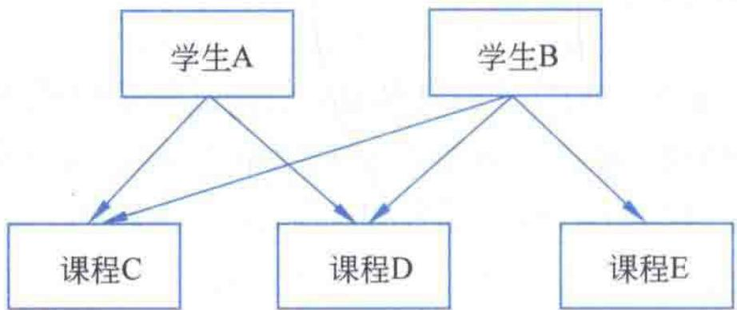
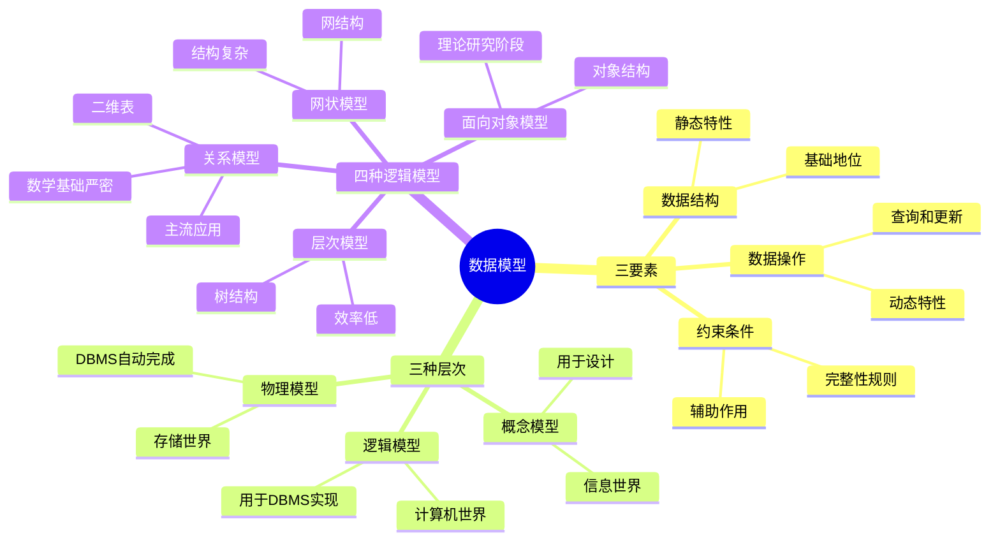

# 第1章-1.4-数据模型

## 基本信息
- **课程**：数据库原理与应用
- **章节**：第1章 1.4节 数据模型
- **日期**：2026-06-30
- **标签**：#数据模型 #层次模型 #网状模型 #关系模型 #面向对象模型

---

## 重点内容

### ⭐⭐⭐ 核心概念
- **数据模型三要素**：数据结构、数据操作、约束条件
- **三种数据模型层次**：概念模型、逻辑模型、物理模型
- **四种逻辑模型**：层次模型、网状模型、关系模型、面向对象模型

### ⭐⭐ 关系模型
- **数据结构**：二维关系（关系表）
- **四大特点**：数学基础、概念单一化、规范化、集合操作
- **三大缺点**：建模能力差、语义表达弱、可扩充性差

### ⭐ 关键区别
- 概念模型面向信息世界，逻辑模型面向计算机世界，物理模型面向存储
- 概念模型 -> 逻辑模型由设计人员完成，逻辑模型 -> 物理模型由DBMS自动完成

---

## 详细笔记

### 一、数据模型的概念

数据库中存放的是数据，这些数据是特定信息的符号表示。数据模型是数据库的形式构架，形式化地描述了数据库的数据组织方式，用于提供信息表示和操作手段。

> 📚 **课本出处**：第1章 1.4节"数据模型"

数据模型可以分为三个层次：

| 模型层次 | 说明 | 作用 |
|:--------:|:-----|:-----|
| 概念模型 | 又称信息模型，从用户观建模 | 描述用户关心的信息结构，用于数据库设计 |
| 逻辑模型 | 对计算机世界中数据对象及联系的描述 | 主要用于DBMS的实现 |
| 物理模型 | 对数据最底层的抽象 | 描述数据在计算机内部的表示和存取方法 |

**模型转换**：
- 概念模型 -> 逻辑模型：由设计人员完成（或借助设计工具辅助）
- 逻辑模型 -> 物理模型：由DBMS自动完成，设计人员一般不需要关心

> 📚 **课本出处**：第1章 1.4节"数据模型"

---

### 二、数据模型的基本要素

数据模型的两大主要功能是用于描述数据及其关联。它包含**3个基本要素**：数据结构、数据操作和数据的约束条件。

> 📚 **课本出处**：第1章 1.4.1节"数据模型的基本要素"

#### 1. 数据结构（静态特性）

数据结构用于描述数据的**静态特性**，是所研究对象类型的集合。根据描述的静态特性的不同，可以将对象分为两类：

| 对象类型 | 说明 | 示例 |
|:--------:|:-----|:-----|
| 数据描述对象 | 描述数据的性质、内容和类型 | 学号、姓名、性别、总成绩等数据项 |
| 数据关系描述对象 | 描述数据间关系信息 | 不同对象类型之间的关系及性质 |

> 📚 **课本出处**：第1章 1.4.1节"数据结构"

- 数据描述对象：应指出对象所包含的项，并对项进行命名，指出数据类型和取值范围
  - 例如：总成绩为数值型，取值为 0~100
- 数据关系描述对象：指明不同对象类型之间的关系及关系的性质
  - 正是由于数据关系描述对象的存在，使得数据库能够建立不同文件之间的关联，与文件系统有着**本质的区别**

#### 2. 数据操作（动态特性）

数据操作用于描述数据的**动态特性**，是对数据库中各种对象类型的实例允许执行的所有操作及相关操作规则的集合。

- 分为**查询**和**更新**两种类型
- 更新操作包括插入、删除和修改
- 需要明确定义操作符、操作规则以及实现操作的语言

> 📚 **课本出处**：第1章 1.4.1节"数据操作"

#### 3. 约束条件（完整性规则）

数据的约束条件是一组**完整性规则的集合**。

- 完整性规则：既定的数据模型中数据及其关系所具有的制约性规则和依存性规则
- 通过限定符合数据模型的数据库状态及其变化来保证数据的**正确性、有效性、相容性**
- 每种数据模型都有自己的完整性约束条件
  - 例如：关系模型的完整性约束主要体现在**实体完整性**和**参照完整性**

> 📚 **课本出处**：第1章 1.4.1节"数据的约束条件"

#### 三要素的关系

| 要素 | 地位 | 作用 |
|:----:|:----:|:-----|
| 数据结构 | **基础** | 决定着数据模型的性质 |
| 数据操作 | **关键** | 确定着数据模型的动态特性 |
| 约束条件 | 辅助 | 保证数据的正确性、有效性和相容性 |

> ⭐ **核心重点**：数据结构是基础，决定着数据模型的性质；数据操作是关键；约束条件主要起辅助作用。

---

### 三、四种主要的逻辑模型

在数据模型的3个要素中，数据结构是基础，它决定着数据模型的性质。典型的数据结构主要有**层次结构、网状结构、关系结构和面向对象结构**等4种。

> 📚 **课本出处**：第1章 1.4.2节"4种主要的逻辑模型"

#### 1. 层次模型（Hierarchical Model）

层次模型是数据库系统中发展较早、技术上也比较成熟的一种数据模型。其数据结构是**树**。

> 📚 **课本出处**：第1章 1.4.2节"层次模型"

**结构特点**：

1. 有且仅有一个节点没有父节点——**根节点**
2. 除根节点外，其他节点有且仅有一个父节点，但可能有0个或多个子节点

**核心术语**：

| 术语 | 说明 |
|:----:|:-----|
| 根节点 | 唯一没有父节点的节点 |
| 兄弟节点 | 具有相同父节点的子节点 |
| 叶节点 | 没有子节点的节点 |

**现实对应**：学校包含多个学院，一个学院包含多个系和研究所等——非常自然地构成层次关系。

**缺点**：

| 缺点 | 说明 |
|:----:|:-----|
| 处理效率低 | 对任何节点的访问都必须从根节点开始，难以反向查询 |
| 不易更新 | 对某一个树节点的操作可能导致整棵树大面积变动 |
| 安全性不好 | 删除一个节点时，其子节点和孙子节点都将被删除 |
| 数据独立性较差 | 要求用户了解数据的物理存储结构，需显式说明存取路径 |

> 📚 **课本出处**：第1章 1.4.2节"层次模型"

---

#### 2. 网状模型

网状模型的数据结构是**网状结构**，是对层次结构进行相应拓展后的结果。

> 📚 **课本出处**：第1章 1.4.2节"网状模型"

**结构特点**：

1. 允许存在一个以上的节点没有父节点
2. 一个节点可以拥有多个父节点

#### 📷 图1.8 网状结构示意图

> 📚 **课本出处**：图1.8 展示了学生与课程之间的网状结构联系

**与层次模型的关键区别**：

| 对比项 | 层次模型 | 网状模型 |
|:------:|:--------:|:--------:|
| 根节点数量 | 仅一个 | 允许多个"根节点" |
| 父节点数量 | 每节点仅一个（根除外） | 可以有多个父节点 |
| 联系实现 | 每个节点只需指定父节点 | 节点需同时指出父节点和子节点 |
| 建模能力 | 描述层次关系 | 描述多对多关系及多个联系 |

**优点**：比层次模型具有更大的灵活性和更强的数据建模能力。

**缺点**：结构的复杂性增加了用户查询和定位的难度；不支持对于层次结构的表述等。

> 💡 **理解技巧**：层次模型是"树"，网状模型是"图"。树是图的特例，所以网状模型是层次模型的推广。

> ⚠️ **常见误区**：层次模型和网状模型对于小数据量缺点不太明显，但当作用于大数据量时，其缺点就显得非常突出。目前基本上退出了市场，取而代之的是关系模型。

---

#### 3. 关系模型

关系模型是当今**应用最广**的一种数据模型。在关系模型中，实体间的联系是通过**二维关系（关系表）**来定义的。

> 📚 **课本出处**：第1章 1.4.2节"关系模型"

**核心术语**：

| 术语 | 别名 | 说明 |
|:----:|:----:|:-----|
| 关系 | — | 一张二维表 |
| 记录 | 元组 | 关系表中的一行 |
| 字段 | 属性 | 关系表中的一列 |
| 域 | 值域 | 字段的取值范围 |
| 数据项 | 分量 | 某一个记录中的一个字段值 |
| 主关键字段 | 主码/主键 | 能唯一标识每一个记录的字段集合 |
| 关系模式 | — | 关系名（属性1，属性2，...，属性n） |

> 📚 **课本出处**：第1章 1.4.2节"关系模型"

**关系模型的四个主要特点**：

| 特点 | 说明 |
|:----:|:-----|
| 严密的数学基础 | 关系代数、关系演算等可用于定性或定量分析 |
| 概念单一化 | 一个关系只表达一个主题，表述直观但建模能力强 |
| 已规范化 | 数据项是最基本单位不可再分，同一字段值类型相同，字段和记录顺序任意 |
| 集合操作 | 操作对象和结果都是记录的集合，不具有明显方向性 |

**关系模型的三个缺点**：

| 缺点 | 说明 |
|:----:|:-----|
| 建模能力差 | 仅限二维关系，无法用递归和嵌套描述复杂关系 |
| 语义表达弱 | 规范化可能强行拆开语义联系，造成不自然分解 |
| 可扩充性差 | 只支持记录集合一种数据结构，无法扩充为层次或网状模型 |

> 📚 **课本出处**：第1章 1.4.2节"关系模型"

> 💡 **理解技巧**：关系模型用"表"这种简单直观的方式表示所有关系。优点是简单规范有数学基础，缺点是现实世界中很多复杂关系用表表示时会丢失语义信息。

---

#### 4. 面向对象模型

面向对象方法（OOP）是按照人类认识世界的方法和思维方式来分析和解决问题。由这种方法进行建模和表示而形成的数据模型就是面向对象模型。

> 📚 **课本出处**：第1章 1.4.2节"面向对象模型"

- 目前相关理论和方法**还不够成熟**
- 主要处于**理论研究和实验阶段**
- 课本未作过多介绍

---

## 总结

### 四种逻辑模型对比

| 对比项 | 层次模型 | 网状模型 | 关系模型 | 面向对象模型 |
|:------:|:--------:|:--------:|:--------:|:------------:|
| **数据结构** | 树 | 网状 | 二维表 | 对象 |
| **父子关系** | 一对一（根除外） | 多对多 | 表间关系 | 对象间关系 |
| **建模能力** | 较弱 | 较强 | 中等 | 强 |
| **查询复杂度** | 高（从根开始） | 高（需熟悉逻辑结构） | 低（集合操作） | 中 |
| **用户要求** | 需了解物理存储 | 需熟悉逻辑结构 | 简单直观 | 需掌握OOP |
| **理论基础** | 成熟 | 成熟 | 严密数学基础 | 尚不成熟 |
| **当前地位** | 基本退出市场 | 基本退出市场 | 主流应用 | 研究阶段 |
| **典型缺陷** | 效率低/安全性差 | 结构复杂 | 复杂建模差 | 不够成熟 |

### 知识点脑图

### 关键要点

1. **三要素中数据结构是基础**，决定着数据模型的性质
2. **概念模型用于设计，逻辑模型用于实现**，二者转换由设计人员完成
3. **层次模型是树结构**，每个节点最多一个父节点
4. **网状模型是层次模型的推广**，允许节点有多个父节点
5. **关系模型是当今主流**，用二维表表示所有关系，数学基础严密
6. **关系模型的规范化是双刃剑**——保证了数据完整性，但也限制了建模能力和可扩充性
7. **层次模型和网状模型已基本退出市场**，关系模型占据主导地位

---

## 疑问与思考

### ❓ 待解决问题
1. 数据模型三要素之间的关系是什么？为什么说数据结构是基础？
2. 四种逻辑模型各自适用于什么场景？为什么关系模型能成为主流？
3. 关系模型为什么能成为当今主流模型？

### 💡 个人理解/技巧

- **三要素的关系**：可以类比盖房子——数据结构是"地基和框架"（决定房子是什么样的），数据操作是"门和通道"（决定人在房子里怎么活动），约束条件是"安全规范"（确保房子不会倒塌）。地基和框架决定了房子的基本形态，所以是基础。

- **四种模型的演进逻辑**：
  - 层次模型只能描述"一对多"（一个父亲多个孩子），现实世界很多关系描述不了
  - 网状模型推广了层次模型，允许"多对多"，但结构太复杂用户难以使用
  - 关系模型用简单的二维表解决了复杂性问题，同时有严密数学支撑
  - 面向对象模型试图更自然地映射现实世界，但还不够成熟

- **关系模型成为主流的原因**：
  1. **简单直观**——二维表人人都能理解
  2. **数学基础严密**——关系代数和关系演算提供了理论保证
  3. **操作统一**——集合操作不区分方向，使用简便
  4. **规范化**——减少了数据冗余和不一致
  5. **SQL标准化**——使得不同DBMS有了统一的语言接口

- **层次模型 vs 网状模型**：层次模型是"严格的上下级关系"（每个节点只能有一个上级），网状模型是"交叉关系"（一个节点可以有多个上级）。用学校类比：层次模型是"学校->学院->系"，网状模型是"学生同时属于多个社团"

---

## 相关链接

### 本节相关图片
- [图1.8 网状结构示意图](../../../images/a22c3444a0cde589d11474f2f87b47ced6e77748ad2c919a9292e9ef7abe3e57.jpg)

### 关联章节
- [第1章-1.1-数据管理技术](./第1章-1.1-数据管理技术.md)
- [第1章-1.2-大数据管理技术](./第1章-1.2-大数据管理技术.md)
- [第1章-1.3-数据库系统概述](./第1章-1.3-数据库系统概述.md)
- [第2章-2.1-关系模型](../../第2章-关系数据库理论基础/第2章-2.1-关系模型.md)

---

## 检查清单

- [x] 已理解数据模型三要素及关系
- [x] 已掌握四种逻辑模型的结构和特点
- [x] 已理解层次模型和网状模型的异同
- [x] 已掌握关系模型的术语、特点和缺点
- [x] 已插入课本原图（图1.8）
- [x] 已记录重点标记
- [x] 已添加课本出处标注

---

*笔记创建时间：2026-06-30*
