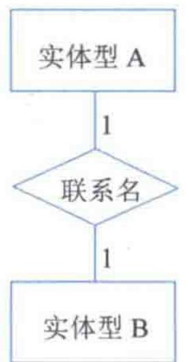
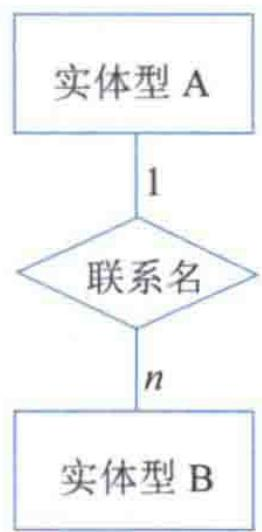
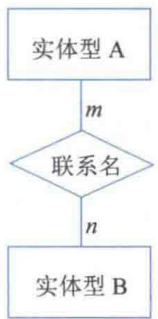
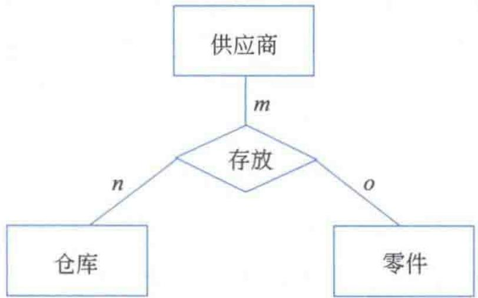
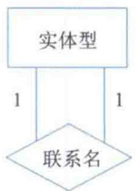
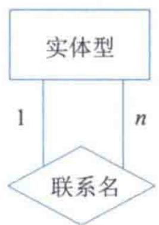
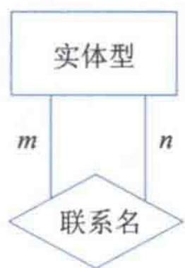
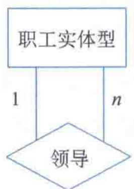
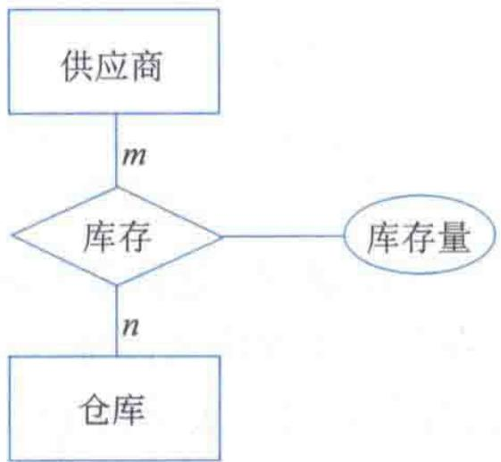
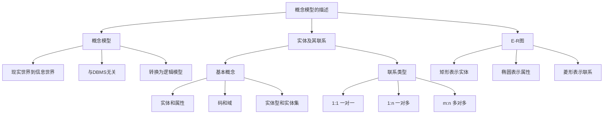

# 第1章 1.5 概念模型的描述

## 基本信息
- **课程**：数据库原理
- **章节**：第1章 1.5 概念模型的描述
- **日期**：2026-06-30
- **标签**：#数据库原理 #概念模型 #E-R图 #实体联系

## 重点内容

- ⭐⭐⭐ 概念模型的定义与作用
- ⭐⭐⭐ 实体间的三种联系类型（1:1、1:n、m:n）
- ⭐⭐⭐ E-R图的表示方法（矩形、椭圆、菱形）
- ⭐ 实体型、实体集、码、域等基本概念
- ⭐ 联系属性的表示

## 详细笔记

### 1.5.1 概念模型

📚 出处：第1章 1.5.1节"概念模型"

将现实世界中的实际问题转换为计算机能够接受和处理的数据模型，需要经过建模和转换过程：

1. **现实世界** -> **建模** -> **概念模型（信息世界）**
2. **概念模型（信息世界）** -> **转换** -> **逻辑模型（计算机世界）**

概念模型是实际问题经过抽象、建模后得到的一种信息结构，是实际问题在信息世界中的表示和描述。它与任何具体的计算机系统和DBMS都无关。

#### 📷 图1.9 从现实世界到计算机世界的转换过程

> 📚 出处：图1.9 展示了原问题（现实世界）经建模形成概念模型（信息世界），再转换为逻辑模型（计算机世界）的过程

💡 理解：概念模型去掉了原问题中无关的琐碎属性，让我们可以专注于问题解决方案的设计，而不必考虑实现细节。

### 1.5.2 实体及其联系

📚 出处：第1章 1.5.2节"实体及其联系"

#### 1. 实体
客观存在的并可以相互区分的事物。可以是具体的人、事、物（如张三、1号体育场），也可以是抽象的概念（如教师、学生、课程），还可以是事物间的关联（如选修）。

#### 2. 属性
实体所具有的特性。建模时仅选择那些确定问题性质的属性，忽略无关属性。

#### 3. 码（关键字）
一个或多个属性的集合，可以唯一标识每个实体。例如学号是学生实体的码。

#### 4. 域
一个属性的取值范围。例如成绩的域为 0~100。

#### 5. 实体型
用实体名和实体属性名的集合来共同刻画同一类实体。例如学生（学号、姓名、性别、籍贯、成绩）是一个实体型。

#### 6. 实体集
实体的集合。同一个实体集中的实体一般是指有相同类型的实体。

#### 7. 联系
事物之间的关系在信息世界中的反映，分为实体内部的联系和实体之间的联系。

**三种联系类型**（假设 A 和 B 为两个实体集）：

| 联系类型 | 符号 | 定义 |
|:--------:|:----:|:-----|
| 一对一 | 1:1 | A 中每个实体，B 中至多一个与之对应，反之亦然 |
| 一对多 | 1:n | A 中每个实体，B 中有 n 个与之对应；B 中每个实体，A 中至多一个 |
| 多对多 | m:n | A 中每个实体，B 中有 n 个与之对应；B 中每个实体，A 中有 m 个 |

### 1.5.3 E-R图

📚 出处：第1章 1.5.3节"E-R图"

E-R图（Entity Relationship Diagram）提供表示实体型、属性和联系的方法。

⭐⭐⭐ **E-R图三要素**：

| 图形 | 表示对象 | 说明 |
|:----:|:--------:|:-----|
| 矩形 | 实体 | 矩形框内写明实体名 |
| 椭圆 | 属性 | 用无向边与实体连接 |
| 菱形 | 联系 | 用无向边与相关实体连接，旁标联系类型 |

#### （1）实体及其属性的表示

#### 📷 图1.10 学生实体及其属性的E-R图

> 📚 出处：图1.10 展示了学生实体（矩形）及其三个属性学号、姓名、成绩（椭圆）的E-R图

#### （2）两个实体型之间联系的表示

**一对一联系（1:1）**：

#### 📷 图1.11(a) 一对一联系

> 📚 出处：图1.11(a) 两个实体型A和B之间的一对一联系

**一对多联系（1:n）**：

#### 📷 图1.11(b) 一对多联系

> 📚 出处：图1.11(b) 两个实体型A和B之间的一对多联系

**多对多联系（m:n）**：

#### 📷 图1.11(c) 多对多联系

> 📚 出处：图1.11(c) 两个实体型A和B之间的多对多联系

#### （3）多个实体型之间联系的表示

多个实体型之间的联系可以由两个实体型之间联系的表示方法推广得到。例如 3 个实体型之间的联系表示为（m:n:o）。

#### 📷 图1.12 三个实体型之间多对多联系

> 📚 出处：图1.12 供应商、仓库、零件三个实体型之间的多对多联系（m:n:o）

#### （4）实体型内部联系的表示

同一个实体型内部的实体之间也可能有联系。

**实体型内一对一联系（1:1）**：

#### 📷 图1.13(a) 实体型内1:1联系

> 📚 出处：图1.13(a) 实体型内部的一对一联系

**实体型内一对多联系（1:n）**：

#### 📷 图1.13(b) 实体型内1:n联系

> 📚 出处：图1.13(b) 实体型内部的一对多联系

**实体型内多对多联系（m:n）**：

#### 📷 图1.13(c) 实体型内m:n联系

> 📚 出处：图1.13(c) 实体型内部的多对多联系

**实例——职工实体型内的一对多联系**：

#### 📷 图1.14 职工实体型内的一对多联系

> 📚 出处：图1.14 职工实体型中领导与被领导的一对多联系

#### （5）联系属性的表示

联系也可以有自己的属性。例如库存是供应商和仓库之间的联系，库存量就是库存的一个属性。

#### 📷 图1.15 联系属性的表示

> 📚 出处：图1.15 供应商与仓库之间联系"库存"的属性"库存量"的表示

## 疑问与思考

❓ **概念模型和逻辑模型有什么区别？**

💡 概念模型是信息世界的表示，与具体DBMS和计算机系统无关，用于抽象和描述问题；逻辑模型是计算机世界的表示，是概念模型转换为特定DBMS支持的数据模型后的结果。建模过程为：现实世界 -> 概念模型 -> 逻辑模型。

❓ **三种联系类型如何区分？**

💡 关键看对应关系：1:1 是"唯一对应"（如一个班级对应一个教室），1:n 是"一对多"（如一个班级有多个学生），m:n 是"相互多对多"（如学生与课程的选修关系）。判断方法是分别从两个方向看对应数量。

❓ **E-R图中联系也可以有属性吗？**

💡 是的。联系本身也可以有属性，例如供应商和仓库之间的"库存"联系就有"库存量"这一属性。联系属性用椭圆表示，连接到菱形上。

❓ **实体型和实体集有什么区别？**

💡 实体型强调"类型相同"，用实体名和属性名集合刻画同一类实体；实体集强调"集合"，即实体的聚集。在实际应用中二者经常等同使用。

❓ **E-R图中如何表示多个实体型之间的联系？**

💡 可以由两个实体型之间联系的表示方法推广。例如三个实体型A、B、C之间的联系表示为（m:n:o），用一个菱形连接三个矩形即可。

## 总结

### 联系类型对比表

| 联系类型 | 符号 | 含义 | 典型举例 | E-R图标号 |
|:--------:|:----:|:-----|:---------|:---------:|
| 一对一 | 1:1 | A中每个实体在B中至多一个对应，反之亦然 | 班级与教室 | 1 - 1 |
| 一对多 | 1:n | A中每个实体在B中有n个对应，B中每个在A中至多一个 | 班级与学生 | 1 - n |
| 多对多 | m:n | A中每个实体在B中有n个对应，反之亦然 | 学生与课程 | m - n |

### E-R图三要素

| 图形 | 名称 | 作用 | 连接方式 |
|:----:|:----:|:-----|:---------|
| 矩形 | 实体 | 表示实体型，内写实体名 | 通过无向边连接属性或联系 |
| 椭圆 | 属性 | 表示实体或联系的属性 | 通过无向边连接实体或联系 |
| 菱形 | 联系 | 表示实体间的联系，内写联系名 | 通过无向边连接实体，旁标联系类型 |

### 知识结构脑图

## 相关链接

- 📚 出处：第1章 1.5节"概念模型的描述"
- 📚 前置知识：第1章 1.4节"数据模型"
- 📚 后续应用：第3章 3.3.1节"概念结构设计（E-R图）"
