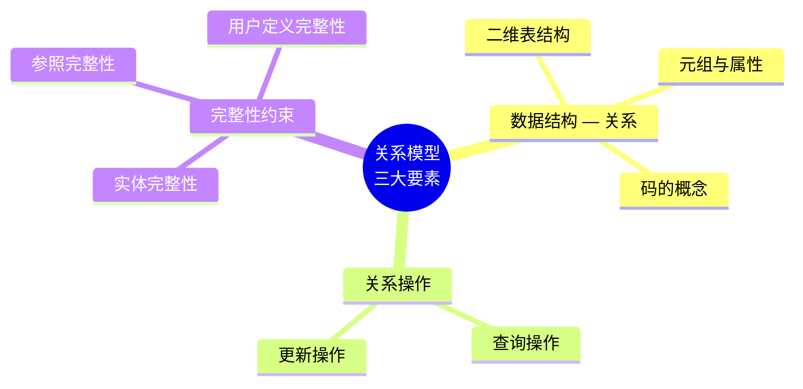
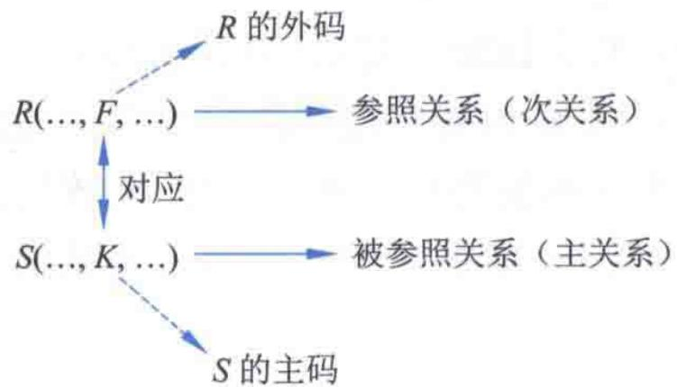
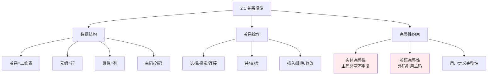

# 第2章-2.1-关系模型

## 基本信息
- **课程**：数据库原理与应用
- **章节**：第2章 2.1节 关系模型
- **日期**：2026-05-19
- **标签**：#关系模型 #数据结构 #完整性约束 #数据库基础

---

## 重点内容

### ⭐⭐⭐ 核心概念
- **关系**：二维表，有限元组的集合
- **主码**：唯一标识元组的最小属性集
- **外码**：引用其他关系主码的属性
- **关系模式**：关系的"型"，由属性构成

### ⭐⭐ 完整性约束
- **实体完整性**：主码非空且不重复
- **参照完整性**：外码必须引用有效主码或为空
- **用户定义完整性**：针对具体应用的约束

### ⭐ 关系操作
- **查询操作**：选择、投影、连接、除
- **集合运算**：并、交、差、笛卡儿积
- **更新操作**：插入、删除、修改

---

## 详细笔记

### 一、关系模型的三大要素

---

### 二、关系模型的数据结构——关系

#### 1. 核心定义（定义2.1）

令 $D = D_1 \times D_2 \times \dots \times D_n$ 为笛卡儿积，则 $D$ 的任何**非空子集 $R$** 都称为 $n$ 元关系。

#### 2. 关键术语对照表

| 术语 | 定义 | 对应概念 |
|-----|------|---------|
| **关系** | 一张二维表，有限元组的集合 | 数据表 |
| **元组** | 二维表中的一行 | 记录 |
| **属性** | 二维表中的一列 | 字段 |
| **分量** | 元组中的一个属性值 | 数据项 |
| **域** | 属性的取值范围 | 字段值域 |
| **候选码** | 能唯一标识元组的最小属性集 | - |
| **主码** | 选定的候选码 | 主键 |
| **主属性** | 包含在候选码中的属性 | - |
| **非主属性** | 不包含在候选码中的属性 | - |

#### 3. 关系的6条基本性质 ⭐

1. **列是同质的** — 每列中的分量是同一类型的数据
2. **属性名唯一** — 不允许存在相同属性名
3. **列的顺序任意** — 列的次序可以任意变换
4. **元组不重复** — 不允许存在两个相同的元组
5. **行的顺序任意** — 行的次序可以任意变换
6. **分量不可再分** — 不允许表中套表（1NF的基础）

#### 4. 关系模式（定义2.2）

$$R(A_1, A_2, \dots, A_n)$$

- **关系模式**是关系的"型"，静态、相对稳定
- **关系**是关系模式的"值"，动态、随时间变化
- 主码属性加**下划线**表示，如：$R(\underline{A}, B, C)$

---

### 三、示例关系表

#### 📋 表2.3 student关系表（学生表）

| 学号 | 姓名 | 性别 | 专业号 |
|-----|------|------|-------|
| 202001 | 刘洋 | 男 | z1 |
| 202002 | 李思思 | 女 | z2 |
| 202003 | 陈永江 | 男 | z2 |
| 202004 | 王大河 | 男 | z3 |
| 202005 | 吕文星 | 男 | z3 |
| 202006 | 李鑫 | 女 | NULL |

> 📚 **课本出处**：表2.3 学生关系表
> - **主码**：学号
> - **外码**：专业号（引用major表的专业号，可为NULL）
> - **说明**：李鑫的专业号为NULL，表示尚未分配专业

#### 📋 表2.4 course关系表（课程表）

| 课程号 | 课程名 | 学分 |
|-------|--------|------|
| 13986 | 数据库原理 | 4 |
| 13987 | 操作系统 | 4 |
| 13988 | 数据结构 | 6 |
| 13989 | 软件工程 | 3 |

> 📚 **课本出处**：表2.4 课程关系表
> - **主码**：课程号
> - **说明**：用于展示实体完整性和参照完整性

#### 📋 表2.5 SC关系表（选课表）

| 学生编号 | 课程编号 | 成绩 |
|---------|---------|------|
| 202001 | 13989 | 78 |
| 202001 | 13987 | 85 |
| 202002 | 13989 | 89 |
| 202003 | 13986 | 92 |

> 📚 **课本出处**：表2.5 选课关系表
> - **主码**：{学生编号, 课程编号}
> - **外码**：学生编号引用student表的学号，课程编号引用course表的课程号
> - **说明**：用于展示实体完整性和参照完整性

#### 📋 表2.6 major关系表（专业表）

| 专业号 | 专业名 |
|-------|--------|
| K0301 | 202001 |
| K0302 | 202002 |
| K0303 | 202001 |
| K0304 | 202003 |

> 📚 **课本出处**：表2.6 专业关系表
> - **主码**：专业号
> - **说明**：专业号是学生表的外码，用于展示参照完整性（外码可为NULL）

---

### 四、关系的完整性约束

#### 1. 实体完整性约束 ⭐⭐⭐

**要求**：主码属性的值**不能为空或部分为空**

**原因**：
- 主码用于区分关系中的元组
- 如果主码为空，就无法标识和区分元组

**示例验证**（基于表2.3 student表）：

| 学号（主码） | 姓名 | 是否合法 |
|-----------|-------|---------|
| 202001 | 刘洋 | ✅ 合法，有值且唯一 |
| NULL | 李鑫 | ❌ **不合法！主码不能为空** |
| 202001 | 张三 | ❌ **不合法！主码不能重复** |

> 💡 **关键**：实体完整性保证每个实体都是可标识、可区分的

---

#### 2. 参照完整性约束 ⭐⭐⭐

**定义2.8**：设F是基本关系R的一个或一组属性，但不是关系R的码，$K_s$是基本关系S的主码。如果F与$K_s$相对应，则称F是R的**外码**。

##### 📷 图2.1 参照关系

> 📚 **课本出处**：图2.1 展示了参照关系和被参照关系之间的联系，外码F引用被参照关系的主码K

**参照完整性规则**：
- 外码 $F$ 的每个值必须等于被参照关系主码 $K$ 的**某个元组的主码值**，**或为空**

**示例分析**（基于表2.5 SC表）：

| SC表中的学生编号 | student表中是否存在 | 是否合法 |
|----------------|-------------------|---------|
| 202001 | ✅ 存在 | ✅ 合法 |
| 202002 | ✅ 存在 | ✅ 合法 |
| 202999 | ❌ 不存在 | ❌ **不合法！违反参照完整性** |

**外码能否为空？**

| 场景 | 能否为空 | 示例 |
|-----|---------|------|
| 外码是主码的一部分 | ❌ 不能 | SC表中的学生编号和课程编号（复合主码）|
| 外码不是主码 | ✅ 可以 | student表中的专业号（李鑫的专业号为NULL）|

---

#### 3. 用户定义的完整性约束

- 针对某一具体应用需求制定的约束
- 例如：成绩取值范围 $0 \sim 100$
- 某些属性值不能为空或必须唯一

**示例**（基于表2.5 SC表）：
- Score取值范围：0-100
- Score可以为NULL（表示尚未考试）

---

### 五、关系操作

#### 1. 查询操作

| 操作 | 说明 | 操作对象 |
|-----|------|---------|
| **选择** | 按条件检索元组 | 行操作 |
| **投影** | 抽取指定属性组成新关系 | 列操作 |
| **连接** | 两个关系拼接 | 行列操作 |
| **除** | 行列同时参加的运算 | 复杂操作 |

#### 2. 集合运算（要求相同属性个数）

| 操作 | 符号 | 说明 |
|-----|------|------|
| **并** | $R \cup S$ | 元组合并 |
| **交** | $R \cap S$ | 共同元组 |
| **差** | $R - S$ | R有S无的元组 |
| **笛卡儿积** | $R \times S$ | 元组首尾拼接 |

#### 3. 更新操作

- **插入**：把元组集合插入到已有关系中
- **删除**：删除满足条件的所有元组
- **修改**：更改满足条件的元组分量值

> 💡 **特点**：关系操作的对象和结果都是**元组的集合**

---

### 本节小结图

---

## 疑问与思考

### ❓ 待解决问题
1. 关系模式和关系的区别在实际应用中如何体现？
2. 外码为空值的情况在什么场景下会出现？

### 💡 个人理解/技巧
- 关系模型用二维表组织数据，直观易懂
- 完整性约束是数据库数据正确性的保障
- 主码和外码是建立表之间关联的基础

---

## 相关链接

### 本节相关图片
- [图2.1 参照关系](../../../images/582074804e4a1f75749d7a9233da57721e593a282a2418916ae44863adbb94a5.jpg)

### 关联章节
- [第2章-2.2-关系代数](./第2章-2.2-关系代数.md)
- [第2章-2.3-关系数据库](./第2章-2.3-关系数据库.md)
- [第2章-2.4-函数依赖](./第2章-2.4-函数依赖.md)

---

## 检查清单

- [x] 已理解关系的6条基本性质
- [x] 已理解主码、外码的概念
- [x] 已理解三种完整性约束
- [x] 已插入课本原图
- [x] 已记录重点标记

---

*笔记创建时间：2026-05-19*
