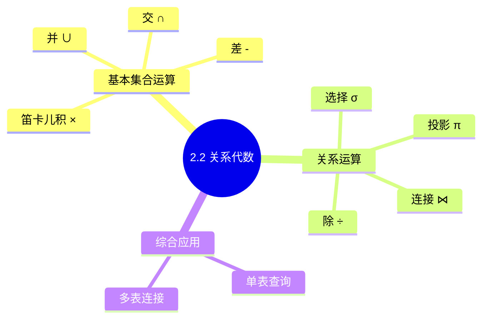
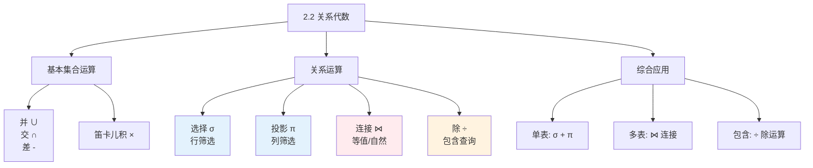

# 第2章-2.2-关系代数

## 基本信息
- **课程**：数据库原理与应用
- **章节**：第2章 2.2节 关系代数
- **日期**：2026-05-19
- **标签**：#关系代数 #选择 #投影 #连接 #除运算 #SQL基础

---

## 重点内容

### ⭐⭐⭐ 核心运算
- **选择（σ）**：行筛选，按条件选择元组
- **投影（π）**：列筛选，选取指定属性
- **连接（⋈）**：多表查询，等值连接与自然连接
- **除（÷）**：包含查询，"至少/全部"类问题

### ⭐⭐ 基本集合运算
- **并（∪）**、**交（∩）**、**差（−）**、**笛卡儿积（×）**

### ⭐ 综合应用
- 单表查询：选择 + 投影
- 多表查询：连接运算
- 包含查询：除运算

---

## 详细笔记

### 一、关系代数概述

关系代数是关系模型的理论基础，是关系数据库操纵语言的一种数学表达。

---

### 二、基本集合运算

**前提**：$R$ 和 $S$ 是 $n$ 元关系，对应属性取自同一个值域

| 运算 | 符号 | 数学定义 | 说明 |
|-----|------|---------|------|
| **并** | $R \cup S$ | $\{x \mid x \in R \vee x \in S\}$ | $R$ 或 $S$ 的元组合并 |
| **交** | $R \cap S$ | $\{x \mid x \in R \wedge x \in S\}$ | $R$ 和 $S$ 的共同元组 |
| **差** | $R - S$ | $\{x \mid x \in R \wedge x \notin S\}$ | 属于$R$但不属于$S$ |
| **笛卡儿积** | $R \times S$ | $\{x_r x_s \mid x_r \in R \wedge x_s \in S\}$ | 元组首尾拼接 |

> 💡 **注意**：若 $R$ 有 $k_r$ 个元组，$S$ 有 $k_s$ 个元组，则 $R \times S$ 有 $k_r \times k_s$ 个元组

---

### 三、关系运算

#### 1. 选择运算（σ）⭐⭐⭐

**定义**：从关系 $R$ 中选取满足条件 $\tau$ 的元组

$$\sigma_{\tau}(R) = \{x \mid x \in R \wedge \tau(x) = \text{true}\}$$

**特点**：
- 行运算（筛选行）
- 条件可以是：$=, \neq, <, >, \leq, \geq$ 及逻辑运算 $\wedge, \vee, \neg$

##### 📋 示例数据表：表2.9 stu_info（学生信息表）

| SNo | SName | SSex | SAge | SDept |
|-----|-------|------|------|-------|
| 20170201 | 刘洋 | 男 | 20 | 计算机系 |
| 20170202 | 王晓珂 | 女 | 19 | 计算机系 |
| 20170203 | 王伟志 | 男 | 20 | 智能技术系 |
| 20170204 | 李思思 | 女 | 21 | 计算机系 |
| 20170205 | 蒙恬 | 女 | 20 | 大数据技术系 |

> 📚 **课本出处**：表2.9 用于展示选择运算

**【例2.1】查询计算机系的男生**
$$\sigma_{\text{SDept}='\text{计算机系}' \wedge \text{SSex}='\text{男}'}(\text{stu\_info})$$

**结果**：

| SNo | SName | SSex | SAge | SDept |
|-----|-------|------|------|-------|
| 20170201 | 刘洋 | 男 | 20 | 计算机系 |

---

#### 2. 投影运算（π）⭐⭐⭐

**定义**：从关系 $R$ 中选取指定属性列 $L$ 组成新关系

$$\pi_{L}(R) = \{x(L) \mid x \in R\}$$

**特点**：
- 列运算（筛选列）
- 自动去重

**【例2.2】查询所有学生的姓名和所在系**
$$\pi_{\{\text{SName}, \text{SDept}\}}(\text{stu\_info})$$

**结果**：

| SName | SDept |
|-------|-------|
| 刘洋 | 计算机系 |
| 王晓珂 | 计算机系 |
| 王伟志 | 智能技术系 |
| 李思思 | 计算机系 |
| 蒙恬 | 大数据技术系 |

---

#### 3. 连接运算（⋈）⭐⭐⭐

**定义**：从两个关系的笛卡儿积中选取满足连接条件的元组

$$R \bowtie_{\theta} S = \{x_r x_s \mid x_r \in R \wedge x_s \in S \wedge x_r(A) \theta x_s(B)\}$$

**类型**：
- **等值连接**：$\theta$ 为 $=$
- **自然连接**：特殊的等值连接，自动去掉重复列

##### 📋 示例数据表

**表2.9 stu_info（学生信息表）**

| SNo | SName | SSex | SAge | SDept |
|-----|-------|------|------|-------|
| 20170201 | 刘洋 | 男 | 20 | 计算机系 |
| 20170202 | 王晓珂 | 女 | 19 | 计算机系 |
| 20170203 | 王伟志 | 男 | 20 | 智能技术系 |

**表2.10 grade（成绩表）**

| SNo | SName | CName | Score |
|-----|-------|-------|-------|
| 20170201 | 刘洋 | 高数 | 90 |
| 20170201 | 刘洋 | 英语 | 85 |
| 20170202 | 王晓珂 | 高数 | 88 |
| 20170203 | 王伟志 | 高数 | 78 |

> 📚 **课本出处**：表2.9和表2.10用于展示连接运算

**【例】查询学生及其选课信息（自然连接）**
$$\text{stu\_info} \bowtie \text{grade}$$

**结果**：

| SNo | SName | SSex | SAge | SDept | CName | Score |
|-----|-------|------|------|-------|-------|-------|
| 20170201 | 刘洋 | 男 | 20 | 计算机系 | 高数 | 90 |
| 20170201 | 刘洋 | 男 | 20 | 计算机系 | 英语 | 85 |
| 20170202 | 王晓珂 | 女 | 19 | 计算机系 | 高数 | 88 |
| 20170203 | 王伟志 | 男 | 20 | 智能技术系 | 高数 | 78 |

---

#### 4. 除运算（÷）⭐⭐⭐

**定义**：$R \div S$ 表示在 $R$ 中满足 $S$ 所有条件的元组

$$R \div S = \{t(L_R - L) \mid t \in R \wedge \pi_L(S) \subseteq L_x \wedge x = t(L_R - L)\}$$

**应用场景**："至少"、"全部"类查询

##### 📋 示例数据表

**表2.15(a) 工号-零件号表R1**

| No | L | N |
|----|---|---|
| 1 | 1 | 20 |
| 1 | 2 | 30 |
| 2 | 2 | 50 |
| 2 | 3 | 20 |
| 3 | 3 | 30 |

**表2.15(b) 零件信息表R2**

| L | Name | P |
|---|------|---|
| 1 | 车刀 | 200 |
| 2 | 砂轮 | 150 |
| 3 | 顶针 | 50 |

> 📚 **课本出处**：表2.15(b) 零件信息表，L为零件号，Name为零件名称，P为价格

**【例2.5】查询生产零件至少包含"砂轮"和"顶针"的工人** ⭐⭐⭐
$$\pi_{\{\text{No},\text{L}\}}(R1) / \pi_{\text{L}}(\sigma_{\text{Name='砂轮'} \lor \text{Name='顶针'}}(R2))$$

**分析**：
- 1号工人生产：L={1,2} = {车刀, 砂轮} ❌（缺少顶针L=3）
- 2号工人生产：L={2,3} = {砂轮, 顶针} ✅（同时包含砂轮和顶针）
- 3号工人生产：L={3} = {顶针} ❌（缺少砂轮L=2）

**结果**：{2}（即工号为2的工人，因为2号工人同时生产了砂轮(L=2)和顶针(L=3)）

---

### 四、综合应用

#### 单表查询：选择 + 投影

**查询计算机系学生的姓名**
$$\pi_{\text{SName}}(\sigma_{\text{SDept}='\text{计算机系}'}(\text{stu\_info}))$$

#### 多表查询：连接运算

**查询选修了"高数"的学生姓名和成绩**
$$\pi_{\{\text{SName}, \text{Score}\}}(\sigma_{\text{CName}='\text{高数}'}(\text{stu\_info} \bowtie \text{grade}))$$

---

### 本节小结图

---

## 疑问与思考

### ❓ 待解决问题
1. 除运算的像集概念如何更直观理解？
2. 自然连接和等值连接在实际SQL中如何区分？

### 💡 个人理解/技巧
- **选择**和**投影**是单表操作的基础
- **连接**是多表查询的核心，自然连接最常用
- **除运算**用于"至少/全部"类问题，较难理解但功能强大

---

## 相关链接

### 本节相关图片
- 无

### 关联章节
- [第2章-2.1-关系模型](./第2章-2.1-关系模型.md)
- [第2章-2.3-关系数据库](./第2章-2.3-关系数据库.md)
- [第2章-2.4-函数依赖](./第2章-2.4-函数依赖.md)

---

## 检查清单

- [x] 已理解基本集合运算（并、交、差、笛卡儿积）
- [x] 已理解选择运算（σ）
- [x] 已理解投影运算（π）
- [x] 已理解连接运算（⋈）
- [x] 已理解除运算（÷）
- [x] 已记录重点标记

---

*笔记创建时间：2026-05-19*
