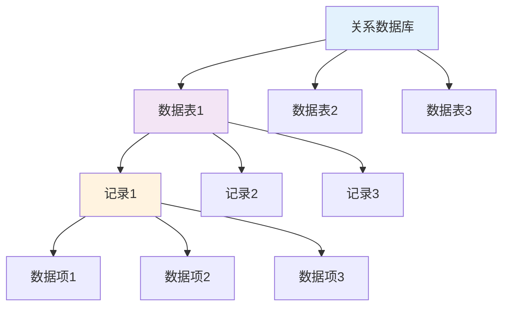
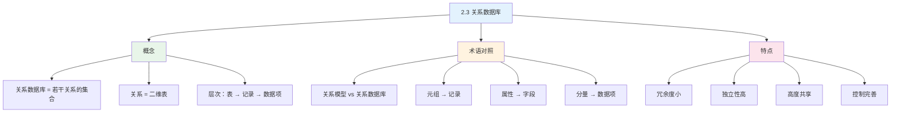

# 第2章-2.3-关系数据库

## 基本信息
- **课程**：数据库原理与应用
- **章节**：第2章 2.3节 关系数据库
- **日期**：2026-05-19
- **标签**：#关系数据库 #概念 #特点 #术语对照

---

## 重点内容

### ⭐⭐ 核心概念
- **关系数据库**：以关系模型为基础的数据库，是若干个关系的集合
- **关系 = 二维表**，关系数据库 = 若干张二维表的集合
- **术语对照**：关系模型 vs 关系数据库

### ⭐ 关系数据库的特点
- 数据冗余度小
- 数据独立性高
- 数据高度共享
- 控制功能完善

---

## 详细笔记

### 一、关系数据库的概念

#### 1. 定义

**关系数据库**是以关系模型为基础的数据库，它是利用关系来描述实体及实体之间的联系。

**核心理解**：
- 一个关系数据库 = 若干个关系的集合
- 一个关系 = 一张二维表（数据表）
- **关系数据库 = 若干张二维表的集合**

#### 2. 示例数据表

**📋 表2.22 术语的对应关系**

| 关系模型 | 关系数据库 | 说明 |
|---------|-----------|------|
| 关系 | 数据表 | 二维表结构 |
| 元组 | 记录 | 表中的一行 |
| 属性 | 字段 | 表中的一列 |
| 分量 | 数据项 | 元组中的一个值 |
| 域 | 字段值域 | 属性的取值范围 |
| 主码 | 主关键字段 | 唯一标识记录 |
| 外码 | 外关键字段 | 引用其他表的主键 |
| 关系模式 | 字段集 | 表的结构定义 |

> 📚 **课本出处**：表2.22 关系模型与关系数据库术语对照表

#### 3. 数据表的结构



**层次结构**：
- **数据表**由一系列**记录**（行）组成
- 每条**记录**由若干个**数据项**组成
- **数据项**是关系数据库中最小的数据单位，不能再分解

#### 3. 数据访问方式

```
表名 → 数据表 → 记录 → 数据项
```

在关系数据库中：
- 每一张数据表都有自己的**表名**
- 在同一个数据库中，**表名唯一**
- 访问数据项时：先通过表名找到数据表 → 检索记录 → 访问数据项

---

### 二、术语对照关系

#### 关系模型 vs 关系数据库

| 关系模型（理论） | 关系数据库（实际） | 说明 |
|-----------------|-------------------|------|
| **关系** | **数据表** | 二维表结构 |
| **元组** | **记录** | 表中的一行 |
| **属性** | **字段** | 表中的一列 |
| **分量** | **数据项** | 元组中的一个值 |
| **域** | **字段值域** | 属性的取值范围 |
| **主码** | **主关键字段（主键）** | 唯一标识记录 |
| **外码** | **外关键字段（外键）** | 引用其他表的主键 |
| **关系模式** | **字段集** | 表的结构定义 |

> 💡 **理解**：
> - "元组""分量"等是**理论概念**（关系模型范畴）
> - "记录""数据项"是**实际概念**（关系数据库中的映像）
> - 它们基本上是**对应关系**，但不是严格的，要视上下文而定

---

### 三、关系数据库的特点

| 特点 | 详细说明 |
|-----|---------|
| **数据冗余度小** | 支持创建数据表间的关联，支持较为复杂的数据结构 |
| **数据独立性高** | 应用程序脱离数据的逻辑结构和物理存储结构，数据和程序之间的独立性高 |
| **数据高度共享** | 实现了数据的高度共享，为多用户的数据访问提供了可能 |
| **控制功能完善** | 提供了各种相应的控制功能，有效保证数据存储的安全性、完整性和并发性等 |

---

### 本节小结图



---

## 疑问与思考

### ❓ 待解决问题
1. 关系数据库的物理存储是如何实现的？
2. 数据独立性具体是如何体现的？

### 💡 个人理解
- 2.3节是概念性的过渡内容，连接前面的理论（关系模型、关系代数）和后面的设计理论（函数依赖、范式）
- 理解术语对照很重要，因为课本前后会使用不同的术语
- 关系数据库的4个特点是其相比文件系统的优势所在

---

## 相关链接

### 本节相关图片
- 无（本节无课本插图）

### 关联章节
- [第2章-2.1-关系模型](./第2章-2.1-关系模型.md)
- [第2章-2.2-关系代数](./第2章-2.2-关系代数.md)
- [第2章-2.4-函数依赖](./第2章-2.4-函数依赖.md)（待创建）
- [第2章-2.5-关系模式的范式](./第2章-2.5-关系模式的范式.md)（⭐⭐⭐核心，待创建）

---

## 检查清单

- [x] 已理解关系数据库的定义
- [x] 已理解关系数据库的层次结构
- [x] 已掌握术语对照关系
- [x] 已理解关系数据库的4个特点
- [x] 已记录重点标记

---

## 快速参考卡

### 术语对照速查

| 你在课本看到的 | 实际含义 |
|--------------|---------|
| 关系 | 数据表/表 |
| 元组 | 记录/行 |
| 属性 | 字段/列 |
| 分量 | 数据项/单元格 |
| 主码 | 主键/主关键字 |
| 外码 | 外键/外关键字 |

### 关系数据库公式

$$
\text{关系数据库} = \{ \text{关系}_1, \text{关系}_2, \dots, \text{关系}_n \}
$$

$$
\text{关系} = \{ \text{元组}_1, \text{元组}_2, \dots, \text{元组}_m \} = \text{二维表}
$$

---

*笔记创建时间：2026-05-19*
