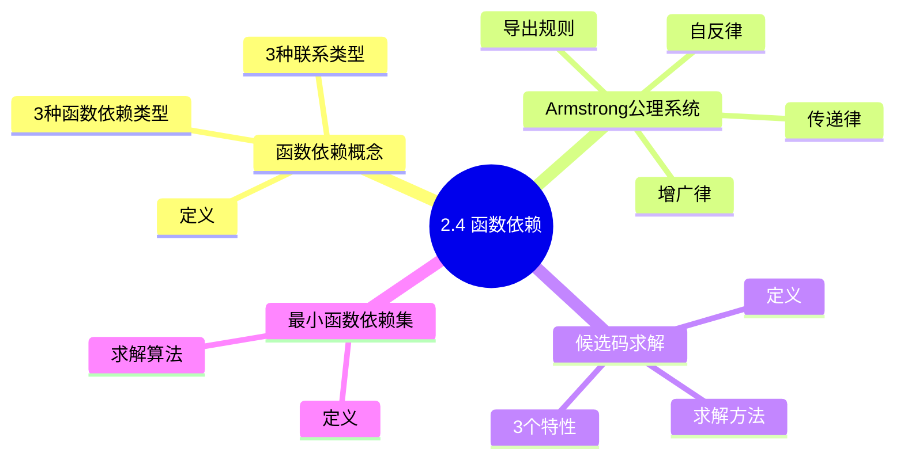
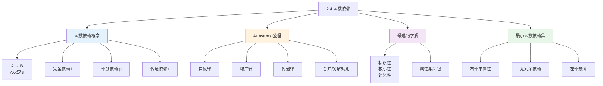

# 第2章-2.4-函数依赖

## 基本信息
- **课程**：数据库原理与应用
- **章节**：第2章 2.4节 函数依赖
- **日期**：2026-05-19
- **标签**：#函数依赖 #Armstrong公理 #候选码 #最小函数依赖集 #范式基础

---

## 重点内容

### ⭐⭐⭐ 核心概念
- **函数依赖**：$A \rightarrow B$，A决定B
- **3种函数依赖类型**：完全依赖、部分依赖、传递依赖
- **候选码**：能完全决定所有属性的最小属性集

### ⭐⭐ Armstrong公理系统
- **3条基本公理**：自反律、增广律、传递律
- **5条导出规则**：合并、分解、复合、伪传递等

### ⭐ 候选码与最小函数依赖集
- **候选码3特性**：标识性、极小性、语义性
- **最小函数依赖集**：右部单属性、无冗余、左部最简

---

## 详细笔记

### 一、函数依赖概述

函数依赖是数据库设计的理论基础，用于分析属性之间的依赖关系，从而减少数据冗余。

---

### 二、函数依赖的概念

#### 1. 定义（定义2.3）

设 $R(U)$ 是属性集 $U$ 上的关系模式，$A, B \subseteq U$，若对于 $R(U)$ 的任意关系 $r$，任意两个元组 $x_1, x_2$ 满足：
$$x_1(A) = x_2(A) \Rightarrow x_1(B) = x_2(B)$$

则称 **$A$ 函数决定 $B$** 或 **$B$ 函数依赖于 $A$**，记作 $A \rightarrow B$

> 💡 **通俗理解**：A的值确定了，B的值也就确定了

**符号说明**：
- $A \rightarrow B$：A函数决定B
- $A \leftrightarrow B$：$A \rightarrow B$ 且 $B \rightarrow A$
- $A \nrightarrow B$：A不能函数决定B

---

#### 2. 属性间联系的3种类型

| 联系类型 | 函数依赖 | 示例 |
|---------|---------|------|
| **1:1**（一对一） | $X \rightarrow Y$ 且 $Y \rightarrow X$ | 学号 $\leftrightarrow$ 身份证号 |
| **m:1**（多对一） | $X \rightarrow Y$ | 学号 $\rightarrow$ 性别 |
| **m:n**（多对多） | 无函数依赖 | 学生与课程 |

> ⚠️ **注意**：函数依赖是**语义范畴**的概念，必须从实际问题的语义上考虑，不能仅凭某个特定关系判断！

---

#### 3. 函数依赖的3种类型 ⭐⭐⭐

##### （1）平凡与非平凡函数依赖（定义2.4）

| 类型 | 条件 | 说明 |
|-----|------|------|
| **平凡函数依赖** | $B \subseteq A$ 时，$A \rightarrow B$ | 无实际意义，一般不讨论 |
| **非平凡函数依赖** | $B \nsubseteq A$ 时，$A \rightarrow B$ | 默认讨论的函数依赖 |

**示例**：{学号, 姓名} $\rightarrow$ 姓名 是平凡函数依赖

##### （2）完全与部分函数依赖（定义2.5）

| 类型 | 记号 | 定义 |
|-----|------|------|
| **完全函数依赖** | $A \xrightarrow{f} B$ | $A \rightarrow B$，且A的任何真子集都不能决定B |
| **部分函数依赖** | $A \xrightarrow{p} B$ | $A \rightarrow B$，但存在A的真子集A'使A' $\rightarrow$ B |

**示例**：
- **完全依赖**：{学生编号, 课程编号} $\xrightarrow{f}$ 成绩
- **部分依赖**：{学生编号, 课程编号} $\xrightarrow{p}$ 姓名（因为学生编号 $\rightarrow$ 姓名）

> 💡 **关键**：只有当决定因素是**组合属性**时，讨论部分函数依赖才有意义！

##### （3）传递函数依赖（定义2.6）

若 $A \rightarrow B$（$B \nsubseteq A$, $B \nrightarrow A$）且 $B \rightarrow C$（$C \nsubseteq B$），则称 $C$ **传递函数依赖于** $A$，记作 $A \xrightarrow{t} C$

**条件**：$B \nrightarrow A$ 是必须的（否则为直接依赖）

**示例**：学号 $\rightarrow$ 班级号 $\rightarrow$ 班长，所以学号 $\xrightarrow{t}$ 班长

---

### 三、Armstrong公理系统 ⭐⭐

Armstrong公理系统是函数依赖的推理规则，用于从已知函数依赖推导新的函数依赖。

#### 1. 3条基本公理

| 公理 | 内容 | 说明 |
|-----|------|------|
| **自反律** | 若 $C \subseteq B$，则 $B \rightarrow C$ | 平凡函数依赖 |
| **增广律** | 若 $B \rightarrow C$，则 $B \cup D \rightarrow C \cup D$ | 两边同时增加属性 |
| **传递律** | 若 $B \rightarrow C$ 且 $C \rightarrow D$，则 $B \rightarrow D$ | 传递性 |

#### 2. 5条导出规则

| 规则 | 内容 |
|-----|------|
| **自合规则** | $B \rightarrow B$ |
| **合并规则** | 若 $B \rightarrow C$ 且 $B \rightarrow D$，则 $B \rightarrow C \cup D$ |
| **分解规则** | 若 $B \rightarrow C \cup D$，则 $B \rightarrow C$ 且 $B \rightarrow D$ |
| **复合规则** | 若 $A \rightarrow B$ 且 $C \rightarrow D$，则 $A \cup C \rightarrow B \cup D$ |
| **伪传递规则** | 若 $B \rightarrow C$ 且 $A \cup C \rightarrow D$，则 $A \cup B \rightarrow D$ |

#### 3. 定理2.1（合并与分解定理）

$B \rightarrow B_1 \cup B_2 \cup \dots \cup B_n$ 成立的**充分必要条件**是 $B \rightarrow B_i$ 成立（$i = 1, 2, \dots, n$）

> 💡 **应用**：函数依赖的极大化与极小化处理

---

### 四、候选码和主码 ⭐⭐⭐

#### 1. 定义（定义2.7）

在关系模式 $R(U)$ 中，若 $A \subseteq U$ 满足 $A \xrightarrow{f} U$，则 $A$ 称为 **候选码**。

从候选码中选择一个作为 **主码(Primary Key)**。

#### 2. 候选码的3个特性

| 特性 | 说明 |
|-----|------|
| **标识性** | $A \rightarrow U$，可唯一标识每个元组 |
| **极小性** | $A$ 的任何真子集都不能函数决定 $U$ |
| **语义性** | 必须从语义上判断，不能仅凭特定关系 |

#### 3. 属性分类

- **主属性**：包含在任何候选码中的属性
- **非主属性**：不包含在任何候选码中的属性
- **全码**：所有属性构成码

#### 4. 定理2.2（候选码判定定理）

若 $A \cup B = U$ 且 $A \xrightarrow{f} B$，则 $A \xrightarrow{f} U$，$A$ 是候选码。

> 💡 **应用**：简化候选码的求解过程

---

### 五、属性集团包与候选码求解

#### 1. 属性集闭包 $B^+$（定义2.9）

$$B^+ = \{a \in C \mid B \rightarrow C \in F^+, C \subseteq U\}$$

即：由 $B$ 能函数决定的所有属性的集合。

#### 2. 求解候选码的方法

**步骤**：
1. 找出只在函数依赖**左边**出现的属性 → 必在候选码中
2. 找出只在函数依赖**右边**出现的属性 → 不在候选码中
3. 对可能的属性组合，计算其闭包，若能推出全部属性，则为候选码

---

### 六、最小函数依赖集 ⭐⭐

#### 1. 定义

满足以下条件的最小函数依赖集 $F_{min}$：
1. **右部单属性化**：每个函数依赖的右部都是单属性
2. **无冗余函数依赖**：$F$ 中不存在可由其他函数依赖推出的依赖
3. **左部无冗余属性**：每个函数依赖的左部没有冗余属性

#### 2. 求解算法

**步骤**：
1. **右部单属性化**：将 $A \rightarrow \{b_1, b_2\}$ 分解为 $A \rightarrow b_1$，$A \rightarrow b_2$
2. **消除冗余函数依赖**：逐一检查每个 $A \rightarrow B$，若可由其他依赖推出，则删除
3. **消除左部冗余属性**：检查决定因素是否可简化

> ⚠️ **注意**：$F_{min}$ 不唯一，与处理顺序有关

---

### 典型例题与表格

**📋 例2.6：学生关系表的函数依赖分析**

| SNo | SName | SSex | SAge | SDept |
|-----|-------|------|------|-------|
| 20170201 | 刘洋 | 男 | 20 | 计算机系 |
| 20170202 | 王晓珂 | 女 | 19 | 计算机系 |
| 20170203 | 王伟志 | 男 | 20 | 智能技术系 |
| 20170204 | 李思思 | 女 | 21 | 计算机系 |

**函数依赖**：
- SNo $\rightarrow$ SName（学号决定姓名）
- SNo $\rightarrow$ SSex（学号决定性别）
- SNo $\rightarrow$ SAge（学号决定年龄）
- SNo $\rightarrow$ SDept（学号决定院系）
- 若不允许重名：SName $\rightarrow$ SNo，则 SNo $\leftrightarrow$ SName

> 📚 **课本出处**：例2.6 学生表的函数依赖分析

**📋 例2.7：选课关系SC的函数依赖分析**

| SNo | CNo | Score |
|-----|-----|-------|
| 20170201 | 1 | 92 |
| 20170201 | 2 | 85 |
| 20170202 | 2 | 90 |
| 20170203 | 3 | NULL |

**函数依赖**：
- {SNo, CNo} $\xrightarrow{f}$ Score（完全依赖）
- {SNo, CNo} $\xrightarrow{p}$ SName（部分依赖，因为SNo单独决定SName）
- {SNo, CNo} $\xrightarrow{p}$ SDept（部分依赖）

> 📚 **课本出处**：例2.7 选课表的完全依赖和部分依赖分析

**📋 例2.8：分班关系的传递依赖分析**

| SNo | SName | ClassNo | Monitor |
|-----|-------|---------|---------|
| 20170201 | 刘洋 | C01 | 张三 |
| 20170202 | 王晓珂 | C01 | 张三 |
| 20170203 | 王伟志 | C02 | 李四 |

**函数依赖**：
- SNo $\rightarrow$ ClassNo（学号决定班级号）
- ClassNo $\rightarrow$ Monitor（班级号决定班长）
- SNo $\xrightarrow{t}$ Monitor（传递依赖：学号→班级号→班长）

> 📚 **课本出处**：例2.8 传递依赖示例

---

### 本节小结图

---

## 疑问与思考

### ❓ 待解决问题
1. 如何快速判断一个属性集是否为候选码？
2. 属性集闭包的具体计算步骤是什么？
3. 最小函数依赖集的不唯一性对数据库设计有什么影响？

### 💡 个人理解/技巧
- **函数依赖是语义概念**：不能只看数据，要从业务逻辑判断
- **部分依赖的判断关键**：看决定因素是否为组合属性
- **传递依赖的判断关键**：找中间属性，且中间属性不能反向决定
- **候选码求解技巧**：先找只在左边出现的属性，再找只在右边出现的属性
- **Armstrong公理记忆**：自反（自己决定子集）、增广（两边同加）、传递（链式推导）

---

## 相关链接

### 本节相关图片
- 无（本节主要为定义和公式）

### 关联章节
- [第2章-2.1-关系模型](./第2章-2.1-关系模型.md)
- [第2章-2.2-关系代数](./第2章-2.2-关系代数.md)
- [第2章-2.3-关系数据库](./第2章-2.3-关系数据库.md)
- [第2章-2.5-关系模式的范式](./第2章-2.5-关系模式的范式.md)（⭐⭐⭐核心，待创建）

---

## 检查清单

- [x] 已理解函数依赖的定义
- [x] 已理解3种函数依赖类型（完全、部分、传递）
- [x] 已掌握Armstrong公理系统的3条基本公理
- [x] 已掌握5条导出规则
- [x] 已理解候选码的3个特性
- [x] 已理解最小函数依赖集的概念和求解方法
- [x] 已记录重点标记

---

## 公式速查表

### 函数依赖符号

| 符号 | 含义 |
|-----|------|
| $A \rightarrow B$ | A函数决定B |
| $A \xrightarrow{f} B$ | B完全函数依赖于A |
| $A \xrightarrow{p} B$ | B部分函数依赖于A |
| $A \xrightarrow{t} B$ | B传递函数依赖于A |
| $A \leftrightarrow B$ | A和B相互函数决定 |

### Armstrong公理

| 公理 | 公式 |
|-----|------|
| 自反律 | $C \subseteq B \Rightarrow B \rightarrow C$ |
| 增广律 | $B \rightarrow C \Rightarrow B \cup D \rightarrow C \cup D$ |
| 传递律 | $B \rightarrow C, C \rightarrow D \Rightarrow B \rightarrow D$ |

### 候选码判定

$$A \xrightarrow{f} U \Leftrightarrow A \text{是候选码}$$

---

## 典型例题思路

### 例2.6：学生关系表的函数依赖
- 学号 $\rightarrow$ 姓名、性别、专业号
- 若不允许重名：姓名 $\rightarrow$ 学号，则学号 $\leftrightarrow$ 姓名

### 例2.7：选课关系SC
- {学生编号, 课程编号} $\xrightarrow{f}$ 成绩
- {学生编号, 课程编号} $\xrightarrow{p}$ 性别（因为学生编号 $\rightarrow$ 性别）

### 例2.8：分班关系
- 学号 $\rightarrow$ 班级号 $\rightarrow$ 班长
- 学号 $\xrightarrow{t}$ 班长（传递依赖）

---

*笔记创建时间：2026-05-19*
