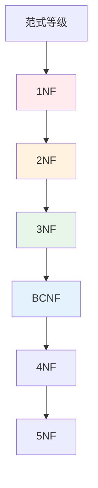
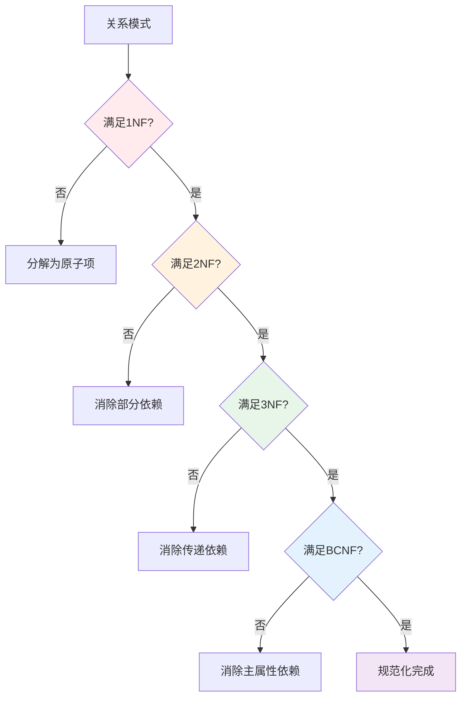
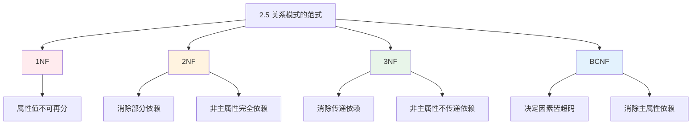

# 第2章-2.5-关系模式的范式

## 基本信息
- **课程**：数据库原理与应用
- **章节**：第2章 2.5节 关系模式的范式
- **日期**：2026-05-19
- **标签**：#范式 #1NF #2NF #3NF #BCNF #规范化 #考试重点

---

## 重点内容

### ⭐⭐⭐ 核心重点（考试必考）
- **1NF**：属性值不可再分
- **2NF**：消除非主属性对码的部分函数依赖
- **3NF**：消除非主属性对码的传递函数依赖
- **BCNF**：消除主属性对码的部分和传递函数依赖

### ⭐⭐ 规范化方法
- **2NF规范化**：投影分解，消除部分依赖
- **3NF规范化**：投影分解，消除传递依赖
- **BCNF规范化**：进一步消除主属性依赖

### ⭐ 范式关系
$$BCNF \subset 3NF \subset 2NF \subset 1NF$$

---

## 详细笔记

### 一、范式概述

范式（Normal Form）是关系模式满足的既定标准，用于衡量关系模式的规范化程度。

**包含关系**：
$$5NF \subset 4NF \subset BCNF \subset 3NF \subset 2NF \subset 1NF$$

> 💡 **实际应用**：一般基于3NF及以上级别范式进行设计

---

### 二、第一范式（1NF）

#### 1. 定义（定义2.12）

设 $R(U)$ 是一个关系模式，若 $U$ 中的每一个属性的值域只包含**原子项**（不可分割的数据项），则称 $R(U)$ 属于第一范式，记作 $R(U) \in 1NF$。

#### 2. 核心要求

- **属性值不可再分**
- 关系中元组的分量是最小的数据单位
- 关系不能相互嵌套

#### 3. 示例

**📋 表2.24 非第一范式的学生表**

| 班级 | 学生人数（男/女） | 平均成绩 |
|-----|----------------|---------|
| 1班 | 25/30 | 81.5 |
| 2班 | 20/25 | 82.1 |
| 3班 | 22/24 | 79.8 |

> 📚 **课本出处**：表2.24 非1NF，因为"学生人数"属性值不是原子项，可以再分为"男生人数"和"女生人数"

**📋 表2.25 第一范式的学生表**

| 班级 | 男生人数 | 女生人数 | 平均成绩 |
|-----|---------|---------|---------|
| 1班 | 25 | 30 | 81.5 |
| 2班 | 20 | 25 | 82.1 |
| 3班 | 22 | 24 | 79.8 |

> 📚 **课本出处**：表2.25 满足1NF，所有属性值都是原子项，不可再分

#### 4. 1NF的问题

仅满足1NF的关系模式还存在：
- ❌ **数据冗余**
- ❌ **插入异常**
- ❌ **删除异常**
- ❌ **更新异常**

---

### 三、第二范式（2NF）⭐⭐⭐

#### 1. 定义（定义2.13）

设 $R(U)$ 是一个关系模式，如果 $R(U) \in 1NF$ 且**每个非主属性都完全函数依赖于任一候选码**，则称 $R(U)$ 属于2NF，记作 $R(U) \in 2NF$。

#### 2. 核心要求

- 满足1NF
- **消除非主属性对码的部分函数依赖**

#### 3. 判断方法

| 情况 | 结论 |
|-----|------|
| 候选码都是单属性 | 必属于2NF |
| 属性全是主属性 | 必属于2NF |
| 存在非主属性对组合码的部分依赖 | 不属于2NF |

#### 4. 2NF规范化算法

**定理2.9**：若 $W \xrightarrow{p} B$，则分解为 $R1(A \cup B)$ 和 $R2(U - B)$，其中 $A \subset W$ 且 $A \xrightarrow{f} B$

**算法步骤**：
1. 找出所有部分函数依赖 $W \xrightarrow{p} B$
2. 对每处部分依赖，找出 $A \xrightarrow{f} B$（$A$ 是 $W$ 的真子集）
3. 分解为 $R1(A \cup B)$ 和 $R2(U - B)$
4. 重复直到所有关系都属于2NF

#### 5. 示例：SSC关系模式规范化

**原模式**：SSC(SNo, SName, SDept, TNo, TName, TTitle, CName, CScore)

**候选码**：{SNo, CName}

**部分依赖**：
- {SNo, CName} $\xrightarrow{p}$ SName（因为 SNo $\rightarrow$ SName）
- {SNo, CName} $\xrightarrow{p}$ SDept
- {SNo, CName} $\xrightarrow{p}$ TNo
- {SNo, CName} $\xrightarrow{p,t}$ TName
- {SNo, CName} $\xrightarrow{p,t}$ TTitle

**📋 表2.26 关系模式SSC的一个关系（1NF但非2NF）**

| SNo | SName | SDept | TNo | TName | TTitle | CName | CScore |
|-----|-------|-------|-----|-------|--------|-------|--------|
| 20170201 | 刘洋 | 计算机系 | 2008021 | 刘媛媛 | 副教授 | 机器学习 | 90 |
| 20170202 | 王晓珂 | 计算机系 | 2008021 | 刘媛媛 | 副教授 | 机器学习 | 87 |
| 20170203 | 王伟志 | 智能技术系 | 2008021 | 刘媛媛 | 副教授 | 机器学习 | 78 |
| 20170203 | 王伟志 | 智能技术系 | 2008021 | 刘媛媛 | 副教授 | 高级人工智能 | 93 |
| 20170206 | 李思思 | 计算机系 | 2005013 | 罗悦 | 教授 | 高级人工智能 | 90 |
| 20170206 | 李思思 | 计算机系 | 2005013 | 罗悦 | 教授 | 数据挖掘 | 90 |
| 20170207 | 蒙恬 | 大数据技术系 | 2005013 | 罗悦 | 教授 | 数据挖掘 | 77 |
| 20170208 | 张宇 | 大数据技术系 | 2008022 | 傅伟娜 | 副教授 | 数据挖掘 | 50 |

> 📚 **课本出处**：表2.26 SSC关系模式，候选码为{SNo, CName}，存在数据冗余（刘媛媛信息重复4次）、插入异常、删除异常等问题

**分解为2NF**：
- $R1$(SNo, SName, SDept, TNo, TName, TTitle) — 学生导师信息
- $R2$(SNo, CName, CScore) — 选课成绩信息

**📋 表2.27 关系模式student_supervisor（2NF）**

| SNo | SName | SDept | TNo | TName | TTitle |
|-----|-------|-------|-----|-------|--------|
| 20170201 | 刘洋 | 计算机系 | 2008021 | 刘媛媛 | 副教授 |
| 20170202 | 王晓珂 | 计算机系 | 2008021 | 刘媛媛 | 副教授 |
| 20170203 | 王伟志 | 智能技术系 | 2008021 | 刘媛媛 | 副教授 |
| 20170206 | 李思思 | 计算机系 | 2005013 | 罗悦 | 教授 |
| 20170207 | 蒙恬 | 大数据技术系 | 2005013 | 罗悦 | 教授 |
| 20170208 | 张宇 | 大数据技术系 | 2008022 | 傅伟娜 | 副教授 |

> 📚 **课本出处**：表2.27 2NF分解后的学生导师信息表，消除了部分依赖

**📋 表2.28 关系模式course（2NF）**

| SNo | CName | CScore |
|-----|-------|--------|
| 20170201 | 机器学习 | 90 |
| 20170202 | 机器学习 | 87 |
| 20170203 | 机器学习 | 78 |
| 20170203 | 高级人工智能 | 93 |
| 20170206 | 高级人工智能 | 90 |
| 20170206 | 数据挖掘 | 90 |
| 20170207 | 数据挖掘 | 77 |
| 20170208 | 数据挖掘 | 50 |

> 📚 **课本出处**：表2.28 2NF分解后的选课成绩表

---

### 四、第三范式（3NF）⭐⭐⭐

#### 1. 定义（定义2.14）

设 $R(U)$ 是一个关系模式，如果 $R(U) \in 2NF$ 且**每个非主属性都不传递函数依赖于任一候选码**，则称 $R(U)$ 属于3NF，记作 $R(U) \in 3NF$。

#### 2. 核心要求

- 满足2NF
- **消除非主属性对码的传递函数依赖**

#### 3. 等价定义

$R(U) \in 3NF$ 当且仅当：对于每一个非平凡函数依赖 $A \rightarrow B$，要么 $A$ 是超码，要么 $B$ 是主属性。

#### 4. 3NF规范化算法

**定理2.10**：若 $A \xrightarrow{t} B$（传递依赖），分解为 $R1(A \cup C)$ 和 $R2(C \cup B)$，其中 $A \rightarrow C$，$C \rightarrow B$

**算法步骤**：
1. 找出所有传递函数依赖
2. 对每个传递依赖 $A \xrightarrow{t} B$，找出中间属性 $C$
3. 分解为 $R1(A \cup C)$ 和 $R2(C \cup B)$
4. 重复直到所有关系都属于3NF

#### 5. 示例：继续规范化SSC

**2NF结果**：
- $R1$(SNo, SName, SDept, TNo, TName, TTitle)
- $R2$(SNo, CName, CScore)

**分析$R1$的传递依赖**：
- SNo $\rightarrow$ TNo $\rightarrow$ TName
- SNo $\rightarrow$ TNo $\rightarrow$ TTitle

**分解为3NF**：
- $R11$(SNo, SName, SDept, TNo) — 学生信息
- $R12$(TNo, TName, TTitle) — 导师信息
- $R2$(SNo, CName, CScore) — 选课成绩

**📋 表2.29 关系模式teacher（2NF示例）**

| 课程名 | 任课教师名 | 任课教师职称 |
|--------|-----------|-------------|
| 数据库原理 | 王宁 | 教授 |
| 操作系统 | 李梦祥 | 讲师 |
| C语言程序设计 | 黄思羽 | 副教授 |
| 软件工程 | 陈光耀 | 教授 |
| 计算机网络原理 | 王宁 | 教授 |
| 多媒体技术 | 李梦祥 | 讲师 |

> 📚 **课本出处**：表2.29 例2.19的teacher关系模式，属于2NF但存在传递依赖（课程名→任课教师名→任课教师职称）

**📋 表2.30 关系模式student（3NF）**

| SNo | SName | SDept | TNo |
|-----|-------|-------|-----|
| 20170201 | 刘洋 | 计算机系 | 2008021 |
| 20170202 | 王晓珂 | 计算机系 | 2008021 |
| 20170203 | 王伟志 | 智能技术系 | 2008021 |
| 20170206 | 李思思 | 计算机系 | 2005013 |
| 20170207 | 蒙恬 | 大数据技术系 | 2005013 |
| 20170208 | 张宇 | 大数据技术系 | 2008022 |

> 📚 **课本出处**：表2.30 3NF分解后的学生信息表

**📋 表2.31 关系模式teacher（3NF）**

| TNo | TName | TTitle |
|-----|-------|--------|
| 2008021 | 刘媛媛 | 副教授 |
| 2005013 | 罗悦 | 教授 |
| 2008022 | 傅伟娜 | 副教授 |

> 📚 **课本出处**：表2.31 3NF分解后的导师信息表，消除了传递依赖（TNo → TName, TTitle）

**📋 关系模式course（3NF）**

| SNo | CName | CScore |
|-----|-------|--------|
| 20170201 | 机器学习 | 90 |
| 20170202 | 机器学习 | 87 |
| 20170203 | 机器学习 | 78 |
| 20170203 | 高级人工智能 | 93 |
| 20170206 | 高级人工智能 | 90 |
| 20170206 | 数据挖掘 | 90 |
| 20170207 | 数据挖掘 | 77 |
| 20170208 | 数据挖掘 | 50 |

> 📚 **课本出处**：3NF分解后的选课成绩表（课本中未单独编号为表2.31，与表2.28相同）

> 💡 **规范化效果**：通过从1NF → 2NF → 3NF的分解，消除了数据冗余和各类异常

---

### 五、BC范式（BCNF）⭐⭐⭐

#### 1. 定义（定义2.15）

设 $R(U)$ 是一个关系模式，$F$ 是 $R(U)$ 的函数依赖集，如果对于 $F$ 中的每一个非平凡函数依赖 $A \rightarrow B$，$A$ 都是 $R(U)$ 的超码，则称 $R(U)$ 属于BCNF，记作 $R(U) \in BCNF$。

#### 2. 核心要求

- **每个决定因素都是超码**
- 消除主属性对码的部分和传递函数依赖

#### 3. 3NF vs BCNF

| 特性 | 3NF | BCNF |
|-----|-----|------|
| 要求 | 非主属性不传递依赖 | 所有决定因素都是超码 |
| 范围 | 只限制非主属性 | 限制所有属性（包括主属性）|
| 严格程度 | 较宽松 | 更严格 |

#### 4. BCNF规范化

**分解原则**：若 $A \rightarrow B$ 且 $A$ 不是超码，则分解为 $R1(A \cup B)$ 和 $R2(U - B)$

---

### 六、范式对比总结

#### 各级范式解决的问题

| 范式 | 解决的问题 | 解决方法 |
|-----|-----------|---------|
| **1NF** | 属性值可再分 | 分解为原子项 |
| **2NF** | 非主属性部分依赖 | 投影分解 |
| **3NF** | 非主属性传递依赖 | 投影分解 |
| **BCNF** | 主属性依赖 | 进一步分解 |

#### 规范化口诀

> 📌 **1NF原子不可分，2NF消除部分依**
> 📌 **3NF传递要消除，BCNF决定皆超码**

---

### 本节小结图

---

## 疑问与思考

### ❓ 待解决问题
1. BCNF和3NF的实际应用场景有什么区别？
2. 规范化程度越高越好吗？什么时候需要反规范化？
3. 如何判断一个分解是否保持函数依赖？

### 💡 个人理解/技巧
- **1NF是基础**：所有关系都必须满足
- **2NF关键**：看候选码是否为组合属性，非主属性是否部分依赖
- **3NF关键**：找传递依赖链，中间属性决定其他属性
- **BCNF关键**：检查所有决定因素是否为超码
- **考试技巧**：先找候选码，再分析函数依赖，逐步判断范式级别

---

## 相关链接

### 本节相关图片
- 无（本节主要为定义和表格示例）

### 关联章节
- [第2章-2.1-关系模型](./第2章-2.1-关系模型.md)
- [第2章-2.2-关系代数](./第2章-2.2-关系代数.md)
- [第2章-2.3-关系数据库](./第2章-2.3-关系数据库.md)
- [第2章-2.4-函数依赖](./第2章-2.4-函数依赖.md)
- [第2章-2.6-关系模式的分解和规范化](./第2章-2.6-关系模式的分解和规范化.md)（待创建）

---

## 检查清单

- [x] 已理解1NF的定义和要求
- [x] 已理解2NF的定义和规范化方法
- [x] 已理解3NF的定义和规范化方法
- [x] 已理解BCNF的定义
- [x] 已掌握各级范式之间的关系
- [x] 已掌握规范化分解的基本方法
- [x] 已记录重点标记

---

## 公式速查表

### 范式定义

| 范式 | 定义公式 |
|-----|---------|
| **1NF** | 属性值不可再分 |
| **2NF** | $R \in 1NF$ 且 非主属性完全依赖于候选码 |
| **3NF** | $R \in 2NF$ 且 非主属性不传递依赖于候选码 |
| **BCNF** | 对于 $A \rightarrow B$，$A$ 必为超码 |

### 包含关系

$$BCNF \subset 3NF \subset 2NF \subset 1NF$$

---

## 典型例题思路

### 例题：判断关系模式的范式级别

**步骤**：
1. **找出候选码**
2. **找出主属性和非主属性**
3. **分析函数依赖**
4. **逐级判断**：1NF → 2NF → 3NF → BCNF

### 例题：将关系模式规范化到3NF

**步骤**：
1. 先分解到2NF（消除部分依赖）
2. 再分解到3NF（消除传递依赖）
3. 验证每个关系是否满足要求

---

## 考试重点提示

### ⭐⭐⭐ 必考内容
1. **判断范式级别**：给定关系模式，判断属于第几范式
2. **规范化分解**：将低级别范式分解为高级别范式
3. **函数依赖分析**：找出部分依赖、传递依赖

### ⭐⭐ 常考内容
1. 候选码的求解
2. BCNF与3NF的区别
3. 规范化的意义和问题

### ⭐ 了解内容
1. 4NF和5NF的概念
2. 多值依赖

---

*笔记创建时间：2026-05-19*
