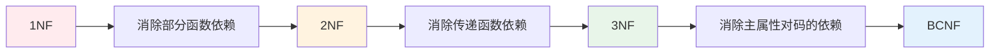
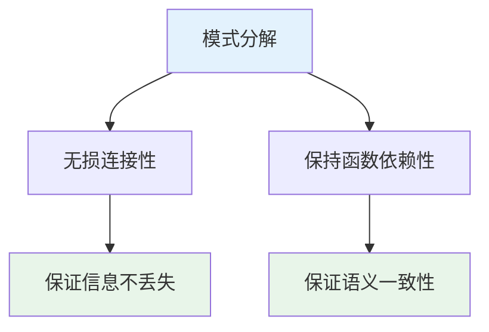
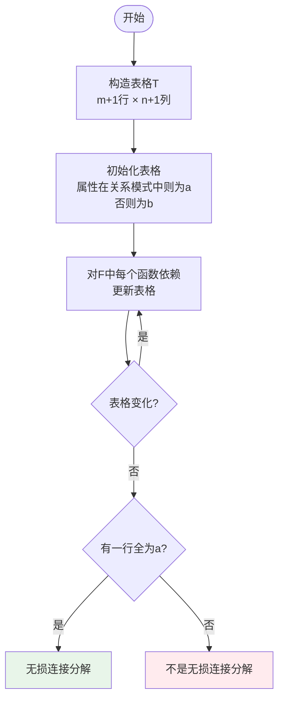

# 第2章-2.6-关系模式的分解和规范化

## 基本信息
- **课程**：数据库原理
- **章节**：第2章 2.6节 关系模式的分解和规范化
- **日期**：2026-04-30
- **标签**：#模式分解 #无损连接 #保持函数依赖 #规范化

---

## 重点内容

### ⭐⭐⭐ 核心概念
1. **关系模式分解**：将低级别范式转化为高级别范式的过程
2. **无损连接分解**：分解后能通过自然连接恢复原关系
3. **保持函数依赖分解**：分解后能保持原有的数据语义
4. **既无损连接又保持函数依赖的分解**：理想的分解方式

### ⭐⭐ 关键定理
- 定理2.11：两关系模式无损连接分解的判定条件
- 无损连接分解测试算法（表格法）
- 保持函数依赖的判定方法

### ⭐ 重要结论
- 仅要求保持函数依赖 → 最高可分解到3NF
- 仅要求无损连接 → 最高可分解到BCNF（或4NF）
- 既要求无损连接又保持函数依赖 → 最高可分解到3NF

---

## 详细笔记

### 一、关系模式的规范化

#### 1. 规范化的定义

**规范化**：将关系模式设计为满足既定范式的过程，主要通过**模式分解**完成。

#### 2. 投影分解的基本步骤

| 步骤 | 操作 | 结果 |
|------|------|------|
| 1 | 消除非主属性对候选码的部分函数依赖 | 产生多个2NF关系模式 |
| 2 | 消除非主属性对候选码的传递函数依赖 | 产生多个3NF关系模式 |
| 3 | 消除主属性对候选码的部分和传递函数依赖 | 产生多个BCNF关系模式 |

#### 3. 分解的两个重要条件

**重要结论**：
- 仅要求保持函数依赖 → 最高可分解到**3NF**
- 仅要求无损连接 → 最高可分解到**BCNF**（或4NF）
- 既要求无损连接又保持函数依赖 → 最高可分解到**3NF**

---

### 二、无损连接分解

#### 1. 定义

**定义2.16**：设关系模式 $R(U)$ 被分解为 $R_1(U_1), R_2(U_2), ..., R_n(U_n)$，如果对任意满足 $F$ 的关系 $r \in R(U)$，均有：

$$r = r_1 \bowtie r_2 \bowtie ... \bowtie r_n$$

则称该分解为**无损连接分解**。

#### 2. 两关系模式无损连接判定（定理2.11）

**定理2.11**：设 $S$ 和 $T$ 为关系模式 $R$ 分解后得到的两个关系模式，则该分解为无损连接分解的充要条件是：

$$(S \cap T) \to (S - T)$$

或

$$(S \cap T) \to (T - S)$$

**通俗理解**：两个关系模式的**公共属性**能够函数决定**差异属性**。

#### 📷 示例分析

**例2.28**：$R(a,b,c)$，$F = \{a \to b, b \to c\}$，分解为 $R_1(a,b)$ 和 $R_2(a,c)$

**判定**：
- $R_1 \cap R_2 = \{a\}$
- $R_1 - R_2 = \{b\}$
- 因为 $a \to b \in F$，满足定理条件
- **结论**：无损连接分解 ✓

#### 3. 无损连接分解测试算法（表格法）

**算法步骤**：

**具体步骤**：

| 步骤 | 操作 |
|------|------|
| (1) 构造表格 | 创建 $(m+1) \times (n+1)$ 的表格，行对应子关系模式，列对应原关系模式的属性 |
| (2) 初始化 | 若属性 $c_j$ 包含在 $A_i$ 中，则 $T[i,j] = a_j$，否则 $T[i,j] = b_{ij}$ |
| (3) 更新表格 | 对 $F$ 中的函数依赖 $c_j \to c_k$，根据规则更新表格 |
| (4) 循环判断 | 反复执行步骤(3)，直到表格不再变化或有一行全为a |
| (5) 结果判断 | 若有一行全为 $a_1, a_2, ..., a_n$，则为无损连接分解 |

---

### 三、保持函数依赖的分解

#### 1. 定义

**定义2.17**：设关系模式 $R(U)$ 被分解为 $\rho = \{R_i(U_i) | i \in \{1,2,...,n\}\}$，$F$ 为 $R(U)$ 的函数依赖集。

令 $F_i = \{A \to B | A \to B \in F^+ \text{ 且 } A \cup B \subseteq U_i\}$（$F$ 在 $R_i$ 上的投影）

如果 $F^+ = (\bigcup_{i=1}^{n} F_i)^+$，则称分解 $\rho$ **保持函数依赖**。

#### 2. 判定方法

**利用定理2.5**：
- 判断 $F \subseteq (\bigcup F_i)^+$：即 $F$ 中的每个函数依赖是否都能由 $\bigcup F_i$ 推出
- 判断 $(\bigcup F_i) \subseteq F^+$：显然成立

**实用方法**：对于 $F$ 中的每个函数依赖 $X \to Y$，计算 $X^+_{(\bigcup F_i)}$，若 $Y \subseteq X^+_{(\bigcup F_i)}$，则保持该函数依赖。

#### 📷 示例分析

**例2.31**：$R(U)$，$U = \{a,b,c,d\}$，$F = \{a \to b, a \to c, c \to d\}$

分解为 $\rho = \{R_1(a,b,c), R_2(a,d)\}$

**分析**：
- $F_1 = \{a \to b, a \to c\}$
- $F_2 = \{a \to d\}$（由 $a \to c$ 和 $c \to d$ 推导得出）
- 检查 $c \to d$：$\{c\}^+_{(F_1 \cup F_2)} = \{c\}$，不包含 $d$
- **结论**：**不保持函数依赖**（丢失了 $c \to d$）

---

### 四、既保持函数依赖又具有无损连接的分解

#### 1. 两种分解特性的对比

| 特性 | 无损连接分解 | 保持函数依赖分解 |
|------|-------------|-----------------|
| **优点** | 信息不丢失 | 语义一致性 |
| **缺点** | 可能带来数据冗余 | 可能造成信息丢失 |
| **目标** | 保证连接后能恢复原关系 | 按照数据语义分解 |

#### 2. 理想的分解

**既保持函数依赖又具有无损连接的分解**：
- 保证分解后的关系模式经过自然连接后能得到原关系模式
- 同时保持原有的函数依赖，避免数据冗余和更新异常

**例2.32**：$R(U)$，$U = \{a,b,c,d\}$，$F = \{a \to b, a \to c, c \to d\}$

分解为 $\rho_2 = \{R_3(a,b,c), R_4(c,d)\}$

- $F_3 = \{a \to b, a \to c\}$
- $F_4 = \{c \to d\}$
- **验证保持函数依赖**：$F = F_3 \cup F_4$ ✓
- **验证无损连接**：$R_3 \cap R_4 = \{c\}$，$R_4 - R_3 = \{d\}$，且 $c \to d \in F$ ✓

---

## 疑问与思考

1. **无损连接和保持函数依赖哪个更重要？**
   - 两者都很重要，但应用场景不同
   - 如果必须选择，通常优先保证无损连接（信息不丢失）
   - 实际设计中尽量同时满足两者

2. **为什么既无损连接又保持函数依赖只能到3NF？**
   - 这是理论上的限制
   - BCNF分解可能破坏函数依赖
   - 需要根据实际需求权衡

---

## 相关链接

- [第2章-2.5-关系模式的范式](第2章-2.5-关系模式的范式.md)
- [第2章-2.7-关系规范化理论综合分析](第2章-2.7-关系规范化理论综合分析.md)
