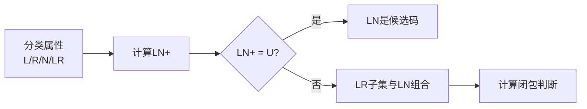

# 第2章-2.7-关系规范化理论综合分析

## 基本信息
- **课程**：数据库原理
- **章节**：第2章 2.7节 关系规范化理论综合分析
- **日期**：2026-04-30
- **标签**：#综合分析 #候选码求解 #范式判定 #规范化算法

---

## 重点内容

### ⭐⭐⭐ 核心能力
1. **综合运用**：最小函数依赖集、属性集闭包、候选码求解算法
2. **范式判定**：判断关系模式属于第几范式
3. **规范化设计**：将关系模式分解为满足要求的范式
4. **分解验证**：验证分解是否无损连接、是否保持函数依赖

### ⭐⭐ 典型问题类型
- 求关系模式的所有候选码
- 计算属性集的闭包
- 判断关系模式属于第几范式
- 将关系模式规范化为3NF或BCNF
- 验证分解的无损连接性和函数依赖性

---

## 详细笔记

### 一、综合分析的基本步骤

```mermaid
flowchart TB
    A[给定关系模式R(U)和函数依赖集F] --> B[步骤1：求候选码]
    B --> C[步骤2：判定范式等级]
    C --> D{是否满足目标范式?}
    D -->|是| E[结束]
    D -->|否| F[步骤3：规范化分解]
    F --> G[步骤4：验证分解性质]
    
    style A fill:#e3f2fd
    style E fill:#e8f5e9
    style F fill:#fff3e0
```

### 二、典型例题分析

#### 例2.33：验证分解性质

**已知**：关系模式 SSC（SNo, SName, SDept, TNo, TName, TTitle, CName, CScore）

**函数依赖集**：
- $F = \{SNo \to SName, SNo \to SDept, SNo \to TNo, TNo \to TName, TNo \to TTitle, \{SNo, CName\} \to CScore\}$

**分解结果**：
- student(SNo, SName, SDept, TNo)
- supervisor(TNo, TName, TTitle)
- course(SNo, CName, CScore)

**分析过程**：

1. **验证各关系模式属于BCNF**：
   - student：候选码 SNo，所有决定因素都是候选码 ✓
   - supervisor：候选码 TNo，所有决定因素都是候选码 ✓
   - course：候选码 {SNo, CName}，所有决定因素都是候选码 ✓

2. **验证无损连接**（表格法）：

| 关系模式 | SNo | SName | SDept | TNo | TName | TTitle | CName | CScore |
|---------|-----|-------|-------|-----|-------|--------|-------|--------|
| student | a1 | a2 | a3 | a4 | b15 | b16 | b17 | b18 |
| supervisor | b21 | b22 | b23 | a4 | a5 | a6 | b27 | b28 |
| course | a1 | b32 | b33 | b34 | b35 | b36 | a7 | a8 |

经过函数依赖更新后，最后一行全为a，**无损连接分解** ✓

3. **验证保持函数依赖**：
   - $F_{student} = \{SNo \to SName, SNo \to SDept, SNo \to TNo\}$
   - $F_{supervisor} = \{TNo \to TName, TNo \to TTitle\}$
   - $F_{course} = \{\{SNo, CName\} \to CScore\}$
   - $F_{student} \cup F_{supervisor} \cup F_{course} = F$
   - **保持函数依赖** ✓

---

#### 例2.34：综合求解

**已知**：$R(U)$，$U = \{a,b,c,d\}$，$F = \{a \to c, c \to a, b \to \{a,c\}, d \to \{a,c\}, \{b,d\} \to a\}$

**(1) 求所有候选码**

**步骤**：
1. 分类属性：
   - L类（只在左边出现）：$\{b, d\}$
   - R类（只在右边出现）：$\phi$
   - N类（都不出现）：$\phi$
   - LR类（两边都出现）：$\{a, c\}$

2. 计算 $LN = L \cup N = \{b, d\}$ 的闭包：
   - $\{b, d\}^+ = \{a, b, c, d\} = U$

3. **结论**：$\{b, d\}$ 是唯一候选码

**(2) 求 $\{a,c\}^+$**

- 左部为 $\{a,c\}$ 的子集的函数依赖：$a \to c$，$c \to a$
- $\{a,c\}^+ = \{a, c\}$

**(3) 判定范式并规范化**

**范式判定**：
- 候选码：$\{b, d\}$
- 存在部分函数依赖：$\{b,d\} \xrightarrow{p} \{a,c\}$（因为 $b \to \{a,c\}$）
- **不属于2NF**

**规范化为3NF**：

1. 求最小函数依赖集：
   - $F_{min} = \{a \to c, c \to a, b \to a, d \to a\}$

2. 按决定因素聚类：
   - $a \to c$ → $R_1(a,c)$
   - $c \to a$ → $R_2(c,a)$（与$R_1$相同）
   - $b \to a$ → $R_3(b,a)$
   - $d \to a$ → $R_4(d,a)$

3. 初步分解：$\rho_1 = \{R_1(a,c), R_3(b,a), R_4(d,a)\}$

4. 验证无损连接：表格法验证**不是无损连接**

5. 添加候选码：$\rho_2 = \{R_1(a,c), R_3(b,a), R_4(d,a), R_5(b,d)\}$

6. **最终结果**：$\rho_2$ 既保持函数依赖又具有无损连接性，每个关系模式都属于3NF

---

#### 例2.35：BCNF规范化

**已知**：$R(U)$，$U = \{a,b,c,d,e,f\}$，$F = \{d \to f, c \to d, \{c,d\} \to e, a \to e\}$

**求解过程**：

1. **求候选码**：$\{a,b,c\}$ 是唯一候选码

2. **判定范式**：
   - 存在 $c \to d$ 和 $a \to e$，是非主属性对候选码的部分函数依赖
   - **不属于2NF**

3. **BCNF规范化**（逐步分解）：

```mermaid
flowchart TB
    A[R(a,b,c,d,e,f)<br/>码:{a,b,c}] --> B[选择 d→f 分解]
    B --> C[R1(d,f)<br/>码:d]
    B --> D[R2(a,b,c,d,e)<br/>码:{a,b,c}]
    
    D --> E[选择 c→d 分解]
    E --> F[R3(c,d)<br/>码:c]
    E --> G[R4(a,b,c,e)<br/>码:{a,b,c}]
    
    G --> H[选择 c→e 分解<br/>由c→d和{c,d}→e推导]
    H --> I[R5(c,e)<br/>码:c]
    H --> J[R6(a,b,c)<br/>码:{a,b,c}]
    
    style C fill:#e8f5e9
    style F fill:#e8f5e9
    style I fill:#e8f5e9
    style J fill:#e8f5e9
```

**最终分解**：$\rho = \{\{d,f\}, \{c,d\}, \{c,e\}, \{a,b,c\}\}$

- 每个关系模式都属于BCNF
- 该分解是无损连接分解
- 注意：BCNF分解**不一定**保持函数依赖

---

### 三、解题技巧总结

#### 1. 求候选码的步骤



#### 2. 判定范式的流程

| 检查内容 | 存在该问题 | 结论 |
|---------|-----------|------|
| 非主属性对候选码的部分函数依赖 | 是 | 属于1NF，不属于2NF |
| 非主属性对候选码的传递函数依赖 | 是 | 属于2NF，不属于3NF |
| 主属性对候选码的部分/传递函数依赖 | 是 | 属于3NF，不属于BCNF |
| 以上都没有 | - | 属于BCNF |

#### 3. 规范化算法选择

| 目标范式 | 要求 | 算法 |
|---------|------|------|
| 3NF | 保持函数依赖 | 3NF规范化算法1 |
| 3NF | 既无损连接又保持函数依赖 | 3NF规范化算法2 |
| BCNF | 无损连接 | BCNF规范化算法 |

---

## 疑问与思考

1. **BCNF和3NF如何选择？**
   - 如果必须保持函数依赖 → 选择3NF
   - 如果可以接受一定冗余 → 选择BCNF
   - 实际应用中，通常以3NF为目标

2. **规范化到什么程度合适？**
   - 不是范式越高越好
   - 需要考虑查询性能、应用复杂度
   - 通常3NF是较好的平衡点

---

## 相关链接

- [第2章-2.4-函数依赖](第2章-2.4-函数依赖.md)
- [第2章-2.5-关系模式的范式](第2章-2.5-关系模式的范式.md)
- [第2章-2.6-关系模式的分解和规范化](第2章-2.6-关系模式的分解和规范化.md)
