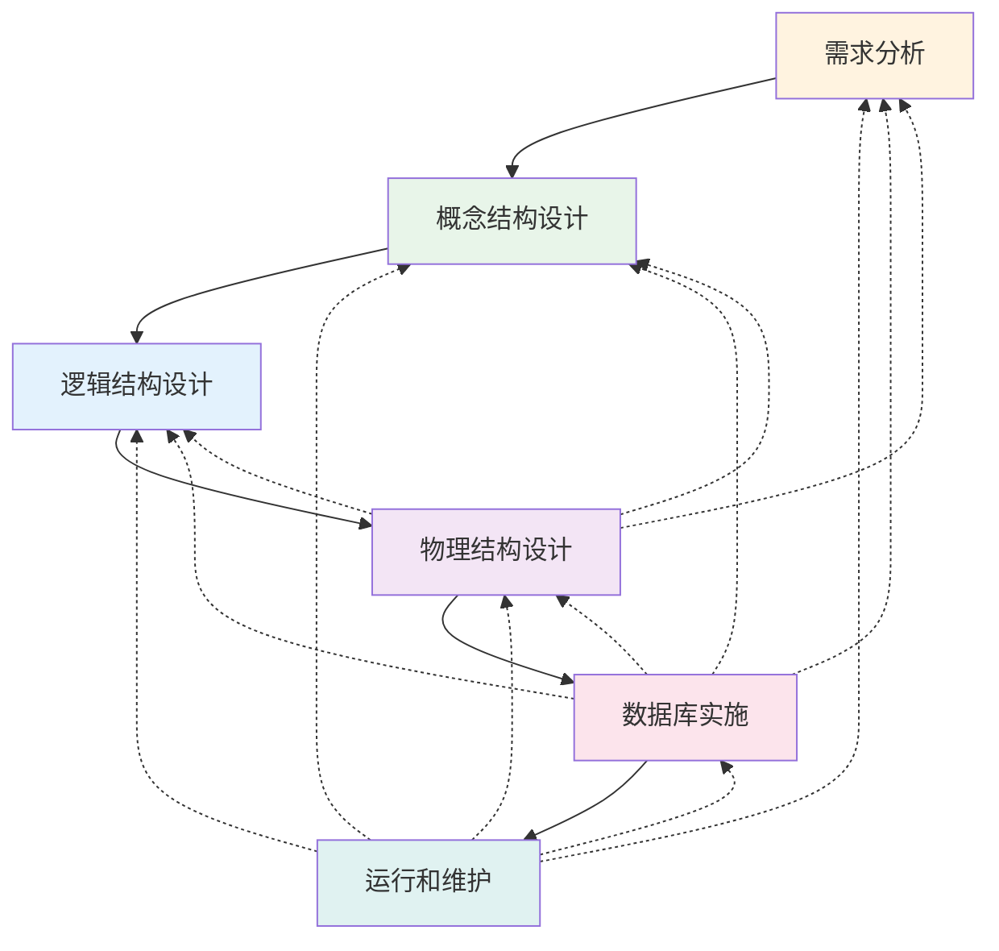
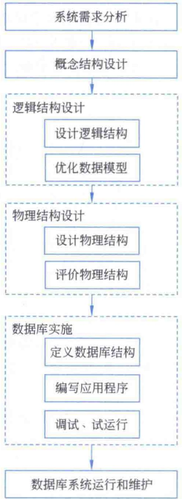
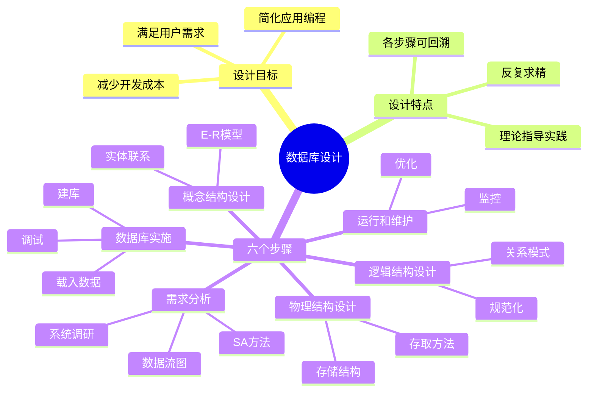

# 第3章-3.1-数据库设计概述

## 基本信息
- **课程**：数据库原理与应用
- **章节**：第3章 3.1节 数据库设计概述
- **日期**：2026-06-30
- **标签**：#数据库设计 #设计步骤 #需求分析 #概念设计 #逻辑设计 #物理设计

---

## 重点内容

### ⭐⭐⭐ 核心概念
- **数据库设计的定义**：在现有应用环境下，构造最优的数据库模式，创建相应的数据库及其应用系统
- **六个步骤**：需求分析 -> 概念结构设计 -> 逻辑结构设计 -> 物理结构设计 -> 数据库实施 -> 运行和维护
- **设计的最终目的**：(1) 满足用户需求；(2) 简化应用编程设计，减少开发成本

### ⭐⭐ 重要特征
- **反复求精**：数据库设计是"认识-设计-纠正-认识"的反复过程，不是一次到位
- **各步骤可回溯**：每个步骤如果不满足要求，都可能返回前面的任一步骤
- **理论与实践结合**：第2章学的是设计理论，本章介绍的是对理论的应用方法

### ⭐ 基础理解
- **数据库设计的范围**：主要是针对数据库本身的设计，较少涉及应用系统的设计
- **设计的复杂性**：实际问题的时空复杂性和运行环境的制约使设计变得复杂

---

## 详细笔记

### 一、数据库设计的定义

#### 1. 什么是数据库设计

在应用数据库技术解决实际问题时，需要针对给定应用环境，构造最优的数据库模式，然后基于该模式创建相应的数据库及其应用系统，使形成的数据库系统能够有效地进行各种数据存储和管理任务，满足用户的各种应用需求，而这个过程就是**数据库设计**。

> 📚 **课本出处**：第3章 3.1节"数据库设计概述"

一般地，数据库设计是指在现有的应用环境下，从建立问题的**概念模型**开始，逐步建立和优化问题的**逻辑模型**，最后建立其高效的**物理模型**，并据此建立数据库及其应用系统，使之能够有效地收集、存储和管理数据，满足用户的各种应用需求。

> 💡 **理解技巧**：可以将数据库设计类比为建房子——先了解住户需求（需求分析），再画设计图纸（概念设计），然后细化为施工图（逻辑设计），最后选择材料和施工方式（物理设计）。

简单而言，数据库设计是**数据库及其应用系统**的设计。本章介绍的数据库设计主要是针对数据库本身的设计，较少涉及应用系统的设计。

---

### 二、数据库设计的目标

数据库设计是数据库应用系统开发的**关键技术之一**，其最终目的可以归结为两点：

> 📚 **课本出处**：第3章 3.1节"数据库设计概述"

| 目标 | 说明 |
|:----:|:-----|
| 满足用户的需求 | 数据库系统能够有效进行各种数据存储和管理任务 |
| 简化应用程序的编程设计 | 实现系统协同、高效的开发，减少开发成本 |

---

### 三、数据库设计的六个步骤

从过程看，数据库设计主要分为**六个步骤**，各步骤的先后关系如图3.1所示。

> 📚 **课本出处**：第3章 3.1节"数据库设计概述"，图3.1

> ⚠️ **常见误区**：图中虚线表示回溯关系——对每一个步骤，如果设计结果不满足要求，都有可能返回前面的任一步骤，直到满足要求为止。数据库设计不是线性的单向流程。

#### 📷 图3.1 数据库设计的基本步骤

> 📚 **课本出处**：图3.1 展示了数据库设计六个基本步骤及其相互间的回溯关系

#### 各步骤简要说明

| 步骤 | 名称 | 核心任务 | 产出 |
|:----:|:-----|:---------|:-----|
| 1 | 需求分析 | 了解并明确用户需求 | 系统需求分析说明书 |
| 2 | 概念结构设计 | 用E-R图描述现实世界 | 概念模型(E-R图) |
| 3 | 逻辑结构设计 | 将概念模型转换为关系模式 | 逻辑模型(关系模式) |
| 4 | 物理结构设计 | 选取存储结构和存取方法 | 物理模型 |
| 5 | 数据库实施 | 建库、载入数据、调试 | 可运行的数据库系统 |
| 6 | 运行和维护 | 监控、调整、优化 | 持续改进的数据库系统 |

---

### 四、数据库设计的特点

#### 1. 反复求精过程

由于实际问题的时空复杂性，数据库设计过程中也存在诸多的不确定因素，加上应用程序运行环境的制约，这就使得数据库设计变得异常复杂。

> 📚 **课本出处**：第3章 3.1节"数据库设计概述"

一般来说，数据库设计不是"一次到位"，而是**"认识-设计-纠正-认识"**的一种反复并逐步求精的过程。

> 💡 **理解技巧**：可以类比软件开发中的"迭代开发"思想——每次迭代都更深入地认识问题，设计更加完善的解决方案。

#### 2. 理论指导实践

经过长期的积累，人们还是总结了数据库设计有关理论和方法，形成了数据库设计的一些基本规律，可为实际的数据库设计提供理论和经验参考。

- 第2章的关系规范化理论为**逻辑结构设计**提供了理论基础
- E-R模型为**概念结构设计**提供了描述工具
- 这些理论和方法使得数据库设计有章可循

---

## 总结

### 六个步骤对照表

| 序号 | 步骤 | 输入 | 输出 | 依赖的理论 |
|:----:|:-----|:-----|:-----|:-----------|
| 1 | 需求分析 | 用户需求 | 需求说明书/数据字典 | SA方法、数据流图 |
| 2 | 概念结构设计 | 需求说明书 | E-R图 | 实体联系模型 |
| 3 | 逻辑结构设计 | E-R图 | 关系模式 | 第2章规范化理论 |
| 4 | 物理结构设计 | 关系模式 | 物理存储方案 | 存储结构、索引技术 |
| 5 | 数据库实施 | 物理模型 | 可运行数据库 | SQL语言 |
| 6 | 运行和维护 | 数据库系统 | 持续优化 | 备份恢复、性能调优 |

### 知识点脑图

### 关键要点

1. **数据库设计 = 数据库 + 应用系统的设计**，本章侧重数据库本身的设计
2. **六步骤**是数据库设计的基本框架，但不是严格的线性流程
3. **可回溯性**是重要特征——任何步骤不满意都可以返回之前的步骤
4. **两大目标**：满足用户需求 + 降低开发成本
5. **第2章理论在第3章应用**——规范化理论为逻辑设计提供理论基础

---

## 疑问与思考

### ❓ 待解决问题
1. 数据库设计的六个步骤中，哪些步骤的工作量最大、最容易出错？为什么？
2. 概念结构设计和逻辑结构设计的本质区别是什么？为什么不直接从需求分析跳到逻辑设计？
3. 物理结构设计在现代数据库管理系统（如SQL Server、MySQL）中是否已经被自动化？DBA还需要关注物理设计吗？
4. 数据库设计的"反复求精"与软件工程中的"敏捷开发"有什么异同？
5. 在实际项目中，需求分析阶段如果遗漏了某些需求，会对后续的设计步骤产生什么样的连锁影响？

### 💡 个人理解/技巧
- 六个步骤可以分为两大阶段：**设计阶段**（步骤1-4）和**实施运维阶段**（步骤5-6）
- 需求分析是整个设计的基础——"垃圾进，垃圾出"，如果需求分析做不好，后面的步骤再精确也没有用
- 概念设计到逻辑设计的转换可以类比为：建筑师的草图（概念） -> 工程师的施工图（逻辑）
- 回溯关系意味着设计是一个**迭代优化**的过程，不要害怕返工，每次返工都让系统更完善
- 记忆口诀：**"需概逻物，实运维"**（需求分析 -> 概念设计 -> 逻辑设计 -> 物理设计 -> 实施 -> 运行维护）

---

## 相关链接

### 本节相关图片
- [图3.1 数据库设计的基本步骤](../../../images/e869afcbe2733c7c9b1589e54e780960ff1f795504aafd0898580324554b346b.jpg)

### 关联章节
- [第3章-数据库设计技术](./第3章-数据库设计技术.md)
- 第3章-3.2-系统需求分析（待创建）
- 第3章-3.3-数据库结构设计（待创建）
- 第3章-3.4-数据库的实施运行和维护（待创建）
- [第2章-2.1-关系模型](../../第2章-关系数据库理论基础/第2章-2.1-关系模型.md)
- [第2章-2.5-关系模式的范式](../../第2章-关系数据库理论基础/第2章-2.5-关系模式的范式.md)

---

## 检查清单

- [x] 已理解数据库设计的定义和最终目的
- [x] 已掌握数据库设计的六个步骤及其相互关系
- [x] 已理解数据库设计"反复求精"的特点
- [x] 已插入课本原图（图3.1）
- [x] 已记录重点标记
- [x] 已添加课本出处标注

---

*笔记创建时间：2026-06-30*
