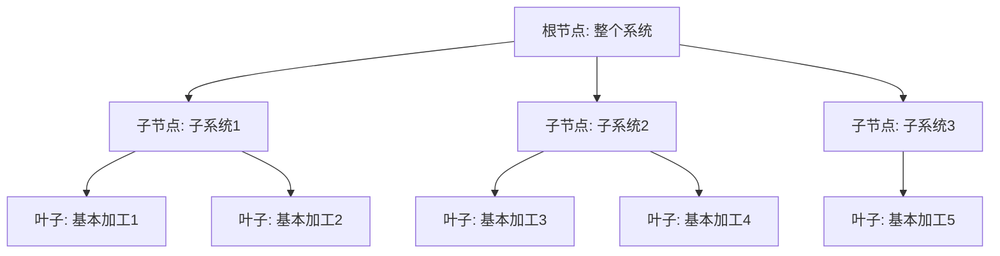
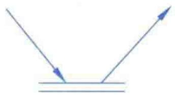
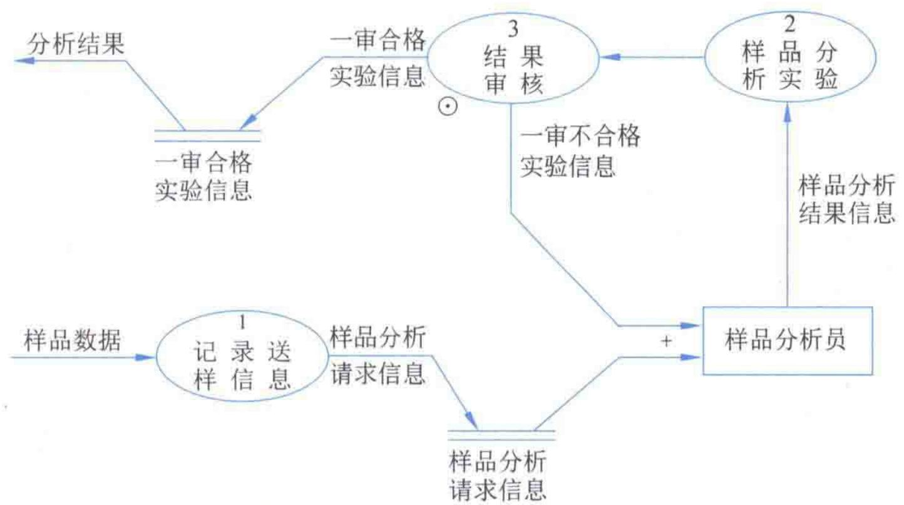
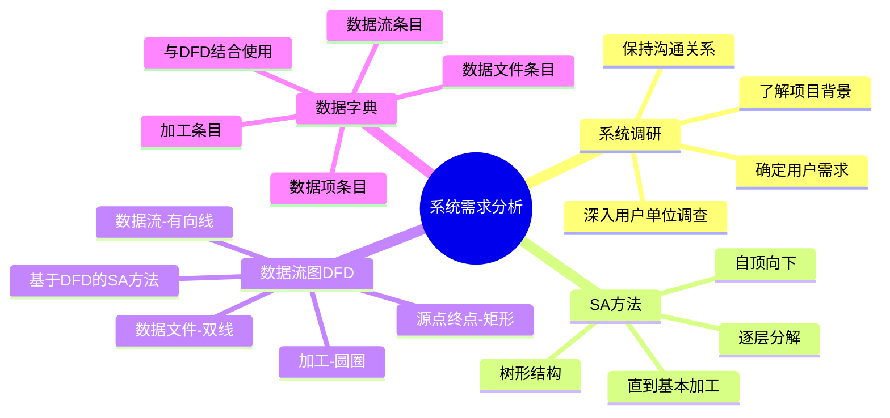

# 第3章-3.2-系统需求分析

## 基本信息
- **课程**：数据库原理与应用
- **章节**：第3章 3.2节 系统需求分析
- **日期**：2026-06-30
- **标签**：#数据库设计 #系统需求分析 #SA方法 #数据流图 #数据字典

---

## 重点内容

### ⭐⭐⭐ 核心概念
- **系统需求分析**：了解用户需求 -> 明确用户需求 -> 形成系统需求分析说明书
- **SA方法**：自顶向下的结构化分析方法，逐层分解系统直到可认知的基本加工
- **数据流图（DFD）**：以图形方式刻画数据处理系统中信息的转变和传递过程
- **数据字典**：数据流图中数据元素的描述，包含数据项、数据流、数据文件和加工4种条目

### ⭐⭐ 关键方法
- **数据流图4种符号**：数据流、数据的源点和终点、加工、数据文件
- **DFD与数据字典的关系**：DFD表示数据和处理的关系，数据字典对DFD中各元素进行详细描述，二者结合使用
- **SA方法的树形分解**：根节点 -> 子节点 -> 叶子节点（基本加工），节点编号反映层次关系

### ⭐ 调研过程
- 系统调研三个步骤：了解项目背景 -> 深入用户单位调查 -> 确定用户需求
- 调查方法四步：总体介绍 -> 深入部门 -> 召开调查会 -> 必要时重复

---

## 详细笔记

### 一、系统调研过程和方法

系统需求分析是首先了解用户需求，然后明确用户需求，最终形成**系统需求分析说明书**的过程。

> 📚 **课本出处**：第3章 3.2节"系统需求分析"

系统调研（项目调研）的主要目的是通过接触用户了解并最终明确用户的实际需求，是一个需要不断与用户进行**沟通和磋商**的过程。

#### 调研过程三个步骤

| 步骤 | 内容 | 要点 |
|:----:|:-----|:-----|
| （1） | 充分了解项目背景及开发目的 | 明确开发的动机和目标 |
| （2） | 深入用户单位进行调查 | 了解组织结构、运作方式、各部门职责和功能，从数据流角度分析 |
| （3） | 确定用户需求、明确系统功能和边界 | 形成功能说明，与用户确认后书面确定 |

> 📚 **课本出处**：第3章 3.2.1节"系统调研过程和方法"

> ⚠️ **常见误区**：步骤（2）是调查的重点也是难点。难点在于建立与用户的沟通渠道——用户和技术人员具有不同的技术背景，经常出现"用户认为说清楚了但分析人员还不理解"的情况。

#### 调查方法（四个子步骤）

1. **单位情况及其运作方式的介绍** — 第一次到用户单位作现场调查，邀请相关负责人作简要介绍
2. **对部门工作职能的深入了解** — 分头深入各个部门进行现场观摩，可进行跟班作业
3. **召开调查会** — 通过询问、讨论、填调查表等方式验证理解的正确程度，次数控制在1~2次
4. **必要时重复步骤2和3** — 如果与用户还未就需求达成共识

> 💡 **理解技巧**：保持与用户良好的关系是系统顺利开发的必要条件。调研结果的不准确会导致开发返工，增加成本，因此应尽最大努力使调研结果具有最小误差。

---

### 二、系统需求分析的方法

在调研结果的基础上，运用各种分析方法形成高质量的系统需求说明书。对于数据库设计来说，最终形成用户需求的有效表达，多以**数据流图**和**数据字典**等形式来描述。

> 📚 **课本出处**：第3章 3.2.2节"系统需求分析的方法"

#### 1. SA方法（结构化分析方法）

**SA（Structured Analysis）** 即自顶向下的结构化分析方法，其分析过程符合人类认识和解决问题的一般过程。

> 📚 **课本出处**：第3章 3.2.2节"SA方法"

**核心思想**——类比一棵树的产生过程：

- **根节点**：整个系统（第一层次）
- **子节点**：第二层次的子系统
- **叶子节点**：系统分析人员认为已经清楚而不必再分解的基本加工

> 📚 **课本出处**：第3章 3.2.2节"SA方法"，原文："自顶向下的SA方法是从整个系统开始，采用逐层分解的方式对系统进行分析的方法"

**SA方法的本质**：初次面对复杂系统时，只能有初步了解（功能、输入、输出），然后对各子系统作进一步分解，明确各子系统的作用及数据流向关系，直到每个子系统都能够被分析人员认知为止。

---

#### 2. 数据流图（DFD）

**数据流图（Data Flow Diagram, DFD）** 是以图形方式刻画数据处理系统中信息的转变和传递过程，是对现实世界中实际系统的一种逻辑抽象表示，但又**独立于具体的计算机系统**。

> 📚 **课本出处**：第3章 3.2.2节"数据流图"

##### 数据流图的4种常用符号

**（1）数据流** — 用有方向的曲线或直线表示，箭头表示方向，旁边标以数据流名称

> 📚 **课本出处**：第3章 3.2.2节"数据流"，数据流可以来自数据的源点、加工和数据文件，也可以流向数据的终点、加工和数据文件。当数据取自或流向文件时，有向线可不命名。

**（2）数据的源点和终点** — 用矩形表示，矩形中标以数据名称

> 📚 **课本出处**：第3章 3.2.2节"数据的源点和终点"，向系统提供数据的对象统称为**数据源点**，系统数据所流向的对象统称为**数据终点**，用于帮助理解系统接口界面。

**（3）加工** — 用圆圈（或椭圆）表示，圆圈标以加工名称

> 📚 **课本出处**：第3章 3.2.2节"加工"，加工是对数据处理的抽象表示。如果加工还不为系统分析员理解，则需要SA方法对其进行分解，直到得到**基本加工**为止。

**（4）数据文件** — 用平行的双节线表示，旁边标以数据文件名

> 📚 **课本出处**：第3章 3.2.2节"数据文件"，数据文件是数据临时存放的地方，加工能够对其进行数据读取或存入。

##### 数据流的关系说明

当节点有多条数据流出入时，影响和作用方式如下：

| 符号表示 | 说明 |
|:--------:|:-----|
| 收到X**和**Y后加工产生Z | 表示在收到X和Y后才进行加工，然后产生Z |
| 收到X**或**Y后加工产生Z | 收到X或收到Y后即可进行加工，结果产生Z |
| 从X和Y中**选择其一**加工产生Z | 表示从数据流X和Y中选择其中之一来进行加工 |
| 加工Z同时**产生**X和Y | 对Z进行加工后同时产生X和Y |
| 加工Z产生X**或**Y | 对Z进行加工后，产生X或Y，或者两者都产生 |
| 加工Z仅产生X和Y的**其中之一** | 对Z进行加工后，仅产生X和Y其中之一 |

> 📚 **课本出处**：第3章 表3.1"数据流的关系"

> 💡 **理解技巧**：6种关系分为两大类——"与/或"关系在**输入端**（3种）和**输出端**（3种），与逻辑电路中的AND/OR概念类似。

---

#### 3. 基于数据流图的SA方法

自顶向下的SA分析方法与数据流图有机地结合，SA分析方法主要体现在对**"加工"进行分解**的过程。

> 📚 **课本出处**：第3章 3.2.2节"基于数据流图的SA方法"

**绘制原则**：
1. 先绘制根节点对应的子图（最大粒度，整个系统作为1个加工）
2. 然后绘制根节点子节点对应的子图
3. 一直绘制到所有叶子节点对应的子图为止

**子图分解命名规则**：分解后的子图中加工节点以上级编号开头，如"2.1""2.2"表示由加工"2"分解得到。

##### 📷 图3.2 YPFXMS的根节点数据流图

> 📚 **课本出处**：图3.2 展示了样品分析管理系统（YPFXMS）的根节点数据流图，将整个应用系统当作一个加工

##### 📷 图3.3 根节点0的子节点数据流图

> 📚 **课本出处**：图3.3 展示了对根节点"样品分析管理系统"进行分解后的子节点数据流图，包含3个节点（1、2、3），分别对应不同的加工过程

**分解过程说明**：
- 根节点分解出3个节点：记录送样信息（1）、样品分析实验（2）、分析结果审查（3）
- 如果某个节点的加工内部还包含数据流，则继续分解，直到形成**基本加工**
- 例如节点"2"的样品分析实验还可再分解，编号以"2."开头

> 📚 **课本出处**：第3章 3.2.2节"基于数据流图的SA方法"

---

### 三、形成数据字典

数据流图主要是表示数据和处理之间的关系，但**缺乏**对数据流、数据文件、加工等各元素进行描述的能力。数据字典正是为弥补这一不足而引入的。

> 📚 **课本出处**：第3章 3.2.3节"形成数据字典"

**数据字典的作用**：
- 数据字典是SA方法中一种有力的工具
- 与数据流图**结合使用**，对数据流图中出现的各种元素进行描述
- 给出所有数据元素的**逻辑定义**
- 简而言之：**数据字典是数据流图中数据元素的描述**

> 💡 **理解技巧**：如果把用户需求和机器表示放在两头，数据流图放在中间，那么数据流图更靠近用户需求，而数据字典使表达逐步转向机器表示，为数据库实施奠定基础。

#### 数据字典的4种条目

数据字典由一系列条目组成，至少应包括以下4种条目：

##### 1. 数据项条目

数据项是数据构成的**最小组成单位**，不能再分割。数据项条目用于说明数据项的名称、类型、长度、取值范围等。

> 📚 **课本出处**：第3章 3.2.3节"数据项条目"

**示例**——"课题申请代码"条目：

| 属性 | 内容 |
|:----:|:-----|
| 数据项名 | 课题申请代码 |
| 类型 | 字符型 |
| 长度 | 12 |
| 取值范围 | 000000000000~999999999999 |
| 取值说明 | 前4位为年份，第5~6位、第7~8位分别表示月份和日期，后4位表示当天的课题序号 |

##### 2. 数据流条目

数据流条目用于说明数据流的**组成**（由哪些数据项组成）、数据流的**来源和流向**以及**数据流量**等信息。

> 📚 **课本出处**：第3章 3.2.3节"数据流条目"

**示例**——"样品分析请求信息"条目：

| 属性 | 内容 |
|:----:|:-----|
| 数据流名称 | 样品分析请求信息 |
| 组成 | 申请表编号、申请表名称、分析项目代码、样品编号、样品名称、送样日期、送样人员 |
| 来源 | 记录送样信息（加工） |
| 去向 | 样品分析请求信息（文件） |
| 流量 | 10~20件/天 |

##### 3. 数据文件条目

数据文件条目用于说明数据文件由哪些数据项组成、**组织方式**、**存储频率**等信息。

> 📚 **课本出处**：第3章 3.2.3节"数据文件条目"

**示例**——"一审合格实验信息"条目：

| 属性 | 内容 |
|:----:|:-----|
| 文件名 | 一审合格实验信息 |
| 数据组成 | 试验记录表编号、试验记录表名称、试验日期、试验环境、试验目的、操作人员、原料规格、试验配方与工艺、操作过程与现象、试验结果与讨论、记录人员、试验组长、课题代码 |
| 组织方式 | 按试验记录表编号递增排列 |
| 存储频率 | 1次/天 |

##### 4. 加工条目

加工条目主要用于说明加工的**逻辑功能**、指明**输入数据**和**输出数据**等信息。

> 📚 **课本出处**：第3章 3.2.3节"加工条目"

**示例**——加工"记录送样信息"条目：

| 属性 | 内容 |
|:----:|:-----|
| 加工编号 | 1 |
| 加工名 | 记录送样信息 |
| 输入数据 | 样品数据 |
| 输出数据 | 样品分析请求信息 |
| 逻辑功能 | 对送检的样品数据进行登记，并由此转化成样品分析请求信息 |

> 📚 **课本出处**：第3章 3.2.3节，原文："数据字典是对系统调研所收集的大量数据进行详细分析所得到的主要结果。它是数据库设计阶段的一项主要成果。"

---

## 总结

### DFD 4种符号对比表

| 符号 | 图形 | 名称 | 作用 |
|:----:|:----:|:-----|:-----|
| → | 有向曲线/直线 | 数据流 | 表示流动中的数据，箭头表示方向 |
| □ | 矩形 | 数据的源点和终点 | 表示系统外部的数据提供者或接收者 |
| ○ | 圆圈/椭圆 | 加工 | 表示对数据的处理操作 |
| ═ | 平行双节线 | 数据文件 | 表示数据临时存放的地方 |

### 数据字典4种条目对比表

| 条目类型 | 描述对象 | 核心属性 |
|:--------:|:--------:|:---------|
| 数据项条目 | 数据的最小单位 | 名称、类型、长度、取值范围 |
| 数据流条目 | 流动中的数据集合 | 组成、来源、去向、流量 |
| 数据文件条目 | 数据的持久存储 | 数据组成、组织方式、存储频率 |
| 加工条目 | 数据处理操作 | 编号、名称、输入、输出、逻辑功能 |

### 知识点脑图

### 关键要点

1. **系统调研**是需求分析的基础，调研结果的准确性直接影响后续开发
2. **SA方法**的核心是自顶向下、逐层分解，直到每个加工都能被分析人员认知
3. **数据流图**独立于具体计算机系统，是对实际系统的逻辑抽象表示
4. **数据字典**弥补了数据流图无法描述元素细节的不足，二者必须结合使用
5. 数据字典的4种条目（数据项、数据流、数据文件、加工）分别描述DFD中的4种元素
6. 数据字典是从用户需求向机器表示过渡的桥梁，为数据库实施奠定基础

---

## 疑问与思考

### ❓ 待解决问题

1. **SA方法与其他分析方法相比有何优劣？** 课本提到分析方法有自顶向下和自底向上两种，SA是自顶向下的代表，那么自底向上的方法适用于什么场景？（提示：面向对象分析中常用自底向上）

2. **数据流图的4种符号分别对应什么数据字典条目？** 数据流符号对应数据流条目，源点/终点在数据字典中如何描述？是否需要单独的条目类型？

3. **DFD和数据字典的关系如何理解？** 课本说"数据流图更靠近用户需求，数据字典拉近了与机器表示的距离"，这意味着数据字典是介于DFD和具体数据库模式之间的中间层？

4. **基本加工的判定标准是什么？** 课本说"不必再分时为止"，但实际操作中"不必再分"的判断标准是什么？不同分析人员会不会得出不同的分解粒度？

5. **数据流图的6种关系中，"或"关系和"选择其一"有何区别？** 前者可能两者都产生，后者仅产生其中之一，但实际绘制时如何标注这些区别？

### 💡 个人理解/技巧

- SA方法类比"拆快递"：先看到大箱子（整个系统），打开后发现几个小箱子（子系统），再逐个打开小箱子，直到看到里面的每个物件（基本加工）
- 数据流图的4种符号可以用一句话记忆：**"源"给"流"，经过"加工"，存入"文件"**
- 数据字典和数据流图的关系类似于"地图"和"图例"——DFD是地图，数据字典是每个图例的详细说明
- 数据字典的4种条目恰好对应DFD的4种符号，一一对应关系是理解二者结合的关键
- 调研过程中"与用户保持良好关系"这一点看似简单，实际上是很多项目失败的主要原因之一

---

## 相关链接

### 本节相关图片
- [数据流符号](../../../images/138b115fac4edd7772c2fba4a6ea6cee88332141e3ce578f676db87a42786e15.jpg)
- [数据流示例](../../../images/a89e0dd0a86350c2c9f0f5823e94bf0b2e067518dc178cd2ded8717064248b44.jpg)
- [数据源点符号](../../../images/983211b0261efe7dc039bb4268451ee1ae9b69266308bfa13d40e8a06127b4be.jpg)
- [数据源点示例](../../../images/4d6b378aed66806e8cc0d21530b2c9c74a12e5df976a7d3686c225a247b953b2.jpg)
- [加工符号](../../../images/82ace22cf763f2d365443d0ef46cf7a3f59c3cfeb86add626aa1cd2a02faba44.jpg)
- [数据文件符号](../../../images/555007a8a4463ad62d5614a0154b38b18eb89dad67c7c2f66f7593c36a3deffd.jpg)
- [图3.2 YPFXMS的根节点数据流图](../../../images/e1f64230e174371b406a7e1511e20217ef1e0ec84974385cc60570271f40fd3b.jpg)
- [图3.3 根节点0的子节点数据流图](../../../images/1535a703a0c61526d9dce24abfed27183d467bec7af69bab48954bbdfd258469.jpg)

### 关联章节
- [第3章-3.1-数据库设计概述](./第3章-3.1-数据库设计概述.md)（待创建）
- [第3章-3.3-数据库结构设计](./第3章-3.3-数据库结构设计.md)（待创建）
- [第1章-1.1-数据管理技术](../../第1章-数据库概述/第1章-1.1-数据管理技术.md)
- [第2章-2.1-关系模型](../../第2章-关系数据库理论基础/第2章-2.1-关系模型.md)

---

## 检查清单

- [x] 已理解系统调研的过程和方法（3个步骤 + 4个调查子步骤）
- [x] 已理解SA方法的核心思想（自顶向下、逐层分解）
- [x] 已掌握数据流图的4种符号及其含义
- [x] 已掌握数据流的6种关系
- [x] 已理解基于DFD的SA方法的绘制原则
- [x] 已理解数据字典的4种条目及其格式
- [x] 已插入课本原图（DFD符号图、图3.2、图3.3）
- [x] 已记录重点标记和课本出处标注

---

*笔记创建时间：2026-06-30*
