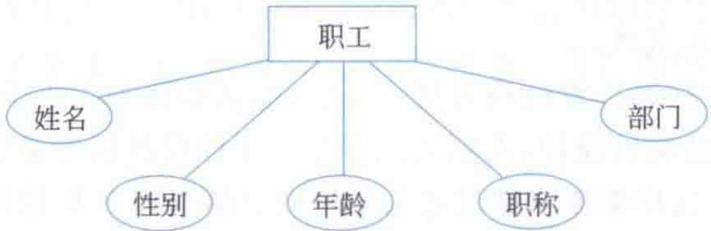
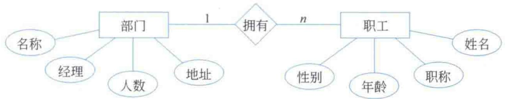
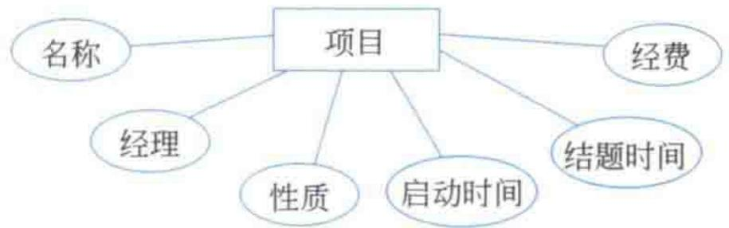
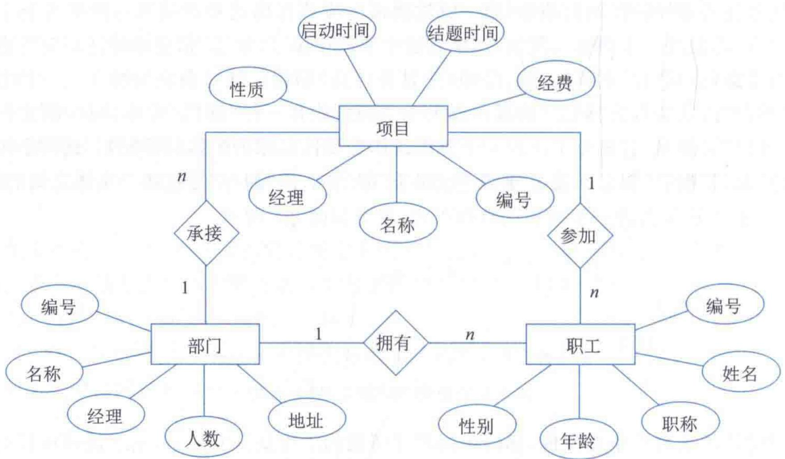
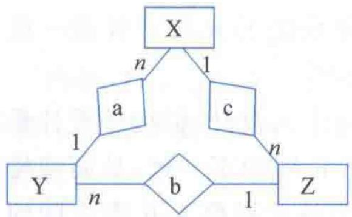
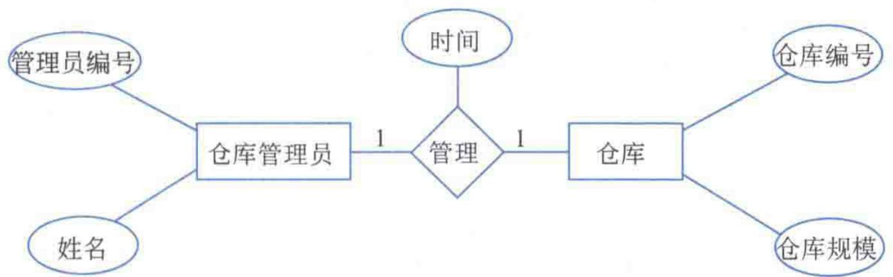
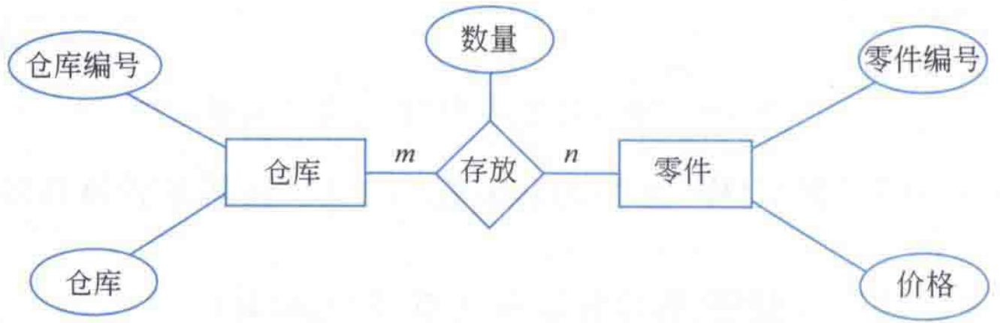
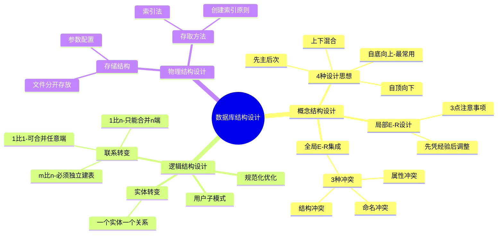

# 第3章-3.3-数据库结构设计

## 基本信息
- **课程**：数据库原理与应用
- **章节**：第3章 3.3节 数据库结构设计
- **日期**：2026-06-30
- **标签**：#数据库设计 #概念结构设计 #逻辑结构设计 #物理结构设计 #E-R图 #索引 #规范化

---

## 重点内容

### ⭐⭐⭐ 核心概念
- **数据库结构设计三阶段**：概念结构设计 -> 逻辑结构设计 -> 物理结构设计
- **概念结构设计**：基于自底向上方法，先设计局部E-R模型，再集成为全局E-R模型
- **E-R到关系模型的转换规则**：1:1、1:n、m:n三种联系各有不同的转换方式
- **物理结构设计**：为逻辑模型选取存储结构和存取方法（索引）

### ⭐⭐ 重要概念
- **4种概念设计思想**：自顶向下、自底向上、先主后次、上下混合
- **3种E-R图冲突**：命名冲突、属性冲突、结构冲突
- **规范化优化**：利用第2章的规范化理论消除冗余和异常
- **用户子模式**：面向用户的外模式，利用视图功能实现

### ⭐ 基础概念
- **存储结构设计**：确定数据存放方式和系统参数配置
- **索引法**：最常用的存取方法，类比图书目录

---

## 详细笔记

### 一、概念结构设计（3.3.1节）

概念结构设计是将需求分析阶段形成的数据流图和数据字典（现实世界的抽象）转化为信息世界中基于信息结构表示的数据结构——**概念结构**。概念结构独立于逻辑结构和物理结构，是现实世界与机器世界之间的中转站。

> 📚 **课本出处**：第3章 3.3.1节"概念结构设计"

概念模式描述的经典工具是**E-R图**，由E-R图表示的概念模型就是**E-R模型**。E-R模型的优点：表达能力强、表示形式简单且直观、定义严格无二义性。

#### 1. 概念结构的4种设计思想

> 📚 **课本出处**：第3章 3.3.1节"概念结构及其设计思想"

| 设计思想 | 方法描述 |
|:--------:|:---------|
| 自顶向下 | 先定义全局概念结构的E-R模型，然后逐步分解细化 |
| 自底向上 | 先根据各部分需求定义局部E-R模型，再拼接为全局E-R模型 |
| 先主后次 | 先设计最重要的概念结构，再依次定义次要的，最后集成 |
| 上下混合 | 将自顶向下和自底向上两种方法结合使用 |

> ⭐ **考试重点**：实际应用中通常采用**自底向上**的设计方法（而需求分析一般采用自顶向下）。

**自底向上方法的两步**：
1. 先建立**局部概念结构**的E-R模型
2. 将所有局部E-R模型**集成**为全局概念结构

---

#### 2. 局部E-R模型的设计

> 📚 **课本出处**：第3章 3.3.1节"局部E-R模型的设计"

局部E-R模型的设计基于需求分析阶段产生的数据流图和数据字典。实体和实体间联系的划分一般采用**"先凭经验，后作调整"**的原则。

**实体与属性划分的3点注意事项**：

| 注意事项 | 说明 |
|:--------:|:-----|
| 属性不可再包含属性 | 被抽象为属性的事物不能再被抽象为实体，否则违反第一范式 |
| 属性具有不可再分性 | 具有不可再分性的事物应抽象为属性，具有可再分性的不能抽象为属性 |
| 属性唯一归属 | 一个事物不能同时作为两个实体的属性 |

> 💡 **理解技巧**：先凭直觉判断哪些是实体、哪些是属性，再根据应用需求调整。例如"部门"最初可能作为"职工"的属性，但当需要存储部门的详细信息时，就应将其提升为独立实体。

#### 📷 图3.4 "职工"实体属性图



> 📚 **课本出处**：图3.4 展示了"职工"实体及其属性（编号、姓名、性别、年龄、职称、部门）

#### 📷 图3.5 "部门"和"职工"的E-R图



> 📚 **课本出处**：图3.5 将"部门"从属性调整为独立实体后形成的E-R图，"部门"与"职工"之间是"拥有"联系

#### 📷 图3.6 "项目"实体属性图



> 📚 **课本出处**：图3.6 展示了"项目"实体及其属性（编号、名称、性质、启动时间、结题时间、经费、经理）

---

#### 3. 全局E-R模型的集成

> 📚 **课本出处**：第3章 3.3.1节"全局E-R模型的集成"

将局部E-R图拼接为全局E-R图时，由于不同设计者、不同时间、不同条件完成的设计，可能产生**冲突**。

#### 📷 图3.7 企业信息管理系统的E-R图



> 📚 **课本出处**：图3.7 展示了将局部E-R图拼接后形成的全局E-R图，包含部门、职工、项目三个实体

#### ⭐⭐⭐ 3种冲突类型

| 冲突类型 | 表现 | 解决方法 |
|:--------:|:-----|:---------|
| **命名冲突** | 意义不同的元素有相同名字，或相同意义的元素有不同名字 | 开发人员充分协商，制定统一命名规则 |
| **属性冲突** | 同义同名的属性在不同局部E-R图中取值类型、范围、单位不同 | 协商统一属性的类型、范围和单位 |
| **结构冲突** | 同一事物在不同局部E-R图中分别被抽象为实体和属性 | 视情况将属性改为实体或将实体改为属性 |

> ⚠️ **常见误区**：结构冲突的另一种表现是——相同实体在不同局部E-R图中有不同属性或不同联系。解决方法是使实体的属性集为各E-R图中属性集的**并集**，联系则需要根据具体情况分解或调整。

#### 📷 图3.8 带环结构的E-R图



> 📚 **课本出处**：图3.8 展示了包含环形结构的E-R图，X->Y->Z->X构成死循环参照关系，导致无法建表

> ⚠️ **常见误区**：环形结构不等于死循环。如果环中表达的参照关系是合理的（如图3.7中部门-职工-项目的环），则不会出现无法建表的问题。只有当参照关系形成真正的"死循环"时才需要修改。

---

### 二、逻辑结构设计（3.3.2节）

逻辑结构设计就是将E-R图表示的概念结构转换为DBMS支持的数据模型（关系模型）并进行优化的过程。

> 📚 **课本出处**：第3章 3.3.2节"逻辑结构设计"

#### 1. 实体和属性的转变

转换规则简单直观：**一个实体转化为一个关系模式**，实体名变为关系名，实体属性变为关系属性。

例如图3.7中的三个实体分别转换为：
- **项目**（编号，名称，经理，性质，启动时间，结题时间，经费）
- **部门**（编号，名称，经理，人数，地址）
- **职工**（编号，姓名，性别，职称，年龄）

> 📚 **课本出处**：第3章 3.3.2节"实体和属性的转变"

#### 2. 1:1联系的转变

> 📚 **课本出处**：第3章 3.3.2节"（1:1）联系的转变"

**方法一**：创建独立的关系模式，属性 = 联系本身的属性 + 两端实体的候选码。

例如"仓库管理员"和"仓库"之间的"管理"联系（1:1）：

#### 📷 图3.9 "仓库管理员"和"仓库"的E-R图



> 📚 **课本出处**：图3.9 展示了仓库管理员和仓库之间1:1联系的E-R图

转换结果：
```
管理（管理员编号，仓库编号，时间）
```

**方法二**：将联系合并到任意一端实体的关系中。将另一端的候选码及联系属性添加到该实体关系中。

```
仓库管理员（管理员编号，姓名，仓库编号，时间）
```
或
```
仓库（仓库编号，仓库规模，管理员编号，时间）
```

> 💡 **理解技巧**：1:1联系可以合并到任意一端。实际中从效率角度考虑，查询更频繁的表应作为合并目标，避免额外连接查询。

#### 3. 1:n联系的转变

> 📚 **课本出处**：第3章 3.3.2节"（1:n）联系的转变"

**方法一**：创建独立的关系模式。

```
拥有（职工.编号，部门.编号）
```

**方法二（推荐）**：将联系合并到**n端**对应的关系模式中（将1端的候选码添加到n端关系中）。

```
职工（职工.编号，姓名，性别，年龄，职称，部门.编号）
```

> ⭐ **考试重点**：1:n联系合并时**只能合并到n端**，不能合并到1端。这是因为将1端的码加入n端，每个n端元组对应一个1端值，不会产生冗余；反之则会产生大量冗余。

#### 4. m:n联系的转变

> 📚 **课本出处**：第3章 3.3.2节"（m:n）联系的转变"

**m:n联系只能转换为独立的关系模式**，其属性 = 两端实体的码 + 联系本身的属性。

#### 📷 图3.10 "仓库"和"零件"及其联系的E-R图



> 📚 **课本出处**：图3.10 展示了仓库和零件之间m:n联系"存放"的E-R图

转换结果：
```
存放（仓库编号，零件编号，数量）
```

> ⭐ **核心重点**：m:n联系**不能合并**到任何一端，必须独立建表。因为两端都有多个值对应，合并到任一端都会产生数据冗余和更新异常。

---

#### 5. 应用规范化理论优化逻辑结构

> 📚 **课本出处**：第3章 3.3.2节"应用规范化理论实现逻辑结构的优化"

在形成关系模式后，需要基于**规范化理论**进行优化处理，减少数据冗余、消除删除冲突和插入冲突。具体方法参见第2章（2.5节范式理论）。

#### 6. 用户子模式的设计

> 📚 **课本出处**：第3章 3.3.2节"用户子模式的设计"

用户子模式（外模式）是面向用户的数据模型部分，利用DBMS的**视图功能**实现：
- 屏蔽概念模式，实现程序与数据的独立
- 满足不同用户对数据的个性化需求
- 利于数据库管理

---

### 三、物理结构设计（3.3.3节）

物理结构设计是为既定的数据模型选取特定的、有效的**存储结构**和**存取方法**的过程。

> 📚 **课本出处**：第3章 3.3.3节"物理结构设计"

#### 1. 数据库存储结构的设计

> 📚 **课本出处**：第3章 3.3.3节"数据库存储结构的设计"

存储结构设计在已选定的DBMS和硬件条件下进行，主要从两方面考虑：

**（1）确定数据的存放方式**

指导性规则：
- 数据文件和日志文件应该**分开存放**
- 多磁盘系统中，数据库文件**分布在不同磁盘**中
- 数据表和索引**分开存放**在不同的数据库文件中
- 大的数据对象**分散存储**在不同的数据库文件中

**（2）确定系统参数的配置**

主要参数包括：数据库大小、同时连接的用户数、缓冲区个数和大小、索引文件大小、填充因子等。DBMS通常提供初始值，但需要设计人员根据具体应用环境重新配置。

#### 2. 确定存取方法（索引法）

> 📚 **课本出处**：第3章 3.3.3节"确定存取方法"

索引法是最常用的存取方法。索引相当于"数据的目录"，是数据标题和数据内存地址的列表，通过索引可以从部分数据检索中实现快速查找。

> ⚠️ **常见误区**：索引不是无代价的。索引本身也是数据表，占用存储资源，且在数据更新操作（增删改）时需要同步维护索引。因此应慎重考虑是否创建索引。

**适合创建索引的情况**：

| 场景 | 原因 |
|:-----|:-----|
| 经常用于检索的列 | 提高查询速度（主码索引一般由DBMS自动完成） |
| 外键列 | 经常用于连接查询 |
| 以读为主或经常排序的列 | 索引已排序，加快读取和排序效率 |
| 经常用于条件查询的列 | 尤其是满足条件的元组较少时 |

**不宜创建索引的情况**：

| 场景 | 原因 |
|:-----|:-----|
| 不经常检索的列 | 浪费存储空间 |
| 值域很小的列 | 如"性别"只有两个值，索引无作用 |
| 值域严重分布不均匀的列 | 索引效率低下 |
| 更新操作非常频繁的列 | 更新数据时还要更新索引，降低系统效率 |

---

## 总结

### 设计三阶段对比表

| 设计阶段 | 输入 | 输出 | 核心任务 |
|:--------:|:-----|:-----|:---------|
| **概念结构设计** | 数据流图、数据字典 | E-R模型（概念结构） | 实体识别、联系抽象、E-R图集成 |
| **逻辑结构设计** | E-R模型 | 关系模式（逻辑结构） | E-R到关系模型转换、规范化优化 |
| **物理结构设计** | 关系模型 | 物理存储方案 | 存储结构设计、存取方法（索引）选择 |

### 联系转换规则对比表

| 联系类型 | 转换方式 | 关系模式示例 |
|:--------:|:---------|:------------|
| **实体** | 直接转为关系模式 | 职工（编号，姓名，性别） |
| **1:1联系** | 可独立建表，也可合并到**任意一端** | 管理（管理员编号，仓库编号，时间） |
| **1:n联系** | 可独立建表，或合并到**n端** | 职工（编号，...，部门编号） |
| **m:n联系** | **必须**独立建表 | 存放（仓库编号，零件编号，数量） |

### 三种E-R图冲突对比表

| 冲突类型 | 本质 | 典型表现 | 解决方法 | 难度 |
|:--------:|:-----|:---------|:---------|:----:|
| **命名冲突** | 名字与含义不一致 | 不同事物同名 / 相同事物异名 | 统一命名规则 | 低 |
| **属性冲突** | 属性定义不一致 | 同一属性类型/范围/单位不同 | 协商统一定义 | 低 |
| **结构冲突** | 抽象层次不一致 | 同一事物一处为实体另一处为属性 | 调整实体/属性归属 | 高 |

### 知识点脑图



### 关键要点

1. **概念结构设计是数据库设计的关键环节**，独立于逻辑和物理结构
2. **自底向上**是实际中最常用的概念设计方法
3. **结构冲突**是三种冲突中最难解决的，应在设计前加强沟通
4. **1:n联系合并到n端**、**m:n联系必须独立建表**是转换核心规则
5. **索引创建要慎重**，需权衡查询加速与更新维护的开销
6. 物理结构设计依赖于具体的DBMS和硬件环境

---

## 疑问与思考

### ❓ 待解决问题

1. **三种冲突类型如何快速区分？** 命名冲突管"名字"，属性冲突管"定义"，结构冲突管"层次"。可以用一个口诀："名同义不同是命名，义同型不同是属性，此为实体彼为属性是结构"。

2. **1:1、1:n、m:n三种联系的转换规则如何记忆？** 核心逻辑是"不能产生冗余"：1:1两端都是一对一，合并到任意一端不会冗余；1:n只有合并到n端不会冗余（每个n端元组只对应一个1端值）；m:n无论合并到哪端都会产生冗余（两端都是多对多），所以必须独立建表。

3. **索引创建的根本原则是什么？** 一句话概括：**读多写少适合建索引，读少写多不宜建索引**。索引本质是用空间换时间，当查询收益大于维护代价时才值得创建。

4. **带环的E-R图什么时候是允许的？** 关键看环中的参照关系是否构成"死循环"。如果环中的联系能形成合理的数据依赖（如图3.7中部门-职工-项目的环），则是允许的。只有当环导致建表时出现循环依赖无法初始化时才需要修改。

5. **概念结构设计和需求分析的关系是什么？** 需求分析采用自顶向下的方法，产出数据流图和数据字典；概念结构设计通常采用自底向上的方法，将需求分析的成果转化为E-R模型。两者方法论相反但互相衔接。

6. **用户子模式（外模式）和视图是什么关系？** 用户子模式就是利用DBMS的视图功能来实现的。一个用户子模式可以对应一个或多个视图，不同用户可以看到不同的数据子集，从而实现个性化需求和安全性控制。

### 💡 个人理解/技巧

- **E-R设计的"先凭经验后调整"** 可以理解为：先快速出一版草稿，再迭代优化。这和软件开发中的敏捷思想类似——不要追求一次到位。
- **自底向上方法** 与需求分析的自顶向下形成互补：需求分析从全局到细节分解问题，概念设计从细节到全局整合方案。
- **实体属性划分的三条规则** 本质上就是在说：属性必须是**原子的**（不可再分）、**独立的**（唯一归属）、**不能再包含属性**（遵守第一范式）。
- **物理结构设计** 看似是技术细节，但对数据库性能影响巨大。好的索引设计可以让查询速度提升几个数量级，差的索引设计反而会拖慢系统。
- **三种冲突的记忆技巧**：命名冲突最简单（改个名字就行），属性冲突也不难（统一类型即可），结构冲突最麻烦（可能要改E-R图结构）。

---

## 相关链接

### 本节相关图片
- [图3.4 "职工"实体属性图](../../../images/5ba6bab9e95899e3c2e6d7c4e212bee7c88a344789c382f8154d2fe29f55f290.jpg)
- [图3.5 "部门"和"职工"的E-R图](../../../images/6576f09f7c93802c6937a33585ef71f89b4166ac471b239dbeb4be17499c021c.jpg)
- [图3.6 "项目"实体属性图](../../../images/c38c7c472043dbfdacf4e6d1ebc8ee5b372493016fcae0e8564ab35b03f3703e.jpg)
- [图3.7 企业信息管理系统的E-R图](../../../images/d16e5cd943a868c3802e7f59fbc5e17f6440710e7436f8332196d0a4f8e277f8.jpg)
- [图3.8 带环结构的E-R图](../../../images/e4302de3ab711e71c5250e6e646f3f5513a563fe9950179f8fdf1ae46d4f5c47.jpg)
- [图3.9 "仓库管理员"和"仓库"的E-R图](../../../images/1b414754894b10d9eb90ad3066eb1ba3d94a77fd5281a92745a3ebc3d1f5627c.jpg)
- [图3.10 "仓库"和"零件"及其联系的E-R图](../../../images/6fd7831d1311d7f4e771461b94c3fd781b4b649939b0bec079b988fd7a13d37e.jpg)

### 关联章节
- [第3章-数据库设计技术](./第3章-数据库设计技术.md)
- 第3章-3.1-数据库设计概述（待创建）
- 第3章-3.2-系统需求分析（待创建）
- 第3章-3.4-数据库的实施运行和维护（待创建）
- [第2章-2.5-关系模式的范式](../../第2章-关系数据库理论基础/) — 规范化优化的理论基础
- [第1章-1.5-概念模型的描述](../第1章-数据库概述/) — E-R图的基本画法

---

## 检查清单

- [x] 已理解概念结构设计的4种设计思想和自底向上方法
- [x] 已理解局部E-R模型设计的原则和注意事项
- [x] 已掌握3种E-R图冲突的类型和解决方法
- [x] 已掌握E-R到关系模型的转换规则（1:1、1:n、m:n）
- [x] 已理解物理结构设计的存储结构和存取方法
- [x] 已插入课本原图（图3.4~图3.10共7张）
- [x] 已添加课本出处标注
- [x] 已添加疑问与思考

---

*笔记创建时间：2026-06-30*
