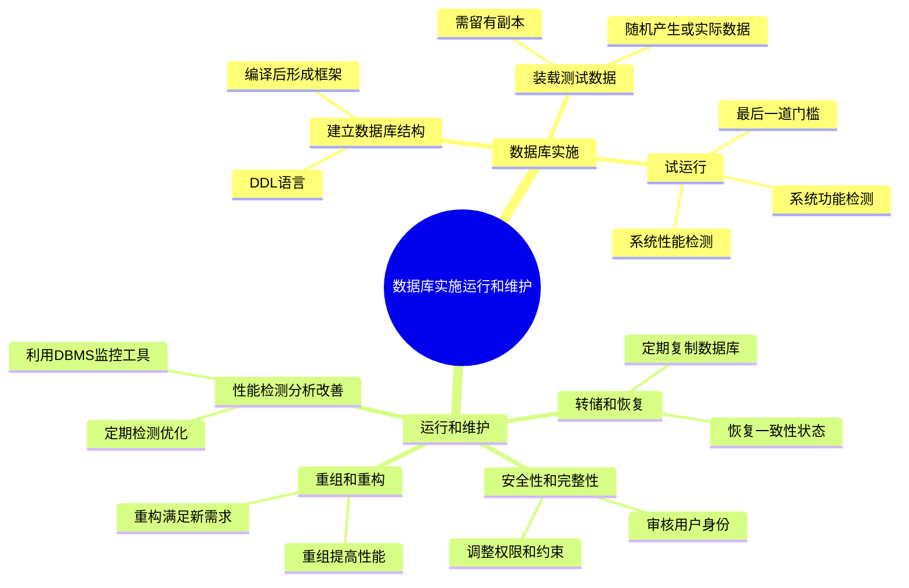

# 第3章-3.4-数据库的实施运行和维护

## 基本信息
- **课程**：数据库原理与应用
- **章节**：第3章 3.4节 数据库的实施、运行和维护
- **日期**：2026-06-30
- **标签**：#数据库实施 #运行维护 #数据库转储 #性能优化 #DBA

---

## 重点内容

### ⭐⭐⭐ 核心概念
- **数据库实施三步骤**：建立数据库结构 -> 装载测试数据/编写调试程序 -> 试运行
- **数据库实施的本质**：将前面设计结果付诸实践，形成能够实际运行的动态系统
- **运行维护的定位**：不是数据库设计的终点，而是设计的延续和提高

### ⭐⭐ 关键知识点
- **试运行与调试的区别**：调试侧重发现错误并纠正；试运行侧重系统性能检测和评价
- **数据库转储**：定期将整个数据库复制到磁盘或其他存储设备上保护起来的过程
- **重组与重构的区别**：重组提高性能（不改变模式），重构满足新需求（改变模式）

### ⭐ 重要细节
- 测试数据应能充分反映实际应用中的各种情况
- 数据库重构可能导致"牵一发而动全身"的后果，需慎重使用
- DBA（系统管理员）是运行维护阶段的核心角色

---

## 详细笔记

### 一、数据库实施概述

数据库的实施是在数据库逻辑设计和物理设计的基础之上进行的。

> 📚 **课本出处**：第3章 3.4节"数据库的实施、运行和维护"

**数据库实施与前面设计阶段的区别**：

| 对比项 | 设计阶段（需求分析/概念/逻辑/物理） | 实施阶段 |
|:------:|:----:|:----:|
| **状态** | 静态 | 动态 |
| **载体** | 文档 | 可运行的系统 |
| **基础** | — | 以设计结果为基础 |

**设计阶段是实施的前提**：前面的设计是数据库系统能够稳定、高效运行的前提。

---

### 二、数据库实施（3.4.1）

数据库实施包括以下3方面的内容：

> 📚 **课本出处**：第3章 3.4.1节"数据库实施"

#### 1. 建立数据库结构

根据物理结构的设计结果，选定相应的DBMS。然后在该DBMS系统中利用其提供的DDL语言建立数据库结构。

> 📚 **课本出处**：第3章 3.4.1节"建立数据库结构"

例如，在SQL Server中，可用如下SQL语句创建数据库和数据表：

```sql
CREATE DATABASE database_name
CREATE TABLE table_name
```

此外，SQL Server还为数据库结构的创建提供了**可视化的图形界面操作方法**，极大提高工作效率。

**关键要点**：
- 数据库结构定义后，通过DBMS提供的编译处理程序编译，形成实际可运行的数据库
- 此时的数据库还只是一个**框架**，内容是空的
- 需要编写应用程序、装载数据，才能形成"有血有肉"的动态系统

> 💡 **理解技巧**：建立数据库结构相当于"盖房子的框架"，装载数据和编写程序相当于"装修和入住"。

---

#### 2. 装载测试数据，编写调试应用程序

> 📚 **课本出处**：第3章 3.4.1节"装载测试数据，编写调试应用程序"

**关键时序关系**：
- 应用程序的**设计**与数据库设计可以**同时进行**
- 应用程序的**代码编写和调试**则在数据库结构创建以后进行

**测试数据的要求**：

| 要求 | 说明 |
|:----:|:-----|
| 充分反映实际情况 | 测试数据应能充分反映实际应用中的各种情况 |
| 充分测试应用程序 | 确保应用程序符合实际应用的要求 |
| 数据来源 | 可随机产生，也可用实际数据（需留有副本） |

> ⚠️ **常见误区**：使用实际数据作为测试数据时，一定要**留有副本**，以防调试过程中数据被修改或损坏。

---

#### 3. 试运行

应用程序调试完后，给数据库加载实际数据并运行应用程序，但**还没有正式投入使用**，只是查看数据库应用系统各方面的功能，这种运行就称为**试运行**（也称联合调试）。

> 📚 **课本出处**：第3章 3.4.1节"试运行"

**试运行与调试的区别**：

| 对比项 | 调试 | 试运行 |
|:------:|:----:|:------:|
| **侧重点** | 发现并纠正系统中可能存在的错误 | 系统性能的检测和评价 |
| **目的** | 保证程序正确性 | 评估系统整体表现 |
| **测试对象** | 程序代码 | 整个应用系统 |

**试运行的主要工作**：

1. **系统性能检测**
   - 测试系统的稳定性、安全性和效率等指标
   - 查看是否符合设计时设定的目标

2. **系统功能检测**
   - 按各个功能模块逐项检测
   - 检查系统各功能模块是否能够完成既定功能

**试运行结果处理**：
- 如果检测结果**不符合设计目标** -> 返回相应设计阶段，重新修改程序代码或数据库结构
- 如果不符合要求就强行投入使用 -> 可能产生**灾难性后果**

> 📚 **课本出处**：第3章 3.4.1节"试运行"

> 📌 **考试重点**：试运行是系统交付使用的最后一道"门槛"，对以后的正式运行有着非常重要的意义。

---

### 三、数据库系统的运行和维护（3.4.2）

试运行结束并被证实符合设计要求后，数据库就可以正式投入使用。

> 📚 **课本出处**：第3章 3.4.2节"数据库系统的运行和维护"

**重要定位**：
- 数据库的正式使用标志着数据库开发阶段的**基本结束**
- 同时意味着数据库运行和维护阶段的**开始**
- 运行和维护**不是**数据库设计的终点，而是设计的**延续和提高**

**维护工作的特点**：
- 专业性很强，需要很强的专业技术
- 一般由**系统管理员（DBA）**完成
- 本质上是软件产品的售后服务

> 📚 **课本出处**：第3章 3.4.2节"数据库系统的运行和维护"

DBA在运行和维护阶段的主要工作包括以下4项：

---

#### 1. 数据库的转储和恢复

> 📚 **课本出处**：第3章 3.4.2节"数据库的转储和恢复"

**背景**：数据库正式投入使用后，企业的相关数据全部存入数据库（一般不会另记在纸质材料中）。如果数据库发生故障，可能导致数据丢失，造成企业重大损失。

**数据库转储的定义**：定期地把整个数据库复制到磁盘或其他存储设备上保护起来的过程。

**DBA的任务**：根据应用的具体要求制定相应的备份和恢复方案，保证一旦发生故障，能够尽快将数据库恢复到某一种**一致性的最近状态**，尽量减少损失。

> 📌 **考试重点**：数据库的转储和恢复是数据库运行维护中**最重要的工作之一**。

---

#### 2. 数据库性能的检测、分析和改善

> 📚 **课本出处**：第3章 3.4.2节"数据库性能的检测、分析和改善"

**性能下降的原因**：
- 随着运行时间增加，数据库的物理存储不断发生改变
- 数据量不断增加
- 用户数量不断增加

**DBA的任务**：利用DBMS提供的**性能监控和分析工具**，定期对数据库的各种性能指标进行检测，及早发现问题并采取相应的优化和改善措施。

---

#### 3. 数据库的安全性和完整性维护

> 📚 **课本出处**：第3章 3.4.2节"数据库的安全性和完整性维护"

**安全性维护**：
- 认真审核每一个用户的身份
- 正确授予相应的权限
- 随着时间和应用环境变化，对安全性控制作出相应调整

**完整性维护**：
- 数据库的完整性约束条件会随时间发生变化
- DBA需要作出相应的修正，以满足新的要求

---

#### 4. 数据库的重组和重构

> 📚 **课本出处**：第3章 3.4.2节"数据库的重组和重构"

**数据库重组**：
- **原因**：数据的插入、修改和删除操作的多次使用，使数据在磁盘上的存储分布越来越散，导致存储效率降低，系统性能下降
- **目的**：提高系统性能
- **方法**：对数据库在磁盘上的存储分布进行调整
- **特点**：**不会改变**数据库的模式和内模式

**数据库重构**：
- **原因**：应用发展需要，用户可能要求增加/删除某些属性或实体，修改实体间联系等
- **目的**：实现新的用户需求
- **方法**：对数据库的模式和内模式进行调整（增加或删除列和表、索引、修改完整性约束等）
- **特点**：**会改变**数据库的模式和内模式
- **影响**：不仅改变数据库结构，多数情况下也要求应用程序作相应修改

**重组与重构的本质区别**：

| 对比项 | 数据库重组 | 数据库重构 |
|:------:|:----------:|:----------:|
| **目的** | 提高系统性能 | 满足新的用户需求 |
| **是否改变模式** | 不改变 | 改变 |
| **是否改变内模式** | 不改变 | 改变 |
| **对应用程序的影响** | 无影响 | 通常需要修改 |
| **使用频率** | 较频繁 | 不到迫不得已不使用 |

> ⚠️ **常见误区**：数据库重构不是"无所不能"的，需求变化幅度必须限制在一定范围内。如果超过范围，可能需要设计一个全新的系统来取代。

> 📚 **课本出处**：第3章 3.4.2节"数据库的重组和重构"

---

## 总结

### 数据库实施三步骤

| 步骤 | 内容 | 关键要点 |
|:----:|:-----|:---------|
| **建立数据库结构** | 根据物理设计结果，选定DBMS，利用DDL建立数据库结构 | 此时数据库只是框架，内容为空 |
| **装载测试数据/编写调试程序** | 装载测试数据，编写和调试应用程序 | 应用程序设计可与数据库设计同步，编写在结构创建后进行 |
| **试运行** | 加载实际数据，运行应用程序检测功能和性能 | 系统交付前最后一道"门槛"，需检测性能和功能 |

### DBA运行维护四大职责

| 职责 | 核心内容 | 重要程度 |
|:----:|:---------|:--------:|
| **转储和恢复** | 制定备份和恢复方案，故障时恢复到一致性最近状态 | ⭐⭐⭐ 最重要 |
| **性能检测、分析和改善** | 利用DBMS工具定期检测性能指标，及时优化 | ⭐⭐ |
| **安全性和完整性维护** | 审核用户身份、授予权限、调整约束条件 | ⭐⭐ |
| **重组和重构** | 重组提高性能（不改模式），重构满足新需求（改模式） | ⭐ |

### 知识点脑图



---

## 疑问与思考

### ❓ 待解决问题
1. **试运行与正式运行有什么区别？** 试运行是在系统交付前的检测阶段，加载实际数据但未正式使用；正式运行是系统通过检测后真正投入生产使用。试运行发现问题可返回修改，正式运行发现问题可能造成灾难性后果。
2. **DBA的主要职责有哪些？** DBA（数据库管理员）在运行维护阶段主要负责4项工作：数据库的转储和恢复、性能检测分析和改善、安全性和完整性维护、数据库的重组和重构。DBA是维护阶段的核心角色，需要很强的专业技术。
3. **调试和试运行的区别是什么？** 调试侧重于发现和纠正系统中的错误（程序正确性），试运行虽然也需要发现错误，但更注重系统性能的检测和评价（整体表现评估）。
4. **数据库重组和重构有什么本质区别？** 重组目的是提高性能，不改变模式和内模式；重构目的是满足新需求，需要修改模式和内模式，且通常要求应用程序也作相应修改。

### 💡 个人理解/技巧
- 数据库实施可以类比"从设计图纸到实际施工"：设计阶段是在纸上画图（静态），实施阶段是真正盖楼（动态）
- 试运行相当于"试营业"：加载真实数据和真实用户，但还没正式对外开业，发现问题还可以关店整改
- DBA的四大职责可以用"备份、提速、安全、扩展"四个关键词记忆
- 重组和重构的区别：重组是"打扫房间"（东西没变，只是整理位置），重构是"改造房间"（拆墙、加房间，结构变了）
- 数据库重构要非常谨慎，因为"牵一发而动全身"，不到迫不得已不要使用

---

## 相关链接

### 关联章节
- [第3章-3.1-数据库设计概述](./第3章-3.1-数据库设计概述.md)（待创建）
- [第3章-3.2-需求分析](./第3章-3.2-需求分析.md)（待创建）
- [第3章-3.3-数据库结构设计](./第3章-3.3-数据库结构设计.md)（待创建）
- [第1章-1.3-数据库系统概述](../../第1章-数据库概述/第1章-1.3-数据库系统概述.md)（待创建）
- [第2章-2.2-数据通信的基础知识](../../第2章-关系数据库理论基础/第2章-2.2-数据通信的基础知识.md)

---

## 检查清单

- [x] 已掌握数据库实施的三个步骤
- [x] 已理解数据库结构建立的方法（DDL语言）
- [x] 已区分调试与试运行的区别
- [x] 已掌握DBA运行维护的四大职责
- [x] 已理解数据库重组与重构的本质区别
- [x] 已添加课本出处标注

---

*笔记创建时间：2026-06-30*
