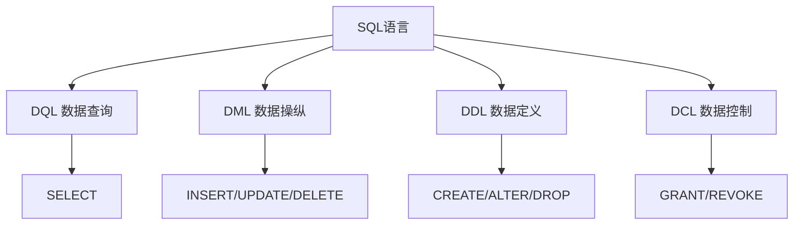

# 第4章-4.1-SQL概述

## 基本信息
- **课程**：数据库原理与应用
- **章节**：第4章 4.1节 SQL概述
- **日期**：2026-06-30
- **标签**：#SQL #SQL发展 #SQL特点 #DDL #DML #DCL #DQL

---

## 重点内容

### ⭐⭐⭐ 核心概念
- **SQL定义**：Structured Query Language，结构化查询语言，关系数据库的标准语言
- **SQL四大功能**：数据查询（DQL）、数据操纵（DML）、数据定义（DDL）、数据控制（DCL）
- **SQL核心关键字**：仅9个——CREATE、ALTER、DROP、GRANT、REVOKE、SELECT、INSERT、UPDATE、DELETE

### ⭐⭐ SQL六大特点
- 高度非过程化、统一的操作语言、关系数据库标准语言
- 面向集合、可嵌入式、简单易学

### ⭐ 基础知识
- SQL标准演进：SQL-86 -> SQL-89 -> SQL-92(SQL2) -> SQL-99(SQL3) -> SQL-2003
- SQL支持三级模式：外模式（视图）、模式（基本表）、内模式（存储文件）

---

## 详细笔记

### 一、SQL语言的发展（4.1.1）

> 📚 **课本出处**：第4章 4.1.1节"SQL语言的发展"

SQL是**Structured Query Language**的缩写，意为"结构化查询语言"，是关系数据库的标准语言。

**SQL标准演进历程**：

| 时间 | 事件 | 说明 |
|:----:|:-----|:-----|
| 1974年 | Boyce和Chamberlin提出 | SQL最初被提出 |
| 1979年 | IBM在System R上首次实现 | SQL从理论走向实践 |
| 1986年 | ANSI公布SQL-86 | 第一个SQL标准 |
| 1987年 | ISO接纳SQL-86 | 成为国际标准 |
| 1989年 | SQL-89标准 | ISO和ANSI进一步完善 |
| 1992年 | SQL-92 (SQL2) | 新的SQL标准 |
| 1999年 | SQL-99 (SQL3) | 功能更加丰富 |
| 2003年 | SQL-2003 | 兼容XML语言 |

**当前主流支持SQL的数据库产品**：DB2、Oracle、SQL Server等。

> 💡 **理解技巧**：SQL之所以能成为标准语言，是因为它功能丰富、语法简洁、灵活易学，得到了厂商和用户的广泛支持。除SQL外，还有QBE、Quel、Datalog等数据库语言，但它们仅限于少数专业研究人员使用，并非主流。

---

### 二、SQL语言的特点（4.1.2）

> 📚 **课本出处**：第4章 4.1.2节"SQL语言的特点"

SQL语言集数据查询、数据操纵、数据定义和数据控制功能于一体，是一种通用的、功能强大而又简单易学的关系数据库语言。

#### 1. 综合统一

> 📚 **课本出处**：第4章 4.1.2节"统一的数据库操作语言"

SQL语言风格统一，可以用于创建数据库、定义关系模式、完成数据的查询、修改、删除、控制等操作。

- 为数据库应用系统的开发提供了良好的环境
- 可以使用SQL语言实现数据库重构
- 不影响数据库正常运行，具有良好的**可扩展性**

#### 2. 高度非过程化

> 📚 **课本出处**：第4章 4.1.2节"高度非过程化语言"

SQL是一种高度**非过程化**的语言，它一次执行一条命令，对数据提供自动导航。

- 不要求用户指定对数据的存放方法
- 只要求用户提出"**要干什么**"（WHAT），而"**怎么干**"（HOW）由系统自动完成
- 用户可以将更多精力集中于**功能设计**

> ⚠️ **常见误区**：非关系数据模型的数据操纵语言都是面向过程的语言，使用时必须指定存储路径；而SQL完全不同，用户无需关心底层存储路径。

#### 3. 面向集合的操作方式

> 📚 **课本出处**：第4章 4.1.2节"面向集合的数据操纵语言"

非关系数据模型的操作一般是**面向记录**的（每次操作针对一条记录），而SQL以**面向集合**的方式进行操作。

- 每一次操作是针对所有满足条件的元组组成的**集合**
- 操作所产生的结果也是**元组的集合**

> 💡 **理解技巧**：面向记录意味着"一次处理一行"，需要循环；面向集合意味着"一次处理一批"，SQL自动处理。

#### 4. 使用同一种语法结构（关系数据库的标准语言）

> 📚 **课本出处**：第4章 4.1.2节"关系数据库的标准语言"

SQL成为国际标准后，绝大多数数据库厂商都支持SQL。

- 所有用SQL编写的程序可以在**不同系统中移植**
- 结束了数据库查询语言"各自为政的分割局面"
- 也可以**嵌入**到C、COBOL、FORTRAN、VB等高级语言中

#### 5. 语言简洁（简单易学）

> 📚 **课本出处**：第4章 4.1.2节"简单易学"

SQL语法结构简单，调用格式简洁，核心关键字只有**9个**：

| 类别 | 关键字 | 功能 |
|:----:|:------:|:-----|
| 定义 | CREATE, ALTER, DROP | 创建、修改、删除数据库对象 |
| 控制 | GRANT, REVOKE | 授权、回收权限 |
| 操作 | SELECT, INSERT, UPDATE, DELETE | 查询、插入、更新、删除 |

语法接近英语口语，方便理解和记忆。

#### 6. 支持三级模式

> 📚 **课本出处**：第4章 4.1.2节（特点概述部分隐含）

SQL语言支持关系数据库的三级模式结构：

| 模式层次 | 对应SQL对象 | 说明 |
|:--------:|:----------:|:-----|
| 外模式 | 视图（View） | 用户看到的局部数据逻辑结构 |
| 模式 | 基本表（Base Table） | 数据库中的全部数据 |
| 内模式 | 存储文件 | 数据的实际物理存储 |

---

### 三、SQL语言的基本功能（4.1.3）

> 📚 **课本出处**：第4章 4.1.3节"SQL语言的基本功能"

SQL语言具有4个功能，下表列出了功能与SQL语句的对应关系：

#### 表4.1 SQL功能与SQL语句的对应关系

| SQL功能 | 英文缩写 | SQL语句 | 说明 |
|:-------:|:--------:|:-------:|:-----|
| 数据查询 | DQL (Data Query Language) | SELECT | 数据库中使用最多的操作 |
| 数据操纵 | DML (Data Manipulation Language) | INSERT、UPDATE、DELETE | 数据的插入、更新和删除 |
| 数据定义 | DDL (Data Definition Language) | CREATE、ALTER、DROP | 定义、修改和删除数据库对象 |
| 数据控制 | DCL (Data Control Language) | GRANT、REVOKE | 事务管理、数据保护、安全性和完整性控制 |

#### 1. 数据查询功能

- 通过**SELECT**语句完成
- SQL语言最初设计就是用于数据查询
- 这也是它被称为"结构查询语言"的主要原因
- SELECT语句功能强大，表达形式丰富

#### 2. 数据操纵功能

- 通过**INSERT、UPDATE、DELETE**语句完成
- 仅次于数据查询，也是数据库中使用较多的操作

#### 3. 数据定义功能

- 通过**CREATE、ALTER、DROP**语句完成
- 用于定义、修改和删除数据库和数据库对象（数据表、视图等）

#### 4. 数据控制功能

- 主要通过**GRANT、REVOKE**语句完成
- 涉及事务管理、数据保护（数据库恢复、并发控制等）、安全性和完整性控制

---

## 总结

### SQL四大功能速记

### 关键要点

1. **SQL是关系数据库的标准语言**，核心关键字仅9个，语法接近英语口语
2. **高度非过程化**是SQL最显著的特点：用户只需说"要什么"，系统自动处理"怎么做"
3. **面向集合**的操作方式，区别于面向记录的过程化语言
4. **综合统一**：SQL可以完成从定义到查询、操纵、控制的所有功能
5. **可嵌入**：既可交互执行，也可嵌入高级语言中使用
6. **支持三级模式**：外模式（视图）、模式（基本表）、内模式（存储文件）
7. SQL标准不断演进，从1974年提出到2003年兼容XML，功能越来越丰富

---

## 疑问与思考

❓ **疑问**：SQL 的 DQL（数据查询）与 DML（数据操纵）在实际应用中如何区分？SELECT 查询结果能否直接用于 INSERT？

💡 **解答**：
- DQL（SELECT）只负责**查询数据**，不修改数据库内容
- DML（INSERT/UPDATE/DELETE）负责**修改数据**
- SELECT 查询结果**可以**直接用于 INSERT，即 `INSERT INTO 表 SELECT ...` 语法，实现批量插入

❓ **疑问**：SQL 的"高度非过程化"是什么意思？

💡 **解答**：
- 用户只需说明**想要什么**（what），不需要告诉系统**怎么做**（how）
- 例如 `SELECT * FROM student WHERE age > 20`，用户不用指定是逐行扫描还是用索引
- 这使 SQL 成为**声明式语言**，类似 HTML 描述页面结构

❓ **疑问**：SQL 支持三级模式具体体现在哪里？

💡 **解答**：
- **外模式**：通过视图（VIEW）实现，不同用户看到不同的数据视图
- **概念模式**：通过基本表（TABLE）定义
- **内模式**：通过索引和存储方式体现
- 修改内模式不影响概念模式，修改概念模式不影响外模式 → 保证数据独立性

### 💡 个人理解/技巧
- SQL的9个核心关键字可以按功能分三组记忆：定义组（CREATE/ALTER/DROP）、操作组（SELECT/INSERT/UPDATE/DELETE）、控制组（GRANT/REVOKE）
- "高度非过程化"意味着SQL是**声明式语言**（只描述目标），而非命令式语言（描述步骤），类似HTML描述页面结构而非描述如何渲染
- SQL支持三级模式的特点使其天然具备数据独立性，修改内模式不影响模式，修改模式不影响外模式
- 面向集合的操作方式使SQL效率远高于逐行处理，但也意味着需要理解集合运算的逻辑

---

## 相关链接

### 关联章节
- [第4章-数据库查询语言SQL](./第4章-数据库查询语言SQL.md)
- [第4章-4.2-SQL数据类型](./第4章-4.2-SQL数据类型.md)
- [第2章-2.1-关系模型](../../第2章-关系数据库理论基础/第2章-2.1-关系模型.md)
- [第1章-1.3-数据库系统概述](../../第1章-数据库概述/第1章-1.3-数据库系统概述.md)（三级模式结构）

---

*笔记创建时间：2026-06-30*
