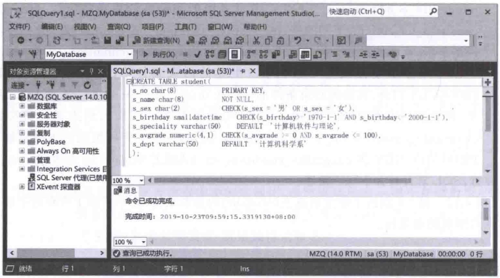
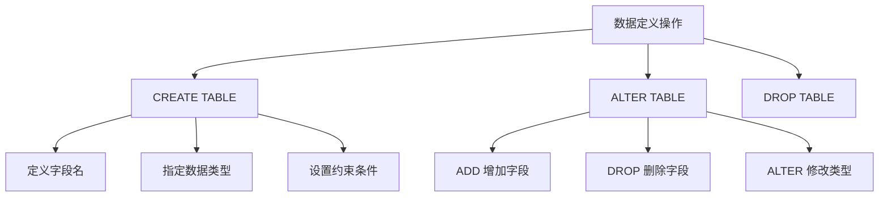

# 第4章-4.3-SQL数据定义功能

## 基本信息
- **课程**：数据库原理与应用
- **章节**：第4章 4.3节 SQL的数据定义功能
- **日期**：2026-06-30
- **标签**：#SQL #数据定义 #CREATE-TABLE #ALTER-TABLE #DROP-TABLE #约束条件

---

## 重点内容

### ⭐⭐⭐ 核心概念
- **CREATE TABLE**：创建数据表，定义字段名、数据类型和完整性约束
- **完整性约束**：PRIMARY KEY、FOREIGN KEY、NOT NULL、UNIQUE、CHECK、DEFAULT
- **字段级 vs 表级约束**：字段级只作用于单字段，表级可作用于多字段或整个表

### ⭐⭐ 关键语法
- **DROP TABLE**：删除数据表及其全部数据，需谨慎使用
- **ALTER TABLE**：修改表结构，包括 ADD/DROP COLUMN、ALTER COLUMN

### ⭐ 注意要点
- 涉及多字段的约束条件**必须**使用表级完整性约束定义
- NOT NULL 和 DEFAULT **只能**在字段级定义
- SQL 语言对大小写不敏感

---

## 详细笔记

### 一、SQL数据定义功能概述

数据定义是指对数据库对象的定义、删除和修改操作。数据库对象主要包括数据表、视图、索引等。数据定义功能通过 **CREATE**、**ALTER**、**DROP** 语句来完成。

> 📚 **课本出处**：第4章 4.3节"SQL的数据定义功能"

数据表是关系模式在关系数据库中的实例化，是数据库中**唯一用于存储数据**的数据库对象，是整个数据库系统的基础。

---

### 二、数据表的创建（CREATE TABLE）

#### 1. 基本语法格式

> 📚 **课本出处**：第4章 4.3.1节"数据表的创建和删除"

```sql
CREATE TABLE [schema_name.]table_name(
    column1_name data_type [integrity_condition_on_column]
    [,column2_name data_type [integrity_condition_on_column]]
    [, integrity_condition_on_TABLE]
);
```

**参数说明**：

| 参数 | 说明 |
|:----:|:-----|
| schema_name | 表所属架构名称，不指定则使用默认架构 dbo |
| table_name | 表名，在一个数据库中必须唯一 |
| column_name | 字段名（列名），在一个表中必须唯一 |
| data_type | 数据类型，参考4.2节 |
| integrity_condition_on_column | 字段级完整性约束条件，只对相应字段起作用 |
| integrity_condition_on_TABLE | 表级完整性约束条件，可作用于多个字段或整个表 |

#### 2. 六种完整性约束条件

> 📚 **课本出处**：第4章 4.3.1节

| 约束 | 作用 | 适用级别 | 说明 |
|:----:|:----:|:--------:|:-----|
| **PRIMARY KEY** | 主码（主键） | 字段级/表级 | 标识表中唯一的一条记录 |
| **FOREIGN KEY** | 外码（外键） | 字段级/表级 | 建立与其他表的关联 |
| **NOT NULL** | 非空 | 仅字段级 | 字段值不能为空 |
| **UNIQUE** | 唯一性 | 字段级/表级 | 字段值不能重复 |
| **CHECK** | 取值范围 | 字段级/表级 | 通过表达式限制字段取值范围 |
| **DEFAULT** | 默认值 | 仅字段级 | 设定字段的默认值 |

**字段级与表级约束的关键区别**：

- 字段级约束（`integrality_condition_on_column`）：只对相应字段起作用，**不能**设置为同时作用于多个字段
- 表级约束（`integrality_condition_on_TABLE`）：可作用于多个字段或整个数据表
- 涉及**多字段**的约束条件**必须**在表级定义
- **NOT NULL** 和 **DEFAULT** 只能在字段级定义

> ⭐ **核心重点**：凡是涉及多个字段的约束条件都必须在表级的完整性约束中定义。例如，由两个字段组成的主码必须利用 PRIMARY KEY 在表级定义。

#### 3. 外键设置格式

```sql
FOREIGN KEY column_name REFERENCES foreign_table_name (foreign_column_name)
```

---

### 三、建表示例

#### 【例4.1】创建学生信息表 student

> 📚 **课本出处**：第4章 4.3.1节"【例4.1】"

**表4.8 学生信息表(student)的基本结构**：

| 字段名 | 数据类型 | 大小 | 小数位 | 约束条件 | 说明 |
|:------:|:--------:|:----:|:------:|:--------:|:----:|
| s_no | char(8) | 8 | | 非空,主键 | 学号 |
| s_name | char(8) | 8 | | 非空 | 姓名 |
| s_sex | char(2) | 2 | | 取值为"男"或"女" | 性别 |
| s_birthday | smalldatetime | | | 1970-1-1到2000-1-1 | 年龄 |
| s_speciality | varchar(50) | 50 | | 默认值"计算机软件与理论" | 专业 |
| s_avgrade | numeric(4,1) | 3 | 1 | 取值0~100 | 平均成绩 |
| s_dept | varchar(50) | 50 | | 默认值"计算机科学系" | 所在系 |

**字段级约束写法**：

```sql
CREATE TABLE student(
    s_no char(8) PRIMARY KEY,
    s_name char(8) NOT NULL,
    s_sex char(2) CHECK(s_sex = '男' OR s_sex = '女'),
    s_birthday smalldatetime CHECK(s_birthday >= '1970-1-1' AND s_birthday <= '2000-1-1'),
    s_speciality varchar(50) DEFAULT '计算机软件与理论',
    s_avgrade numeric(4,1) CHECK(s_avgrade >= 0 AND s_avgrade <= 100),
    s_dept varchar(50) DEFAULT '计算机科学系'
);
```

**表级约束写法**（等价写法）：

```sql
CREATE TABLE student(
    s_no char(8),
    s_name char(8) NOT NULL,
    s_sex char(2),
    s_birthday smalldatetime,
    s_speciality varchar(50) DEFAULT '计算机软件与理论',
    s_avgrade numeric(4,1) CHECK(s_avgrade >= 0 AND s_avgrade <= 100),
    s_dept varchar(50) DEFAULT '计算机科学系',
    PRIMARY KEY(s_no),
    CHECK(s_birthday >= '1970-1-1' AND s_birthday <= '2000-1-1'),
    CHECK(s_sex = '男' OR s_sex = '女')
);
```

> 💡 **理解技巧**：字段级和表级约束可以混合使用。NOT NULL 和 DEFAULT 只能放在字段级，而 PRIMARY KEY、CHECK 等可以在表级定义。

**多字段主键示例**（必须使用表级约束）：

如果需要将 s_name 和 s_birthday 设置为联合主键：

```sql
CREATE TABLE student(
    s_no char(8),
    s_name char(8) NOT NULL,
    s_sex char(2) CHECK(s_sex = '男' OR s_sex = '女'),
    s_birthday smalldatetime CHECK(s_birthday >= '1970-1-1' AND s_birthday <= '2000-1-1'),
    s_speciality varchar(50) DEFAULT '计算机软件与理论',
    s_avggrade numeric(4,1) CHECK(s_avggrade >= 0 AND s_avggrade <= 100),
    s_dept varchar(50) DEFAULT '计算机科学系',
    PRIMARY KEY (s_name, s_birthday)
);
```

#### 📷 图4.1 在SSMS中创建数据库表student



> 📚 **课本出处**：图4.1 展示了在SQL Server Management Studio中执行CREATE TABLE语句创建表student的界面

---

#### 【例4.2】创建导师信息表 supervisor（计算列）

> 📚 **课本出处**：第4章 4.3.1节"【例4.2】"

**表4.9 导师信息表(supervisor)的基本结构**：

| 字段名 | 数据类型 | 约束条件 | 说明 |
|:------:|:--------:|:--------:|:----:|
| t_no | int | 主键 | 导师编号 |
| t_name | varchar(8) | 非空 | 导师姓名 |
| s_n | int | 非空,0~20 | 指导学生数量 |
| c_hour | | 计算列 | 指导工作量(课时)，= s_n * 15 |

当数据表中某一字段是其他字段的函数时，可通过**计算列**实现字段之间的函数关联：

```sql
CREATE TABLE supervisor(
    t_no int PRIMARY KEY,
    t_name varchar(8) NOT NULL,
    s_n int NOT NULL CHECK(s_n >= 0 AND s_n <= 20),
    c_hour AS s_n * 15
);
```

> 💡 **理解技巧**：计算列使用 `AS 表达式` 定义，其值由其他字段自动计算得出，不需要手动插入数据。例如 c_hour 的值始终等于 s_n 乘以 15。

---

### 四、数据表的删除（DROP TABLE）

> 📚 **课本出处**：第4章 4.3.1节"数据表的删除"

**语法格式**：

```sql
DROP TABLE table1_name[, table2_name, ...];
```

**示例**：

```sql
DROP TABLE student;
```

> ⚠️ **常见误区**：当一个数据表被删除时，其中的数据也将**全部被删除**。所以在使用删除语句时要特别慎重。删除操作不可逆！

---

### 五、数据表的修改（ALTER TABLE）

> 📚 **课本出处**：第4章 4.3.2节"数据表的修改"

数据表的修改包括修改字段名和完整性约束条件、增加和删除字段等，主要由 ALTER TABLE 语句完成。

#### 1. 增加字段（ADD）

**语法格式**：

```sql
ALTER TABLE table_name
ADD new_column data_type [integrality_condition]
```

**【例4.3】** 在表student中增加新字段——nationality（民族）：

```sql
ALTER TABLE student
ADD nationality varchar(20);
```

如果要使新增字段为非空：

```sql
ALTER TABLE student
ADD nationality varchar(20) NOT NULL;
```

> ⚠️ **注意**：执行上述带 NOT NULL 的语句时，表 student **必须为空**，否则会执行失败。

#### 2. 删除字段（DROP COLUMN）

**语法格式**：

```sql
ALTER TABLE table_name
DROP COLUMN column_name
```

**【例4.4】** 删除表student中的字段nationality：

```sql
ALTER TABLE student
DROP COLUMN nationality;
```

#### 3. 修改字段数据类型（ALTER COLUMN）

**语法格式**：

```sql
ALTER TABLE table_name
ALTER COLUMN column_name new_data_type
```

**【例4.5】** 将表student中字段s_dept的长度由50改为80：

```sql
ALTER TABLE student
ALTER COLUMN s_dept varchar(80);
```

将字段s_no由字符型改为整型：

```sql
ALTER TABLE student
ALTER COLUMN s_no int;
```

> ⚠️ **注意**：修改字段数据类型时，如果该字段已有数据，可能因类型不兼容而导致数据丢失或操作失败。

---

### 六、数据定义操作流程



> 💡 **理解技巧**：数据定义的核心是围绕"表结构"的三个操作——建表、改表、删表，对应 CREATE、ALTER、DROP 三个关键字。

---

## 总结

### 完整性约束对比表

| 约束类型 | 功能 | 字段级 | 表级 | 示例 |
|:--------:|:----:|:------:|:----:|:-----|
| **PRIMARY KEY** | 主码，唯一标识记录 | ✅ | ✅ | `s_no char(8) PRIMARY KEY` |
| **FOREIGN KEY** | 外码，引用其他表 | ✅ | ✅ | `FOREIGN KEY c_no REFERENCES course(c_no)` |
| **NOT NULL** | 非空约束 | ✅ | ❌ | `s_name char(8) NOT NULL` |
| **UNIQUE** | 唯一性约束 | ✅ | ✅ | `s_email varchar(50) UNIQUE` |
| **CHECK** | 取值范围约束 | ✅ | ✅ | `CHECK(s_age >= 0 AND s_age <= 150)` |
| **DEFAULT** | 默认值 | ✅ | ❌ | `s_dept varchar(50) DEFAULT '计算机系'` |

### ALTER TABLE 操作汇总

| 操作 | 语法 | 示例 |
|:----:|:-----|:-----|
| 增加字段 | `ADD column data_type [约束]` | `ADD nationality varchar(20)` |
| 删除字段 | `DROP COLUMN column` | `DROP COLUMN nationality` |
| 修改类型 | `ALTER COLUMN column new_type` | `ALTER COLUMN s_dept varchar(80)` |

### 关键要点

1. **数据表**是数据库中唯一用于存储数据的对象，是数据库系统的基础
2. **字段级约束**只作用于单字段，**表级约束**可作用于多字段或整个表
3. 涉及**多字段**的约束必须使用表级定义，NOT NULL 和 DEFAULT 只能在字段级
4. **计算列**通过 `AS 表达式` 定义，其值由其他字段自动计算
5. **DROP TABLE** 删除表及全部数据，操作不可逆，需慎重
6. **ALTER TABLE** 支持增加、删除和修改字段，但修改类型时需注意数据兼容性

---

## 疑问与思考

### ❓ 待解决问题
1. 在实际项目中，PRIMARY KEY 和 UNIQUE 的选择策略是什么？什么时候用自增整数主键，什么时候用自然键？
2. FOREIGN KEY 的级联操作（ON DELETE CASCADE / ON UPDATE CASCADE）在什么场景下使用？课本后续章节是否有介绍？
3. 修改字段数据类型时，如果字段已有数据且新旧类型不兼容，数据库会如何处理？是否会有数据丢失的风险？
4. 计算列（Computed Column）与视图（View）中使用表达式有什么区别？各自的适用场景是什么？
5. ALTER TABLE ADD 新字段时带 NOT NULL 约束要求表为空，那如果表已有数据又需要添加非空字段，有什么解决方案？

### 💡 个人理解/技巧
- 六种约束可以分为三组记忆：**完整性约束**（PRIMARY KEY、FOREIGN KEY）、**非空与唯一**（NOT NULL、UNIQUE）、**值域约束**（CHECK、DEFAULT）
- CREATE TABLE 的两种约束定义方式（字段级 vs 表级）本质上等价，选择哪种取决于字段是否参与多字段约束
- 建表时建议：先设计好表结构和约束条件，再写 SQL 语句，而不是边写边想
- 计算列是一种"虚拟字段"，不占用存储空间，每次查询时动态计算
- DROP TABLE 要特别小心，生产环境建议先备份再操作

---

## 相关链接

### 本节相关图片
- [图4.1 在SSMS中创建数据库表student](../../../images/e60be34f4131f1e9c6df7122e080dffd3d3eca4f3b82dfeef349d23bd68e9335.jpg)

### 关联章节
- [第4章-4.1-SQL概述](./第4章-4.1-SQL概述.md)（待创建）
- [第4章-4.2-SQL数据类型](./第4章-4.2-SQL数据类型.md)（待创建）
- [第4章-4.4-SQL数据查询功能](./第4章-4.4-SQL数据查询功能.md)（待创建）
- [第4章-4.5-SQL数据操纵功能](./第4章-4.5-SQL数据操纵功能.md)（待创建）
- [第11章-数据的完整性管理](../../../数据库原理/notes/章节笔记/第11章-数据的完整性管理/)（待创建）

---

## 检查清单

- [x] 已理解CREATE TABLE语法及参数含义
- [x] 已掌握六种完整性约束的区别和适用场景
- [x] 已区分字段级约束和表级约束
- [x] 已理解计算列（Computed Column）的用法
- [x] 已掌握DROP TABLE的语法和注意事项
- [x] 已掌握ALTER TABLE的三种操作（ADD/DROP/ALTER COLUMN）
- [x] 已插入课本原图（图4.1）
- [x] 已记录所有例题的SQL代码
- [x] 已添加课本出处标注

---

*笔记创建时间：2026-06-30*
