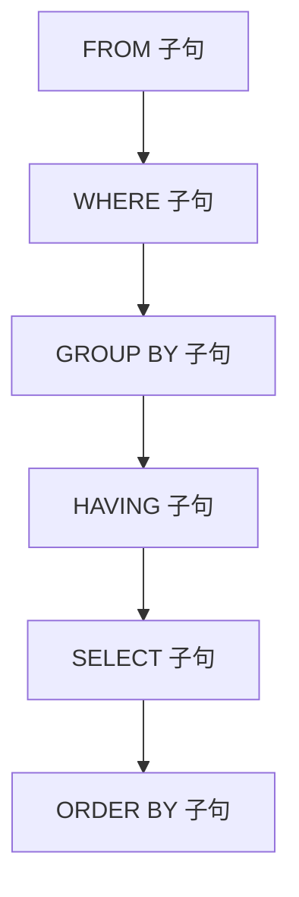
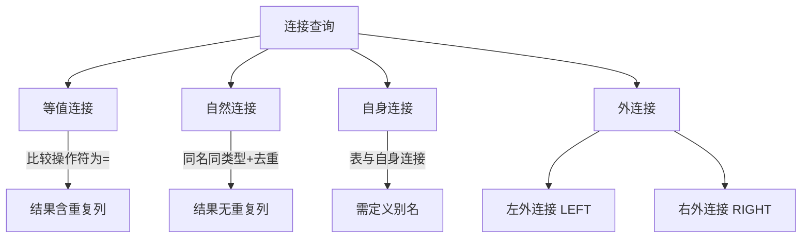
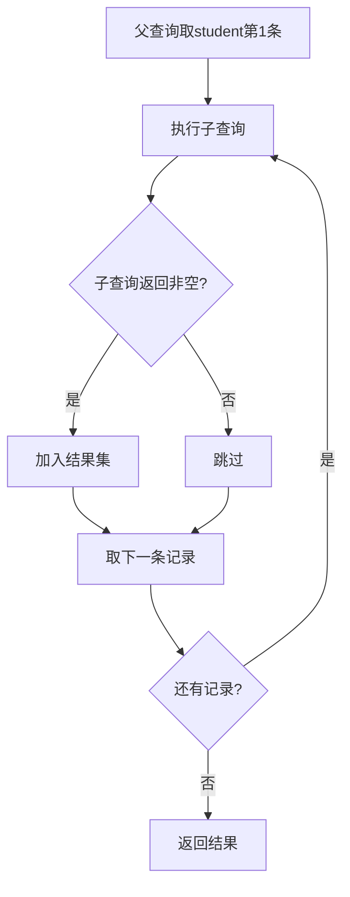
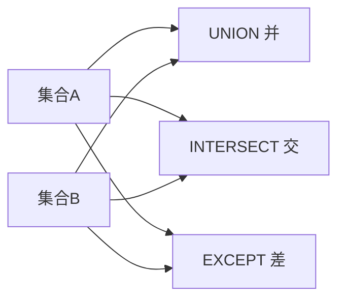
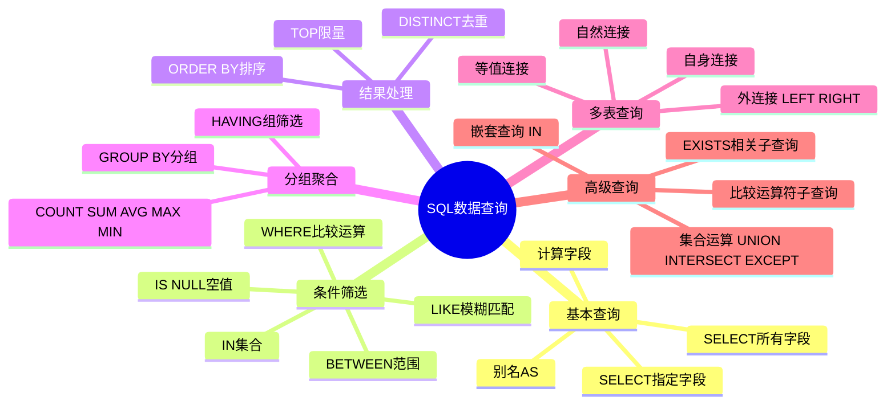

# 第4章-4.4-SQL数据查询功能

## 基本信息
- **课程**：数据库原理与应用
- **章节**：第4章 4.4节 SQL的数据查询功能
- **日期**：2026-06-30
- **标签**：#SQL #数据查询 #SELECT #连接查询 #嵌套查询 #集合运算 #分组查询

---

## 重点内容

### ⭐⭐⭐ 核心知识点
- **SELECT语句完整语法**：SELECT...FROM...WHERE...GROUP BY...HAVING...ORDER BY
- **连接查询**：等值连接、自然连接、自身连接、外连接（左/右）
- **嵌套查询**：IN、比较运算符、EXISTS、不相关/相关子查询
- **集合运算**：UNION、INTERSECT、EXCEPT

### ⭐⭐ 重要概念
- **分组查询与聚合函数**：GROUP BY...HAVING，COUNT/SUM/AVG/MAX/MIN
- **WHERE vs HAVING**的本质区别：对行筛选 vs 对组筛选
- **BETWEEN...AND** 与 **IN** 的使用场景
- **LIKE** 通配符匹配（% 和 _）
- **IS NULL** 空值判断

### ⭐ 关键区分
- 自然连接 vs 等值连接：自然连接去掉了重复字段
- 左外连接 vs 右外连接：保留哪个表的全部记录
- 不相关子查询 vs 相关子查询（EXISTS）：执行顺序不同
- UNION vs JOIN：集合运算 vs 连接运算

---

## 详细笔记

### 0. SELECT语句总体语法

> 📚 **课本出处**：第4章 4.4节"SQL的数据查询功能"

数据查询是数据库最常用的功能，由SELECT语句完成。其语法结构如下：

```sql
SELECT [ALL|DISTINCT|TOP] column_expression
FROM table_name[, table_name, ...]
[WHERE condition_expression]
[GROUP BY column_expression]
[HAVING condition_expression]
[ORDER BY column_expression [ASC|DESC]]
```

**执行逻辑顺序**（非书写顺序）：



> 💡 **理解技巧**：虽然SELECT写在最前面，但实际执行时是从FROM开始的。理解执行顺序有助于理解WHERE和HAVING的区别。

**示例数据表 student**（贯穿本节所有示例）：

| s_no | s_name | s_sex | s_birthday | s_speciality | s_avgrade | s_dept |
|:-----|:-------|:-----:|:----------:|:-------------|:---------:|:-------|
| 20170201 | 刘洋 | 女 | 1997-02-03 | 计算机应用技术 | 98.5 | 计算机系 |
| 20170202 | 王晓珂 | 女 | 1997-09-20 | 计算机软件与理论 | 88.1 | 计算机系 |
| 20170203 | 王伟志 | 男 | 1996-12-12 | 智能科学与技术 | 89.8 | 智能技术系 |
| 20170204 | 岳志强 | 男 | 1998-06-01 | 智能科学与技术 | 75.8 | 智能技术系 |
| 20170205 | 贾簿 | 男 | 1994-09-03 | 计算机软件与理论 | 43.0 | 计算机系 |
| 20170206 | 李思思 | 女 | 1996-05-05 | 计算机应用技术 | 67.3 | 计算机系 |
| 20170207 | 蒙恬 | 男 | 1995-12-02 | 大数据技术 | 78.8 | 大数据技术系 |
| 20170208 | 张宇 | 女 | 1997-03-08 | 大数据技术 | 59.3 | 大数据技术系 |

---

### 一、4.4.1 基本查询

> 📚 **课本出处**：第4章 4.4.1节"基本查询"

基本查询是指基于单表的、仅由SELECT子句和FROM子句构成的语句。一般格式：

```sql
SELECT [ALL|DISTINCT|TOP] * | column_name [AS alias_name], ...
FROM table_name;
```

#### 1. 选择所有字段

```sql
SELECT * FROM student;
-- 等价于
SELECT s_no, s_name, s_sex, s_birthday, s_speciality, s_avgrade, s_dept FROM student;
```

#### 2. 选择指定字段 + 别名

```sql
SELECT s_avgrade AS 平均成绩, s_name AS 姓名 FROM student;
-- AS 关键字可以省略
SELECT s_avgrade 平均成绩, s_name 姓名 FROM student;
```

#### 3. 构造计算字段

查询结果中的计算字段是根据已有字段计算得到的新字段，在原表中并不存在。

```sql
SELECT s_name 姓名, Year(getdate()) - Year(s_birthday) 年龄 FROM student;
```

> 💡 **理解技巧**：计算字段使用系统函数（如Year()、getdate()）和算术运算符构造，结果集中的列名可通过AS指定。

---

### 二、4.4.2 带DISTINCT的查询

> 📚 **课本出处**：第4章 4.4.2节"带DISTINCT的查询"

SELECT后面可加的关键字：

| 关键字 | 功能 | 示例 |
|:------:|:-----|:-----|
| ALL | 默认值，返回所有满足条件的元组 | `SELECT ALL * FROM student` |
| TOP n | 返回前n条记录 | `SELECT TOP 3 * FROM student` |
| TOP n PERCENT | 返回前n%条记录，非整数向上取整 | `SELECT TOP 38 PERCENT * FROM student` |
| DISTINCT | 去掉查询结果中的重复记录 | `SELECT DISTINCT s_dept FROM student` |

**DISTINCT 示例**：

```sql
-- 查询涉及的不同系别（去重）
SELECT DISTINCT s_dept 所在的系 FROM student;
-- 结果：大数据技术系、计算机系、智能技术系（仅3条）

-- 不加 DISTINCT 则返回8条（含重复）
SELECT s_dept 所在的系 FROM student;
```

⚠️ **常见误区**：DISTINCT必须放在第一个字段名前面，紧跟SELECT之后：

```sql
-- 正确
SELECT DISTINCT s_dept, s_sex FROM student;
-- 错误！
SELECT s_dept, DISTINCT s_sex FROM student;
```

**TOP 示例**：

```sql
SELECT TOP 3 * FROM student;           -- 返回前3条
SELECT TOP 38 PERCENT * FROM student;  -- 8×38%=3.04，向上取整返回4条
```

---

### 三、4.4.3 带WHERE子句的条件查询

> 📚 **课本出处**：第4章 4.4.3节"带WHERE子句的条件查询"

WHERE子句用于指定查询条件，只有使条件表达式为真的记录才会被选出。常用逻辑联结词：NOT、OR、AND。

```sql
SELECT s_no 学号, s_name 姓名, s_sex 性别, s_avgrade 平均成绩
FROM student
WHERE s_avgrade >= 80 AND s_avgrade < 90;
-- 结果：王晓珂(88.1)、王伟志(89.8)
```

**常用比较运算符**：

| 运算符 | 含义 | 示例 |
|:------:|:-----|:-----|
| `=` | 等于 | `WHERE s_sex = '男'` |
| `<>` 或 `!=` | 不等于 | `WHERE s_dept <> '计算机系'` |
| `>` `<` `>=` `<=` | 大于/小于/大于等于/小于等于 | `WHERE s_avgrade >= 80` |
| AND | 逻辑与 | `WHERE s_avgrade >= 80 AND s_sex = '女'` |
| OR | 逻辑或 | `WHERE s_dept = '计算机系' OR s_dept = '智能技术系'` |
| NOT | 逻辑非 | `WHERE NOT s_sex = '男'` |

---

### 四、4.4.4 带BETWEEN的范围查询

> 📚 **课本出处**：第4章 4.4.4节"带BETWEEN的范围查询"

查询字段值在指定范围内的记录（包括边界值value1和value2）。

```sql
-- 语法
SELECT column_expression
FROM table_name
WHERE column_name [NOT] BETWEEN value1 AND value2;

-- 示例：查询出生在1996-08-01到1997-10-01之间的学生
SELECT s_name 姓名, s_sex 性别, s_dept 系别, s_avgrade 平均成绩, s_birthday 出生年月
FROM student
WHERE s_birthday BETWEEN '1996-08-01' AND '1997-10-01';
-- 结果：刘洋、王晓珂、王伟志、张宇

-- NOT BETWEEN：查询不在该范围内的学生
SELECT s_name 姓名, s_sex 性别, s_dept 系别, s_avgrade 平均成绩, s_birthday 出生年月
FROM student
WHERE s_birthday NOT BETWEEN '1996-08-01' AND '1997-10-01';
-- 结果：岳志强、贾簿、李思思、蒙恬
```

> 💡 **理解技巧**：BETWEEN适合于可以转换为具有线序关系的数据类型，如数值型、日期时间型等。等价于 `column >= value1 AND column <= value2`。

---

### 五、4.4.5 带IN的范围查询

> 📚 **课本出处**：第4章 4.4.5节"带IN的范围查询"

IN用于查询字段值属于某一枚举集合的记录，适合非数值型的离散值查询。

```sql
-- 语法
SELECT column_expression
FROM table_name
WHERE column_name [NOT] IN (value1, value2, ..., valuen);

-- 示例：查询智能技术系和大数据技术系的学生
SELECT s_no 学号, s_name 姓名, s_sex 性别, s_birthday 出生年月,
       s_speciality 专业, s_avgrade 平均成绩, s_dept 系别
FROM student
WHERE s_dept IN ('智能技术系', '大数据技术系');
```

> 💡 **理解技巧**：`column IN (v1, v2, ..., vn)` 等价于 `column=v1 OR column=v2 OR ... OR column=vn`，但IN写法更简洁直观。BETWEEN适合连续范围，IN适合离散值集合。

---

### 六、4.4.6 带GROUP的分组查询

> 📚 **课本出处**：第4章 4.4.6节"带GROUP的分组查询"

分组查询将结果按指定字段分组，可对每组进行聚合操作。

#### 1. 基本语法

```sql
SELECT column_expression, count(*)
FROM table_name
GROUP BY column_expression
[HAVING condition_expression]
```

#### 2. 聚合函数

⭐⭐⭐ 五大聚合函数：

| 函数 | 功能 | 说明 |
|:----:|:-----|:-----|
| `COUNT(*)` | 统计行数 | 包括NULL值和重复行 |
| `COUNT(ALL expression)` | 统计非NULL值个数 | ALL可省略 |
| `COUNT(DISTINCT expression)` | 统计唯一非空值个数 | 去重后计数 |
| `SUM([ALL\|DISTINCT] expression)` | 求和 | NULL被忽略 |
| `AVG([ALL\|DISTINCT] expression)` | 求平均 | NULL被忽略 |
| `MAX(expression)` | 求最大值 | NULL被忽略 |
| `MIN(expression)` | 求最小值 | NULL被忽略 |

#### 3. 分组查询示例

```sql
-- 查询各系学生数量
SELECT s_dept 系别, COUNT(*) 人数 FROM student GROUP BY s_dept;
-- 结果：大数据技术系2人, 计算机系4人, 智能技术系2人

-- 用 HAVING 筛选人数>=2的系
SELECT s_dept 系别, COUNT(*) 人数
FROM student
GROUP BY s_dept
HAVING COUNT(*) >= 2;

-- WHERE + GROUP BY + HAVING 组合：先筛选及格学生，再分组，再筛选人数>=2的系
SELECT s_dept 系别, COUNT(*) 人数
FROM student
WHERE s_avgrade >= 60
GROUP BY s_dept
HAVING COUNT(*) >= 2;
-- 结果：计算机系3人, 智能技术系2人（贾簿被WHERE过滤掉了）
```

⭐⭐ **WHERE vs HAVING 的本质区别**：

| 对比项 | WHERE | HAVING |
|:------:|:------|:-------|
| **作用对象** | 每一条记录（行） | 每一个分组（组） |
| **执行时机** | 分组之前筛选 | 分组之后筛选 |
| **能否用聚合函数** | 不能 | 能 |
| **位置** | GROUP BY之前 | GROUP BY之后 |

> ⚠️ **常见误区**：WHERE子句中不能使用聚合函数（如COUNT(*)、SUM()等），因为WHERE是在分组前对单行进行判断。HAVING中可以使用聚合函数，因为它是在分组后对组进行判断。

---

### 七、4.4.7 带LIKE的匹配查询和带IS的空值查询

> 📚 **课本出处**：第4章 4.4.7节"带LIKE的匹配查询和带IS的空值查询"

#### 1. LIKE 模糊匹配

```sql
-- 语法
SELECT column_expression
FROM table_name
WHERE column_name [NOT] LIKE character_string;
```

**通配符**：

| 通配符 | 含义 | 示例 |
|:------:|:-----|:-----|
| `%` | 匹配任意长度字符串（含空串） | `'王%'` 匹配所有姓王的 |
| `_` | 匹配任意单个字符 | `'王_'` 匹配姓王且名仅1个字的 |
| 其他字符 | 只匹配自身 | `'数据库'` 精确匹配 |

```sql
-- 查询所有姓"王"的学生
SELECT s_no 学号, s_name 姓名, s_sex 性别, s_avgrade 平均成绩, s_dept 系别
FROM student
WHERE s_name LIKE '王%';
-- 结果：王晓珂、王伟志

-- 查询姓名中含有"志"的学生
SELECT * FROM student WHERE s_name LIKE '%志%';
-- 结果：王伟志、岳志强

-- 查询姓"王"且姓名仅两个字的学生
SELECT * FROM student WHERE s_name LIKE '王_';
```

> ⚠️ **常见误区**：字段s_name如果是char(8)类型，实际长度不够8个字符时后面会以空格填补，这可能影响LIKE匹配。可配合RTRIM()使用。

#### 2. 空值 NULL 查询

⭐ **空值不能用等号 `=` 判断**，必须使用 `IS NULL` 或 `IS NOT NULL`：

```sql
-- 错误！不会返回任何结果
SELECT * FROM student WHERE s_avgrade = NULL;

-- 正确写法
SELECT * FROM student WHERE s_avgrade IS NULL;
SELECT * FROM student WHERE s_avgrade IS NOT NULL;
```

> 📌 **考试重点**：NULL与任何值的比较结果都是UNKNOWN（非TRUE），所以 `= NULL` 永远不成立。这是SQL三值逻辑的核心。

---

### 八、4.4.8 使用ORDER BY排序查询结果

> 📚 **课本出处**：第4章 4.4.8节"使用ORDER排序查询结果"

```sql
-- 语法
SELECT column_expression
FROM table_name
ORDER BY column_name [ASC|DESC][, ...]
```

- **ASC**：升序排列（默认值）
- **DESC**：降序排列
- 支持多字段排序：先按第一字段排，第一字段相同时按第二字段排

```sql
-- 男同学按成绩降序排序
SELECT * FROM student
WHERE s_sex = '男'
ORDER BY s_avgrade DESC;
-- 结果：王伟志89.8 > 蒙恬78.8 > 岳志强75.8 > 贾簿43.0

-- 多字段排序：成绩降序，成绩相同则按学号升序
SELECT * FROM student
WHERE s_sex = '男'
ORDER BY s_avgrade DESC, s_no ASC;
```

> 💡 **理解技巧**：ORDER BY是SELECT语句中最后执行的子句，它对最终结果集进行排序。可以在ORDER BY中使用SELECT列表中未出现的字段。

---

### 九、4.4.9 连接查询

> 📚 **课本出处**：第4章 4.4.9节"连接查询"

连接查询是同时涉及两个或两个以上数据表的查询，是关系数据库中**最主要的查询**。

**选课表 SC 数据**：

| s_no | c_name | c_grade |
|:-----|:-------|:-------:|
| 20170201 | 英语 | 80.2 |
| 20170201 | 数据库原理 | 70.0 |
| 20170201 | 算法设计与分析 | 92.4 |
| 20170202 | 英语 | 81.9 |
| 20170202 | 算法设计与分析 | 85.2 |
| 20170203 | 多媒体技术 | 68.1 |

#### 1. 等值连接

当连接条件的比较操作符为等号"="时，称为等值连接：

```sql
SELECT student.s_no 学号, s_name 姓名, s_sex 性别, s_speciality 专业,
       s_dept 系别, c_name 课程名称, c_grade 课程成绩
FROM student, SC
WHERE student.s_no = SC.s_no;
```

> 💡 **理解技巧**：等值连接的执行过程是嵌套循环——先取student的第1条记录，遍历SC的所有记录检查s_no是否相等，满足则并接为一条新记录；再取第2条...直到处理完所有记录。去掉WHERE子句则形成笛卡尔积（8×6=48条）。

**使用别名简化**：

```sql
SELECT a.s_no 学号, s_name 姓名, s_sex 性别, s_speciality 专业,
       s_dept 系别, c_name 课程名称, c_grade 课程成绩
FROM student AS a, SC AS b
WHERE a.s_no = b.s_no;
```

#### 2. 自然连接

⭐ 自然连接是特殊的等值连接，满足两个额外条件：
1. 参加比较的两个字段**同名同类型**
2. 结果集**去掉了重复字段**

```sql
SELECT student.s_no 学号, s_name 姓名, s_sex 性别, s_birthday 出生日期,
       s_speciality 专业, s_avgrade 平均成绩, s_dept 系别,
       c_name 课程名称, c_grade 课程成绩
FROM student, SC
WHERE student.s_no = SC.s_no
-- 只保留student.s_no，去掉重复的SC.s_no
```

> ⚠️ **常见误区**：SQL中没有专门实现自然连接的语句，需要手动在SELECT中去掉重复字段。自然连接和等值连接的SQL写法本质上并无区别，区别在于结果集是否包含重复列。

#### 3. 自身连接

将一个表与它自身进行连接，逻辑上需要定义不同的别名使其成为"两张表"：

```sql
-- 查询与"刘洋"在同一专业的所有学生
SELECT b.s_no 学号, b.s_name 姓名, b.s_sex 性别,
       b.s_speciality 专业, b.s_avgrade 平均成绩
FROM student AS a
JOIN student AS b
ON (a.s_name = '刘洋' AND a.s_speciality = b.s_speciality);
-- 结果：刘洋本人 + 李思思（同属计算机应用技术）
```

#### 4. 外连接

⭐⭐ 外连接保留不满足连接条件的记录（对应字段填NULL）：

```sql
-- 语法
SELECT ...
FROM table1_name
LEFT|RIGHT [OUTER] JOIN table2_name ON join_condition
```

| 外连接类型 | 保留的表 | 说明 |
|:----------:|:-------:|:-----|
| **LEFT JOIN** | 左表（table1） | 左表全部记录保留，右表不匹配的填NULL |
| **RIGHT JOIN** | 右表（table2） | 右表全部记录保留，左表不匹配的填NULL |

```sql
-- 查询所有学生信息，已选课的列出课程信息，未选课的课程字段留空
SELECT s_name 姓名, s_sex 性别, s_speciality 专业, s_dept 系别,
       SC.c_name 课程名称, SC.c_grade 课程成绩
FROM student
LEFT JOIN SC ON (student.s_no = SC.s_no);
-- 岳志强、贾簿、李思思、蒙恬、张宇的课程名称和成绩为NULL

-- 等价的右外连接写法（调换表顺序）
SELECT s_name 姓名, s_sex 性别, s_speciality 专业, s_dept 系别,
       SC.c_name 课程名称, SC.c_grade 课程成绩
FROM SC
RIGHT JOIN student ON (student.s_no = SC.s_no);
```

**连接查询类型对比**：



---

### 十、4.4.10 嵌套查询

> 📚 **课本出处**：第4章 4.4.10节"嵌套查询"

一个查询A嵌入到另一个查询B的WHERE子句或HAVING短语中：
- **子查询（内层查询）**：被嵌入的查询A
- **父查询（外层查询）**：包含子查询的查询B

**执行顺序**：由里向外，先执行最内层子查询，再用其结果构成父查询的条件。

> ⚠️ **重要限制**：子查询**不能带ORDER BY**子句。

#### 1. 使用谓词IN的嵌套查询

子查询返回一个集合，父查询判断某字段值是否在该集合中：

```sql
-- 查询"王伟志"和"蒙恬"所在专业的所有学生
SELECT * FROM student
WHERE s_speciality IN (
    SELECT s_speciality FROM student
    WHERE s_name = '王伟志' OR s_name = '蒙恬'
);
-- 子查询返回{'智能科学与技术', '大数据技术'}
-- 等价于 WHERE s_speciality IN ('智能科学与技术', '大数据技术')
```

#### 2. 使用比较运算符的嵌套查询

用比较运算符（>, <, =, >=, <=, <>）将字段与子查询连接：

```sql
-- 查询平均成绩比"蒙恬"低的学生
SELECT s_no 学号, s_name 姓名, s_speciality 专业, s_avgrade 平均成绩
FROM student
WHERE s_avgrade < (
    SELECT s_avgrade FROM student WHERE s_name = '蒙恬'
);
-- 子查询返回78.8
-- 结果：岳志强75.8、贾簿43.0、李思思67.3、张宇59.3
```

> 📌 **考试重点**：比较运算符的子查询**必须返回单值**（单字段单行），否则会出错。IN的子查询可以返回多值。

#### 3. 使用谓词EXISTS的嵌套查询

⭐⭐ EXISTS只判断子查询是否返回非空结果，不关心具体内容：

```sql
-- 查询所有选修了"算法设计与分析"课的学生
SELECT s_no 学号, s_name 姓名, s_speciality 专业
FROM student
WHERE EXISTS (
    SELECT * FROM SC
    WHERE student.s_no = SC.s_no
    AND c_name = '算法设计与分析'
);
```

**EXISTS的执行过程**（相关子查询）：



⭐ **不相关子查询 vs 相关子查询**：

| 对比项 | 不相关子查询（IN/比较运算符） | 相关子查询（EXISTS） |
|:------:|:---------------------------|:--------------------|
| **执行顺序** | 先内后外，子查询只执行一次 | 先外后内，子查询对父查询每行执行一次 |
| **子查询依赖** | 独立于父查询 | 依赖父查询的当前记录 |
| **使用谓词** | IN, 比较运算符 | EXISTS |

> 💡 **理解技巧**：IN嵌套查询中，子查询的字段名可以和父查询不同；而EXISTS中，子查询通常引用父查询的字段（如`student.s_no = SC.s_no`），这就是"相关"的含义。

**EXISTS与IN可以互换使用**：

```sql
-- 用IN实现与上例EXISTS相同的功能
SELECT s_no 学号, s_name 姓名, s_speciality 专业
FROM student
WHERE s_no IN (
    SELECT s_no FROM SC WHERE c_name = '算法设计与分析'
);
```

---

### 十一、4.4.11 查询的集合运算

> 📚 **课本出处**：第4章 4.4.11节"查询的集合运算"

每个SELECT语句返回的结果是记录集合，可以对两个结果集进行集合运算。**前提条件**：两个查询的结果集结构必须一致（字段个数相等，对应字段类型相同）。

#### 1. UNION（并运算）

将两个查询结果合并，**自动去掉重复记录**：

```sql
-- 查询专业为大数据技术 或 平均成绩>=80的学生
(SELECT s_no 学号, s_name 姓名, s_speciality 专业, s_avgrade 平均成绩
 FROM student WHERE s_speciality = '大数据技术')
UNION
(SELECT s_no 学号, s_name 姓名, s_speciality 专业, s_avgrade 平均成绩
 FROM student WHERE s_avgrade >= 80);
-- 结果：刘洋、王晓珂、王伟志、蒙恬、张宇（去重后5条）
```

#### 2. INTERSECT（交运算）

返回两个查询结果的**交集**（同时满足两个条件的记录）：

```sql
-- 查询专业为智能科学与技术 且 平均成绩>=80的学生
(SELECT s_no 学号, s_name 姓名, s_speciality 专业, s_avgrade 平均成绩
 FROM student WHERE s_speciality = '智能科学与技术')
INTERSECT
(SELECT s_no 学号, s_name 姓名, s_speciality 专业, s_avgrade 平均成绩
 FROM student WHERE s_avgrade >= 80);
-- 结果：仅王伟志（89.8）
```

#### 3. EXCEPT（差运算）

返回在第一个查询结果中但**不在**第二个查询结果中的记录：

```sql
-- 查询专业为智能科学与技术 且 平均成绩<80的学生
(SELECT s_no 学号, s_name 姓名, s_speciality 专业, s_avgrade 平均成绩
 FROM student WHERE s_speciality = '智能科学与技术')
EXCEPT
(SELECT s_no 学号, s_name 姓名, s_speciality 专业, s_avgrade 平均成绩
 FROM student WHERE s_avgrade >= 80);
-- 结果：仅岳志强（75.8）
```

**集合运算总结**：



> 💡 **理解技巧**：集合运算可以用AND/OR/NOT改写，但当查询涉及不同表或复杂条件时，集合运算更直观。注意INTERSECT和EXCEPT在实际业务中常用子查询+IN改写。

---

## 总结

### SQL查询类型全景对比

| 查询类型 | 关键字/语法 | 适用场景 | 示例要点 |
|:--------:|:-----------|:---------|:---------|
| 基本查询 | SELECT...FROM | 选列、别名、计算字段 | `SELECT s_name AS 姓名 FROM student` |
| 去重/限量 | DISTINCT / TOP | 去重、取前N条 | `SELECT DISTINCT s_dept FROM student` |
| 条件查询 | WHERE | 行级筛选 | `WHERE s_avgrade >= 80 AND s_sex = '女'` |
| 范围查询 | BETWEEN...AND | 连续范围（含边界） | `WHERE s_birthday BETWEEN '1996' AND '1997'` |
| 集合查询 | IN (...) | 离散值匹配 | `WHERE s_dept IN ('计算机系', '智能技术系')` |
| 分组聚合 | GROUP BY...HAVING | 统计每组数据 | `GROUP BY s_dept HAVING COUNT(*) >= 2` |
| 模糊匹配 | LIKE % _ | 字符串模式匹配 | `WHERE s_name LIKE '王%'` |
| 空值判断 | IS NULL / IS NOT NULL | 判断是否为空 | `WHERE s_avgrade IS NULL` |
| 排序 | ORDER BY ASC/DESC | 结果排序 | `ORDER BY s_avgrade DESC, s_no ASC` |
| 连接查询 | JOIN...ON / WHERE | 多表关联 | `FROM student JOIN SC ON student.s_no = SC.s_no` |
| 嵌套查询 | IN/EXISTS/比较运算符 | 子查询条件 | `WHERE EXISTS (SELECT * FROM SC WHERE ...)` |
| 集合运算 | UNION/INTERSECT/EXCEPT | 结果集合并/交/差 | `(SELECT...) UNION (SELECT...)` |

### 知识点脑图



### SELECT语句各子句执行顺序

```
FROM → WHERE → GROUP BY → HAVING → SELECT → ORDER BY
```

> 📌 **考试重点速记**：WHERE在分组前筛选行，HAVING在分组后筛选组；子查询不能带ORDER BY；EXISTS子查询是相关子查询（由外向内执行），IN子查询是不相关子查询（由内向外执行）。

---

## 疑问与思考

### ❓ 待解决问题

1. **WHERE vs HAVING的本质区别**：WHERE对每一条记录设定条件（分组前），HAVING对分组设定条件（分组后）。为什么WHERE中不能使用聚合函数？因为WHERE在GROUP BY之前执行，此时分组尚未形成。

2. **连接查询的性能差异**：等值连接、自然连接、外连接在实际数据库中的执行效率有何不同？数据库优化器如何选择连接策略？

3. **嵌套查询用IN还是EXISTS**：什么情况下用IN更好，什么情况下用EXISTS更好？一般来说，如果子查询结果集较小用IN，如果父查询结果集较小用EXISTS（因为EXISTS子查询每行都执行一次）。但实际性能取决于数据库优化器和索引情况。

4. **集合运算 vs 连接运算**：UNION和OR有什么区别？INTERSECT和内连接有什么区别？集合运算是对结果集操作，连接运算是对表操作。但许多集合运算可以用连接运算改写，反之亦然。

5. **外连接的NULL处理**：LEFT JOIN结果中右表的NULL字段，在后续计算（如SUM、AVG）中如何影响结果？NULL在聚合函数中被忽略。

6. **自然连接的局限性**：为什么SQL标准中没有提供专门的NATURAL JOIN语法？实际项目中为什么很少使用自然连接？

### 💡 个人理解/技巧

- SELECT语句的书写顺序和执行顺序不同，理解执行顺序（FROM→WHERE→GROUP BY→HAVING→SELECT→ORDER BY）是理解SQL的关键
- WHERE和HAVING的区别可以用一句话概括：**WHERE筛行，HAVING筛组**
- IN适合离散值集合（如系别='计算机系' OR 系别='智能技术系'），BETWEEN适合连续数值范围（如成绩>=80 AND 成绩<=90）
- EXISTS比IN在处理大数据量时可能更高效，因为EXISTS找到一条匹配就返回TRUE，不需要扫描全部结果
- 集合运算（UNION/INTERSECT/EXCEPT）要求两个查询结构一致，而连接查询没有这个限制
- 外连接解决了一个经典问题：如何同时列出有选课和没选课的学生信息
- 自连接是"化难为易"的利器——当需要从同一张表中获取两个不同角色的数据时，为表定义别名创建逻辑上的两张表

---

## 相关链接

### 关联章节
- [第4章-SQL概述](./第4章-4.1-SQL概述.md)（待创建）
- [第4章-SQL数据定义功能](./第4章-4.3-SQL数据定义功能.md)（待创建）
- [第4章-SQL数据操纵功能](./第4章-4.5-SQL数据操纵功能.md)（待创建）
- [第2章-关系模型](../../第2章-关系数据库理论基础/第2章-2.1-关系模型.md)

### 知识点交叉引用
- **关系代数**中的选择、投影、连接操作 → 对应SQL中的WHERE、SELECT字段、JOIN
- **函数依赖** → 与连接查询的正确性相关（连接条件需要满足依赖关系）
- **范式理论** → 表设计质量影响查询的复杂度

---

## 检查清单

- [x] 已覆盖全部11个子节（4.4.1 ~ 4.4.11）
- [x] 已包含SELECT语句总体语法和执行顺序
- [x] 已记录基本查询（全选、选字段、别名、计算字段）
- [x] 已记录DISTINCT/TOP用法及注意事项
- [x] 已记录WHERE条件查询（比较运算符、逻辑运算符）
- [x] 已记录BETWEEN范围查询（含NOT BETWEEN）
- [x] 已记录IN集合查询（含等价OR改写）
- [x] 已记录GROUP BY分组查询 + 聚合函数（COUNT/SUM/AVG/MAX/MIN）
- [x] 已重点标注WHERE vs HAVING区别
- [x] 已记录LIKE通配符（%和_）+ IS NULL空值查询
- [x] 已记录ORDER BY排序（ASC/DESC、多字段）
- [x] 已记录连接查询四种类型（等值/自然/自身/外连接）
- [x] 已记录嵌套查询三种类型（IN/比较运算符/EXISTS）
- [x] 已标注不相关子查询 vs 相关子查询
- [x] 已记录集合运算（UNION/INTERSECT/EXCEPT）
- [x] 已包含SQL代码示例
- [x] 已添加重点标记和课本出处标注
- [x] 已包含总结表格、脑图和疑问与思考
- [x] 已添加Mermaid图表

---

*笔记创建时间：2026-06-30*
