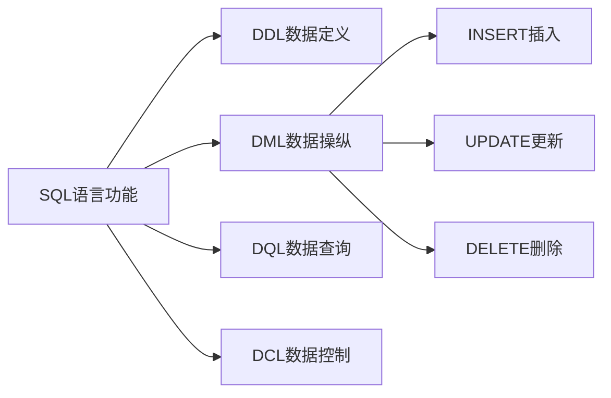
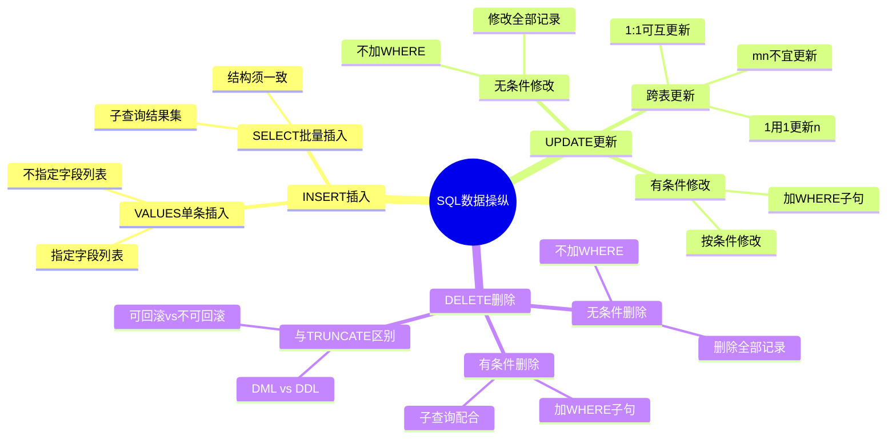

# 第4章-4.5-SQL数据操纵功能

## 基本信息
- **课程**：数据库原理与应用
- **章节**：第4章 4.5节 SQL的数据操纵功能
- **日期**：2026-06-30
- **标签**：#SQL #DML #INSERT #UPDATE #DELETE #数据操纵

---

## 重点内容

### ⭐⭐⭐ 核心概念
- **INSERT**：向数据表插入新记录，支持单条插入和批量插入（子查询）
- **UPDATE**：修改数据表中的已有记录，支持有条件和无条件修改
- **DELETE**：删除数据表中的记录，支持有条件和无条件删除

### ⭐⭐ 语法要点
- INSERT两种形式：`INSERT INTO...VALUES`（单条）和 `INSERT INTO...SELECT`（批量）
- UPDATE省略WHERE子句将修改所有记录（危险操作）
- DELETE省略WHERE子句将删除所有记录（但不释放空间）

### ⭐ 关键区别
- DELETE 是 DML 操作，TRUNCATE TABLE 是 DDL 操作
- DML 操作可以在事务中回滚，DDL 操作通常不可回滚

---

## 详细笔记

### 一、概述

数据操纵功能用于在数据库中进行数据添加、修改和删除操作，这些操作分别由 SQL 语言的 INSERT、UPDATE 和 DELETE 语句来完成。

> 📚 **课本出处**：第4章 4.5节"SQL的数据操纵功能"

DML（Data Manipulation Language，数据操纵语言）是 SQL 的核心组成部分，与 DDL（数据定义语言）和 DQL（数据查询语言）共同构成 SQL 的主要功能。



---

### 二、4.5.1 数据插入

使用 CREATE 语句创建的数据表还只是一个"空壳"，表中没有任何数据。利用 SQL 语言提供的 INSERT 语句可以完成向数据表插入数据的任务。

> 📚 **课本出处**：第4章 4.5.1节"数据插入"

#### 1. INSERT INTO...VALUES 形式（单条插入）

语法格式：

```sql
INSERT [INTO] <table> [(<column1>[, <column2>...])] VALUES(<value1>[, <value2>...]);
```

其中，table 表示表名，value1，value2，... 分别表示待插入的常量值，它们插入后形成同一条记录上的各个字段值，且 value1 与字段 column1 对应，value2 与字段 column2 对应。

**注意事项**：

| 注意项 | 说明 |
|:------:|:-----|
| 字段顺序 | table 后面字段的顺序和数量可以是任意的 |
| 值对应 | VALUES 子句中的常量值要按位置与字段列表中的字段对应 |
| 数据类型 | 常量值的数据类型必须与对应字段一致 |
| 无字段列表 | 如果不指定字段列表，常量值的顺序必须与表中定义字段顺序一样 |
| NULL值 | 除 NOT NULL 字段外，任何数据类型的字段都可以插入 NULL |
| "没有值" | "没有值"不等于空值(NULL)，它们是两个不同的概念 |

> 📌 **考试重点**：插入语句中"没有值"和 NULL 是不同概念。"没有值"是不提供该字段，而 NULL 是显式设置为空值。

> ⚠️ **常见误区**：主键字段的值不能重复，也不能为空值(NULL)；被设为 NOT NULL 的字段的插入值也不能为空值。

**【例4.25】** 用 INSERT 语句将一个学生记录插入数据表 student 中。

该记录中各分量值的顺序与表 student 中定义字段的顺序相同，且数据类型也分别相同，因此可以用带字段列表的 INSERT 语句来实现数据插入：

```sql
INSERT student(s_no, s_name, s_sex, s_birthday, s_speciality, s_avgrade, s_dept)
VALUES('20170201', '刘洋', '女', '1997-02-03', '计算机应用技术', 98.5, '计算机系');
```

该语句等价于：

```sql
INSERT INTO student
VALUES('20170201', '刘洋', '女', '1997-02-03', '计算机应用技术', 98.5, '计算机系');
```

**【例4.26】** 插入只包含部分字段的学生记录（'20170202'，'王晓珂'，88.1）。

由于该记录并不包含所有的字段值，故在该 INSERT 语句中必须显式地指定字段列表：

```sql
INSERT INTO student(s_no, s_name, s_avgrade)
VALUES('20170202', '王晓珂', 88.1);
```

由于字段的顺序可以是任意的（但插入值要与字段对应），所以该语句等价于：

```sql
INSERT INTO student(s_name, s_avgrade, s_no)
VALUES('王晓珂', 88.1, '20170202');
```

> 💡 **理解技巧**：对于没有被插入的字段，如果定义表时设置了默认值则自动填上默认值，否则自动填上空值(NULL)。例如执行上述语句后，s_speciality 和 s_dept 取默认值，s_sex 和 s_birthday 取空值(NULL)。

---

#### 2. INSERT INTO...SELECT 形式（批量插入）

另一种插入数据的方法是在 INSERT 语句中嵌入子查询，以子查询的返回结果集作为插入的数据。这样可以实现数据的**批量插入**。

**要求**：子查询的返回结果集和被插入数据的数据表在**结构上要一致**，否则无法完成插入操作。

> 📚 **课本出处**：第4章 4.5.1节，INSERT INTO...SELECT形式

**【例4.27】** 查询表 student 中学生的学号、姓名、专业、平均成绩和系别，并将查询结果输入到另一个数据表中。

首先创建目标表 student2：

```sql
CREATE TABLE student2(
    s_no char(8) PRIMARY KEY,
    s_name char(8) NOT NULL,
    s_speciality varchar(50) DEFAULT '计算机软件与理论',
    s_avgrade numeric(4,1) CHECK(s_avgrade >= 0 AND s_avgrade <= 100),
    s_dept varchar(50) DEFAULT '计算机科学系'
);
```

然后使用 INSERT INTO...SELECT 实现批量插入：

```sql
INSERT INTO student2(s_no, s_name, s_speciality, s_avgrade, s_dept)
(SELECT s_no, s_name, s_speciality, s_avgrade, s_dept
 FROM student);
```

> ⚠️ **注意**：上述 INSERT 语句中并无关键字 VALUES。这是 INSERT INTO...SELECT 形式与 INSERT INTO...VALUES 形式的关键区别。

---

### 三、4.5.2 数据更新

在数据输入到数据表以后，或者是由于错误的输入，或者是由于应用环境和时间的变化等原因，都有可能需要对表中的数据进行修改。在 SQL 语句中，UPDATE 语句提供了数据修改功能。

> 📚 **课本出处**：第4章 4.5.2节"数据更新"

语法格式：

```sql
UPDATE <table>
SET <column1> = <value1>[, <column2> = <value2>...] [WHERE <condition_expression>]
```

其中：
- `<table>` 表示要修改数据的表
- SET 后面的 column1，column2，... 表示要修改的字段
- value1，value2，... 对应字段修改后的新值
- condition_expression 为一逻辑表达式，表示修改条件

**两种修改模式**：

| 模式 | 条件 | 说明 |
|:----:|:----:|:-----|
| 无条件修改 | 无 WHERE 子句 | 对表中所有记录都进行修改 |
| 有条件修改 | 有 WHERE 子句 | 只对满足条件的记录进行修改 |

> ⚠️ **常见误区**：UPDATE 不加 WHERE 子句会修改表中**所有记录**，这在实际操作中非常危险，可能导致大量数据被意外修改。在生产环境中执行无条件 UPDATE 前一定要格外谨慎！

**【例4.28】** 将所有学生的平均成绩都减5分。（无条件修改）

```sql
UPDATE student
SET s_avgrade = s_avgrade - 5;
```

**【例4.29】** 将所有女学生的平均成绩都加上其原来分数的 0.5%。（有条件修改）

```sql
UPDATE student
SET s_avgrade = s_avgrade + s_avgrade * 0.005
WHERE s_sex = '女';
```

---

#### 用一个表去更新另一个表

在项目开发实践中，经常遇到用一个表去更新另外一个表的操作。根据两个表之间的联系类型，规则如下：

| 联系类型 | 可否更新 | 说明 |
|:--------:|:--------:|:-----|
| 1:1 | 可以 | 可以用其中任何一个表去更新另外一个表 |
| 1:n | 可以 | 可以用"1"对应的表去更新"n"对应的表 |
| m:n | 不宜 | 不宜用任何一个表去更新另外一个表 |

> 📌 **考试重点**：一对多（1:n）更新时，必须用"1"表去更新"n"表，否则极易出现不一致性问题。

**【例4.30】** 用学分表 credit 去更新课程信息表 SC2。

表 credit 和表 SC2 之间的联系是基于课程名称 c_name 的 1:n 联系：

```sql
UPDATE SC2
SET SC2.c_credit = credit.c_credit
FROM SC2
JOIN credit
ON SC2.c_name = credit.c_name;
```

**【例4.31】** 通过查询表 SC 的方法来更新表 student 中的 s_avgrade 字段值。

思路：先创建临时表存放中间结果，再用临时表更新 student 表。

```sql
-- 创建用于存放中间结果的数据表
CREATE TABLE tmp_table(s_no char(8), s_avgrade numeric(4,1));

-- 按学号分组求各学生平均成绩并存入临时表
INSERT INTO tmp_table(s_no, s_avgrade)
(SELECT s_no, AVG(c_grade) FROM SC GROUP BY s_no);

-- 用临时表更新 student 表
UPDATE student
SET s_avgrade = b.s_avgrade
FROM student AS a
JOIN tmp_table AS b
ON a.s_no = b.s_no;

-- 删除临时数据表
DROP TABLE tmp_table;
```

---

### 四、4.5.3 数据删除

一般来说，数据也有生成、发展和淘汰的过程。随着时间的推移，在经过长期使用后有些数据必须予以淘汰。在 SQL 语言中，DELETE 语句提供了数据删除功能。

> 📚 **课本出处**：第4章 4.5.3节"数据删除"

语法格式：

```sql
DELETE
FROM <table>
[WHERE <condition_expression>];
```

**两种删除模式**：

| 模式 | 条件 | 说明 |
|:----:|:----:|:-----|
| 无条件删除 | 无 WHERE 子句 | 删除表中所有的数据 |
| 有条件删除 | 有 WHERE 子句 | 只删除满足删除条件的记录 |

**【例4.32】** 删除表 student 中的所有数据。（无条件删除）

```sql
DELETE FROM student;
```

**【例4.33】** 删除表 student 中没有选修任何课程的学生。（有条件删除）

```sql
DELETE FROM student
WHERE s_no NOT IN (SELECT s_no FROM SC);
```

> 💡 **理解技巧**：由于学生的选课信息保存在表 SC 中，只要一个学生的学号没有在表 SC 中出现，则表明该学生没有选修课程。这里使用子查询来判断条件。

---

#### DELETE 与 TRUNCATE TABLE 的区别

课本主要介绍了 DELETE 语句，但在实际应用中还有另一种删除方式——TRUNCATE TABLE。两者对比如下：

| 对比项 | DELETE | TRUNCATE TABLE |
|:------:|:------:|:--------------:|
| 语句类型 | DML（数据操纵语言） | DDL（数据定义语言） |
| WHERE子句 | 支持，可有条件删除 | 不支持，只能删除全部数据 |
| 事务回滚 | 可以回滚 | 通常不可回滚 |
| 执行速度 | 较慢（逐行删除） | 很快（释放数据页） |
| 自增计数 | 不重置 | 重置为初始值 |
| 触发器 | 会触发触发器 | 不触发触发器 |
| 空间释放 | 不立即释放 | 立即释放空间 |
| 日志记录 | 记录每行删除操作 | 只记录页的释放 |

> 📚 **拓展**：TRUNCATE TABLE 类似于不带 WHERE 的 DELETE，但效率更高，因为它直接释放数据页而非逐行删除。在 SQL Server 中，TRUNCATE 被视为 DDL 操作。

> ⚠️ **常见误区**：虽然 DELETE 不带 WHERE 的效果与 TRUNCATE TABLE 都是删除所有数据，但 DELETE 是 DML 操作（可在事务中回滚），TRUNCATE 是 DDL 操作（通常不可回滚）。

---

## 总结

### DML 三种操作对比

| 操作 | 关键字 | 功能 | 语法模板 | 典型场景 |
|:----:|:------:|:-----|:---------|:---------|
| 插入 | INSERT | 向表中添加新记录 | `INSERT INTO...VALUES` | 新增用户、录入成绩 |
| 更新 | UPDATE | 修改表中已有记录 | `UPDATE...SET...WHERE` | 修改密码、调整成绩 |
| 删除 | DELETE | 删除表中记录 | `DELETE FROM...WHERE` | 删除过期数据、撤销选课 |

### SQL 数据操纵功能脑图



### 关键要点

1. **INSERT 两种形式**：`INSERT INTO...VALUES` 用于单条插入，`INSERT INTO...SELECT` 用于批量插入，后者不使用 VALUES 关键字
2. **UPDATE 必须谨慎**：不加 WHERE 子句会修改所有记录，生产环境中务必小心
3. **DELETE 与 TRUNCATE**：DELETE 是 DML 可回滚，TRUNCATE 是 DDL 通常不可回滚且不触发触发器
4. **跨表更新规则**：1:1 可互更新，1:n 用"1"更新"n"，m:n 不宜更新
5. **"没有值"不等于 NULL**：插入数据时需区分这两个概念

---

## 疑问与思考

### ❓ 待解决问题

1. INSERT INTO...VALUES 和 INSERT INTO...SELECT 在底层执行机制上有什么区别？哪种效率更高？
2. DELETE 不带 WHERE 与 TRUNCATE TABLE 在实际生产环境中应如何选择？各自的适用场景是什么？
3. UPDATE 不加 WHERE 子句时，如果表中有触发器，触发器会对每一行都触发吗？性能影响如何？
4. DML 操作（INSERT/UPDATE/DELETE）和 DDL 操作（CREATE/DROP/ALTER/TRUNCATE）在事务处理中的具体差异是什么？
5. 用一个表更新另一个表时，如果联系类型是 m:n，是否有变通的方法可以实现？（提示：可能需要中间表）

### 💡 个人理解/技巧

- INSERT 两种形式的本质区别：VALUES 是"手写数据"，SELECT 是"从别处搬数据"。批量插入时 SELECT 形式更高效
- UPDATE 不加 WHERE 就像"全班罚站"——本来只想批评一个人，结果所有人都被罚了。执行前务必先用 SELECT 确认 WHERE 条件的正确性
- DELETE vs TRUNCATE 可以类比为：DELETE 像用橡皮擦逐字擦除（慢但可恢复），TRUNCATE 像撕掉整页纸（快但不可恢复）
- 跨表更新时的"1:n 规则"：想象"1"是字典，"n"是文章——用字典去校正文章是合理的，用文章去更新字典就会出错
- 临时表在复杂更新操作中非常有用：先计算中间结果存入临时表，再用临时表更新目标表，这是数据库开发中的常见模式

---

## 相关链接

### 关联章节
- [第4章-4.3-SQL的数据定义功能](./第4章-4.3-SQL的数据定义功能.md)
- [第4章-4.4-SQL的数据查询功能](./第4章-4.4-SQL的数据查询功能.md)
- 第4章-4.1-SQL概述（待创建）
- 第4章-4.2-SQL语言的数据类型（待创建）

### 关联课程
- 第5章 Transact-SQL程序设计（存储过程、流程控制等高级操纵）
- 第8章 存储过程和触发器（DML操作与触发器的结合）
- 第10章 事务管理与并发控制（DML操作的事务性保证）

---

## 检查清单

- [x] 已掌握 INSERT 两种形式（VALUES 和 SELECT）的语法和区别
- [x] 已掌握 UPDATE 有条件修改和无条件修改的语法
- [x] 已掌握跨表更新的规则（1:1 / 1:n / m:n）
- [x] 已掌握 DELETE 有条件删除和无条件删除的语法
- [x] 已理解 DELETE 与 TRUNCATE TABLE 的区别
- [x] 已插入课本中的所有 SQL 代码示例
- [x] 已记录重点标记和课本出处标注

---

*笔记创建时间：2026-06-30*
