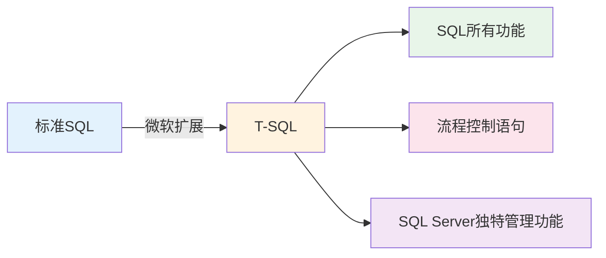
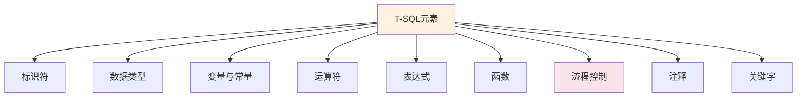

# 第5章-5.1-T-SQL概述

## 基本信息
- **课程**：数据库原理与应用
- **章节**：第5章 5.1节 Transact-SQL概述
- **日期**：2026-06-30
- **标签**：#T-SQL #Transact-SQL #SQL扩展 #流程控制 #标识符 #数据类型

---

## 重点内容

### ⭐⭐⭐ 核心概念
- **Transact-SQL（T-SQL）**：微软公司对SQL语言的扩展，是SQL的超集，在标准SQL基础上添加了流程控制语句
- **T-SQL只能在SQL Server上使用**，其他数据库（Oracle、Access等）不支持

### ⭐⭐ 重要元素
- **标识符**：常规标识符和分隔标识符，用于命名变量、过程、触发器等逻辑对象
- **数据类型**：定义数据对象时必须指定，包括系统数据类型和用户定义数据类型
- **变量与常量**：程序设计的基础元素

### ⭐ 基础概念
- **表达式**：由标识符通过运算符连接而成的合法字符串
- **注释**：单行注释 `--` 和多行注释 `/* */`
- **关键字**：SQL Server预留的保留字，如ADD、EXCEPT、PERCENT等

---

## 详细笔记

### 一、T-SQL语言介绍

> 📚 **课本出处**：第5章 5.1.1节"关于Transact-SQL语言"

**标准SQL的局限**：SQL语句只能按照既定的顺序逐条执行，不能根据中间结果有选择地或循环地执行某些语句块，无法像高级程序语言那样进行流程控制。

**T-SQL的定义**：Transact-SQL即事务SQL，也简写为T-SQL，是微软公司对关系数据库标准语言SQL进行扩充的结果，是SQL语言的**超集**。

**T-SQL与SQL的关系**：



**T-SQL的特点**：
- 支持所有的标准SQL语言操作
- 在SQL基础上添加了**流程控制语句**（IF、CASE、WHILE等）
- 只有 **SQL Server** 支持T-SQL，其他关系数据库不支持
- 可以深入数据库系统内部，完成图形化管理工具无法完成的管理任务

> 💡 **理解技巧**：可以把T-SQL理解为"带编程能力的SQL"。标准SQL只能一条一条执行语句，而T-SQL可以写条件判断、循环等逻辑，让数据库操作更灵活。

---

### 二、T-SQL的元素

> 📚 **课本出处**：第5章 5.1.2节"Transact-SQL的元素"

T-SQL程序由以下元素组成：



#### 1. 标识符

> 📚 **课本出处**：第5章 5.1.2节"标识符"

在数据库编程中，访问任何逻辑对象（变量、过程、触发器等）都需要通过其名称来完成，而逻辑对象的名称使用合法的**标识符**来表示。

**标识符的两种类型**：

| 类型 | 说明 | 示例 |
|:----:|:-----|:-----|
| **常规标识符** | 不需分隔，但要符合格式规则 | `student_name`, `@age` |
| **分隔标识符** | 包含在两个单引号(`''`)或方括号(`[]`)内，可包含空格 | `[My Table]`, `'My Column'` |

**常规标识符的命名规则**：
- 首字符必须是：英文字母、下划线 `_`、`@`、`#` 或汉字
- 首字符后面可以是：字母、数字、下划线、`@`、`$` 或汉字
- 不能与SQL Server的关键字重复
- 不应以 `@@` 开头（系统全局变量使用此前缀）
- 不允许嵌入空格或其他特殊字符

> ⚠️ **常见误区**：以 `@@` 开头的标识符是系统全局变量的专属前缀，用户定义的标识符不应使用此格式。

#### 2. 数据类型

> 📚 **课本出处**：第5章 5.1.2节"数据类型"

与其他编程语言一样，T-SQL也有自己的数据类型。定义数据对象（如列、变量和参数）时必须指定数据类型。

**注意**：SQL Server 2008新增了 **XML数据类型**，用于保存XML数据。其他数据类型与标准SQL相同，详见第4章。

#### 3. 函数

> 📚 **课本出处**：第5章 5.1.2节"函数"

SQL Server内置了大量的函数，极大地方便程序员使用。常见函数类型包括：
- **时间函数**：处理日期和时间数据
- **统计函数**：执行数学和统计计算
- **游标函数**：操作游标相关数据

（详见5.5节函数）

#### 4. 表达式

> 📚 **课本出处**：第5章 5.1.2节"表达式"

表达式是由常量、变量、函数等标识符通过运算符连接而成的、具有实际计算意义的合法字符串。

**注意**：单个的常量、变量也可以视为一个表达式，它们不一定含有运算符。

> 💡 **理解技巧**：表达式就像数学公式，`3 + 5` 是表达式，`@age` 也是表达式（值为变量的当前值），`'Hello'` 还是表达式（值为字符串本身）。

#### 5. 注释

> 📚 **课本出处**：第5章 5.1.2节"注释"

T-SQL提供两种注释方式：

| 注释类型 | 符号 | 适用场景 |
|:--------:|:----:|:---------|
| **单行注释** | `--` | 注释一行内容 |
| **多行注释** | `/* ... */` | 注释多行内容 |

**示例**：
```sql
-- 这是单行注释
SELECT * FROM student; -- 也可以在语句后注释

/*
这是多行注释
可以跨越多行
常用于注释较大的代码块
*/
```

#### 6. 关键字

> 📚 **课本出处**：第5章 5.1.2节"关键字"

关键字也称为保留字，是SQL Server预留作专门用途的标识符。例如 `ADD`、`EXCEPT`、`PERCENT` 等。

**规则**：用户定义的标识符不能与保留关键字重复。

> ⚠️ **常见误区**：如果确实需要使用关键字作为标识符，可以用方括号将其括起来，如 `[ORDER]`、`[GROUP]`。

---

## 总结

### T-SQL核心要点

| 要点 | 内容 |
|:----:|:-----|
| **本质** | 微软对标准SQL的扩展，SQL的超集 |
| **核心贡献** | 添加了流程控制语句 |
| **适用范围** | 仅SQL Server支持 |
| **标识符规则** | 首字符为字母/_/@/#/汉字，后续可加数字、$等 |
| **注释方式** | 单行 `--`，多行 `/* */` |
| **关键区分** | `@@` 前缀为系统全局变量，`@` 前缀为用户局部变量 |

### T-SQL与标准SQL的关系

```mermaid
flowchart TB
    A[标准SQL] -->|数据定义DDL| B[CREATE/ALTER/DROP]
    A -->|数据操纵DML| C[SELECT/INSERT/UPDATE/DELETE]
    A -->|数据控制DCL| D[GRANT/REVOKE]
    E[T-SQL扩展] -->|流程控制| F[IF/CASE/WHILE/GOTO]
    E -->|变量系统| G[局部变量@/全局变量@@]
    E -->|事务控制| H[BEGIN/COMMIT/ROLLBACK]

    style A fill:#e3f2fd
    style E fill:#fff3e0
```

### 关键要点

1. **T-SQL是SQL的超集**：包含标准SQL所有功能，并扩展了流程控制
2. **标识符命名规则**：首字符限制、不能与关键字重复、不以`@@`开头
3. **数据类型是必须的**：定义变量、列、参数时必须指定数据类型
4. **注释是好习惯**：使用`--`和`/* */`添加注释，提高代码可读性
5. **T-SQL专属于SQL Server**：其他数据库系统不支持T-SQL语法

---

## 疑问与思考

### ❓ 待解决问题
1. T-SQL的流程控制语句（IF、CASE、WHILE等）的具体语法和使用方法是什么？（详见5.4节）
2. T-SQL与其他数据库的编程扩展（如PL/SQL、PL/pgSQL）有什么异同？
3. 分隔标识符在什么场景下特别有用？能否给出实际开发中的使用案例？
4. 如果在T-SQL中使用了其他数据库的函数或语法，会有什么后果？

### 💡 个人理解/技巧
- T-SQL之于SQL，类似于JavaScript之于ECMAScript标准——微软在标准基础上增加了自己的扩展
- 标识符命名建议：使用有意义的英文名称，避免使用关键字，不用中文命名（虽然语法允许）
- 实际开发中，分隔标识符（方括号）常用于表名/列名包含空格或关键字的情况，如`[Order Details]`
- 两种注释方式的选用：单行用`--`更快捷，多行用`/* */`更整齐

---

## 相关链接

### 关联章节
- [第5章-Transact-SQL程序设计](./第5章-Transact-SQL程序设计.md)（章概述）
- [第5章-5.2-变量和常量](./第5章-5.2-变量和常量.md)（下一节）
- 第5章-5.3-运算符（待创建）
- 第5章-5.4-流程控制（待创建）
- 第5章-5.5-函数（待创建）
- [第4章-数据库查询语言SQL](../../第4章-数据库查询语言SQL/)（标准SQL基础）

---

## 检查清单

- [x] 已理解T-SQL的定义和与标准SQL的关系
- [x] 已掌握T-SQL的6大组成元素
- [x] 已理解标识符的命名规则（常规标识符与分隔标识符）
- [x] 已掌握两种注释方式（`--` 和 `/* */`）
- [x] 已记录重点标记
- [x] 已添加课本出处标注

---

*笔记创建时间：2026-06-30*
